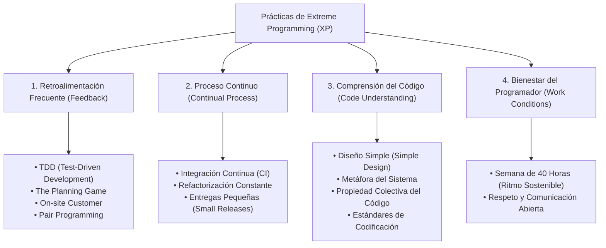

# Extreme Programming (XP): Prácticas de Ingeniería Ágil

**Extreme Programming (XP)** es una metodología ágil creada en la década de 1990 por Kent Beck, Ward Cunningham y Ron Jeffries. A diferencia de marcos de gestión como [[scrum]], XP se enfoca intensamente en la **excelencia técnica y la artesanía del software (*Software Craftsmanship*)**, prescribiendo un conjunto riguroso de valores, principios y prácticas para escribir código limpio, adaptable y de altísima calidad.

---

## 1. Las 12 Prácticas Fundamentales de XP

```mermaid
graph TD
    XP["Prácticas de Extreme Programming (XP)"]
    
    XP --> FEED["1. Retroalimentación Frecuente (Feedback)"]
    XP --> CONT["2. Proceso Continuo (Continual Process)"]
    XP --> COMP["3. Comprensión del Código (Code Understanding)"]
    XP --> BIEN["4. Bienestar del Programador (Work Conditions)"]
    
    FEED --> F1["• TDD (Test-Driven Development)<br>• The Planning Game<br>• On-site Customer<br>• Pair Programming"]
    CONT --> C1["• Integración Continua (CI)<br>• Refactorización Constante<br>• Entregas Pequeñas (Small Releases)"]
    COMP --> M1["• Diseño Simple (Simple Design)<br>• Metáfora del Sistema<br>• Propiedad Colectiva del Código<br>• Estándares de Codificación"]
    BIEN --> B1["• Semana de 40 Horas (Ritmo Sostenible)<br>• Respeto y Comunicación Abierta"]
```

### 1) Retroalimentación Frecuente (Feedback)
* **Test-Driven Development (TDD):** Desarrollo guiado por pruebas unitarias previas al código ([[Testing automatizado]], [[tecnicas pruebas]]). Retroalimentación inmediata ante cualquier fallo.
* **The Planning Game (Juego de Planificación):** Reunión al inicio de cada iteración para negociar y priorizar el valor con el cliente.
* **On-site Customer (Cliente in situ):** El cliente o su representante directo trabaja junto al equipo resolviendo dudas en tiempo real.
* **Pair Programming (Programación en Parejas):** Dos desarrolladores en una sola estación: el *Driver* (escribe el código) y el *Navigator* (revisa el diseño, arquitectura y casos de borde).

### 2) Proceso Continuo (Continual Process)
* **Continuous Integration (CI):** Integración del código de todos los desarrolladores múltiples veces al día, ejecutando pruebas automáticas en cada commit.
* **Refactorización Constante:** Limpieza permanente del diseño sin alterar el comportamiento observable, reduciendo la [[Deuda técnica]].
* **Small Releases (Entregas Pequeñas):** Puestas en producción frecuentes en lapsos de semanas, recolectando retroalimentación empírica rápida.

### 3) Comprensión del Código (Code Understanding)
* **Simple Design (Diseño Simple):** El diseño más simple que apruebe todas las pruebas y no contenga duplicación (principio DRY / KISS).
* **Coding Standards (Estándares Comunes):** Reglas uniformes de formato, nomenclatura y arquitectura que hacen el código legible por cualquiera.
* **Collective Code Ownership (Propiedad Colectiva):** Cualquier miembro del equipo tiene la potestad y responsabilidad de mejorar cualquier módulo del repositorio.
* **System Metaphor (Metáfora del Sistema):** Visión conceptual unificada de la arquitectura y dominio para guiar los nombres y modelos.

### 4) Condiciones de Trabajo y Bienestar
* **Ritmo Sostenible (Semana de 40 horas):** Los errores críticos aumentan exponencialmente con el agotamiento. Las horas extras recurrentes indican problemas de planificación y deben evitarse.

---

## 2. Valores y Principios de XP

- **Valores:** Comunicación, Simplicidad, Retroalimentación, Coraje (para refactorizar código crítico) y Respeto.
- **Principios:** Cambios incrementales, asumir simplicidad, abrazar el cambio (*Embracing Change*), trabajo de alta calidad y retroalimentación rápida.

---

> [!info] Explicación: XP como base del Software Craftsmanship
> Mientras Scrum aborda la gestión de entregables y la cadencia del equipo, Extreme Programming aporta las prácticas de ingeniería indispensables. Sin TDD, refactorización continua e integración continua, los ciclos rápidos de Scrum terminan colapsando bajo una montaña de deuda técnica.

---

## Notas relacionadas
- [[software 2]]
- [[historias de usuario]]
- [[scrum]]
- [[kanban]]
- [[tecnicas pruebas]]
- [[Testing automatizado]]
- [[Integración continua y despliegue continuo (CI-CD)]]
- [[Deuda técnica]]
