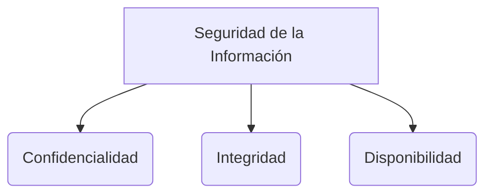

# Historias de Usuario

Al inicio de un proyecto, se debe priorizar lo que es **mandatorio** (los requerimientos obligatorios por donde se debe empezar a trabajar).
Luego, se aborda lo **deseable** (aquello que el sistema debería tener para aportar mayor valor).
Finalmente, se deja lo **optativo** (que casi nunca se implementa, ya que depende del presupuesto sobrante).

Para la estimación, en lugar de usar horas, se recomienda usar **Puntos de Historia de Usuario** (Story Points), usando formatos como *Large, Medium, Small* o secuencias basadas en Fibonacci. No se recomienda estimar en unidades de tiempo exactas.

*Ejemplo de escala Fibonacci para estimar complejidad:*
* **1, 2, 3, 5:** Historia simple.
* **8, 12, 21:** Historia moderada.
* **34 en adelante:** Historia muy compleja.

Si una historia de usuario es tan grande que no se puede completar en una sola iteración (sprint), se le considera una **Épica** y debe ser dividida en historias más pequeñas.
Cuando hay mucha incertidumbre y el equipo no sabe cómo estimar una historia, se usa un **Spike** (tarea de investigación limitada en tiempo). Esto es una técnica proveniente de XP (Extreme Programming).

## Tarjetas CRC
CRC significa **Clase, Responsabilidad y Colaboración**. Es una herramienta de diseño orientada a objetos.

| Clase: Cliente | |
| --- | --- |
| **Responsabilidad** | **Colaboración** |

| Clase: Cuenta | |
| --- | --- |
| **Responsabilidad** | **Colaboración** |

| Clase: Transacción | |
| --- | --- |
| **Responsabilidad** | **Colaboración** |
| Actividades | Métodos que dan información |
| Métodos | Cliente |
| Creación de transacción | Cuenta |
| Actualizar transacción | |

## Metáforas
La **metáfora del sistema** es una técnica para dar una visión global fácil de entender sobre cómo funciona el proyecto. Se basa en usar palabras o conceptos del mundo real que todos (técnicos y clientes) comprendan fácilmente. Permite unificar el lenguaje del proyecto.

## Gestión de Riesgos
En el desarrollo con historias de usuario, es necesario:
* **Identificar riesgos:** Por ejemplo, posibles brechas de seguridad (bases de datos, redes, software).
* **Prevenir:** Tomar acciones anticipadas, como encriptar los datos.
* **Mitigar:** Definir qué se hará si el riesgo ocurre para minimizar el impacto.
Identificar un riesgo a tiempo implica también crear y estimar tareas preventivas en el *backlog*.

## Deuda Técnica y Refactorización
* **Refactorizar:** Significa cambiar la estructura interna del código manteniendo su comportamiento externo (limpieza y eficiencia). Consiste en poner el código en las mejores condiciones posibles para futuras modificaciones.
* **Deuda técnica:** Ocurre cuando el sistema funciona, pero el código fue escrito de forma apresurada ("sucia") y requiere mejoras estructurales. Se debe "pagar" esta deuda refactorizando para evitar que el software se vuelva inmanejable.

> [!info] Explicación: Las Historias de Usuario y el Testing de Aceptación
> Las historias de usuario (User Stories) se enfocan en el valor que se entrega al usuario final ("Como [rol], quiero [acción] para [beneficio]"). Para que una historia se considere finalizada, debe tener **Criterios de Aceptación**. Estos criterios sirven como base para las pruebas de aceptación automatizadas (generalmente mediante metodologías como BDD), asegurando que el software hace exactamente lo que el negocio solicitó.

## Notas relacionadas
- [[software 2]]
- [[scrum]]
- [[XP (eXtremme programming)]]
- [[técnicas pruebas]]
- [[pruebas de usabilidad]]

## Diagrama de Referencia

