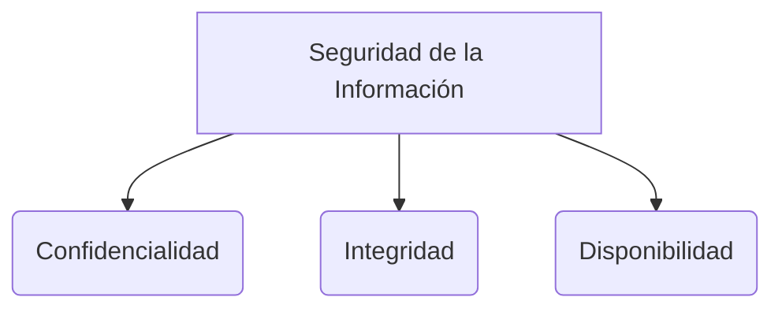

# Kanban

Kanban es un método de gestión visual del trabajo.
Consigue un acuerdo de cambio con el equipo, enfocado en que se mejorarán los procesos de forma continua e incremental.
Los casilleros o columnas en el tablero son llamados "kanban" (que en japonés significa "tarjeta visual").
Los sistemas Kanban son sistemas "pull" (de arrastre), lo que significa que el trabajo se mueve a la siguiente etapa solo cuando hay capacidad disponible.

> [!info] Explicación: Gestión de Cuellos de Botella y Testing en Kanban
> A diferencia de Scrum, Kanban no impone cajas de tiempo (sprints). Su objetivo es optimizar el flujo de trabajo midiendo el "Lead Time" (tiempo desde que se pide hasta que se entrega) y el "Cycle Time" (tiempo desde que se empieza a trabajar hasta que se termina). Permite identificar cuellos de botella en tiempo real. En desarrollo de software, la etapa de Testing (pruebas) suele ser un cuello de botella común; Kanban ayuda a visibilizar esto para que el equipo pueda colaborar y despejar el atasco antes de tomar nuevas tareas.

## Notas relacionadas
- [[software 2]]
- [[scrum]]
- [[XP (eXtremme programming)]]
- [[historias de usuario]]

## Diagrama de Referencia

