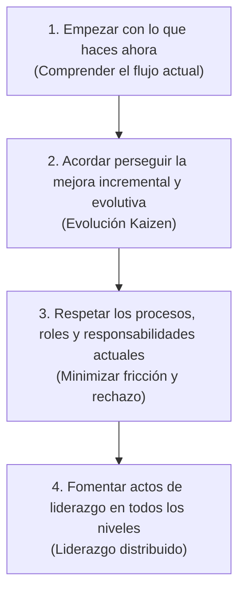
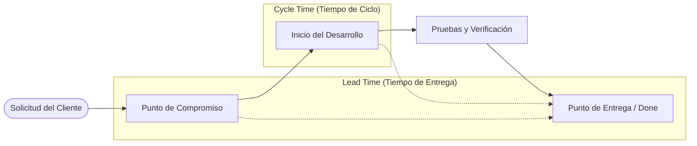
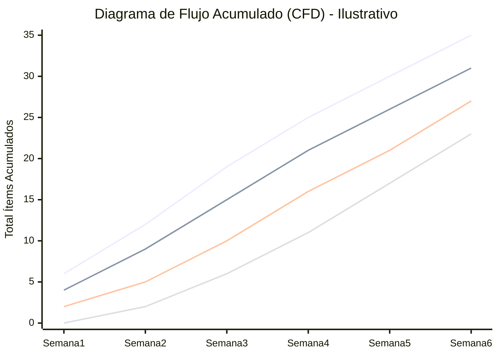
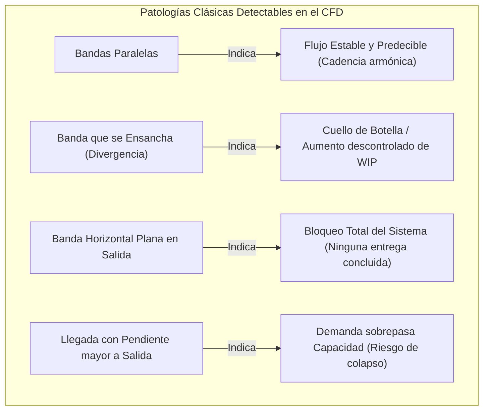

# Kanban: Principios, Prácticas y Gestión del Flujo de Trabajo

El método **Kanban** es un enfoque de gestión del flujo de trabajo y optimización de sistemas de entrega de servicios y desarrollo de software fundamentado en el paradigma **Lean**. Fue formalizado e introducido en la industria del software por **David J. Anderson** en 2010 a partir de los conceptos del **Sistema de Producción de Toyota (TPS - Toyota Production System)** desarrollado por **Taiichi Ohno** a mediados del siglo XX.

Etimológicamente, la palabra japonesa *Kanban* (看板) se compone de *Kan* (看, visual o señal) y *Ban* (板, tarjeta o tablero); literalmente: **"tarjeta visual"** o señal visual. A diferencia de marcos prescriptivos basados en iteraciones fijas como [[scrum]], Kanban opera como un **sistema de arrastre (pull system)** continuo que no impone roles predefinidos ni cajas de tiempo (*timeboxes*), sino que busca catalizar la mejora incremental y evolutiva del proceso preexistente.

---

## 1. Los 4 Principios Fundamentales (Gestión del Cambio)

Kanban aborda la resistencia humana y cultural al cambio organizacional mediante cuatro principios de gestión evolutiva:

```mermaid
flowchart TD
    P1["1. Empezar con lo que haces ahora\n(Comprender el flujo actual)"] --> P2["2. Acordar perseguir la mejora incremental y evolutiva\n(Evolución Kaizen)"]
    P2 --> P3["3. Respetar los procesos, roles y responsabilidades actuales\n(Minimizar fricción y rechazo)"]
    P3 --> P4["4. Fomentar actos de liderazgo en todos los niveles\n(Liderazgo distribuido)"]
```

1. **Empezar con lo que haces ahora (*Start with what you do now*):**
   No introduce transformaciones disruptivas inmediatas ni reestructuraciones drásticas. El método se superpone sobre el flujo de trabajo existente para visibilizar sus fortalezas, ineficiencias y cuellos de botella antes de proponer cualquier modificación.
2. **Acordar perseguir la mejora incremental y evolutiva (*Agree to pursue improvement through evolutionary change*):**
   Los cambios revolucionarios desencadenan resistencia natural en los equipos y la organización. Kanban promueve la filosofía japonesa *Kaizen* (mejora continua a través de pequeños pasos experimentales verificados).
3. **Respetar los procesos, roles, responsabilidades y títulos actuales (*Respect current processes, roles & responsibilities*):**
   Reconoce el valor de las estructuras operativas vigentes. Esto elimina la amenaza psicológica a la estabilidad laboral o estatus de los participantes, facilitando una adopción colaborativa y receptiva.
4. **Fomentar actos de liderazgo en todos los niveles (*Encourage acts of leadership at all levels*):**
   El liderazgo no es prerrogativa exclusiva de la alta gerencia o del director de proyectos. Cualquier desarrollador, analista o evaluador puede proponer una hipótesis de mejora, alertar sobre un cuello de botella o impulsar una política de calidad.

---

## 2. Las 6 Prácticas Centrales

David J. Anderson estableció seis prácticas esenciales que sostienen la operatividad y madurez de un sistema Kanban:

### 2.1. Visualizar el flujo de trabajo (*Visualize the workflow*)
Consiste en mapear explícitamente todas las etapas por las que transita un ítem de trabajo, desde el momento en que se conceptualiza una necesidad hasta su entrega en producción. La visualización de las tarjetas en un **tablero Kanban** expone colas ocultas, bloqueos, dependencias y tiempos muertos.

### 2.2. Limitar el Trabajo en Progreso (*Limit Work in Progress - WIP*)
Es el núcleo técnico de Kanban. Consiste en fijar un número máximo permitido de elementos simultáneos en cada columna o fase activa del tablero (**Límites WIP**).
- **Justificación teórica:** El cerebro humano pierde eficiencia al realizar multitarea cognitiva (*multitasking waste*).
- **Efecto operativo:** Fuerza al equipo a terminar tareas activas antes de iniciar nuevas bajo el lema: *"Stop starting, start finishing"* (Deja de empezar, empieza a terminar).
- **Efecto sistémico:** Previene la sobrecarga de los miembros del equipo y convierte los problemas latentes en bloqueos visibles inmediatos.

### 2.3. Gestionar el flujo (*Manage flow*)
El objetivo prioritario no es mantener ocupadas a las personas (*resource utilization*), sino asegurar que el trabajo avance de forma fluida, continua y predecible a través del sistema (*flow efficiency*). Se monitorea la velocidad, la acumulación en colas de espera y la estabilidad temporal del sistema.

### 2.4. Hacer explícitas las políticas del proceso (*Make policies explicit*)
Las reglas de operación del sistema no deben ser tácitas ni depender de interpretaciones subjetivas. Cada columna debe contar con:
- **Criterios de entrada y salida:** Definición de Listo (*Definition of Ready - DoR*) y Definición de Terminado (*Definition of Done - DoD*).
- **Políticas de descarte y bloqueo:** Cómo proceder ante una tarjeta bloqueada por dependencias externas.
- **Políticas de priorización:** Criterios formales de selección de tareas desde el backlog hacia el sistema activo.

### 2.5. Implementar bucles de retroalimentación (*Implement feedback loops*)
Kanban instituye reuniones estructuradas y cadencias periódicas para inspeccionar y adaptar el flujo:
- **Daily Kanban (Reunión diaria de pie):** El equipo revisa el tablero de derecha a izquierda (*Right-to-Left*), enfocándose en liberar las tareas más cercanas a completarse y desbloquear impedimentos.
- **Service Delivery Review (Revisión de entrega de servicios):** Análisis de métricas de calidad y compromisos frente a los clientes.
- **Operations Review (Revisión de operaciones):** Análisis global de dependencias entre múltiples equipos e interconexión de flujos.
- **Risk Review (Revisión de riesgos):** Evaluación de factores que amenazan la previsibilidad del tiempo de entrega.

### 2.6. Mejorar colaborativamente, evolucionar experimentalmente (*Improve collaboratively, evolve experimentally*)
Utiliza el método científico para el cambio organizacional: formular una hipótesis de mejora, ejecutar un experimento controlado, medir el impacto en las métricas del sistema y estandarizar o revertir el cambio según la evidencia empírica recolectada.

---

## 3. El Tablero Kanban y su Estructura

El tablero Kanban es la herramienta visual primaria. Refleja un **sistema pull (de arrastre)**: un paso aguas abajo (*downstream*) toma trabajo de un paso aguas arriba (*upstream*) únicamente cuando tiene capacidad disponible según su límite WIP.

### 3.1. Anatomía del Tablero y Columnas
Un tablero de desarrollo de software formal implementa subcolumnas de "En Proceso" (*Doing*) y "Completado" (*Done/Buffer*) para evitar empujar trabajo prematuramente a la etapa siguiente:

```mermaid
flowchart LR
    subgraph ColBacklog ["1. Backlog (Ilimitado)"]
        T1["REQ-101: Autenticación OAuth2"]
        T2["REQ-104: Exportación PDF"]
    end

    subgraph ColAnalisis ["2. Análisis (WIP: 2)"]
        T3["REQ-102: Diseño Esquema DB"]
    end

    subgraph ColDesarrollo ["3. Desarrollo (WIP: 3)"]
        direction TB
        subgraph DevDoing ["Doing"]
            T4["REQ-099: API Pagos"]
            T5["REQ-100: Checkout UI"]
        end
        subgraph DevDone ["Done"]
            T6["REQ-098: Cache Redis"]
        end
    end

    subgraph ColTesting ["4. Testing (WIP: 2)"]
        T7["REQ-097: Pruebas E2E Carrito"]
    end

    subgraph ColDeploy ["5. Despliegue (WIP: 1)"]
        T8["REQ-096: Migración DB v2.4"]
    end

    subgraph ColDone ["6. Done (Completado)"]
        T9["REQ-094: Landing Page"]
        T10["REQ-095: Webhook Stripe"]
    end

    ColBacklog ==>|"Flujo Pull (según WIP)"| ColAnalisis
    ColAnalisis ==>|"Pull"| ColDesarrollo
    ColDesarrollo ==>|"Pull"| ColTesting
    ColTesting ==>|"Pull"| ColDeploy
    ColDeploy ==>|"Entrega de Valor"| ColDone
```

### 3.2. Carriles de Natación (*Swimlanes*)
Son divisiones horizontales en el tablero utilizadas para segmentar el trabajo en función de:
- Unidades de negocio o clientes distintos.
- Proyectos concurrentes que comparten el mismo equipo de desarrollo.
- Niveles de urgencia o **Clases de Servicio**.

### 3.3. Clases de Servicio (Classes of Service - CoS)
Las clases de servicio clasifican los ítems en función de su **Costo de Retraso (*Cost of Delay - CoD*)**, permitiendo tomar decisiones óptimas de priorización en tiempo real:

| Clase de Servicio | Costo de Retraso (CoD) | Política de Atención y Prioridad | Límite WIP Típico |
| :--- | :--- | :--- | :--- |
| **Expedite (Urgente / Crítica)** | Catastrófico e inmediato (ej. caída de producción, fallo crítico de seguridad). | Máxima prioridad absoluta. Los miembros del equipo suspenden el trabajo estándar para resolverla. | Máximo 1 (o carril exclusivo con WIP = 1). |
| **Fixed Date (Fecha Fija)** | Nulo hasta una fecha límite específica, momento en el cual se vuelve crítico (ej. regulación legal, evento comercial). | Se programa hacia atrás calculando el *Lead Time* histórico percentil 95 ($P_{95}$) para garantizar que empiece a tiempo. | Integrado al flujo estándar bajo seguimiento. |
| **Standard (Estándar)** | Crece de manera lineal o moderada con el paso del tiempo. Representa las características normales de negocio. | Se procesa siguiendo políticas de priorización por valor o FIFO (*First In, First Out*). | Sujeto a los límites WIP convencionales. |
| **Intangible** | Prácticamente nulo en el corto plazo, pero con alto valor latente acumulativo (ej. refactorización de código, reducción de deuda técnica). | Se procesa como trabajo de fondo (*background*) cuando no hay urgencias o como inversión de capacidad protegida. | Asignación porcentual de capacidad (ej. 10-20%). |

---

## 4. Métricas de Flujo y la Ley de Little

Kanban prescinde de estimaciones subjetivas en puntos de historia (*Story Points*) y se apoya en métricas estadísticas objetivas del flujo continuo:

```mermaid
flowchart LR
    A([Solicitud del Cliente]) --> B[Punto de Compromiso]
    B --> C[Inicio del Desarrollo]
    C --> D[Pruebas y Verificación]
    D --> E[Punto de Entrega / Done]
    
    subgraph LT ["Lead Time (Tiempo de Entrega)"]
        B -.-> E
    end
    
    subgraph CT ["Cycle Time (Tiempo de Ciclo)"]
        C -.-> E
    end
```

### 4.1. Definición de Métricas Principales
1. **Tiempo de Entrega (*Lead Time*):**
   Intervalo transcurrido desde que el requerimiento es aceptado formalmente en el sistema (**Punto de Compromiso**) hasta que es entregado en producción y aporta valor real al cliente (**Punto de Entrega**).
2. **Tiempo de Ciclo (*Cycle Time*):**
   Intervalo transcurrido desde que un ítem entra en una etapa de trabajo activo (el equipo comienza a escribir código o realizar análisis) hasta que concluye su desarrollo o validación.
3. **Rendimiento (*Throughput*):**
   Cantidad neta de unidades de trabajo completadas y entregadas por unidad de tiempo específica (ej. 8 historias de usuario por semana).

### 4.2. Fundamento Matemático: La Ley de Little
Formulada por John Little en 1961 para la teoría de colas matemáticas, establece que en un sistema estable en régimen estacionario, el número promedio de elementos en el sistema ($L$ o $WIP$) es igual a la tasa promedio de llegada/salida ($\lambda$ o $Throughput$) multiplicada por el tiempo promedio de permanencia en el sistema ($W$ o $Cycle\ Time$):

$$\text{WIP} = \text{Throughput} \times \text{Cycle Time}$$

Despejando el Tiempo de Ciclo:

$$\text{Cycle Time} = \frac{\text{WIP}}{\text{Throughput}}$$

> [!important] Implicación de Ingeniería en la Ley de Little
> Si un equipo duplica su trabajo en curso ($\text{WIP} \times 2$) manteniendo constante su capacidad de procesamiento ($\text{Throughput}$), el tiempo necesario para completar cada tarea se **duplicará automáticamente**. La forma más directa, económica y matemáticamente demostrable de acelerar las entregas de software no es forzar horas extras, sino **reducir los límites de WIP**.

---

## 5. El Diagrama de Flujo Acumulado (CFD - Cumulative Flow Diagram)

El **Diagrama de Flujo Acumulado (CFD)** es la herramienta analítica más potente en Kanban. Grafica en el eje horizontal el tiempo y en el eje vertical el número acumulado de ítems de trabajo que han alcanzado cada estado:

```mermaid
xychart-beta
    title "Diagrama de Flujo Acumulado (CFD) - Ilustrativo"
    x-axis [Semana 1, Semana 2, Semana 3, Semana 4, Semana 5, Semana 6]
    y-axis "Total Ítems Acumulados" 0 --> 35
    line [6, 12, 19, 25, 30, 35]
    line [4, 9, 15, 21, 26, 31]
    line [2, 5, 10, 16, 21, 27]
    line [0, 2, 6, 11, 17, 23]
```

### 5.1. Interpretación Geométrica del CFD
- **Distancia Vertical entre curvas en un instante $t$:** Representa el Trabajo en Progreso ($\text{WIP}$) existente en el sistema o entre dos fases específicas en ese momento.
- **Distancia Horizontal entre la curva de entrada y la de salida:** Representa el Tiempo de Ciclo o Tiempo de Entrega aproximado para los ítems finalizados en esa fecha.
- **Pendiente de la curva superior (Llegada):** Tasa de demanda o ingreso de tareas al sistema.
- **Pendiente de la curva inferior (Hecho / Salida):** Rendimiento real (*Throughput*) del equipo.

```mermaid
flowchart TD
    subgraph Patologias ["Patologías Clásicas Detectables en el CFD"]
        P_A["Bandas Paralelas"] -->|Indica| R_A["Flujo Estable y Predecible (Cadencia armónica)"]
        P_B["Banda que se Ensancha (Divergencia)"] -->|Indica| R_B["Cuello de Botella / Aumento descontrolado de WIP"]
        P_C["Banda Horizontal Plana en Salida"] -->|Indica| R_C["Bloqueo Total del Sistema (Ninguna entrega concluida)"]
        P_D["Llegada con Pendiente mayor a Salida"] -->|Indica| R_D["Demanda sobrepasa Capacidad (Riesgo de colapso)"]
    end
```

---

## 6. Kanban vs. Scrum: Comparativa de Ingeniería

| Dimensión | [[kanban|Kanban]] | [[scrum|Scrum]] |
| :--- | :--- | :--- |
| **Cadencia** | Flujo continuo e ininterrumpido. | Iteraciones fijas y acotadas (*Sprints* de 1 a 4 semanas). |
| **Mecanismo de Control** | Límites WIP por columna o estado. | Capacidad estimada por velocidad en el Sprint Backlog. |
| **Compromiso** | Continuo por ítem; se compromete al entrar al flujo activo. | Por lote al inicio de cada Sprint (*Sprint Planning*). |
| **Roles Mandatorios** | Ninguno obligatorio; respeta los roles vigentes. | Scrum Master, Product Owner, Developers. |
| **Gestión de Cambios** | Admite modificaciones inmediatas en el backlog priorizado mientras el WIP lo permita. | No se admiten cambios que comprometan el *Sprint Goal*. |
| **Métrica Clave** | Lead Time, Cycle Time, Throughput y CFD. | Velocidad (*Story Points* por Sprint) y Burndown Chart. |

---

## Notas relacionadas
- [[software 2]]
- [[scrum]]
- [[proyectos]]
- [[historias de usuario]]
- [[XP (eXtremme programming)]]
- [[producto minimo viable]]
- [[pruebas de usabilidad]]
