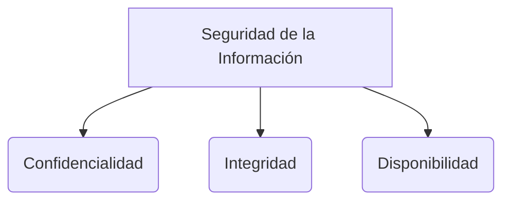

# Scrum

Scrum trabaja mediante una "caja de tiempo" (Timebox) que generalmente dura entre 1 y 4 semanas. A este periodo de tiempo se le denomina **Sprint**.

## Reuniones (Eventos) en Scrum
* **Sprint Planning Meeting:** Es la reunión donde se revisa el objetivo del sprint y se define el *Sprint Backlog* (el conjunto de historias de usuario a trabajar).
* **Sprint Retrospective:** Reunión al final del sprint para evaluar cómo trabajó el equipo y encontrar oportunidades de mejora continua.
* **Daily Scrum:** Reunión diaria de máximo 15 minutos donde cada miembro responde: ¿Qué hice ayer?, ¿Qué haré hoy?, y ¿Qué problemas o bloqueos tengo?
* **Sprint Review:** Reunión donde se muestra el trabajo finalizado al final del sprint (dura mínimo 3 horas; participan el Product Owner, el Scrum Master y el equipo).

## Artefactos
* **Product Backlog:** Lista priorizada de todo lo que se necesita en el producto, escrita en un lenguaje normal o de negocio. Se basa en el ROI (Retorno de Inversión) para identificar las prioridades. Incluye nuevas funcionalidades (Historias de Usuario o US), errores (bugs), tareas técnicas y riesgos.
* **Sprint Backlog:** Lista de tareas técnicas para el sprint actual. Cada historia de usuario seleccionada genera un conjunto de tareas más pequeñas (lenguaje técnico).
* **Incremento:** Es el producto terminado y funcional que resulta al final del sprint.

## Control
* **Burndown / Burnup chart:** Gráficos que permiten visualizar el trabajo pendiente o completado frente al tiempo restante del sprint.

## Sprint Planning Meeting
Durante esta reunión se definen dos cosas principales:
1. **Objetivo del Sprint:** La meta que se espera alcanzar.
2. **Sprint Backlog:** Las tareas en lenguaje técnico que el equipo debe desarrollar.

| Objetivo | Tareas (Lenguaje Técnico) |
| --- | --- |
| Desarrollar Backlog | Crear tablas, definir restricciones, etc. |
| Corregir Bugs | Tareas de depuración |
| Interfaz de Usuario | Diseñar y maquetar |
| Capacitación | Preparar manuales |
| Requerimientos de desarrollo | Spikes (tareas de investigación) |

**Parte 1:** El Product Owner y el equipo de desarrollo revisan el Product Backlog.
**Parte 2:** Se ajustan los tiempos estimados para todas las tareas del Sprint Backlog.

En los repositorios (como GitHub), por lo general (aunque no es una regla estricta de Scrum), se manejan al menos 3 ramas de control de versiones:
* **main:** Cambios estables en el proyecto que entran directamente a producción.
* **dev:** Cambios consolidados que se hacen a lo largo de los sprints (no necesariamente testeados al 100% aún).
* **feature:** Cambios puntuales que cada desarrollador hace en su propia rama antes de integrarlos.

## El "Sprint 0"
En la guía oficial de Scrum no se hace referencia explícita al "Sprint 0". De hecho, el coautor Ken Schwaber considera que es una "mala denominación" y que realmente se refiere a la planificación inicial que se realiza antes del Sprint 1. Esto se debe a que no genera un incremento de valor del producto, lo cual es requisito esencial para ser considerado un sprint. Sin embargo, su uso está tan generalizado en la industria que vale la pena definirlo.

El **Sprint 0** corresponde a la fase previa al inicio del proyecto. Tiene como objetivo establecer el propósito del producto y preparar las bases técnicas y metodológicas:
* **Elaborar la versión inicial del Product Backlog:** Se preparan las historias de usuario iniciales y se fijan prioridades.
* **Investigación:** Incluye tareas de análisis o estudio de requisitos iniciales (herramientas, seguridad, etc.).
* **Diseño y arquitectura:** Se define la arquitectura base y los entornos de desarrollo.
* **Equipo:** Se define el equipo y los roles de cada persona.
* **Definición de Completado (DoD):** Se hace una aproximación de los plazos y se define el *Definition of Done* (DoD), es decir, los criterios de calidad que toda tarea debe cumplir para considerarse finalizada.
* **Business Case:** Se analiza la viabilidad del proyecto y su rentabilidad.

### Ventajas del Sprint 0
Aunque no existe oficialmente en Scrum, realizar esta etapa de preparación inicial tiene varias ventajas:
* Permite identificar los objetivos y puntos clave del proyecto con exactitud.
* Al definir el alcance inicial, ayuda a determinar la duración y el coste estimado, disminuyendo la incertidumbre.
* Aclara las bases del proyecto y la forma en que se aplicará la metodología.
* Sirve como guía de planificación para el resto de los sprints, ahorrando tiempo en el futuro.

![[Pasted image 20240623221655.png]]

> [!info] Explicación: Scrum y Testing (Definition of Done)
> En Scrum, el "Definition of Done" (DoD) es crucial para asegurar la calidad. El DoD no solo significa que el código fue escrito, sino que fue probado. Típicamente incluye: "El código pasa las pruebas unitarias", "El código ha pasado pruebas de integración", y "El código no rompe la construcción (CI)". Esto garantiza que el *Incremento* al final del Sprint sea verdaderamente funcional y libre de errores graves (bugs).

## Notas relacionadas
- [[software 2]]
- [[XP (eXtremme programming)]]
- [[kanban]]
- [[historias de usuario]]
- [[proyectos]]

## Diagrama de Referencia

