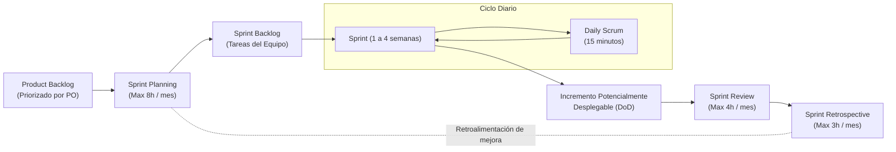

# Scrum

Scrum trabaja mediante una "caja de tiempo" (*Timebox*) que generalmente dura entre 1 y 4 semanas. A este periodo de tiempo se le denomina **Sprint**.

> [!info] 💡 ¿Cómo entender esto desde cero? (Guía para novatos de pregrado)
> En los métodos tradicionales (como Cascada), se planificaba todo el año completo antes de escribir una sola línea de código; si el cliente cambiaba de opinión a los 6 meses, todo el proyecto fracasaba. 
> **Scrum divide el año en ciclos cortos (Sprints de 2 semanas):** en cada ciclo el equipo promete entregar una pequeña parte del software funcionando al 100%. Así, si algo sale mal, solo perdiste dos semanas y puedes corregir de inmediato el rumbo.

---

## Reuniones (Eventos) en Scrum
* **Sprint Planning Meeting:** Es la reunión donde se revisa el objetivo del sprint y se define el *Sprint Backlog* (el conjunto de historias de usuario a trabajar).
* **Daily Scrum:** Reunión diaria de sincronización de máximo 15 minutos donde cada miembro responde: ¿Qué hice ayer?, ¿Qué haré hoy?, y ¿Qué problemas o bloqueos tengo?
* **Sprint Review:** Reunión donde el equipo presenta el incremento de software terminado a los *stakeholders* y al Product Owner para recibir retroalimentación. Tiene un límite de tiempo (*timebox*) de máximo 4 horas para un sprint de un mes (típicamente 1 a 2 horas para sprints de dos semanas); **no dura un mínimo obligatorio**, sino que es un tope máximo.
* **Sprint Retrospective:** Reunión interna del equipo al final del sprint para evaluar cómo trabajaron juntos, identificar fallas de comunicación o técnicas y acordar mejoras concretas para el siguiente ciclo.

---

## Artefactos
* **Product Backlog:** Lista ordenada y priorizada de todo lo que se necesita en el producto, gestionada por el Product Owner. Se basa en el valor de negocio y ROI. Incluye funcionalidades (Historias de Usuario), errores (bugs), tareas técnicas y riesgos.
* **Sprint Backlog:** Conjunto de elementos del Product Backlog seleccionados para el Sprint actual, junto con el plan técnico detallado para entregarlos.
* **Incremento:** Es la suma de todos los elementos del Product Backlog completados durante el Sprint que cumplen con la Definición de Terminado (*Definition of Done - DoD*).

---

## Control y Métricas
* **Burndown / Burnup chart:** Gráficos que permiten visualizar el trabajo pendiente o completado frente al tiempo restante del sprint.

---

## Sprint Planning Meeting
Durante esta reunión se definen dos cosas principales:
1. **Objetivo del Sprint (Sprint Goal):** La meta de negocio que se espera alcanzar.
2. **Sprint Backlog:** Las tareas en lenguaje técnico que el equipo debe desarrollar.

| Objetivo | Tareas (Lenguaje Técnico) |
| --- | --- |
| Desarrollar Backlog | Crear tablas, definir restricciones, endpoints |
| Corregir Bugs | Tareas de depuración y refactorización |
| Interfaz de Usuario | Diseñar y maquetar vistas |
| Capacitación | Preparar manuales o documentación |
| Requerimientos de desarrollo | Spikes (tareas de investigación técnica) |

**Parte 1:** El Product Owner y el equipo revisan el Product Backlog.
**Parte 2:** El equipo de desarrollo define el "cómo" técnico y estima las tareas.

En los repositorios de código (como GitHub), por lo general se manejan al menos 3 ramas de control de versiones:
* **main:** Cambios estables en el proyecto que entran directamente a producción.
* **dev:** Cambios consolidados que se hacen a lo largo de los sprints.
* **feature:** Cambios puntuales que cada desarrollador hace en su propia rama antes de integrarlos vía Pull Request.

---

## El "Sprint 0"
En la guía oficial de Scrum no se hace referencia explícita al "Sprint 0" (los cofundadores de Scrum señalan que un sprint siempre debe entregar un incremento utilizable). Sin embargo, en la práctica industrial se usa comúnmente para referirse a la fase previa de preparación:
* **Elaborar la versión inicial del Product Backlog:** Historias de usuario iniciales y prioridades.
* **Investigación:** Spike técnico y estudio de viabilidad.
* **Diseño y arquitectura:** Definición de la arquitectura base, CI/CD y entornos.
* **Equipo:** Roles y acuerdos de trabajo.
* **Definición de Terminado (DoD):** Criterios de calidad que toda tarea debe cumplir para considerarse finalizada.
* **Business Case:** Análisis de rentabilidad y viabilidad.

> [!info] Explicación: Scrum y Testing (Definition of Done)
> En Scrum, el "Definition of Done" (DoD) es crucial para asegurar la calidad. El DoD no solo significa que el código fue escrito, sino que fue probado. Típicamente incluye: "El código pasa las pruebas unitarias", "El código ha pasado pruebas de integración", y "El código no rompe la construcción (CI)". Esto garantiza que el *Incremento* al final del Sprint sea verdaderamente funcional y libre de errores graves (bugs).

---

## Flujo del Marco Scrum

```mermaid
flowchart LR
    PB["Product Backlog<br/>(Priorizado por PO)"] --> SP["Sprint Planning<br/>(Max 8h / mes)"]
    SP --> SB["Sprint Backlog<br/>(Tareas del Equipo)"]
    SB --> Sprint["Sprint (1 a 4 semanas)"]
    
    subgraph CicloDiario ["Ciclo Diario"]
        Sprint --> Daily["Daily Scrum<br/>(15 minutos)"]
        Daily --> Sprint
    end
    
    Sprint --> Inc["Incremento Potencialmente<br/>Desplegable (DoD)"]
    Inc --> Review["Sprint Review<br/>(Max 4h / mes)"]
    Review --> Retro["Sprint Retrospective<br/>(Max 3h / mes)"]
    Retro -. Retroalimentación de mejora .- SP
```

---

## Notas Relacionadas
- [[software 2]]
- [[historias de usuario]]
- [[Estimación de software]]
- [[XP (eXtremme programming)]]
- [[kanban]]
- [[proyectos]]
- [[Metodologia TDD (Test-Driven Development)]]
- [[Testing automatizado]]
