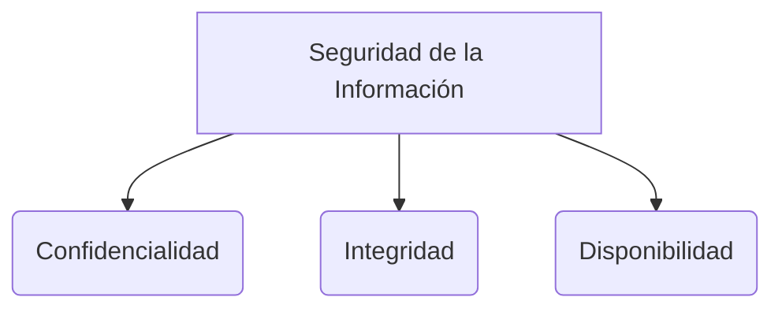

# Software 2

Scrum no es una metodología en sí misma, sino que es un *framework* (marco de trabajo) ágil.
XP (Extreme Programming) sí es una metodología ágil, ya que prescribe exactamente cómo se deben hacer las cosas desde el punto de vista técnico y utiliza historias de usuario.
AUP (Agile Unified Process) es un marco que trabaja principalmente con casos de uso.
Kanban es un método visual que ayuda a identificar cuellos de botella en el flujo de trabajo en tiempo real.
Es importante entender la diferencia entre Git (el sistema de control de versiones) y GitHub (la plataforma de alojamiento de repositorios). Al trabajar en equipo, los desarrolladores deben hacer *match* (coordinar) para saber a quién le corresponde solucionar un error o conflicto específico.

## Manifiesto Ágil

El desarrollo ágil se basa en 4 valores fundamentales:
1. **Individuos e interacciones** sobre procesos y herramientas.
2. **Software funcionando** sobre documentación extensiva.
3. **Colaboración con el cliente** sobre negociación contractual.
4. **Respuesta ante el cambio** sobre seguir un plan estricto.

Además, se rige por 12 principios:
1. Nuestra mayor prioridad es satisfacer al cliente mediante la entrega temprana y continua de software con valor.
2. Aceptamos que los requisitos cambien, incluso en etapas tardías del desarrollo. Los procesos Ágiles aprovechan el cambio para proporcionar ventaja competitiva al cliente.
3. Entregamos software funcional frecuentemente, en periodos de entre dos semanas y dos meses, con preferencia por el periodo de tiempo más corto posible.
4. Los responsables del negocio y los desarrolladores trabajamos juntos de forma cotidiana durante todo el proyecto.
5. Los proyectos se desarrollan en torno a individuos motivados. Hay que darles el entorno y el apoyo que necesitan, y confiarles la ejecución del trabajo.
6. El método más eficiente y efectivo de comunicar información al equipo de desarrollo y entre sus miembros es la conversación cara a cara.
7. El software funcionando es la medida principal de progreso.
8. Los procesos Ágiles promueven el desarrollo sostenible. Los promotores, desarrolladores y usuarios debemos ser capaces de mantener un ritmo constante de forma indefinida.
9. La atención continua a la excelencia técnica y al buen diseño mejora la Agilidad.
10. La simplicidad, o el arte de maximizar la cantidad de trabajo no realizado, es esencial.
11. Las mejores arquitecturas, requisitos y diseños emergen de equipos auto-organizados.
12. A intervalos regulares, el equipo reflexiona sobre cómo ser más efectivo y, a continuación, ajusta y perfecciona su comportamiento en consecuencia.

## Enfoques de Desarrollo
* **FDD (Feature-Driven Development):** Se centra en el desarrollo guiado por características y está muy orientado a las pruebas del sistema y los resultados.
* **BDD (Behavior-Driven Development):** Se centra en el desarrollo guiado por el comportamiento del usuario y cómo el sistema reacciona ante este.

> [!info] Explicación: Integración de Prácticas Ágiles
> Los 12 principios del manifiesto ágil no son un simple ideal teórico; requieren disciplina técnica para sostenerse. Por ejemplo, el principio de "entregar software funcional frecuentemente" requiere de automatización de pruebas (Testing) e Integración Continua (CI). Metodologías como BDD ayudan a cerrar la brecha entre el negocio ("responsables de negocio") y la parte técnica ("desarrolladores"), usando un lenguaje común para describir pruebas automatizadas basadas en el comportamiento.

## Notas relacionadas
- [[scrum]]
- [[XP (eXtremme programming)]]
- [[kanban]]
- [[historias de usuario]]
- [[técnicas pruebas]]
- [[El proceso de software]]

## Diagrama de Referencia

