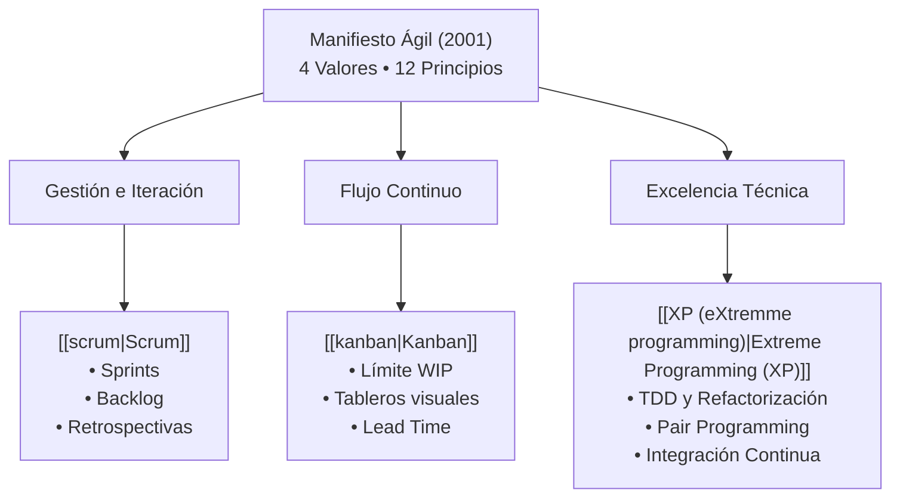

# Software 2: Fundamentos del Desarrollo Ágil de Software

El desarrollo ágil surge como respuesta a la rigidez de los modelos tradicionales en cascada (*Waterfall*), priorizando la entrega continua de valor, la adaptabilidad al cambio y la estrecha colaboración entre los clientes y los equipos de desarrollo.

- **Scrum:** No es una metodología prescriptiva completa, sino un **marco de trabajo (*framework*) ágil** empírico centrado en la gestión iterativa del valor (Sprints de 1 a 4 semanas).
- **XP (Extreme Programming):** Es una **metodología ágil técnica** que prescribe prácticas de ingeniería rigurosas (Pair Programming, TDD, integración continua, refactorización constante) y modela los requisitos mediante [[historias de usuario]].
- **Kanban:** Es un método visual de gestión del flujo de trabajo enfocado en limitar el trabajo en curso (WIP - *Work In Progress*) e identificar cuellos de botella en tiempo real.
- **AUP (Agile Unified Process):** Versión simplificada del RUP que combina principios ágiles con modelado de casos de uso y arquitectura en fases.

---

## 1. El Manifiesto Ágil: Valores y Principios

### Los 4 Valores Fundamentales
1. **Individuos e interacciones** sobre procesos y herramientas.
2. **Software funcionando** sobre documentación extensiva.
3. **Colaboración con el cliente** sobre negociación contractual.
4. **Respuesta ante el cambio** sobre seguir un plan estricto.

### Los 12 Principios Rectores
1. Mayor prioridad: satisfacer al cliente mediante la entrega temprana y continua de software con valor.
2. Aceptación del cambio de requisitos, incluso en etapas tardías, como ventaja competitiva.
3. Entrega frecuente de software funcional (semanas a meses, con preferencia por lapsos cortos).
4. Trabajo conjunto y cotidiano entre negocio y desarrolladores.
5. Construcción de proyectos alrededor de individuos motivados, brindándoles entorno, apoyo y confianza.
6. Comunicación cara a cara como el método más eficaz de transmisión de información.
7. Software funcionando como la principal medida de progreso.
8. Promoción del desarrollo sostenible y mantenimiento de un ritmo constante indefinido.
9. Atención continua a la excelencia técnica y al buen diseño.
10. La simplicidad (el arte de maximizar el trabajo no realizado) como elemento esencial.
11. Equipos autoorganizados como fuente de las mejores arquitecturas y diseños.
12. Reflexiones retrospectivas a intervalos regulares para ajustar y perfeccionar la efectividad.

---

## 2. Enfoques Técnicos de Desarrollo

* **TDD (Test-Driven Development):** Desarrollo guiado por pruebas unitarias previas al código de producción ([[Testing automatizado]]).
* **BDD (Behavior-Driven Development):** Desarrollo guiado por el comportamiento del sistema validado contra especificaciones de negocio legibles en lenguaje natural.
* **FDD (Feature-Driven Development):** Desarrollo guiado por funcionalidades y características tangibles de corto plazo.

---

## 3. Ecosistema de Metodologías Ágiles

```mermaid
flowchart TD
    AGILE["Manifiesto Ágil (2001)<br>4 Valores • 12 Principios"]
    
    AGILE --> GEST["Gestión e Iteración"]
    AGILE --> FLUX["Flujo Continuo"]
    AGILE --> TECN["Excelencia Técnica"]
    
    GEST --> SCRUM["[[scrum|Scrum]]<br>• Sprints<br>• Backlog<br>• Retrospectivas"]
    FLUX --> KANBAN["[[kanban|Kanban]]<br>• Límite WIP<br>• Tableros visuales<br>• Lead Time"]
    TECN --> XP["[[XP (eXtremme programming)|Extreme Programming (XP)]]<br>• TDD y Refactorización<br>• Pair Programming<br>• Integración Continua"]
```

---

> [!info] Explicación: Integración de Prácticas Ágiles
> Los valores y principios del manifiesto ágil requieren una estricta disciplina técnica para no degenerar en desorganización. La entrega de software funcional continuo requiere suites robustas de [[Testing automatizado]], control de versiones distribuido riguroso y automatización mediante [[Integración continua y despliegue continuo (CI-CD)]].

---

## Notas relacionadas
- [[scrum]]
- [[XP (eXtremme programming)]]
- [[kanban]]
- [[historias de usuario]]
- [[tecnicas pruebas]]
- [[Testing automatizado]]
- [[El proceso de software]]
- [[Estimación de software]]
