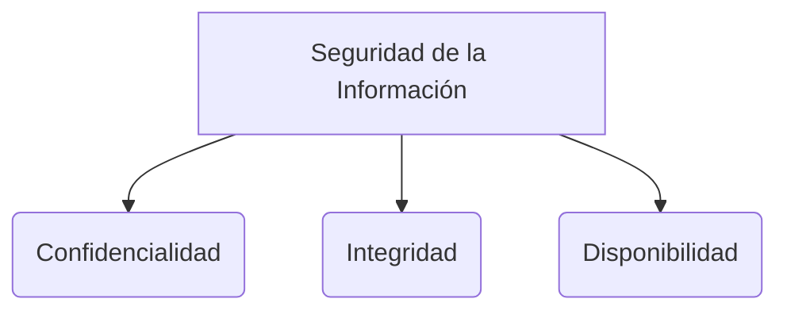

# Técnicas de Pruebas y Metodologías

* **TDD (Test-Driven Development):** Desarrollo guiado por pruebas. Sirve principalmente para crear pruebas automatizadas a nivel de desarrollador (pruebas unitarias). En TDD, la prueba se escribe antes que el código de producción.
* **BDD (Behavior-Driven Development):** Desarrollo guiado por el comportamiento. Se enfoca en las pruebas desde la perspectiva del analista, el equipo de testing y el usuario. Requiere que se definan de antemano los **criterios de aceptación** (lo que el usuario espera que el sistema haga) en un lenguaje común.

## Metodologías de Diseño Orientado a Objetos
* **OOHTR** (Object-Oriented Hypermedia Testing y Requisitos).
* **OOHDM** (Object-Oriented Hypermedia Design Methodology): Es una metodología orientada a objetos para diseñar aplicaciones hipermedia, sitios web y aplicaciones móviles.
Sus etapas principales son:
1. **Diseño conceptual:** Se definen los objetos y clases del dominio. (Modelo Conceptual: Los objetos tienen atributos, métodos y relaciones entre ellos).
2. **Navegación:** Se establece el contexto navegacional para los diferentes tipos de usuarios (Modelo Contextual).
3. **Interfaz abstracta:** Se diseña cómo se presentará la información de manera independiente de la plataforma.
4. **Implementación:** Se codifica la aplicación.

## Propiedades de los Equipos y Proyectos Ágiles
1. **Entregas frecuentes:** Generar valor constante al cliente.
2. **Mejoras reflexivas:** Inspeccionar y adaptar los procesos del equipo continuamente.
3. **Comunicación osmótica:** Comunicación cara a cara e incidental en el equipo. Se apoya definiendo una metáfora del sistema para que todos hablen el mismo lenguaje.
4. **seguridad personal:** Darle al equipo la confianza técnica y psicológica para tomar decisiones.
5. **Enfoque:** Concentración en los objetivos de la iteración.
6. **Fácil acceso a expertos:** Poder consultar al cliente o a usuarios clave en cualquier momento.
7. **Buen ambiente técnico:** Contar con las herramientas necesarias para automatizar el trabajo.

*Estrategias técnicas fundamentales:*
* Pruebas automatizadas continuas.
* Manejo de la configuración del software (control de versiones).
* Radiadores de información (tableros visuales para ver el estado del proyecto).
* Arquitectura incremental (la arquitectura crece junto con el producto).
* Exploración 360 grados de requisitos y riesgos.
* **Walking skeleton:** Una implementación mínima y end-to-end (de extremo a extremo) del sistema que sirve como prueba de concepto técnica inicial.
* Éxitos tempranos (ganar confianza del cliente rápido).

> [!info] Explicación: TDD, BDD y Calidad
> TDD asegura que el software esté construido correctamente desde el punto de vista técnico (sin fallos, altamente cohesivo, débilmente acoplado). BDD complementa esto asegurando que se está construyendo "el software correcto", es decir, aquel que satisface los requerimientos de negocio a través de pruebas de aceptación ejecutables. Juntas, estas técnicas forman la columna vertebral del aseguramiento de calidad moderno (Quality Assurance).

## Notas relacionadas
- [[software 2]]
- [[historias de usuario]]
- [[XP (eXtremme programming)]]
- [[pruebas de usabilidad]]
- [[CARACTERÍSTICAS DE CALIDAD DE UN PRODUCTO DE SOFTWARE]]

## Diagrama de Referencia

