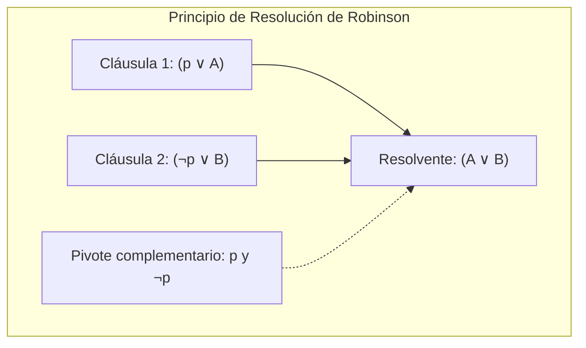
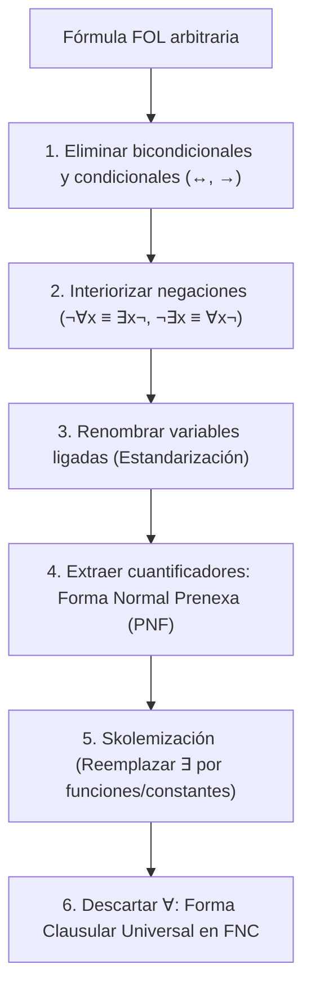
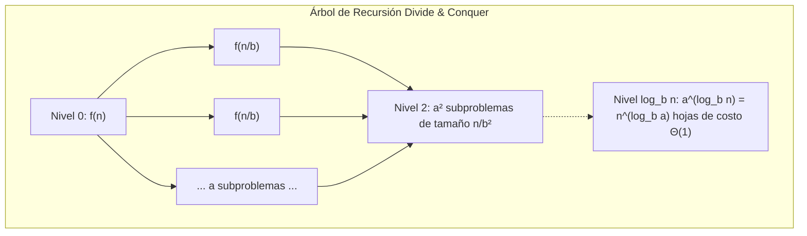
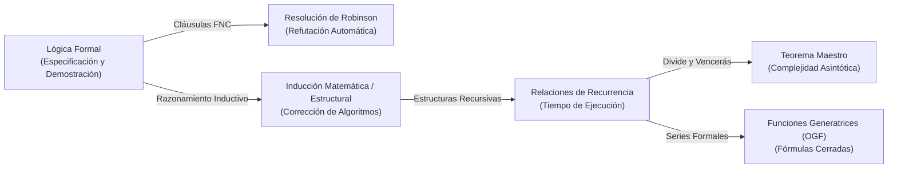

# Lógica Formal, Inducción y Relaciones de Recurrencia

La computación teórica descansa sobre cimientos matemáticos inquebrantables. Para especificar sistemas sin ambigüedad, verificar que un programa no contiene errores lógicos y calcular con exactitud matemática el consumo temporal o espacial de un algoritmo recursivo, el ingeniero informático domina tres pilares fundamentales: la **Lógica Simbólica Formal** (proposicional y de predicados), los **Principios de Inducción Matemática y Estructural**, y las herramientas analíticas para resolver **Relaciones de Recurrencia** (incluyendo el Teorema Maestro y las Funciones Generatrices).

> [!info] 💡 ¿Cómo entender esto desde cero? (Guía para novatos de pregrado)
> - **El problema de la intuición humana:** En el lenguaje cotidiano decimos cosas como *"Si no llueve o vienes temprano, salimos a comer"*. Pero, ¿qué pasa si llueve Y vienes temprano? ¿Salimos o no? El lenguaje natural es traicionero, vago y ambiguo. En software y hardware, una ambigüedad cuesta millones o vidas.
> - **Lógica Formal como compilador de la verdad:** La lógica simbólica reemplaza frases ambiguas por símbolos matemáticos estrictos ($\land, \lor, \neg, \to, \forall, \exists$) con reglas de evaluación algebraicas inmutables. Es el lenguaje con el que verificamos chips de Intel, sistemas de frenado automático y contratos inteligentes.
> - **Inducción Matemática como un efecto dominó infinito:** ¿Cómo puedes demostrar que un algoritmo de ordenamiento funciona bien para 10 datos, 10 millones de datos y para CUALQUIER cantidad infinita de datos? Es imposible probarlos uno por uno. La inducción es el truco maestro: demuestras que la primera ficha de dominó cae ($n=0$), y demuestras que CUALQUIER ficha que caiga empujará a la siguiente ($k \to k+1$). ¡Por lo tanto, todas las fichas caerán hasta el infinito!
> - **Relaciones de Recurrencia:** Todo algoritmo recursivo (*MergeSort*, *QuickSort*, árboles binarios) se llama a sí mismo reduciendo el tamaño del problema. Una relación de recurrencia es la ecuación matemática que describe ese consumo paso a paso. El **Teorema Maestro** es la "fórmula cuadrática" de los algoritmos: una receta matemática directa para saber instantáneamente si tu código tardará $O(n \log n)$ o explotará en $O(n^2)$.

---

## 1. Lógica Proposicional: Sintaxis, Semántica y Resolución

La lógica proposicional estudia las propiedades formales de proposiciones atómicas que pueden tomar exclusivamente uno de dos valores veritativos: **Verdadero** ($1$ o $V$) o **Falso** ($0$ o $F$).

### 1.1 Sintaxis Formal y Fórmulas Bien Formadas (FBF)

> [!definition] Definición 1.1: Alfabeto y Sintaxis Proposicional
> El lenguaje de la lógica proposicional $\mathcal{L}_{prop}$ está constituido por:
> 1. Un conjunto enumerable de **variables proposicionales**: $\mathcal{P} = \{p, q, r, p_1, p_2, \dots\}$.
> 2. Las **constantes lógicas** de verdad: $\{\top, \bot\}$ (donde $\top \equiv 1$ y $\bot \equiv 0$).
> 3. Los **conectivos lógicos**:
>    - Negación: $\neg$ (unario, aridad 1)
>    - Conjunción: $\land$ (binario, aridad 2)
>    - Disyunción: $\lor$ (binario, aridad 2)
>    - Implicación / Condicional material: $\to$ (binario, aridad 2)
>    - Doble implicación / Bicondicional: $\leftrightarrow$ (binario, aridad 2)
> 4. Símbolos auxiliares de puntuación: paréntesis $($ y $)$.

El conjunto de **Fórmulas Bien Formadas** ($\text{FBF}$ o $\text{WFF}$, *Well-Formed Formulas*) se define de manera inductiva como el lenguaje mínimo que satisface:
1. **Base:** Toda variable proposicional $p \in \mathcal{P}$ y las constantes $\top, \bot$ pertenecen a $\text{FBF}$.
2. **Paso inductivo:** Si $\alpha, \beta \in \text{FBF}$, entonces $(\neg \alpha)$, $(\alpha \land \beta)$, $(\alpha \lor \beta)$, $(\alpha \to \beta)$ y $(\alpha \leftrightarrow \beta)$ pertenecen a $\text{FBF}$.
3. **Clausura:** Ninguna otra secuencia de símbolos pertenece a $\text{FBF}$.

### 1.2 Semántica, Asignación de Verdad y Modelos

La semántica asigna significado y valor de verdad a las fórmulas sintácticas.

> [!definition] Definición 1.2: Asignación de Verdad / Valuación
> Una **valuación** o asignación de verdad es una función $v: \mathcal{P} \to \{0, 1\}$. Esta función se extiende de manera homomórfica y única a todo $\text{FBF}$ mediante la función $\bar{v}: \text{FBF} \to \{0, 1\}$ definida recursivamente:
> - $\bar{v}(\top) = 1$, $\bar{v}(\bot) = 0$.
> - $\bar{v}(p) = v(p)$ para todo $p \in \mathcal{P}$.
> - $\bar{v}(\neg \alpha) = 1 - \bar{v}(\alpha)$.
> - $\bar{v}(\alpha \land \beta) = \min(\bar{v}(\alpha), \bar{v}(\beta)) = \bar{v}(\alpha) \cdot \bar{v}(\beta)$.
> - $\bar{v}(\alpha \lor \beta) = \max(\bar{v}(\alpha), \bar{v}(\beta)) = \bar{v}(\alpha) + \bar{v}(\beta) - \bar{v}(\alpha)\cdot\bar{v}(\beta)$.
> - $\bar{v}(\alpha \to \beta) = 1$ si y solo si $\bar{v}(\alpha) = 0$ o $\bar{v}(\beta) = 1$. Equivalentemente: $\bar{v}(\neg \alpha \lor \beta)$.
> - $\bar{v}(\alpha \leftrightarrow \beta) = 1$ si y solo si $\bar{v}(\alpha) = \bar{v}(\beta)$.

#### Clasificación Semántica de Fórmulas
Para una fórmula $\phi \in \text{FBF}$:
- **Tautología ($\models \phi$):** $\bar{v}(\phi) = 1$ para toda valuación posible $v$.
- **Contradicción / Insatisfacible:** $\bar{v}(\phi) = 0$ para toda valuación posible $v$.
- **Satisfacible (SAT):** Existe al menos una valuación $v$ tal que $\bar{v}(\phi) = 1$. Dicha valuación es un **modelo** de $\phi$ ($v \models \phi$).
- **Contingencia:** $\phi$ es satisfacible pero no es una tautología (existen modelos y contra-modelos).

### 1.3 Equivalencias Lógicas Fundamentales

Dos fórmulas $\alpha$ y $\beta$ son **lógicamente equivalentes** ($\alpha \equiv \beta$ o $\alpha \Leftrightarrow \beta$) si y solo si $\models (\alpha \leftrightarrow \beta)$, lo que significa que $\bar{v}(\alpha) = \bar{v}(\beta)$ bajo cualquier valuación $v$.

| Nombre de la Ley | Equivalencia Conjunción ($\land$) | Equivalencia Disyunción ($\lor$) |
| :--- | :--- | :--- |
| **Identidad** | $\alpha \land \top \equiv \alpha$ | $\alpha \lor \bot \equiv \alpha$ |
| **Dominación (Aniquilación)** | $\alpha \land \bot \equiv \bot$ | $\alpha \lor \top \equiv \top$ |
| **Idempotencia** | $\alpha \land \alpha \equiv \alpha$ | $\alpha \lor \alpha \equiv \alpha$ |
| **Doble Negación** | $\neg(\neg \alpha) \equiv \alpha$ | — |
| **Conmutatividad** | $\alpha \land \beta \equiv \beta \land \alpha$ | $\alpha \lor \beta \equiv \beta \lor \alpha$ |
| **Asociatividad** | $(\alpha \land \beta) \land \gamma \equiv \alpha \land (\beta \land \gamma)$ | $(\alpha \lor \beta) \lor \gamma \equiv \alpha \lor (\beta \lor \gamma)$ |
| **Distributividad** | $\alpha \land (\beta \lor \gamma) \equiv (\alpha \land \beta) \lor (\alpha \land \gamma)$ | $\alpha \lor (\beta \land \gamma) \equiv (\alpha \lor \beta) \land (\alpha \lor \gamma)$ |
| **Leyes de De Morgan** | $\neg(\alpha \land \beta) \equiv \neg \alpha \lor \neg \beta$ | $\neg(\alpha \lor \beta) \equiv \neg \alpha \land \neg \beta$ |
| **Absorción** | $\alpha \land (\alpha \lor \beta) \equiv \alpha$ | $\alpha \lor (\alpha \land \beta) \equiv \alpha$ |
| **Complemento** | $\alpha \land \neg \alpha \equiv \bot$ | $\alpha \lor \neg \alpha \equiv \top$ |
| **Implicación Material** | $\alpha \to \beta \equiv \neg \alpha \lor \beta$ | $\neg(\alpha \to \beta) \equiv \alpha \land \neg \beta$ |
| **Contrapositiva** | $\alpha \to \beta \equiv \neg \beta \to \neg \alpha$ | — |

---

### 1.4 Formas Normales: FNC y FND

Un **literal** es una variable proposicional atómica $p$ o su negación $\neg p$.
- Un literal positivo es de la forma $p$.
- Un literal negativo es de la forma $\neg p$.

> [!definition] Definición 1.3: Forma Normal Conjuntiva y Disyuntiva
> 1. **Forma Normal Conjuntiva (FNC / CNF):** Una fórmula $\phi$ está en FNC si es una conjunción de una o más **cláusulas**, donde cada cláusula es una disyunción pura de literales:
>    $$\phi_{FNC} = \bigwedge_{i=1}^{m} \left( \bigvee_{j=1}^{k_i} l_{ij} \right) = (l_{11} \lor l_{12} \lor \dots) \land (l_{21} \lor l_{22} \lor \dots) \land \dots \land (l_{m1} \lor \dots)$$
> 2. **Forma Normal Disyuntiva (FND / DNF):** Una fórmula $\psi$ está en FND si es una disyunción de uno o más **términos**, donde cada término es una conjunción pura de literales:
>    $$\psi_{FND} = \bigvee_{i=1}^{m} \left( \bigwedge_{j=1}^{k_i} l_{ij} \right) = (l_{11} \land l_{12} \land \dots) \lor (l_{21} \land l_{22} \land \dots) \lor \dots \lor (l_{m1} \land \dots)$$

#### Algoritmo Canónico de Conversión a FNC
Para transformar cualquier fórmula proposicional arbitraria $\phi$ a una fórmula equivalente $\phi' \in \text{FNC}$:
1. **Eliminar bicondicionales:** Reemplazar $\alpha \leftrightarrow \beta$ por $(\alpha \to \beta) \land (\beta \to \alpha)$.
2. **Eliminar condicionales:** Reemplazar $\alpha \to \beta$ por $\neg \alpha \lor \beta$.
3. **Propagar negaciones hacia el interior (NNF - Negation Normal Form):**
   - Aplicar Leyes de De Morgan: $\neg(\alpha \land \beta) \mapsto \neg \alpha \lor \neg \beta$, $\neg(\alpha \lor \beta) \mapsto \neg \alpha \land \neg \beta$.
   - Eliminar dobles negaciones: $\neg(\neg \alpha) \mapsto \alpha$.
4. **Distribuir disyunciones sobre conjunciones:**
   - Aplicar repetidamente: $\alpha \lor (\beta \land \gamma) \mapsto (\alpha \lor \beta) \land (\alpha \lor \gamma)$.
   - $(\alpha \land \beta) \lor \gamma \mapsto (\alpha \lor \gamma) \land (\beta \lor \gamma)$.
5. **Simplificación booleana:** Eliminar literales duplicados dentro de cada cláusula ($l \lor l \equiv l$) y descartar cláusulas triviales que contengan $p \lor \neg p \equiv \top$ (pues $\Delta \land \top \equiv \Delta$).

---

### 1.5 Algoritmo de Resolución Proposicional de Robinson (1965)

El **Principio de Resolución** propuesto por J. Alan Robinson es una regla de inferencia sintáctica completa y correcta que opera exclusivamente sobre conjuntos de cláusulas en Forma Normal Conjuntiva (FNC). Constituye el motor fundamental del razonamiento automatizado, demostradores de teoremas y el lenguaje lógico **Prolog**.

> [!definition] Definición 1.4: Regla de Resolución Proposicional
> Dadas dos cláusulas $C_1$ y $C_2$ tales que $C_1$ contiene un literal positivo $l$ y $C_2$ contiene su literal complementario $\neg l$:
> $$C_1 = l \lor c_{1,1} \lor c_{1,2} \lor \dots \lor c_{1,n} = \{l\} \cup C'_1$$
> $$C_2 = \neg l \lor c_{2,1} \lor c_{2,2} \lor \dots \lor c_{2,m} = \{\neg l\} \cup C'_2$$
> La **cláusula resolvente** de $C_1$ y $C_2$ respecto al literal pivote $l$, denotada como $\text{Res}(C_1, C_2)$, es:
> $$\text{Res}(C_1, C_2) = C'_1 \cup C'_2 = c_{1,1} \lor \dots \lor c_{1,n} \lor c_{2,1} \lor \dots \lor c_{2,m}$$
> Si las cláusulas unitarias son $C_1 = \{l\}$ y $C_2 = \{\neg l\}$, su resolvente es la **cláusula vacía**, denotada por $\square$ o $\bot$, la cual representa intrínsecamente una **contradicción lógica** (falsedad).

#### Refutación por Resolución (Prueba por Contradicción)
Para demostrar mediante resolución que un conjunto de premisas $\Gamma = \{\phi_1, \phi_2, \dots, \phi_k\}$ implica lógicamente una conclusión $\psi$ ($\Gamma \models \psi$):
1. **Teorema de la Deducción Semántica:** $\Gamma \models \psi \iff \Gamma \cup \{\neg \psi\}$ es insatisfacible.
2. **Paso 1:** Convertir cada premisa $\phi_i \in \Gamma$ a su forma clausular en FNC.
3. **Paso 2:** Negar la conclusión esperada ($\neg \psi$) y convertirla a FNC.
4. **Paso 3:** Formar el conjunto inicial de cláusulas $S = \text{Clausulas}(\Gamma) \cup \text{Clausulas}(\neg \psi)$.
5. **Paso 4 (Bucle de Resolución):** Aplicar sistemáticamente la regla de resolución a pares de cláusulas en $S$ que posean literales complementarios, agregando los resolventes a $S$:
   $$S_{i+1} = S_i \cup \{\text{Res}(C_j, C_k) \mid C_j, C_k \in S_i\}$$
6. **Criterio de Parada:**
   - Si se deriva la cláusula vacía $\square \in S$, el conjunto $S$ es contradictorio (insatisfacible). Por tanto, la refutación tiene éxito y queda formalmente demostrado que $\Gamma \models \psi$.
   - Si no se generan nuevas cláusulas (punto fijo $S_{i+1} = S_i$) y $\square \notin S$, el conjunto es satisfacible; por tanto, la conclusión $\psi$ no se deduce de $\Gamma$.

> [!example] Ejemplo Completo de Demostración por Resolución
> **Premisas:**
> 1. Si el bus llega a tiempo o el metro funciona, Ana llega temprano: $(p \lor q) \to r$
> 2. Ana no llega temprano: $\neg r$
> 3. El bus llega a tiempo: $p$
> 
> **Objetivo:** Demostrar por refutación que el metro no funciona ($\neg q$).
> 
> **Fase 1: Conversión a Cláusulas FNC:**
> - Premisa 1: $(p \lor q) \to r \equiv \neg(p \lor q) \lor r \equiv (\neg p \land \neg q) \lor r \equiv (\neg p \lor r) \land (\neg q \lor r)$.
>   Obtenemos dos cláusulas:
>   - $C_1: \neg p \lor r$
>   - $C_2: \neg q \lor r$
> - Premisa 2: $C_3: \neg r$
> - Premisa 3: $C_4: p$
> - Negación de la conclusión ($\neg(\neg q) \equiv q$):
>   - $C_5: q$
> 
> **Fase 2: Grafo de Deducción por Resolución:**
> 1. De $C_2: (\neg q \lor r)$ y $C_5: (q)$ resolviendo sobre $q$ $\implies C_6: r$.
> 2. De $C_6: (r)$ y $C_3: (\neg r)$ resolviendo sobre $r$ $\implies C_7: \square$ (Cláusula vacía).
> 
> ¡Se obtuvo la cláusula vacía $\square$! La hipótesis $\neg(\neg q)$ generó una contradicción matemática. Queda rigurosamente demostrado que $\neg q$ es una consecuencia lógica necesaria.

---

## 2. Lógica de Primer Orden (Cálculo de Predicados)

La lógica proposicional es incapaz de expresar relaciones entre objetos, propiedades de individuos o afirmaciones generales como *"Todos los seres humanos son mortales"*. La **Lógica de Primer Orden (FOL - First-Order Logic)** extiende la lógica proposicional incorporando constantes, variables, funciones, predicados y **cuantificadores**.

### 2.1 Sintaxis y Cuantificadores Formales

> [!definition] Definición 2.1: Alfabeto y Términos en Lógica de Primer Orden
> El lenguaje formal de primer orden se construye sobre:
> 1. **Variables individuales:** $\mathcal{V} = \{x, y, z, x_1, x_2, \dots\}$.
> 2. **Símbolos de constantes:** $\mathcal{C} = \{a, b, c, c_1, \dots\}$.
> 3. **Símbolos de función:** $\mathcal{F} = \{f, g, h, \dots\}$, cada uno con una aridad finita $n \ge 1$.
> 4. **Símbolos de predicado:** $\mathcal{R} = \{P, Q, R, \dots\}$, cada uno con una aridad finita $n \ge 0$.
> 5. **Cuantificadores:**
>    - Cuantificador Universal: $\forall$ (*"Para todo"* o *"Para cada"*).
>    - Cuantificador Existencial: $\exists$ (*"Existe al menos un"*).
> 
> Un **término** representa un objeto del dominio y se define inductivamente:
> - Toda variable $x \in \mathcal{V}$ y toda constante $c \in \mathcal{C}$ es un término.
> - Si $t_1, t_2, \dots, t_n$ son términos y $f \in \mathcal{F}$ es una función $n$-aria, entonces $f(t_1, \dots, t_n)$ es un término.

Una **fórmula atómica** es de la forma $P(t_1, \dots, t_n)$ donde $P$ es un predicado $n$-ario y cada $t_i$ es un término. Las fórmulas bien formadas de primer orden se generan combinando átomos con conectivos lógicos y cuantificadores $(\forall x \ \phi)$ y $(\exists x \ \phi)$.

### 2.2 Semántica: Estructuras, Dominios e Interpretaciones

> [!definition] Definición 2.2: Estructura de Interpretación de Primer Orden
> Una **estructura de interpretación** $\mathcal{M}$ es un par ordenado $\mathcal{M} = \langle \mathcal{D}, \mathcal{I} \rangle$:
> 1. $\mathcal{D}$ es el **universo del discurso** o **dominio**, un conjunto no vacío de entidades concretas o abstractas.
> 2. $\mathcal{I}$ es la **función de interpretación** que mapea:
>    - Cada constante $c \in \mathcal{C}$ a un elemento $\mathcal{I}(c) \in \mathcal{D}$.
>    - Cada función $n$-aria $f \in \mathcal{F}$ a una operación matemática $\mathcal{I}(f): \mathcal{D}^n \to \mathcal{D}$.
>    - Cada predicado $n$-ario $P \in \mathcal{R}$ a una relación $\mathcal{I}(P) \subseteq \mathcal{D}^n$.
> 
> Dada una asignación de variables $\sigma: \mathcal{V} \to \mathcal{D}$, la satisfacción formal de una fórmula cuantificada se define:
> - $\mathcal{M}, \sigma \models \forall x \ \phi \iff \text{para todo } d \in \mathcal{D}, \ \mathcal{M}, \sigma[x \mapsto d] \models \phi$.
> - $\mathcal{M}, \sigma \models \exists x \ \phi \iff \text{existe al menos un } d \in \mathcal{D} \text{ tal que } \mathcal{M}, \sigma[x \mapsto d] \models \phi$.

---

### 2.3 Forma Normal Prenexa (PNF) y Skolemización

Para aplicar algoritmos de deducción automática (como Resolución de Robinson de Primer Orden mediante Unificación de Robinson), toda fórmula de primer orden debe despojarse de cuantificadores existenciales y estructurarse algebraicamente.

> [!definition] Definición 2.3: Forma Normal Prenexa (PNF)
> Una fórmula $\phi$ de primer orden está en **Forma Normal Prenexa** si todos sus cuantificadores aparecen al inicio absoluto de la fórmula, dejando una matriz libre de cuantificadores:
> $$\phi_{PNF} = Q_1 x_1 \, Q_2 x_2 \, \dots \, Q_k x_k \, \left[ \psi(x_1, \dots, x_k) \right]$$
> donde cada $Q_i \in \{\forall, \exists\}$ es un cuantificador y la **matriz** $\psi$ es una fórmula puramente proposicional sin cuantificadores.

#### Reglas de Transformación a Forma Normal Prenexa:
1. Eliminar $\leftrightarrow$ y $\to$.
2. Mover las negaciones $\neg$ hacia adentro (Leyes de De Morgan para cuantificadores):
   $$\neg(\forall x \, \phi) \equiv \exists x \, \neg \phi \qquad \neg(\exists x \, \phi) \equiv \forall x \, \neg \phi$$
3. **Renombramiento de variables ligadas (Estandarización de variables):** Si una variable aparece ligada dos veces o con alcances superpuestos, renombrarla con un identificador único: $(\forall x P(x)) \lor (\exists x Q(x)) \mapsto (\forall x P(x)) \lor (\exists y Q(y))$.
4. Extraer los cuantificadores al frente usando las equivalencias:
   - $(\forall x \, P(x)) \land Q \equiv \forall x (P(x) \land Q)$ (donde $x$ no aparece libre en $Q$).
   - $(\forall x \, P(x)) \lor Q \equiv \forall x (P(x) \lor Q)$.
   - $(\exists x \, P(x)) \land Q \equiv \exists x (P(x) \land Q)$.
   - $(\exists x \, P(x)) \lor Q \equiv \exists x (P(x) \lor Q)$.

#### Skolemización: Eliminación de Cuantificadores Existenciales
La **Skolemización** (introducida por Thoralf Skolem) transforma una fórmula en PNF en una fórmula universalmente cuantificada, preservando la **equi-satisfacibilidad** (la fórmula original es satisfacible si y solo si su versión Skolemizada es satisfacible).

> [!important] Regla Canónica de Skolemización
> Sea una fórmula en PNF: $\forall x_1 \forall x_2 \dots \forall x_n \, \exists y \, \psi(x_1, \dots, x_n, y, \dots)$
> 1. Si el cuantificador existencial $\exists y$ se encuentra dentro del alcance de $n$ cuantificadores universales $\forall x_1, \dots, \forall x_n$ ($n \ge 1$), el valor de $y$ depende formalmente de los valores elegidos para $x_1, \dots, x_n$. Por tanto, se reemplaza toda ocurrencia de $y$ por una **función de Skolem fresca** $f_k(x_1, \dots, x_n)$, donde $f_k$ no aparecía previamente en el lenguaje:
>    $$\forall x_1 \dots \forall x_n \, \psi(x_1, \dots, x_n, f_k(x_1, \dots, x_n), \dots)$$
> 2. Si $\exists y$ **no está bajo el alcance de ningún cuantificador universal** ($n = 0$), se reemplaza toda ocurrencia de $y$ por una **constante de Skolem fresca** $c$:
>    $$\exists y \, \psi(y) \mapsto \psi(c)$$

> [!example] Ejemplo Detallado de Skolemización
> Sea la afirmación: *"Para cada número natural $x$, existe un sucesor $y$ tal que para todo número $z$, existe un número $w$ que satisface $P(x, y) \land (Q(y, z) \to R(w))$"*.
> 
> En primer orden formal:
> $$\phi = \forall x \, \exists y \, \forall z \, \exists w \, [P(x, y) \land (\neg Q(y, z) \lor R(w))]$$
> 
> 1. Ya se encuentra en Forma Normal Prenexa.
> 2. Analizamos el existencial $\exists y$: se encuentra únicamente bajo el alcance de $\forall x$. Reemplazamos $y$ por la función de Skolem unaria $f(x)$.
>    $$\phi' = \forall x \, \forall z \, \exists w \, [P(x, f(x)) \land (\neg Q(f(x), z) \lor R(w))]$$
> 3. Analizamos el existencial $\exists w$: se encuentra bajo el alcance de **dos** cuantificadores universales precedentes ($\forall x$ y $\forall z$). Reemplazamos $w$ por la función de Skolem binaria $g(x, z)$.
>    $$\phi'' = \forall x \, \forall z \, [P(x, f(x)) \land (\neg Q(f(x), z) \lor R(g(x, z)))]$$
> 4. Dado que todos los cuantificadores restantes son universales, se omiten implícitamente, dejando la matriz pura en FNC lista para Unificación y Resolución de Robinson:
>    $$[P(x, f(x))] \land [\neg Q(f(x), z) \lor R(g(x, z))]$$

---

## 3. Principio de Inducción Matemática e Inducción Estructural

La inducción matemática es la técnica deductiva fundamental de la computación teórica para demostrar propiedades sobre dominios discretos infinitos, estructuras de datos jerárquicas y complejidad de algoritmos.

### 3.1 Inducción Simple (Débil) e Inducción Fuerte (Completa)

El conjunto de los números naturales $\mathbb{N} = \{0, 1, 2, 3, \dots\}$ está fundado bajo el **Principio del Buen Orden**: *Todo subconjunto no vacío de $\mathbb{N}$ posee un elemento mínimo*.

> [!definition] Definición 3.1: Principio de Inducción Simple
> Sea $P(n)$ un predicado definido sobre $n \in \mathbb{N}$ y sea $n_0 \in \mathbb{N}$ el caso base:
> $$\Big[ P(n_0) \ \land \ \forall k \ge n_0 \, \big( P(k) \to P(k+1) \big) \Big] \implies \forall n \ge n_0 \, P(n)$$
> - **Caso Base:** Demostrar que la propiedad se cumple para $n = n_0$.
> - **Hipótesis Inductiva:** Asumir formalmente que $P(k)$ es verdadero para un entero arbitrario $k \ge n_0$.
> - **Paso Inductivo:** Demostrar rigurosamente que $P(k+1)$ es verdadero utilizando la hipótesis $P(k)$.

> [!definition] Definición 3.2: Principio de Inducción Fuerte
> En ocasiones, la veracidad de $P(k+1)$ no depende exclusivamente de su antecesor inmediato $P(k)$, sino de la acumulación histórica de todos los estados previos:
> $$\Big[ P(n_0) \ \land \ \forall k \ge n_0 \, \Big( \big( \forall j \in \{n_0, \dots, k\} \, P(j) \big) \to P(k+1) \Big) \Big] \implies \forall n \ge n_0 \, P(n)$$

> [!important] Teorema de Equivalencia Formal
> **Teorema:** El Principio de Inducción Simple, el Principio de Inducción Fuerte y el Principio del Buen Orden son **lógicamente equivalentes**. Cualquier propiedad demostrable por inducción fuerte puede reformularse en inducción simple definiendo un predicado acumulativo $Q(n) \equiv \bigwedge_{j=n_0}^{n} P(j)$.

---

### 3.2 Principio de Inducción Estructural

La inducción matemática estándar opera sobre cadenas lineales de enteros. La **Inducción Estructural** generaliza este principio a conjuntos definidos de manera inductiva o recursiva, tales como listas enlazadas, árboles binarios, gramáticas formales y expresiones sintácticas.

> [!definition] Definición 3.3: Principio de Inducción Estructural
> Sea $\mathcal{S}$ un conjunto definido inductivamente por:
> 1. **Base del conjunto:** Un conjunto de elementos atómicos $\mathcal{B} \subset \mathcal{S}$.
> 2. **Constructores algebraicos:** Un conjunto de operaciones constructivas $\{\kappa_1, \kappa_2, \dots\}$ tales que si $s_1, \dots, s_m \in \mathcal{S}$, entonces $\kappa_i(s_1, \dots, s_m) \in \mathcal{S}$.
> 
> Para demostrar que una propiedad $P(s)$ es verdadera para todo $s \in \mathcal{S}$:
> - **Caso Base Estructural:** Probar que $P(b)$ se cumple para todo átomo $b \in \mathcal{B}$.
> - **Paso Inductivo Estructural:** Para cada constructor $\kappa_i$, asumir como hipótesis inductiva que $P(s_1), P(s_2), \dots, P(s_m)$ son verdaderos, y demostrar que $P(\kappa_i(s_1, \dots, s_m))$ es verdadero.

#### Ejemplo Paradigmático: Teorema de Hojas y Nodos Internos en Árboles Binarios

> [!example] Demostración Rigurosa por Inducción Estructural
> **Definición inductiva del conjunto de Árboles Binarios Estrictos $\mathcal{T}$:**
> 1. **Base:** Un único nodo hoja $\bullet$ es un árbol binario estricto ($\bullet \in \mathcal{T}$).
> 2. **Constructor:** Si $T_1, T_2 \in \mathcal{T}$, entonces $\text{MakeTree}(T_1, T_2) \in \mathcal{T}$, el cual une una nueva raíz con subárbol izquierdo $T_1$ y subárbol derecho $T_2$.
> 
> **Propiedad a Demostrar:** Para todo $T \in \mathcal{T}$, si $L(T)$ es el número de hojas y $I(T)$ es el número de nodos internos (con dos hijos), se cumple que:
> $$L(T) = I(T) + 1$$
> 
> **Demostración:**
> - **Caso Base:** Sea $T = \bullet$ (un único nodo atómico).
>   - $L(\bullet) = 1$
>   - $I(\bullet) = 0$
>   - Verificación: $L(\bullet) = 1 = 0 + 1 = I(\bullet) + 1$. El caso base se cumple de manera exacta.
> - **Paso Inductivo Estructural:**
>   - Sean $T_1, T_2 \in \mathcal{T}$ dos árboles binarios arbitrarios.
>   - **Hipótesis Inductiva:** Asumimos que la propiedad se cumple para ambos subárboles:
>     $$L(T_1) = I(T_1) + 1 \qquad \text{y} \qquad L(T_2) = I(T_2) + 1$$
>   - Consideremos el árbol compuesto $T = \text{MakeTree}(T_1, T_2)$.
>   - Por la semántica del constructor, las hojas de $T$ son la unión disjunta de las hojas de sus subárboles:
>     $$L(T) = L(T_1) + L(T_2)$$
>   - Los nodos internos de $T$ son los nodos internos de $T_1$, más los nodos internos de $T_2$, más la **nueva raíz** creada por el constructor:
>     $$I(T) = I(T_1) + I(T_2) + 1$$
>   - Sustituyendo la hipótesis inductiva en la expresión de $L(T)$:
>     $$L(T) = [I(T_1) + 1] + [I(T_2) + 1] = I(T_1) + I(T_2) + 2$$
>     $$L(T) = \underbrace{[I(T_1) + I(T_2) + 1]}_{I(T)} + 1 = I(T) + 1$$
> Queda demostrado formalmente por inducción estructural que para cualquier árbol binario estricto, sin importar su profundidad o balance, $L(T) = I(T) + 1$. $\blacksquare$

---

## 4. Relaciones de Recurrencia y Ecuaciones en Diferencias

En análisis de algoritmos, el tiempo de ejecución de un procedimiento recursivo se formula matemáticamente como una ecuación donde el término $a_n$ se define en función de sus valores previos $a_{n-1}, a_{n-2}, \dots$.

### 4.1 Recurrencias Lineales Homogéneas con Coeficientes Constantes

> [!definition] Definición 4.1: Recurrencia Lineal Homogénea de Orden $k$
> Es una ecuación de la forma:
> $$c_k a_n + c_{k-1} a_{n-1} + c_{k-2} a_{n-2} + \dots + c_0 a_{n-k} = 0$$
> donde cada $c_i \in \mathbb{R}$ es constante y $c_k \ne 0, c_0 \ne 0$.
> Proponiendo una solución de la forma exponencial $a_n = r^n$ con $r \ne 0$, sustituimos y dividimos entre $r^{n-k}$, obteniendo el **Polinomio Característico**:
> $$c_k r^k + c_{k-1} r^{k-1} + \dots + c_1 r + c_0 = 0$$

#### Teorema Fundamental de Solución según las Raíces:
1. **Raíces Reales Distintas:** Si el polinomio posee $k$ raíces reales distintas $r_1, r_2, \dots, r_k$, la solución general es:
   $$a_n = C_1 r_1^n + C_2 r_2^n + \dots + C_k r_k^n$$
2. **Raíces con Multiplicidad:** Si una raíz $r_j$ tiene multiplicidad algebraica $m$, aporta $m$ soluciones linealmente independientes al espacio solución:
   $$a_n = (C_{j,0} + C_{j,1} n + C_{j,2} n^2 + \dots + C_{j, m-1} n^{m-1}) r_j^n$$
3. **Raíces Complejas Conjugadas:** Si existen raíces complejas $r = \rho e^{\pm i \theta} = \rho (\cos \theta \pm i \sin \theta)$, su contribución en números reales adopta la forma armónica:
   $$a_n = \rho^n (A \cos(n \theta) + B \sin(n \theta))$$

---

### 4.2 Recurrencias Lineales No Homogéneas

Cuando la ecuación incluye una función externa independiente de la secuencia $a_n$:
$$c_k a_n + c_{k-1} a_{n-1} + \dots + c_0 a_{n-k} = f(n)$$

Por el principio de superposición lineal, la solución completa es:
$$a_n = a_n^{(h)} + a_n^{(p)}$$
donde $a_n^{(h)}$ es la solución general de la ecuación homogénea asociada y $a_n^{(p)}$ es una **solución particular** que satisface la ecuación no homogénea.

| Forma del término no homogéneo $f(n)$ | Solución particular propuesta $a_n^{(p)}$ |
| :--- | :--- |
| Polinomio de grado $d$: $P_d(n) = b_d n^d + \dots + b_0$ | $n^s (A_d n^d + \dots + A_0)$, donde $s$ es la multiplicidad de $1$ como raíz característica. |
| Exponencial: $C \cdot s^n$ | $n^m (A \cdot s^n)$, donde $m$ es la multiplicidad de $s$ como raíz característica ($m=0$ si $s$ no es raíz). |
| Combinación: $s^n P_d(n)$ | $n^m s^n (A_d n^d + \dots + A_0)$ |

---

### 4.3 Método de Funciones Generatrices Ordinarias (OGF)

Las Funciones Generatrices Ordinarias (*Ordinary Generating Functions*) transforman secuencias discretas $\{a_n\}_{n=0}^{\infty}$ en funciones analíticas continuas $G(x)$, convirtiendo problemas combinatorios y recurrencias en manipulación algebraica de polinomios y series de potencias.

> [!definition] Definición 4.2: Función Generatriz Ordinaria
> Dada la sucesión infinita $\langle a_0, a_1, a_2, \dots \rangle$, su función generatriz ordinaria $G(x)$ es la serie formal de potencias:
> $$G(x) = \sum_{n=0}^{\infty} a_n x^n = a_0 + a_1 x + a_2 x^2 + a_3 x^3 + \dots$$
> El término general de la secuencia se recupera mediante el operador de extracción de coeficientes: $a_n = [x^n] G(x)$.

#### Procedimiento Algebraico para Resolver Recurrencias mediante OGF:
1. Multiplicar la relación de recurrencia completa por $x^n$.
2. Aplicar la sumatoria infinita sobre todo el rango de validez de la recurrencia (ej. $\sum_{n=k}^{\infty}$).
3. Expresar cada sumatoria desplazada en términos de $G(x)$ utilizando las identidades:
   $$\sum_{n=0}^{\infty} a_{n+1} x^n = \frac{G(x) - a_0}{x}, \qquad \sum_{n=0}^{\infty} a_{n+2} x^n = \frac{G(x) - a_0 - a_1 x}{x^2}$$
4. Despejar algebraicamente la función $G(x)$ como una función racional $G(x) = \frac{P(x)}{Q(x)}$.
5. Descomponer $G(x)$ en **fracciones simples (parciales)**.
6. Aplicar la serie geométrica generalizada $\frac{1}{(1 - rx)^{k+1}} = \sum_{n=0}^{\infty} \binom{n+k}{k} r^n x^n$ para extraer el coeficiente de $[x^n]$ y obtener la fórmula cerrada de $a_n$.

> [!example] Resolución de Fibonacci mediante Funciones Generatrices
> Sea la recurrencia $F_{n} = F_{n-1} + F_{n-2}$ para $n \ge 2$, con $F_0 = 0$ y $F_1 = 1$.
> Multiplicamos por $x^n$ y sumamos para $n \ge 2$:
> $$\sum_{n=2}^{\infty} F_n x^n = \sum_{n=2}^{\infty} F_{n-1} x^n + \sum_{n=2}^{\infty} F_{n-2} x^n$$
> Expresando en términos de $G(x) = \sum_{n=0}^{\infty} F_n x^n$:
> $$G(x) - F_0 - F_1 x = x (G(x) - F_0) + x^2 G(x)$$
> Sustituyendo $F_0 = 0$ y $F_1 = 1$:
> $$G(x) - x = x G(x) + x^2 G(x) \implies G(x)(1 - x - x^2) = x$$
> Despejando $G(x)$:
> $$G(x) = \frac{x}{1 - x - x^2}$$
> Las raíces de $1 - x - x^2 = 0$ son $-\phi$ y $-\hat{\phi}$ donde $\phi = \frac{1+\sqrt{5}}{2}$ (razón áurea) y $\hat{\phi} = \frac{1-\sqrt{5}}{2}$.
> Factorizando y descomponiendo en fracciones parciales:
> $$G(x) = \frac{1}{\sqrt{5}} \left( \frac{1}{1 - \phi x} - \frac{1}{1 - \hat{\phi} x} \right)$$
> Extrayendo el coeficiente $[x^n]$ mediante la expansión geométrica $\frac{1}{1 - \alpha x} = \sum_{n=0}^{\infty} \alpha^n x^n$:
> $$F_n = [x^n] G(x) = \frac{1}{\sqrt{5}} \left( \phi^n - \hat{\phi}^n \right) = \frac{1}{\sqrt{5}} \left[ \left(\frac{1+\sqrt{5}}{2}\right)^n - \left(\frac{1-\sqrt{5}}{2}\right)^n \right]$$
> Obtenemos de manera puramente analítica la célebre **Fórmula de Binet**.

---

## 5. El Teorema Maestro Formal para Complejidades Divide & Conquer

El paradigma de diseño algorítmico **Divide y Vencerás** (*Divide and Conquer*) divide una instancia de tamaño $n$ en $a$ subproblemas idénticos, cada uno de tamaño $n/b$, resuelve recursivamente los subproblemas y recombina sus soluciones con un costo local $f(n)$. Su tiempo de ejecución satisface la relación de recurrencia canónica:

$$T(n) = a \cdot T\left(\frac{n}{b}\right) + f(n)$$

donde $a \ge 1$, $b > 1$ son constantes y $f(n)$ es una función asintóticamente positiva.

### 5.1 Anatomía del Árbol de Recursión y Costos por Nivel

Para deducir rigurosamente el comportamiento de $T(n)$, descomponemos la ejecución en un árbol de recursión:

- **Profundidad / Altura del Árbol:** En cada nivel el tamaño del problema se reduce por el factor $b$. La recursión finaliza cuando $\frac{n}{b^j} = 1$, lo que implica $n = b^j \implies j = \log_b n$. El árbol tiene exactamente $\log_b n$ niveles (de $j=0$ a $j=\log_b n$).
- **Cantidad de subproblemas en el nivel $j$:** Cada nodo genera $a$ ramificaciones; en el nivel $j$ hay exactamente $a^j$ subproblemas.
- **Tamaño de cada subproblema en el nivel $j$:** $\frac{n}{b^j}$.
- **Costo total del nivel $j$ (trabajo de división/combinación):**
  $$\text{Costo}_j = a^j \cdot f\left(\frac{n}{b^j}\right)$$
- **Cantidad total de hojas en la base del árbol:**
  $$\text{Hojas} = a^{\log_b n} = a^{\frac{\log_a n}{\log_a b}} = \left(a^{\log_a n}\right)^{\frac{1}{\log_a b}} = n^{\log_b a}$$
- **Costo total de la base (casos base):**
  $$\text{Costo}_{\text{hojas}} = n^{\log_b a} \cdot \Theta(1) = \Theta(n^{\log_b a})$$

Sumando el costo de todos los niveles del árbol:
$$T(n) = \Theta(n^{\log_b a}) + \sum_{j=0}^{\log_b n - 1} a^j f\left(\frac{n}{b^j}\right)$$

La función $n^{\log_b a}$ actúa como el **umbral crítico de referencia**. El comportamiento asintótico de $T(n)$ depende de la competencia matemática entre el costo de procesar las hojas $\Theta(n^{\log_b a})$ y el costo de dividir/combinar en la raíz $f(n)$.

---

### 5.2 Enunciado y Demostración Matemática de los Tres Casos

> [!definition] Definición 5.1: Teorema Maestro Estándar (Cormen et al.)
> Sea $T(n) = a T(n/b) + f(n)$ con $a \ge 1$, $b > 1$. Se presentan tres casos disyuntos:
> 
> 1. **Caso 1 (Dominancia de Hojas / Bottom-Heavy):** Si existe una constante $\epsilon > 0$ tal que:
>    $$f(n) = O(n^{\log_b a - \epsilon})$$
>    entonces el costo de las hojas domina asintóticamente la suma, y:
>    $$T(n) = \Theta(n^{\log_b a})$$
> 
> 2. **Caso 2 (Equilibrio de Costos / Evenly Distributed):** Si el costo local coincide asintóticamente con el costo de hojas:
>    $$f(n) = \Theta(n^{\log_b a})$$
>    entonces el costo se reparte uniformemente en los $\log_b n$ niveles del árbol, y:
>    $$T(n) = \Theta(n^{\log_b a} \log n)$$
> 
> 3. **Caso 3 (Dominancia de Raíz / Top-Heavy):** Si existe una constante $\epsilon > 0$ tal que:
>    $$f(n) = \Omega(n^{\log_b a + \epsilon})$$
>    y además $f(n)$ satisface la **condición de regularidad**: existe una constante $c < 1$ y un $n_0$ tal que para todo $n \ge n_0$:
>    $$a \cdot f\left(\frac{n}{b}\right) \le c \cdot f(n)$$
>    entonces el costo del nivel raíz domina todo el árbol, y:
>    $$T(n) = \Theta(f(n))$$

#### Demostración Matemática Rigurosa:

Analicemos la serie de la sumatoria total $S(n) = \sum_{j=0}^{\log_b n - 1} a^j f\left(\frac{n}{b^j}\right)$.

##### Demostración del Caso 1:
Dado $f(n) = O(n^{\log_b a - \epsilon})$, existe $c > 0$ tal que $f(n/b^j) \le c \left(\frac{n}{b^j}\right)^{\log_b a - \epsilon}$.
Sustituyendo en la sumatoria:
$$S(n) \le c \sum_{j=0}^{\log_b n - 1} a^j \left(\frac{n}{b^j}\right)^{\log_b a - \epsilon} = c \cdot n^{\log_b a - \epsilon} \sum_{j=0}^{\log_b n - 1} a^j (b^{-\log_b a + \epsilon})^j$$
Recordemos que $b^{-\log_b a} = \frac{1}{b^{\log_b a}} = \frac{1}{a}$. Por tanto:
$$a^j (b^{-\log_b a + \epsilon})^j = a^j \left( \frac{1}{a} b^\epsilon \right)^j = (b^\epsilon)^j$$
La sumatoria se reduce a una serie geométrica de razón $r = b^\epsilon > 1$ (dado que $b > 1$ y $\epsilon > 0$):
$$\sum_{j=0}^{\log_b n - 1} (b^\epsilon)^j = \frac{(b^\epsilon)^{\log_b n} - 1}{b^\epsilon - 1} = \frac{(b^{\log_b n})^\epsilon - 1}{b^\epsilon - 1} = \frac{n^\epsilon - 1}{b^\epsilon - 1} = O(n^\epsilon)$$
Multiplicando por el factor exterior:
$$S(n) = O(n^{\log_b a - \epsilon} \cdot n^\epsilon) = O(n^{\log_b a})$$
Sumando el costo de las hojas $\Theta(n^{\log_b a})$:
$$T(n) = \Theta(n^{\log_b a}) + O(n^{\log_b a}) = \Theta(n^{\log_b a}) \quad \blacksquare$$

##### Demostración del Caso 2:
Dado $f(n) = \Theta(n^{\log_b a})$, entonces $f(n/b^j) = \Theta\left(\left(\frac{n}{b^j}\right)^{\log_b a}\right)$.
Sustituyendo en la sumatoria:
$$S(n) = \sum_{j=0}^{\log_b n - 1} a^j \cdot \Theta\left(\frac{n^{\log_b a}}{(b^{\log_b a})^j}\right)$$
Como $b^{\log_b a} = a$, tenemos que $(b^{\log_b a})^j = a^j$. El término $a^j$ en el numerador y denominador se cancela exactamente:
$$S(n) = \sum_{j=0}^{\log_b n - 1} a^j \cdot \Theta\left(\frac{n^{\log_b a}}{a^j}\right) = \sum_{j=0}^{\log_b n - 1} \Theta(n^{\log_b a}) = \Theta(n^{\log_b a}) \sum_{j=0}^{\log_b n - 1} 1$$
La suma de 1 repetida $\log_b n$ veces es idéntica a $\log_b n$:
$$S(n) = \Theta(n^{\log_b a} \log_b n) = \Theta(n^{\log_b a} \log n)$$
Por consiguiente:
$$T(n) = \Theta(n^{\log_b a}) + \Theta(n^{\log_b a} \log n) = \Theta(n^{\log_b a} \log n) \quad \blacksquare$$

##### Demostración del Caso 3:
Por la condición de regularidad, $a f(n/b) \le c f(n)$ para alguna constante $c < 1$. Aplicando inductivamente esta cota para el nivel $j$:
$$a^j f(n/b^j) \le c^j f(n)$$
Sustituyendo en la suma de costos:
$$S(n) = \sum_{j=0}^{\log_b n - 1} a^j f(n/b^j) \le f(n) \sum_{j=0}^{\log_b n - 1} c^j$$
Dado que $c < 1$, la serie geométrica infinita converge a un valor constante: $\sum_{j=0}^{\infty} c^j = \frac{1}{1-c} = O(1)$.
Por lo tanto, la sumatoria está acotada superiormente por:
$$S(n) \le f(n) \cdot \frac{1}{1-c} = O(f(n))$$
Dado que el nivel $j=0$ aporta trivialmente $f(n)$, concluimos que $S(n) = \Theta(f(n))$.
Como $f(n) = \Omega(n^{\log_b a + \epsilon})$, el término $f(n)$ domina asintóticamente a $\Theta(n^{\log_b a})$, obteniendo:
$$T(n) = \Theta(f(n)) \quad \blacksquare$$

---

### 5.3 El Caso Extendido del Teorema Maestro

¿Qué sucede cuando $f(n)$ contiene factores polilogarítmicos $\log^k n$ que la hacen ligeramente mayor que $n^{\log_b a}$, pero no por un factor polinomial $n^\epsilon$?

> [!important] Teorema Maestro Extendido (Generalización del Caso 2)
> Si la relación de recurrencia es $T(n) = a T(n/b) + f(n)$ y:
> $$f(n) = \Theta(n^{\log_b a} \cdot \log^k n) \quad \text{con } k \ge 0$$
> entonces:
> $$T(n) = \Theta(n^{\log_b a} \cdot \log^{k+1} n)$$
> Si $k = -1$:
> $$T(n) = \Theta(n^{\log_b a} \cdot \log(\log n))$$
> Si $k < -1$:
> $$T(n) = \Theta(n^{\log_b a})$$

> [!example] Casos Prácticos en Algoritmos Clásicos
> 1. **MergeSort:** $T(n) = 2 T(n/2) + \Theta(n)$.
>    - $a = 2, b = 2 \implies n^{\log_b a} = n^{\log_2 2} = n^1 = n$.
>    - $f(n) = \Theta(n) \implies$ Caso 2 ($k = 0$).
>    - **Resultado:** $T(n) = \Theta(n \log n)$.
> 2. **Multiplicación de Matrices de Strassen:** $T(n) = 7 T(n/2) + \Theta(n^2)$.
>    - $a = 7, b = 2 \implies n^{\log_b a} = n^{\log_2 7} \approx n^{2.807}$.
>    - $f(n) = \Theta(n^2)$. Como $2 < 2.807 - \epsilon$ (con $\epsilon \approx 0.807$), aplica el **Caso 1**.
>    - **Resultado:** $T(n) = \Theta(n^{\log_2 7}) \approx \Theta(n^{2.807})$.
> 3. **Búsqueda Binaria:** $T(n) = 1 T(n/2) + \Theta(1)$.
>    - $a = 1, b = 2 \implies n^{\log_2 1} = n^0 = 1$.
>    - $f(n) = \Theta(1) \implies$ Caso 2 ($k = 0$).
>    - **Resultado:** $T(n) = \Theta(1 \cdot \log n) = \Theta(\log n)$.

> [!tip] Limitaciones y Gaps del Teorema Maestro
> El Teorema Maestro **no se puede aplicar** cuando:
> 1. $a$ no es constante (ej. $T(n) = n T(n/2) + n$).
> 2. $f(n)$ no es polinomialmente mayor o menor que $n^{\log_b a}$. Por ejemplo, en $T(n) = 2 T(n/2) + n \log n$, la relación entre $f(n)$ y $n^{\log_2 2} = n$ es un factor $\log n$, el cual crece más lento que $n^\epsilon$ para cualquier $\epsilon > 0$. Para este caso se usa el **Teorema Extendido** obteniendo $\Theta(n \log^2 n)$.
> 3. Falla la condición de regularidad en el Caso 3 (ej. $f(n) = n(2 - \cos n)$). En tales escenarios se debe recurrir al método de sustitución o al teorema más general de **Akra-Bazzi**.

---

## 6. Resumen y Conexiones Conceptuales

La lógica simbólica proporciona el lenguaje formal libre de ambigüedades con el que enunciamos propiedades algorítmicas; la inducción matemática y estructural brinda el método deductivo para certificar que un algoritmo computa el resultado correcto para infinitos casos posibles; y las ecuaciones de recurrencia, resueltas analíticamente mediante funciones generatrices o evaluadas asintóticamente mediante el Teorema Maestro, establecen con exactitud la viabilidad temporal y el escalamiento del software en sistemas computacionales reales.
