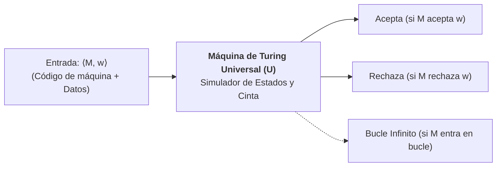
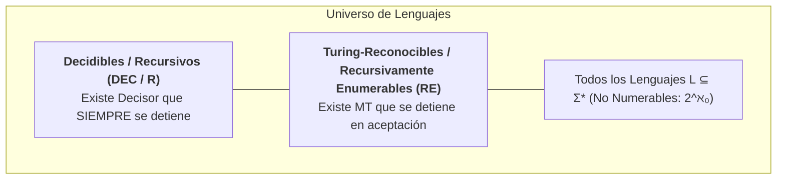
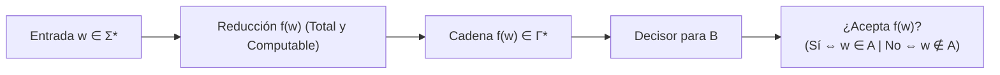

# Máquinas de Turing, Decidibilidad y Tesis de Church-Turing

En 1936, el matemático británico **Alan Mathison Turing** publicó un artículo seminal titulado *"On Computable Numbers, with an Application to the Entscheidungsproblem"*. En él formuló un dispositivo conceptual de extrema simplicidad mecánica que no solo resolvió negativamente el reto de Hilbert sobre la completitud matemática, sino que fundó formalmente la Ciencia de la Computación, definió con precisión qué es un algoritmo y delineó la frontera matemática infranqueable entre lo que una computadora puede y **nunca podrá resolver**.

> [!info] 💡 ¿Cómo entender esto desde cero? (Guía para novatos de pregrado)
> - **El sueño de un supercompilador perfecto:** Imagina que un estudiante de la EPN quiere programar el antivirus o analizador de código definitivo: un software llamado `SuperDetector.c` que reciba el código fuente de cualquier otro programa y te diga con 100% de certeza: *"Este programa jamás se colgará en un bucle infinito"* o *"Este código no tiene vulnerabilidades de seguridad"*. ¿Por qué nadie se ha hecho multimillonario creando este software?
> - **No es una limitación técnica, es una ley del universo matemático:** No se debe a que nuestras CPUs sean lentas ni a que nos falte inteligencia artificial. Es una imposibilidad lógica matemática idéntica a la paradoja del barbero: *"En un pueblo, el barbero afeita a todos los hombres que NO se afeitan a sí mismos. ¿Quién afeita al barbero?"*. Si el barbero se afeita a sí mismo, viola la regla; si no se afeita, está obligado a afeitarse.
> - **La Máquina de Turing como el modelo universal:** Cualquier computadora que compres hoy, un clúster con 10,000 GPUs o una hipotética supercomputadora alienígena, calcula en el fondo exactamente lo mismo que una cinta de papel con un cabezal mecánico diseñada en 1936. Si un problema es indecidible para la Máquina de Turing, **ningún algoritmo de la historia podrá resolverlo jamás**.

---

## 1. Arquitectura y Definición Formal de la Máquina de Turing Estándar

A diferencia de los autómatas finitos (sin memoria de trabajo) y de los autómatas a pila (con acceso restringido al tope LIFO), la **Máquina de Turing (MT)** dispone de una memoria infinita de lectura y escritura con acceso aleatorio en ambas direcciones.

### 1.1 Diagrama de Arquitectura del Modelo de Turing

A continuación se muestra el diagrama arquitectónico canónico del dispositivo ideado por Alan Turing:

![[turing-machine-diagram.png]]

#### Desglose Detallado de los Componentes Arquitectónicos:
1. **La Cinta Infinita (*Infinite Memory Tape*):**
   - La memoria principal del sistema consiste en una tira continua unidimensional dividida en compartimentos discretos llamados **celdas**.
   - Cada celda almacena exactamente un símbolo perteneciente al alfabeto de la cinta $\Gamma$.
   - La cinta se extiende infinitamente (por convención hacia la derecha, o bidireccionalmente). Las posiciones que no contienen datos de entrada están precargadas con el símbolo especial en blanco $\sqcup$ (*blank*), que satisface $\sqcup \in \Gamma$ pero $\sqcup \notin \Sigma$.
2. **El Cabezal de Lectura/Escritura (*Read/Write Head*):**
   - El transductor físico se ubica sobre una celda específica en cualquier instante de cómputo.
   - En cada ciclo de reloj, el cabezal puede:
     1. **Leer** el símbolo presente en la celda activa.
     2. **Escribir** (sobrescribir) un nuevo símbolo en esa misma celda.
     3. **Desplazarse** exactamente una celda hacia la izquierda ($L$) o hacia la derecha ($R$).
3. **El Control de Estados Finitos (*Finite Control*):**
   - Es el registro de control del autómata, compuesto por un conjunto finito de estados discretos $Q$.
   - Almacena el estado interno activo del procesador (análogo al registro `IP` / `PC` - *Program Counter* en arquitecturas contemporáneas).
4. **La Tabla o Función de Transición ($\delta$):**
   - Constituye el "programa" o la CPU de la máquina.
   - Especifica de manera determinista la acción del sistema en función del estado actual $q \in Q$ y del símbolo leído $X \in \Gamma$.

---

### 1.2 Definición Formal como Séptupla

Siguiendo la formalización matemática estándar de Michael Sipser:

> [!definition] Definición 1.1: Máquina de Turing Determinista Estándar
> Una **Máquina de Turing** es una séptupla formal:
> $$M = \langle Q, \Sigma, \Gamma, \delta, q_0, q_{accept}, q_{reject} \rangle$$
> donde:
> 1. $Q$ es un conjunto finito de **estados**.
> 2. $\Sigma$ es el **alfabeto de entrada** finito, sin incluir el símbolo blanco ($\sqcup \notin \Sigma$).
> 3. $\Gamma$ es el **alfabeto de la cinta**, con $\Sigma \subset \Gamma$ y $\sqcup \in \Gamma$.
> 4. $\delta$ es la **función de transición**:
>    $$\delta: Q \times \Gamma \to Q \times \Gamma \times \{L, R\}$$
>    Dada una tupla $(q, a)$ con $q \in Q \setminus \{q_{accept}, q_{reject}\}$ y $a \in \Gamma$, $\delta(q, a) = (p, b, D)$ donde $p \in Q$ es el nuevo estado, $b \in \Gamma$ es el símbolo escrito en la celda, y $D \in \{L, R\}$ es la dirección de desplazamiento del cabezal.
> 5. $q_0 \in Q$ es el **estado inicial**.
> 6. $q_{accept} \in Q$ es el **estado de aceptación único**.
> 7. $q_{reject} \in Q$ es el **estado de rechazo único**, con $q_{reject} \ne q_{accept}$.

Al alcanzar $q_{accept}$ o $q_{reject}$, la máquina **se detiene inmediatamente** (*halts*). No existen transiciones que partan de estos estados terminales.

---

### 1.3 Configuraciones Instantáneas

Una **configuración** representa una instantánea completa del estado global de la Máquina de Turing en un instante dado: el estado actual, el contenido completo de la cinta y la posición precisa del cabezal.

> [!definition] Definición 1.2: Notación de Configuración
> Una configuración se escribe formalmente como una cadena $u \, q \, v$, donde:
> - $q \in Q$ es el estado actual.
> - $u, v \in \Gamma^*$ representan el contenido no blanco de la cinta.
> - El cabezal de lectura/escritura se encuentra posicionado exactamente sobre el **primer símbolo** de la cadena $v$.
> - La cadena completa en la cinta es $uv$ (seguida de infinitos blancos $\sqcup$).

#### Relación de Cómputo ($\vdash_M$):
Sean $a, b, c \in \Gamma$ y $u, v \in \Gamma^*$:
- **Movimiento a la Derecha ($R$):**
  $$u \, a \, q \, b \, v \vdash_M u \, a \, c \, p \, v \iff \delta(q, b) = (p, c, R)$$
- **Movimiento a la Izquierda ($L$):**
  $$u \, a \, q \, b \, v \vdash_M u \, p \, a \, c \, v \iff \delta(q, b) = (p, c, L)$$
  *(Si el cabezal se encuentra en el extremo izquierdo de la cinta e intenta moverse a la izquierda, permanece inmóvil en la celda 0).*

#### Comportamientos Posibles sobre una Entrada $w \in \Sigma^*$:
Dada la configuración inicial $q_0 w$, la máquina puede:
1. **Aceptar:** $q_0 w \vdash_M^* u \, q_{accept} \, v$ (la máquina se detiene y aprueba la cadena).
2. **Rechazar:** $q_0 w \vdash_M^* u \, q_{reject} \, v$ (la máquina se detiene y desaprueba la cadena).
3. **Bucle Infinito (*Looping*):** La máquina jamás alcanza un estado terminal, continuando su ejecución eternamente sin detenerse.

---

## 2. Variantes de Máquinas de Turing y su Equivalencia

Uno de los resultados más asombrosos de la teoría de la computación es la **robustez extrema** del modelo de Turing: cualquier intento de dotar a la máquina de mayor poder mecánico (múltiples cintas, paralelismo no determinista, memoria multidimensional) resulta exactamente en la misma clase de problemas solubles.

```mermaid
flowchart LR
    MT1["MT Estándar<br/>(1 cinta, determinista)"]
    MT2["MT Multicinta<br/>(k cintas independientes)"]
    MT3["MT No Determinista<br/>(NTM - ramas paralelas)"]
    MT4["MT Bidireccional<br/>(cinta infinita en ambos lados)"]
    MT2 <==>|Simulación en O(T²)| MT1
    MT3 <==>|Simulación en O(2^(cT))| MT1
    MT4 <==>|Mapeo de índices| MT1
```

### 2.1 Máquina de Turing Multicinta
- Posee $k$ cintas separadas, cada una con su propio cabezal de lectura/escritura independiente.
- Función de transición: $\delta: Q \times \Gamma^k \to Q \times \Gamma^k \times \{L, R, S\}^k$ (donde $S$ es permanecer estacionario).
- **Teorema de Equivalencia:** Toda MT multicinta que se detiene en $T(n)$ pasos puede ser simulada por una MT estándar de una sola cinta en tiempo $O(T(n)^2)$.
  - *Idea de la simulación:* Se utiliza una sola cinta dividida mediante delimitadores `#`, utilizando pistas dobles (*dots*) sobre los símbolos para marcar virtualmente la posición de cada uno de los $k$ cabezales.

### 2.2 Máquina de Turing No Determinista (NTM)
- En cada paso, la función de transición ofrece un conjunto finito de opciones de bifurcación: $\delta(q, a) \subseteq Q \times \Gamma \times \{L, R\}$.
- La computación forma un **árbol de cómputo**. La NTM acepta la cadena si **al menos una rama** de ejecución alcanza $q_{accept}$.
- **Teorema de Equivalencia:** Todo lenguaje reconocido por una NTM en tiempo $T(n)$ puede ser decidido por una MT determinista estándar utilizando una **Búsqueda en Anchura (BFS)** sobre el árbol de cómputo en tiempo $O(2^{c \cdot T(n)})$.

---

## 3. La Tesis de Church-Turing

En la década de 1930, antes de la construcción física de los primeros computadores electrónicos, matemáticos líderes formularon independientemente tres propuestas formales para capturar la noción intuitiva de *"cálculo algorítmico efectivo"*:
1. **Alan Turing (1936):** La Máquina de Turing (cómputo mecánico de transiciones de estado y cinta).
2. **Alonzo Church (1936):** El **Cálculo Lambda ($\lambda$-calculus)** (cómputo funcional basado en abstracción de variables y aplicación de términos).
3. **Kurt Gödel y Stephen Kleene (1936):** Las **Funciones Recursivas $\mu$** (aritmética formal fundada sobre funciones base y el operador de minimización).

> [!important] Teorema de Equivalencia de Modelos Fundacionales
> Se demostró formalmente que las tres definiciones son **matemáticamente indistinguibles**:
> $$\text{Funciones Computables por MT} \equiv \text{Funciones Definibles en Cálculo } \lambda \equiv \text{Funciones } \mu\text{-Recursivas}$$

> [!definition] Definición 3.1: Enunciado de la Tesis de Church-Turing
> *"La noción intuitiva de algoritmo o procedimiento computacional efectivo coincide exactamente con la clase de funciones computables por una Máquina de Turing estándar."*

La Tesis de Church-Turing **no es un teorema matemático formal** susceptible de demostración deductiva, pues vincula un concepto informal de la mente humana (*"receta algorítmica"*) con un formalismo matemático estricto (*Máquina de Turing*). Sin embargo, goza de estatus de axioma científico indiscutible, dado que todo modelo de computación concebido posteriormente (lenguajes imperativos, ensamblador, máquinas de acceso aleatorio RAM, autómatas celulares, computación cuántica en términos de computabilidad) no rebasa la capacidad de cómputo de la Máquina de Turing.

---

## 4. La Máquina de Turing Universal (UTM)

Hasta 1936, las máquinas de cálculo (como la máquina analítica de Babbage o los telares de Jacquard) estaban cableadas rígidamente para resolver un único problema predeterminado. El insight más revolucionario de Alan Turing fue demostrar que **un programa de computadora es simplemente un dato más que puede ser almacenado e interpretado por otra máquina**.

### 4.1 Codificación Binaria de Máquinas y Cadenas

Cualquier Máquina de Turing $M = \langle Q, \Sigma, \Gamma, \delta, q_0, q_{accept}, q_{reject} \rangle$ y su cadena de entrada $w$ pueden codificarse numéricamente como una secuencia finita de bits en $\{0, 1\}^*$:
- Se indexan los estados: $q_1, q_2, \dots, q_{|Q|}$ y los símbolos de la cinta: $X_1, X_2, \dots, X_{|\Gamma|}$.
- Una transición $\delta(q_i, X_j) = (q_k, X_l, D_m)$ se codifica en unívoco unario:
  $$0^i 1 0^j 1 0^k 1 0^l 1 0^m$$
- Toda la tabla de transición y la entrada se concatenan mediante delimitadores, produciendo la cadena canónica $\langle M, w \rangle$.

### 4.2 La Máquina Universal ($U$)

> [!definition] Definición 4.1: Máquina de Turing Universal (UTM)
> Existe una Máquina de Turing universal fija $U$ que toma como entrada la descripción de cualquier máquina arbitraria $M$ y una cadena $w$, simulando con exactitud el comportamiento paso a paso de $M$ sobre $w$:
> $$U(\langle M, w \rangle) = \begin{cases} 
> \text{Acepta} & \text{si } M \text{ acepta } w \\ 
> \text{Rechaza} & \text{si } M \text{ rechaza } w \\ 
> \text{Bucle Infinito} & \text{si } M \text{ entra en bucle sobre } w 
> \end{cases}$$



#### Relevancia Histórica y Tecnológica:
La UTM es el origen conceptual directo de la **Arquitectura Von Neumann (1945)**: un computador programable moderno no necesita cambiar físicamente sus circuitos para alternar entre ejecutar una planilla de cálculo, reproducir un video o compilar código; únicamente carga una secuencia diferente de bytes $\langle M \rangle$ en memoria RAM y ejecuta un ciclo de interpretación universal (*Fetch-Decode-Execute*).

---

## 5. Decidibilidad, Indecidibilidad y Problemas No Computables

La teoría de la computabilidad divide el universo de todos los problemas formales en clases estrictas de solvencia computacional.



### 5.1 Lenguajes Decidibles vs Turing-Reconocibles

> [!definition] Definición 5.1: Decidibilidad y Reconocibilidad
> 1. **Lenguaje Turing-Reconocible (Recursivamente Enumerable - $RE$):** Un lenguaje $L$ es Turing-reconocible si existe una Máquina de Turing $M$ tal que $L = L(M)$. Si $w \in L$, $M$ se detiene y acepta. Si $w \notin L$, $M$ puede rechazar o ciclar indefinidamente.
> 2. **Lenguaje Decidible (Recursivo - $DEC$ o $R$):** Un lenguaje $L$ es decidible si existe una Máquina de Turing $M$ (llamada **Decisor**) que **se detiene para toda cadena de entrada** $w \in \Sigma^*$. Si $w \in L$, acepta; si $w \notin L$, rechaza. Jamás entra en bucle infinito.

> [!important] Teorema de Complementariedad de Post
> Un lenguaje $L$ es **decidible** si y solo si tanto $L$ como su complemento $\bar{L} = \Sigma^* \setminus L$ son **Turing-reconocibles**:
> $$L \in DEC \iff (L \in RE \ \land \ \bar{L} \in RE)$$

---

## 6. El Problema de la Parada ($HALT_{TM}$) y Demostración por Diagonalización

El **Problema de la Parada (*Halting Problem*)** es el resultado central de la teoría de la computabilidad: la prueba irrefutable de que existen problemas matemáticos bien definidos que ninguna computadora puede resolver.

### 6.1 Formulación de los Lenguajes Fundamentales

- **Lenguaje de Aceptación de la MT:**
  $$A_{TM} = \{\langle M, w \rangle \mid M \text{ es una MT y } M \text{ acepta la cadena } w\}$$
- **Lenguaje de la Parada de la MT:**
  $$HALT_{TM} = \{\langle M, w \rangle \mid M \text{ es una MT y } M \text{ se detiene sobre } w\}$$

---

### 6.2 Demostración Matemática Formal de la Indecidibilidad de $A_{TM}$

La demostración utiliza la técnica de **Diagonalización de Georg Cantor** formulada para refutar la existencia de un algoritmo universal de decisión.

> [!example] Demostración por Contradicción de Turing
> **Teorema:** El lenguaje $A_{TM}$ es **indecidible**.
> 
> **Demostración:**
> 1. Supongamos por contradicción que $A_{TM}$ es decidible.
> 2. Entonces debe existir una Máquina de Turing decisora $H$ tal que para cualquier par $\langle M, w \rangle$:
>    $$H(\langle M, w \rangle) = \begin{cases} 
>    \text{Acepta} & \text{si } M \text{ acepta } w \\ 
>    \text{Rechaza} & \text{si } M \text{ no acepta } w \text{ (rechaza o cicla)} 
>    \end{cases}$$
>    Nótese que por ser $H$ un decisor, **siempre termina en tiempo finito**.
> 
> 3. Construimos ahora una nueva Máquina de Turing $D$ (la máquina diagonal paradójica), la cual toma como entrada la descripción de una máquina $\langle M \rangle$ y utiliza a $H$ como subrutina:
>    
>    **Algoritmo de la Máquina $D$ sobre la entrada $\langle M \rangle$:**
>    - Ejecuta el decisor $H$ sobre la tupla $\langle M, \langle M \rangle \rangle$ (es decir, consulta si la máquina $M$ acepta su propio código fuente).
>    - Invierte la respuesta de $H$:
>      - Si $H$ **acepta**, entonces $D$ **RECHAZA**.
>      - Si $H$ **rechaza**, entonces $D$ **ACEPTA**.
> 
> 4. Dado que $D$ es una Máquina de Turing perfectamente válida y finita, posee su propia representación en cadena $\langle D \rangle$.
> 
> 5. **La Pregunta Fatal:** ¿Qué ocurre cuando ejecutamos la máquina $D$ pasándole su propia descripción como entrada, es decir, al evaluar $D(\langle D \rangle)$?
> 
> 6. Analicemos la definición constructiva de $D$:
>    $$D(\langle D \rangle) \text{ ACEPTA} \iff H(\langle D, \langle D \rangle \rangle) \text{ RECHAZA} \iff D \text{ NO ACEPTA } \langle D \rangle$$
>    y recíprocamente:
>    $$D(\langle D \rangle) \text{ RECHAZA} \iff H(\langle D, \langle D \rangle \rangle) \text{ ACEPTA} \iff D \text{ ACEPTA } \langle D \rangle$$
> 
> 7. Obtenemos la contradicción directa y destructiva:
>    $$D \text{ acepta } \langle D \rangle \iff D \text{ no acepta } \langle D \rangle$$
> 
> 8. **Conclusión:** La contradicción surge exclusivamente de suponer la existencia del decisor $H$. En consecuencia, tal decisor es imposible en nuestro universo matemático. El lenguaje $A_{TM}$ es **indecidible**. $\blacksquare$

#### Tabla Diagonal de Cantor Aplicada al Cómputo:

| Máquinas $\downarrow$ / Entradas $\rightarrow$ | $\langle M_1 \rangle$ | $\langle M_2 \rangle$ | $\langle M_3 \rangle$ | $\dots$ | $\langle D \rangle$ | $\dots$ |
| :---: | :---: | :---: | :---: | :---: | :---: | :---: |
| $M_1$ | **Acepta** | Rechaza | Acepta | $\dots$ | Acepta | $\dots$ |
| $M_2$ | Acepta | **Acepta** | Rechaza | $\dots$ | Rechaza | $\dots$ |
| $M_3$ | Rechaza | Rechaza | **Bucle** | $\dots$ | Rechaza | $\dots$ |
| $\vdots$ | $\vdots$ | $\vdots$ | $\vdots$ | $\ddots$ | $\vdots$ | $\dots$ |
| **$D$** | Rechaza | Rechaza | Acepta | $\dots$ | **¿!?** | $\dots$ |

La máquina $D$ invierte exactamente la diagonal principal, forzando un valor en la celda $(D, \langle D \rangle)$ que discrepa matemáticamente de sí mismo.

---

## 7. Reducciones por Mapeo ($A \le_m B$)

Una vez demostrada la indecidibilidad de un primer problema ($A_{TM}$), no es necesario repetir la diagonalización para otros problemas. Se emplea la técnica de **reducción computacional**.

> [!definition] Definición 7.1: Reducción por Mapeo
> Sean $A \subseteq \Sigma^*$ y $B \subseteq \Gamma^*$ dos lenguajes formales. Decimos que $A$ es reducible por mapeo a $B$ (notado como $A \le_m B$) si existe una **función computable total** $f: \Sigma^* \to \Gamma^*$ tal que para toda cadena $w \in \Sigma^*$:
> $$w \in A \iff f(w) \in B$$



> [!important] Teorema Fundamental de las Reducciones
> Si $A \le_m B$:
> 1. Si $B$ es decidible $\implies A$ es decidible.
> 2. **Forma Contrapositiva (Uso habitual):** Si $A$ es **indecidible** $\implies B$ es **indecidible**.

### Demostración de Indecidibilidad de $HALT_{TM}$ mediante $A_{TM} \le_m HALT_{TM}$

> [!example] Reducción Formal de $A_{TM}$ a $HALT_{TM}$
> Queremos demostrar que $HALT_{TM}$ es indecidible reduciendo $A_{TM} \le_m HALT_{TM}$.
> 1. Asumimos por contradicción que existe un decisor $R$ para $HALT_{TM}$.
> 2. Construimos una máquina $S$ para decidir $A_{TM}$ sobre la entrada $\langle M, w \rangle$:
>    - Ejecuta $R$ sobre $\langle M, w \rangle$.
>    - Si $R$ rechaza (lo que significa que $M$ no se detiene sobre $w$), $S$ **rechaza** inmediatamente (evitando caer en un bucle infinito).
>    - Si $R$ acepta (lo que certifica que $M$ se detendrá con seguridad), $S$ simula $M$ sobre $w$ ejecutando la UTM hasta su parada final:
>      - Si $M$ termina aceptando, $S$ **acepta**.
>      - Si $M$ termina rechazando, $S$ **rechaza**.
> 3. Como $S$ siempre termina, $S$ decidiría $A_{TM}$, lo cual sabemos que es imposible.
> 4. Por tanto, el decisor $R$ no puede existir: $HALT_{TM}$ es **indecidible**. $\blacksquare$

---

## 8. El Teorema de Rice

El Teorema de Rice (demostrado por Henry Gordon Rice en 1953) es una de las generalizaciones más demoledoras de la ciencia de la computación: demuestra que **cualquier pregunta no trivial acerca del comportamiento o lenguaje de un programa es indecidible**.

### 8.1 Propiedades Semánticas vs Propiedades Sintácticas
- **Propiedad Sintáctica (Decidible):** Analiza la estructura del código sin ejecutarlo.
  - Ejemplos: *"¿Tiene este código menos de 50 líneas?"*, *"¿Contiene este programa una variable llamada `contador`?"*. Se resuelven con un parser simple.
- **Propiedad Semántica (del Lenguaje):** Atañe al conjunto de cadenas que la máquina acepta, es decir, a $L(M)$.
  - Una propiedad $\mathcal{P}$ es una propiedad de lenguajes si cuando dos máquinas reconocen el mismo lenguaje ($L(M_1) = L(M_2)$), ambas satisfacen $\mathcal{P}$ o ambas no la satisfacen.
- **Propiedad Trivial:** Una propiedad que la cumplen **todas** las Máquinas de Turing reconocibles o que no la cumple **ninguna** ($\mathcal{P} = \emptyset$ o $\mathcal{P} = \mathcal{ALL}$).

---

### 8.2 Enunciado y Demostración Matemática Formal

> [!definition] Definición 8.1: Teorema de Rice
> Sea $\mathcal{P}$ cualquier propiedad semántica **no trivial** de los lenguajes Turing-reconocibles. Entonces el lenguaje correspondiente:
> $$L_{\mathcal{P}} = \{\langle M \rangle \mid L(M) \text{ satisface la propiedad } \mathcal{P}\}$$
> es **indecidible**.

> [!example] Demostración General por Reducción de $A_{TM}$
> Sea $\mathcal{P}$ una propiedad no trivial.
> 1. Sin pérdida de generalidad, asumamos que el lenguaje vacío $\emptyset$ **no satisface** la propiedad $\mathcal{P}$ (si la satisfaciera, trabajaríamos con el complemento $\bar{\mathcal{P}}$, el cual tampoco es trivial).
> 2. Puesto que $\mathcal{P}$ no es trivial, debe existir al menos un lenguaje Turing-reconocible $L_0$ que **sí satisface** $\mathcal{P}$. Sea $M_{L_0}$ una MT fija que reconoce $L_0$ ($L(M_{L_0}) = L_0$).
> 3. Reducimos el problema indecidible $A_{TM}$ a $L_{\mathcal{P}}$ ($A_{TM} \le_m L_{\mathcal{P}}$).
> 4. Diseñamos un algoritmo que transforma cualquier par $\langle M, w \rangle$ en la descripción de una nueva máquina $\langle M_w \rangle$:
>    
>    **Definición de la máquina $M_w$ sobre una entrada arbitraria $x$:**
>    - Ejecuta la máquina $M$ sobre la cadena $w$.
>    - Si $M$ no acepta $w$, $M_w$ no hace nada más (o cicla eternamente).
>    - Si $M$ acepta $w$, entonces $M_w$ procede a ejecutar la máquina fija $M_{L_0}$ sobre su propia entrada $x$, aceptando si $M_{L_0}$ acepta $x$.
> 
> 5. Analicemos el lenguaje exacto reconocido por la máquina construida $M_w$:
>    - **Caso 1: Si $M$ acepta $w$:** La segunda fase siempre se activa. Por tanto, $M_w$ acepta $x$ si y solo si $x \in L_0$. En consecuencia:
>      $$L(M_w) = L(M_{L_0}) = L_0 \implies L(M_w) \text{ SATISFACE } \mathcal{P}$$
>      Por ende, $\langle M_w \rangle \in L_{\mathcal{P}}$.
>    - **Caso 2: Si $M$ no acepta $w$:** La máquina $M_w$ jamás supera la primera fase. Por tanto, no acepta ninguna cadena $x$. En consecuencia:
>      $$L(M_w) = \emptyset \implies L(M_w) \text{ NO SATISFACE } \mathcal{P}$$
>      Por ende, $\langle M_w \rangle \notin L_{\mathcal{P}}$.
> 
> 6. Hemos construido una reducción perfecta:
>    $$\langle M, w \rangle \in A_{TM} \iff \langle M_w \rangle \in L_{\mathcal{P}}$$
> 7. Como $A_{TM}$ es indecidible, $L_{\mathcal{P}}$ es forzosamente **indecidible**. $\blacksquare$

---

### 8.3 Consecuencias Prácticas en Ingeniería de Software

El Teorema de Rice impone límites inviolables a las herramientas de desarrollo de software modernas:

| Problema en Ingeniería de Software | Lenguaje Formal Asociado | Veredicto Teórico |
| :--- | :--- | :--- |
| **Detección de Código Muerto** | $L_{\text{dead}} = \{\langle M \rangle \mid \exists \text{ instrucción inalcanzable}\}$ | **Indecidible** (Rice) |
| **Verificación de Equivalencia** | $L_{EQ} = \{\langle M_1, M_2 \rangle \mid L(M_1) = L(M_2)\}$ | **Indecidible** (Rice) |
| **Ausencia Total de Fallos / NullPointer** | $L_{\text{safe}} = \{\langle M \rangle \mid M \text{ jamás lanza una excepción}\}$ | **Indecidible** (Rice) |
| **Detección Perfecta de Malware / Virus** | $L_{\text{virus}} = \{\langle M \rangle \mid M \text{ realiza una acción maliciosa}\}$ | **Indecidible** (Rice) |

> [!tip] La Solución de la Industria: Análisis Estático Aproximado
> Dado que es matemáticamente imposible construir un verificador perfecto de software, los linter y analizadores estáticos modernos (`SonarQube`, verificadores de modelos formales, tipos de Rust) recurren a **aproximaciones conservadoras**: aceptan falsos positivos (marcar código sano como sospechoso) o falsos negativos a cambio de garantizar terminación y eficiencia.
