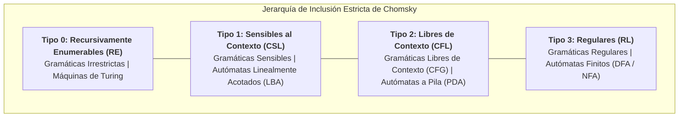
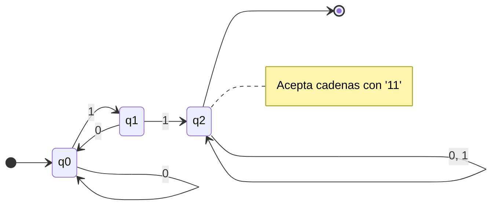
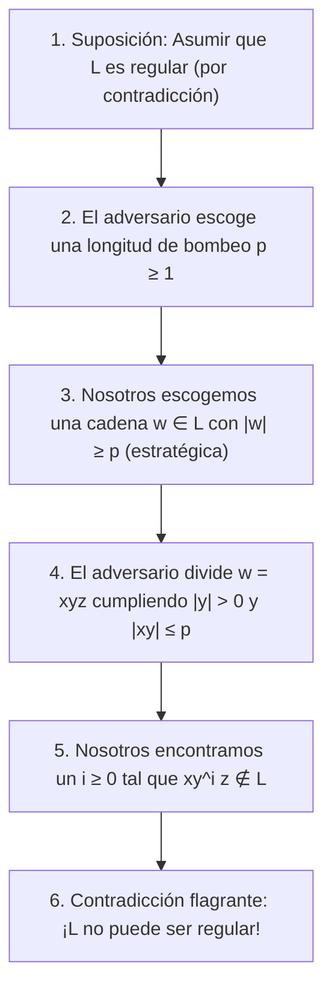

# Teoría de Autómatas y Lenguajes Formales

La Teoría de Autómatas y Lenguajes Formales constituye la espina dorsal teórica de la ciencia de la computación. Define de manera matemática qué es un lenguaje, cómo se especifica mediante gramáticas generativas y qué modelo abstracto de cómputo (con cuánta y qué tipo de memoria) se requiere para reconocerlo. Esta teoría fundamenta el diseño de procesadores de texto, expresiones regulares, analizadores léxicos y sintácticos de compiladores, protocolos de comunicación y diseño de hardware digital.

> [!info] 💡 ¿Cómo entender esto desde cero? (Guía para novatos de pregrado)
> - **La metáfora de la memoria y la máquina:** Todo en teoría de autómatas se reduce a una sola pregunta: **¿Cuánta memoria necesita una máquina para reconocer si una cadena pertenece o no a un conjunto de reglas?**
>   1. **Autómata Finito (DFA / NFA):** Memoria cero. Solo sabe en qué "estado" se encuentra en este instante (como un torniquete de metro o una cerradura digital con código). No puede contar hasta números arbitrarios. Sirve para expresiones regulares y análisis léxico (`tokens`).
>   2. **Autómata a Pila (PDA):** Memoria con estructura de Pila (LIFO: último en entrar, primero en salir). Puede contar cosas acumulándolas en la pila y desapilándolas, pero solo ve el tope de la pila. Es suficiente para verificar paréntesis balanceados `((...))` y compilar la gramática de lenguajes como C, Java o Python.
>   3. **Autómata Linealmente Acotado (LBA):** Memoria limitada exactamente al tamaño físico de la cadena de entrada.
>   4. **Máquina de Turing (MT):** Memoria infinita de acceso aleatorio. Puede leer y escribir en cualquier posición cuantas veces quiera. Es el modelo universal de cualquier computadora moderna.
> - **El Lema del Bombeo:** Es el "detector de mentiras" matemático. Si alguien te afirma que un autómata finito sin memoria puede validar contraseñas que tengan *exactamente la misma cantidad de ceros seguidos de unos ($0^n 1^n$)* para cualquier $n$ gigantesco, el lema demuestra que al superar la cantidad de estados internos, la máquina entrará inevitablemente en un bucle infinito y se confundirá, aceptando cadenas inválidas.

---

## 1. La Jerarquía de Lenguajes de Chomsky

En 1956, el lingüista y científico computacional **Noam Chomsky** clasificó formalmente las gramáticas generativas en cuatro niveles jerárquicos estrictamente anidados. Cada nivel impone mayores restricciones sobre la forma sintáctica de las reglas de producción y se corresponde biyectivamente con una clase específica de máquina reconocedora.

### 1.1 Definición Formal de una Gramática Generativa

> [!definition] Definición 1.1: Gramática Formal
> Una **gramática formal** es una cuádrupla:
> $$G = \langle V_N, \Sigma, P, S \rangle$$
> donde:
> - $V_N$ es un conjunto finito de **símbolos no terminales** (o variables sintácticas).
> - $\Sigma$ es un conjunto finito de **símbolos terminales** (el alfabeto del lenguaje), con $V_N \cap \Sigma = \emptyset$.
> - $P$ es un conjunto finito de **reglas de producción**, de la forma:
>   $$\alpha \to \beta \quad \text{donde } \alpha \in (V_N \cup \Sigma)^+ \text{ y } \beta \in (V_N \cup \Sigma)^*$$
> - $S \in V_N$ es el **símbolo inicial** o axioma de la gramática.

Dada una gramática $G$, una relación de derivación directa $\gamma \alpha \delta \Rightarrow \gamma \beta \delta$ ocurre si existe $(\alpha \to \beta) \in P$. La relación $\Rightarrow^*$ denota el cierre reflexivo y transitivo de $\Rightarrow$. El **lenguaje generado por $G$** es:
$$L(G) = \{w \in \Sigma^* \mid S \Rightarrow^* w\}$$

### 1.2 Taxonomía de los Cuatro Niveles de Chomsky

$$\mathcal{L}_{\text{Tipo 3}} \subsetneq \mathcal{L}_{\text{Tipo 2}} \subsetneq \mathcal{L}_{\text{Tipo 1}} \subsetneq \mathcal{L}_{\text{Tipo 0}} \subsetneq \mathcal{P}(\Sigma^*)$$

#### Tipo 3: Lenguajes Regulares (Regular Languages - RL)
- **Forma de las Reglas:**
  - Gramática Regular a Derecha: $A \to aB$ o $A \to a$ o $A \to \epsilon$.
  - Gramática Regular a Izquierda: $A \to Ba$ o $A \to a$ o $A \to \epsilon$.
  (donde $A, B \in V_N$ y $a \in \Sigma$). Nunca se deben mezclar ambas formas en una misma gramática.
- **Máquina Reconocedora:** Autómatas Finitos Deterministas y No Deterministas (DFA / NFA).
- **Potencia Expresiva:** Lenguajes sin anidamiento arbitrario ni memoria de conteo.
- **Aplicaciones:** Análisis léxico en compiladores (`Flex`, `Lex`), validadores de cadenas con Regex, controladores de semáforos y protocolos de red (máquinas de estados de hardware).

#### Tipo 2: Lenguajes Libres de Contexto (Context-Free Languages - CFL)
- **Forma de las Reglas:**
  $$A \to \gamma \quad \text{donde } A \in V_N, \ \gamma \in (V_N \cup \Sigma)^*$$
  La sustitución del no terminal $A$ no depende de los símbolos que lo rodean (es independiente del contexto).
- **Máquina Reconocedora:** Autómatas a Pila No Deterministas (NPDA).
- **Potencia Expresiva:** Estructuras jerárquicas recursivas, paréntesis balanceados, expresiones aritméticas anidadas.
- **Aplicaciones:** Definición de la sintaxis formal de lenguajes de programación mediante BNF (Backus-Naur Form), parsers sintácticos (`Bison`, `Yacc`, parsers LL/LR).

#### Tipo 1: Lenguajes Sensibles al Contexto (Context-Sensitive Languages - CSL)
- **Forma de las Reglas:**
  $$\alpha A \beta \to \alpha \gamma \beta \quad \text{con } A \in V_N, \ \alpha, \beta, \gamma \in (V_N \cup \Sigma)^*, \ \gamma \ne \epsilon$$
  Equivalentemente, toda producción satisface la condición no contractiva $|\alpha| \le |\beta|$ (a excepción de $S \to \epsilon$ si $S$ no aparece en la parte derecha de ninguna regla).
- **Máquina Reconocedora:** Autómatas Linealmente Acotados (LBA - Linear Bounded Automata), una Máquina de Turing cuya cinta de trabajo está confinada a la longitud de la cadena de entrada multiplicada por una constante.
- **Potencia Expresiva:** Reconoce lenguajes clásicos como $\{a^n b^n c^n \mid n \ge 1\}$ o $\{w w \mid w \in \Sigma^*\}$.
- **Aplicaciones:** Chequeo estático de tipos dependientes (ej. declarar una variable antes de usarla, matrices con dimensiones coincidentes).

#### Tipo 0: Lenguajes Recursivamente Enumerables (Recursively Enumerable - RE)
- **Forma de las Reglas:**
  $$\alpha \to \beta \quad \text{donde } \alpha \in (V_N \cup \Sigma)^+, \ \beta \in (V_N \cup \Sigma)^*$$
  No impone restricción alguna sobre la longitud o estructura de las producciones.
- **Máquina Reconocedora:** Máquinas de Turing Estándar (TM).
- **Potencia Expresiva:** Cualquier función computable de acuerdo con la Tesis de Church-Turing.

---

## 2. Autómatas Finitos: DFA, NFA y Teorema de Equivalencia

Un autómata finito es el modelo formal de una computadora con capacidad de memoria finita y fija, independiente de la longitud de la cadena de entrada.

### 2.1 Definición Formal: DFA vs NFA

> [!definition] Definición 2.1: Autómata Finito Determinista (DFA)
> Un **Autómata Finito Determinista (DFA)** es una quíntupla formal:
> $$M = \langle Q, \Sigma, \delta, q_0, F \rangle$$
> donde:
> 1. $Q$ es un conjunto finito y no vacío de **estados**.
> 2. $\Sigma$ es un conjunto finito de símbolos llamado **alfabeto de entrada**.
> 3. $\delta: Q \times \Sigma \to Q$ es la **función de transición**, una función total que determina unívocamente el siguiente estado.
> 4. $q_0 \in Q$ es el **estado inicial**.
> 5. $F \subseteq Q$ es el conjunto de **estados de aceptación** o finales.

La **función de transición extendida** $\hat{\delta}: Q \times \Sigma^* \to Q$ describe el estado alcanzado tras procesar una cadena completa $w \in \Sigma^*$, definida inductivamente:
- **Base:** $\hat{\delta}(q, \epsilon) = q$.
- **Paso inductivo:** Para toda cadena $w = x a$ con $x \in \Sigma^*$ y $a \in \Sigma$:
  $$\hat{\delta}(q, x a) = \delta(\hat{\delta}(q, x), a)$$

El **lenguaje aceptado por el DFA** $M$ es:
$$L(M) = \{w \in \Sigma^* \mid \hat{\delta}(q_0, w) \in F\}$$

> [!definition] Definición 2.2: Autómata Finito No Determinista con Transiciones $\epsilon$ ($\text{NFA}\text{-}\epsilon$)
> Un **Autómata Finito No Determinista** es una quíntupla $M = \langle Q, \Sigma, \delta, q_0, F \rangle$ donde la función de transición mapea a subconjuntos del conjunto de potencias:
> $$\delta: Q \times (\Sigma \cup \{\epsilon\}) \to \mathcal{P}(Q)$$
> En un NFA, para un mismo símbolo el autómata puede bifurcarse en múltiples estados alternativos o realizar transiciones espontáneas sin consumir símbolos de entrada ($\epsilon$).

Una cadena $w$ es aceptada por un NFA si **al menos una** de las ramas computacionales posibles concluye en un estado perteneciente a $F$.

---

### 2.2 Teorema de Equivalencia: Construcción de Subconjuntos (Powerset Construction)

Aunque el no-determinismo simplifica sustancialmente el diseño humano de autómatas, no incrementa el poder computacional de los autómatas finitos.

> [!important] Teorema de Rabin y Scott (1959)
> Para todo Autómata Finito No Determinista $N = \langle Q_N, \Sigma, \delta_N, q_0, F_N \rangle$, existe un Autómata Finito Determinista equivalente $D = \langle Q_D, \Sigma, \delta_D, q_0', F_D \rangle$ tal que:
> $$L(D) = L(N)$$

#### Algoritmo Formal de Conversión:
1. **Operador de $\epsilon$-Clausura ($\epsilon\text{-close}$):**
   Para cualquier estado $q \in Q_N$, $\epsilon\text{-close}(q)$ es el conjunto de todos los estados alcanzables desde $q$ transitando exclusivamente por aristas etiquetadas con $\epsilon$. Para un conjunto $S \subseteq Q_N$:
   $$\epsilon\text{-close}(S) = \bigcup_{q \in S} \epsilon\text{-close}(q)$$
2. **Definición de Componentes del DFA equivalente:**
   - **Estados del DFA:** $Q_D \subseteq \mathcal{P}(Q_N)$. Cada estado del DFA es un conjunto de estados del NFA.
   - **Estado Inicial:** $q_0' = \epsilon\text{-close}(q_0)$.
   - **Función de Transición:** Para cada estado compuesto $S \in Q_D$ y cada símbolo terminal $a \in \Sigma$:
     $$\delta_D(S, a) = \epsilon\text{-close}\left( \bigcup_{q \in S} \delta_N(q, a) \right)$$
   - **Estados de Aceptación:** Cualquier superestado que contenga al menos un estado final del NFA original:
     $$F_D = \{S \in Q_D \mid S \cap F_N \ne \emptyset\}$$

> [!tip] Cota de Complejidad de Estados
> Dado un NFA con $|Q_N| = n$ estados, el DFA determinista equivalente puede tener en el peor caso $|Q_D| = 2^n$ estados. En compiladores reales, esta explosión exponencial de estados se mitiga mediante algoritmos de **Minimización de DFA** (Algoritmo de Partición de Hopcroft de complejidad $O(|\Sigma| \cdot n \log n)$).

---

## 3. Lema del Bombeo (Pumping Lemma) para Lenguajes Regulares

El Lema del Bombeo es una propiedad necesaria que satisface todo lenguaje regular. Se utiliza como técnica de demostración por reducción al absurdo para probar rigurosamente que un lenguaje dado **no es regular**.

### 3.1 Enunciado Matemático Formal

> [!definition] Definición 3.1: Teorema del Lema del Bombeo para Lenguajes Regulares
> Sea $L$ un lenguaje regular sobre un alfabeto $\Sigma$. Entonces existe un número entero $p \ge 1$ (denominado **longitud de bombeo**, dependiente únicamente de $L$) tal que para toda cadena $w \in L$ cuya longitud satisfaga $|w| \ge p$, la cadena $w$ puede descomponerse en tres subcadenas $w = xyz$ que cumplen estrictamente las siguientes tres condiciones:
> 1. $|y| > 0 \quad (y \ne \epsilon)$
> 2. $|xy| \le p$
> 3. Para todo $i \ge 0$, la cadena bombeada $x y^i z \in L$.

### 3.2 Demostración Matemática Basada en el Principio del Palomar

> [!important] Demostración Formal del Lema
> Sea $L$ un lenguaje regular. Por definición, existe un DFA mínimo $M = \langle Q, \Sigma, \delta, q_0, F \rangle$ tal que $L(M) = L$.
> 1. Definimos la longitud de bombeo exactamente como el número total de estados del autómata:
>    $$p = |Q|$$
> 2. Sea $w = a_1 a_2 \dots a_n \in L$ una cadena arbitraria de longitud $n \ge p$.
> 3. Al procesar $w$, el autómata visita una secuencia de estados:
>    $$s_0, s_1, s_2, \dots, s_n \quad \text{donde } s_0 = q_0, \ s_k = \hat{\delta}(q_0, a_1 \dots a_k), \ s_n \in F$$
> 4. Esta secuencia contiene exactamente $n + 1$ estados.
> 5. Dado que $n \ge p$, en los primeros $p$ símbolos consumidos el autómata visita una subsecuencia de $p + 1$ estados:
>    $$s_0, s_1, s_2, \dots, s_p$$
> 6. **Aplicación del Principio del Palomar (*Pigeonhole Principle*):**
>    Tenemos $p + 1$ visitas a estados, pero el conjunto total de estados distintos es solo $|Q| = p$. Por tanto, es matemáticamente imposible que todos sean distintos. Existen al menos dos índices $j$ y $k$ con $0 \le j < k \le p$ tales que:
>    $$s_j = s_k$$
> 7. Particionamos la cadena $w = xyz$ haciendo corresponder las secciones con las visitas a los estados:
>    - $x = a_1 \dots a_j$: conduce a la máquina de $s_0$ a $s_j$.
>    - $y = a_{j+1} \dots a_k$: forma un ciclo cerrado que regresa de $s_j$ al mismo estado $s_k = s_j$.
>    - $z = a_{k+1} \dots a_n$: conduce desde $s_k$ al estado de aceptación $s_n \in F$.
> 8. Verifiquemos las 3 condiciones:
>    - Como $j < k$, la subcadena $y$ contiene al menos un símbolo: $|y| = k - j \ge 1 > 0$.
>    - Como $k \le p$, la longitud de $xy$ satisface: $|xy| = k \le p$.
>    - Al iterar el ciclo $y$ exactamente $i$ veces ($i \ge 0$), la transición de estados resultante es:
>      $$\hat{\delta}(q_0, x y^i z) = \hat{\delta}(s_j, y^i z) = \hat{\delta}(s_j, z) = s_n \in F$$
>    Por tanto, $x y^i z \in L$ para todo $i \ge 0$. $\blacksquare$

---

### 3.3 Metodología del Juego del Bombeo y Demostración de No Regularidad

Para demostrar que un lenguaje $L$ **no es regular**, el estudiante de pregrado debe conceptualizar el Lema del Bombeo como un juego contra un adversario:

> [!example] Demostración Formal: $L = \{0^n 1^n \mid n \ge 0\}$ no es Regular
> **Teorema:** El lenguaje $L = \{0^n 1^n \mid n \ge 0\}$ no es regular.
> 
> **Demostración (por reducción al absurdo):**
> 1. Supongamos por el contrario que $L$ es regular.
> 2. Por el Lema del Bombeo, debe existir una longitud de bombeo $p \ge 1$.
> 3. Seleccionamos la cadena específica:
>    $$w = 0^p 1^p$$
>    Observamos que $w \in L$ (posee igual número de ceros que de unos) y su longitud es $|w| = 2p \ge p$.
> 4. Por la condición 2 del lema, cualquier descomposición válida $w = xyz$ debe satisfacer $|xy| \le p$.
>    Como los primeros $p$ caracteres de la cadena $w$ son exclusivamente ceros ($0$), la subcadena $xy$ debe estar compuesta únicamente por ceros. En consecuencia, la subcadena $y$ tiene la forma:
>    $$y = 0^k \quad \text{con } 1 \le k \le p \quad (\text{dado que } |y| > 0)$$
>    La partición general es entonces:
>    $$x = 0^{j}, \quad y = 0^{k}, \quad z = 0^{p - j - k} 1^p \quad \text{con } j + k \le p$$
> 5. Evaluamos el bombeo para $i = 2$ (duplicar la sección $y$):
>    $$w' = x y^2 z = 0^j (0^k)^2 0^{p - j - k} 1^p = 0^{j + 2k + p - j - k} 1^p = 0^{p+k} 1^p$$
> 6. Dado que $k \ge 1$, se tiene estrictamente que:
>    $$p + k > p \implies p + k \ne p$$
>    Por tanto, la cantidad de ceros en $w'$ es estrictamente mayor que la cantidad de unos. Esto implica directamente que:
>    $$x y^2 z \notin L$$
> 7. Esto contradice de manera irrefutable la condición 3 del Lema del Bombeo, la cual exige que $x y^i z \in L$ para todo $i \ge 0$.
> 8. **Conclusión:** La suposición inicial es falsa; el lenguaje $L = \{0^n 1^n \mid n \ge 0\}$ **no es regular**. $\blacksquare$

---

## 4. Autómatas a Pila (Pushdown Automata - PDA)

Los autómatas a pila enriquecen el modelo de autómata finito dotándolo de una estructura de memoria auxiliar ilimitada que opera bajo una disciplina de acceso **LIFO** (*Last In, First Out*). Constituyen la contraparte operacional de las Gramáticas Libres de Contexto (Chomsky Tipo 2).

### 4.1 Séptupla Formal y Mecanismo Operacional

> [!definition] Definición 4.1: Autómata a Pila No Determinista (NPDA)
> Un Autómata a Pila es una séptupla formal:
> $$M = \langle Q, \Sigma, \Gamma, \delta, q_0, Z_0, F \rangle$$
> donde:
> 1. $Q$ es un conjunto finito de estados de control.
> 2. $\Sigma$ es el alfabeto finito de entrada.
> 3. $\Gamma$ es el **alfabeto finito de la pila**.
> 4. $\delta$ es la **función de transición**:
>    $$\delta: Q \times (\Sigma \cup \{\epsilon\}) \times \Gamma \to \mathcal{P}_{\text{finito}}(Q \times \Gamma^*)$$
>    Dado un estado actual $q$, un símbolo de entrada $a$ (o $\epsilon$) y el símbolo en el tope de la pila $X \in \Gamma$, $\delta(q, a, X)$ produce un par $(p, \alpha)$ donde $p \in Q$ es el nuevo estado y $\alpha \in \Gamma^*$ reemplaza al símbolo $X$ en el tope de la pila.
> 5. $q_0 \in Q$ es el estado inicial.
> 6. $Z_0 \in \Gamma$ es el **símbolo inicial de fondo de pila** (*stack bottom marker*).
> 7. $F \subseteq Q$ es el conjunto de estados finales o de aceptación.

#### Convenciones de Reemplazo en la Pila:
Si la transición es $\delta(q, a, X) \ni (p, \alpha)$:
- Si $\alpha = \epsilon$, el símbolo $X$ se desapila (**POP**).
- Si $\alpha = X$, la pila permanece inalterada (**NOP**).
- Si $\alpha = YX$, el símbolo $Y$ se apila sobre $X$ (**PUSH**).
- Si $\alpha = \beta X$, se inserta la cadena $\beta$ sobre $X$.

---

### 4.2 Configuraciones Instantáneas (ID)

El estado global de un PDA en cualquier instante de cómputo se formaliza mediante una **Descripción Instantánea (ID)**:

$$(q, w, \gamma) \in Q \times \Sigma^* \times \Gamma^*$$

- $q$: estado actual del control finito.
- $w$: resto de la cadena de entrada aún no consumida.
- $\gamma$: contenido completo de la pila, leyéndose de izquierda a derecha (el primer símbolo a la izquierda representa el **tope de la pila**).

La relación de paso de cómputo $\vdash_M$ se define formalmente:
$$(q, a w, X \beta) \vdash_M (p, w, \alpha \beta) \iff (p, \alpha) \in \delta(q, a, X)$$

La notación $\vdash_M^*$ denota la clausura reflexiva y transitiva de pasos sucesivos de computación.

---

### 4.3 Criterios de Aceptación: Estado Final vs Pila Vacía

Existen dos mecanismos formales para definir el lenguaje reconocido por un PDA:

> [!definition] Definición 4.2: Lenguajes Aceptados por un PDA
> 1. **Aceptación por Estado Final ($L(M)$):** La cadena es aceptada si el autómata consume por completo la entrada y termina posicionado en un estado perteneciente a $F$, sin importar el contenido residual de la pila:
>    $$L(M) = \{w \in \Sigma^* \mid (q_0, w, Z_0) \vdash_M^* (q, \epsilon, \gamma), \text{ con } q \in F \text{ y } \gamma \in \Gamma^*\}$$
> 2. **Aceptación por Pila Vacía ($N(M)$):** La cadena es aceptada si el autómata consume por completo la entrada y vacía simultáneamente toda su pila ($\epsilon$), sin importar en qué estado del control finito concluya:
>    $$N(M) = \{w \in \Sigma^* \mid (q_0, w, Z_0) \vdash_M^* (q, \epsilon, \epsilon), \text{ con } q \in Q\}$$

> [!important] Teorema de Equivalencia Operacional
> Para cualquier lenguaje $L \subseteq \Sigma^*$, las siguientes tres afirmaciones son estrictamente equivalentes:
> 1. $L = L(M_1)$ para algún PDA $M_1$ que acepta por estado final.
> 2. $L = N(M_2)$ para algún PDA $M_2$ que acepta por pila vacía.
> 3. $L = L(G)$ para alguna Gramática Libre de Contexto $G$ (Chomsky Tipo 2).

#### Construcción de Equivalencia:
- **De $N(M)$ a $L(M')$:** Se introduce un nuevo estado inicial $q_0'$, un nuevo símbolo de fondo de pila $X_0$ (para evitar vaciados prematuros) y un nuevo estado de aceptación universal $q_f$. Cuando la pila original se vacía y se detecta $X_0$, el autómata transita a $q_f$.
- **De $L(M)$ a $N(M'')$:** Al alcanzar cualquier estado $q \in F$, el autómata transita a un estado de purga que ejecuta transiciones $\epsilon$ desapilando todos los símbolos residuales hasta vaciar la pila.

---

### 4.4 Autómatas a Pila Deterministas (DPDA) vs No Deterministas (NPDA)

A diferencia de los autómatas finitos (donde $\text{DFA} \equiv \text{NFA}$), en los autómatas a pila **el no-determinismo amplía estrictamente la clase de lenguajes aceptados**:

$$\text{Lenguajes Libres de Contexto Deterministas (DCFL)} \subsetneq \text{Lenguajes Libres de Contexto (CFL)}$$

- Un **DPDA** no admite ambigüedad: para cada par $(q, X)$, no puede existir conflicto entre una transición con símbolo de entrada y una transición $\epsilon$.
- El lenguaje de palíndromos de longitud par $L = \{w w^R \mid w \in \{0, 1\}^*\}$ requiere un **NPDA**, puesto que el autómata debe "adivinar" de manera no determinista en qué momento exacto termina la primera mitad $w$ y comienza la reversa $w^R$. En cambio, $L' = \{w c w^R \mid w \in \{0, 1\}^*\}$ (con un símbolo central marcador $c$) es determinista y puede ser reconocido por un **DPDA**.
- **Impacto en Compiladores:** Los compiladores modernos no pueden permitirse la complejidad temporal exponencial de un retroceso (*backtracking*) de un NPDA general. Por ello, la sintaxis de los lenguajes de programación se diseña dentro del subconjunto determinista **DCFL**, implementable mediante analizadores sintácticos de tiempo lineal $O(n)$ como **Parsers LL(k)** y **Parsers LR(k)**.
