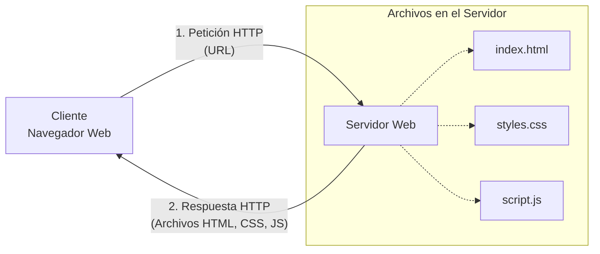

Los sitios web son conjuntos de archivos que los usuarios descargan mediante sus navegadores desde ordenadores remotos llamados servidores. Cuando un usuario decide acceder a un sitio web, le comunica al navegador la dirección (URL) del sitio; en respuesta, el navegador descarga los archivos, procesa su contenido y lo muestra en pantalla.

Como los sitios web son de acceso público e Internet es una red global, estos archivos deben estar siempre disponibles, generalmente alojados en servidores web que funcionan las 24 horas del día.

> [!info] Explicación
> **Arquitectura Cliente-Servidor:** En el desarrollo web, tu computadora (con el navegador) actúa como el "Cliente", que pide información. El ordenador remoto donde están guardados los archivos actúa como el "Servidor", que responde entregando esos archivos (HTML, CSS, imágenes, etc.).

## Archivos
Los sitios web están compuestos de múltiples documentos que el navegador descarga cuando el usuario los solicita. Los documentos que conforman un sitio web se llaman "páginas web", y el proceso de abrir nuevas páginas se conoce comúnmente como "navegar" (es decir, el usuario navega a través de las diferentes páginas del sitio mediante enlaces).

El archivo `index.html` contiene el código y la información correspondiente a la página principal del sitio (es la página predeterminada que el usuario ve cuando entra al dominio principal por primera vez). Por ejemplo, un archivo llamado `contacto.html` podría contener el código necesario para presentar un formulario de contacto, mientras que un archivo `noticias.html` contendría el código para mostrar actualizaciones recientes. 
Cuando un usuario accede al directorio raíz del sitio web, el navegador descarga por defecto el archivo `index.html` y muestra su contenido en la ventana.

> [!info] Explicación
> El nombre `index.html` es una convención universal. Los servidores web están configurados por defecto para buscar un archivo con ese nombre cuando alguien visita una carpeta o un dominio (ej. `misitio.com` automáticamente carga `misitio.com/index.html`).

## Lenguajes
El desarrollo web moderno (basado en el estándar HTML5) incorpora tres características fundamentales: estructura, estilo y funcionalidad. Esto se logra integrando tres lenguajes independientes pero complementarios: HTML, CSS y JavaScript. 
Estos lenguajes están compuestos por grupos de instrucciones que los navegadores pueden interpretar para procesar, dar formato y mostrar los documentos al usuario final.

### HTML (Estructura)
HTML (HyperText Markup Language o Lenguaje de Marcado de Hipertexto) es un lenguaje compuesto por un grupo de etiquetas definidas con un nombre rodeado de paréntesis angulares (`< >`). Los paréntesis angulares delimitan la etiqueta y el nombre interno define el tipo de contenido que representa (por ejemplo, `
` para un párrafo).
Para definir un documento web estructurado, se deben combinar múltiples elementos. Estos elementos se procesan en secuencia de arriba a abajo y pueden contener otros elementos anidados en su interior (creando un árbol de elementos o DOM).

### CSS (Estilo)
CSS (Cascading Style Sheets o Hojas de Estilo en Cascada) es el lenguaje que se utiliza para definir los estilos visuales de los elementos HTML, tales como el tamaño, el color tipográfico, el fondo, el borde, la disposición, etc. Aunque todos los navegadores asignan estilos básicos por defecto a la mayoría de los elementos para que sean legibles, estos estilos generalmente están lejos del diseño estético y personalizado que queremos para nuestros sitios web.

### JavaScript (Funcionalidad)
JavaScript es un lenguaje de programación de alto nivel, comparable en capacidad lógica con cualquier otro lenguaje de programación profesional como C++ o Java. 
JavaScript difiere de HTML y CSS en que es dinámico: puede realizar tareas lógicas complejas, desde almacenar valores en variables y ejecutar algoritmos, hasta interactuar directamente con los elementos del documento HTML y procesar su contenido dinámicamente en respuesta a las acciones del usuario (hacer clics, arrastrar, enviar datos, etc.).

> [!info] Explicación
> **La analogía del cuerpo humano:** 
> - **HTML** son los huesos (estructura que sostiene todo).
> - **CSS** es la piel, la ropa y el maquillaje (lo que le da la apariencia visual).
> - **JavaScript** es el cerebro y los músculos (lo que permite moverse, reaccionar y pensar).