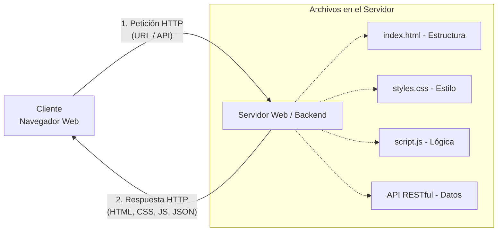
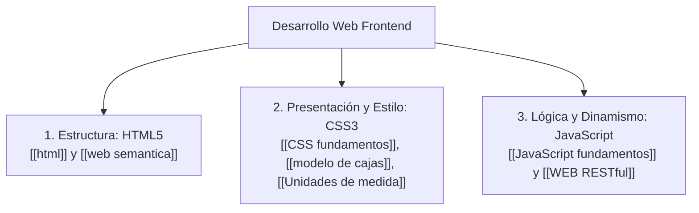

# Desarrollo Web: Fundamentos y Arquitectura

Los sitios web son conjuntos de archivos que los usuarios descargan mediante sus navegadores desde ordenadores remotos llamados servidores. Cuando un usuario decide acceder a un sitio web, le comunica al navegador la dirección (URL) del sitio; en respuesta, el navegador descarga los archivos, procesa su contenido y lo muestra en pantalla.

Como los sitios web son de acceso público e Internet es una red global, estos archivos deben estar siempre disponibles, generalmente alojados en servidores web que funcionan las 24 horas del día.

> [!info] 💡 ¿Cómo entender esto desde cero? (Guía para novatos de pregrado)
> **La analogía del cuerpo humano y el restaurante:** 
> - **HTML ([[html]] y [[web semantica]]):** Es el esqueleto óseo del sitio. Define qué partes son títulos, párrafos o botones.
> - **CSS ([[CSS fundamentos]], [[modelo de cajas]], [[Unidades de medida]]):** Es la piel, ropa, peinado y maquillaje. Da color, posiciona los elementos y los hace ver atractivos.
> - **JavaScript ([[JavaScript fundamentos]]):** Son los músculos y el cerebro. Permite que la página reaccione a clics, mueva animaciones y hable con el backend.
> - **APIs RESTful ([[WEB RESTful]]):** Es el mesero que va a la cocina (el servidor y la base de datos) a pedir los datos del usuario y se los entrega al cliente en la mesa.

```mermaid
flowchart LR
    C[Cliente\nNavegador Web] -- "1. Petición HTTP\n(URL / API)" --> S[Servidor Web / Backend]
    S -- "2. Respuesta HTTP\n(HTML, CSS, JS, JSON)" --> C
    
    subgraph Archivos en el Servidor
        S -.-> HTML[index.html - Estructura]
        S -.-> CSS[styles.css - Estilo]
        S -.-> JS[script.js - Lógica]
        S -.-> API[API RESTful - Datos]
    end
```

---

## 1. Archivos y Estructura de un Sitio Web

Los sitios web están compuestos de múltiples documentos que el navegador descarga cuando el usuario los solicita. Los documentos que conforman un sitio web se llaman "páginas web", y el proceso de abrir nuevas páginas se conoce comúnmente como "navegar" (mediante hipervínculos).

El archivo `index.html` contiene el código correspondiente a la página principal del sitio. Cuando un usuario accede al directorio raíz del dominio (ej. `misitio.com`), el servidor web descarga por defecto `index.html`. Otros archivos como `contacto.html` o `noticias.html` complementan la arquitectura del sitio.

---

## 2. Los Tres Pilares del Frontend Web

El desarrollo web moderno integra tres tecnologías complementarias que los navegadores interpretan de forma nativa:

```mermaid
flowchart TD
    Web[Desarrollo Web Frontend] --> HTML["1. Estructura: HTML5<br/>[[html]] y [[web semantica]]"]
    Web --> CSS["2. Presentación y Estilo: CSS3<br/>[[CSS fundamentos]], [[modelo de cajas]], [[Unidades de medida]]"]
    Web --> JS["3. Lógica y Dinamismo: JavaScript<br/>[[JavaScript fundamentos]] y [[WEB RESTful]]"]
```

### HTML (Estructura Semántica)
[[html|HTML]] (*HyperText Markup Language*) es el lenguaje compuesto por etiquetas delimitadas por paréntesis angulares (`< >`) que definen el significado y la jerarquía de los contenidos.
- Las etiquetas se anidan formando un árbol jerárquico en memoria denominado **DOM (Document Object Model)**.
- El uso de etiquetas con significado semántico ([[web semantica]]) como `<header>`, `<nav>`, `<main>`, `<article>` y `<footer>` es indispensable para la accesibilidad de personas con discapacidad y para el posicionamiento en motores de búsqueda (SEO).

### CSS (Presentación Visual)
[[CSS fundamentos|CSS]] (*Cascading Style Sheets*) es el lenguaje de hojas de estilo encargado de definir el aspecto estético: colores, tipografías, cuadrículas y comportamiento responsivo.
- **Geometría de Maquetación:** Cada elemento en pantalla se modela como un rectángulo físico mediante el **[[modelo de cajas]]** (*Box Model*: Content, Padding, Border y Margin).
- **Dimensionamiento:** Se calibra con **[[Unidades de medida]]** absolutas (`px`) o relativas escalables (`rem`, `em`, `%`, `vh/vw`).
- **Sistemas de Flujo Modernos:** Disposición unidimensional con **Flexbox** y bidimensional con **CSS Grid**.

### JavaScript (Comportamiento y Comunicación)
[[JavaScript fundamentos|JavaScript]] es el lenguaje de programación imperativo y orientado a eventos que se ejecuta en el motor del navegador (V8 en Chrome, SpiderMonkey en Firefox).
- Permite modificar el DOM en tiempo real, validar formularios y gestionar eventos de usuario (clics, teclas, scroll).
- Se comunica de forma asíncrona (`fetch` con `async/await`) con servidores y bases de datos a través de **[[WEB RESTful|APIs RESTful]]** intercambiando datos en formato JSON sin necesidad de recargar la página completa.

---

## 3. Notas Relacionadas y Módulo de Estudio
- [[html]] — Sintaxis fundamental de marcado y estructura de páginas.
- [[web semantica]] — Buenas prácticas semánticas, SEO y accesibilidad web.
- [[CSS fundamentos]] — Selectores, cascada, especificidad, Flexbox y CSS Grid.
- [[modelo de cajas]] — Anatomía del Box Model y espaciado de elementos.
- [[Unidades de medida]] — Guía de unidades absolutas vs relativas y formatos de color.
- [[JavaScript fundamentos]] — Sintaxis, variables, DOM, funciones flecha y promesas.
- [[WEB RESTful]] — Diseño de APIs, métodos HTTP y arquitectura cliente-servidor.
- [[Computacion ditribuida/Microservicios|Microservicios]] — Servicios backend distribuidos que alimentan aplicaciones web.