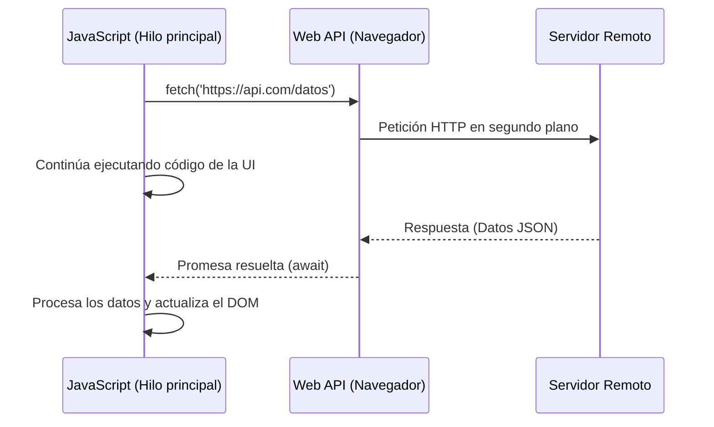

**JavaScript** es un lenguaje de programación dinámico que se ejecuta en el navegador (y en el lado del servidor con entornos como Node.js). Es el encargado de darle interactividad y lógica a las páginas [[html|HTML]].

## Variables y Tipos de Datos
En JavaScript, puedes declarar variables utilizando `let` y `const` (evita usar el antiguo `var`).
- **const:** Declara constantes que no cambiarán de valor.
- **let:** Declara variables cuyo valor puede reasignarse.

```javascript
const nombre = "Mundo"; // String
let contador = 0;       // Number
let esVerdad = true;    // Boolean
let lista = [1, 2, 3];  // Array
let usuario = { nombre: "Ana", edad: 25 }; // Objeto
```

## Funciones
Las funciones encapsulan bloques de código para ser reutilizados. Se pueden declarar de forma clásica o usando *Arrow Functions* (funciones flecha).

```javascript
// Función clásica
function sumar(a, b) {
    return a + b;
}

// Arrow function (sintaxis moderna ES6)
const multiplicar = (a, b) => a * b;
```

## Manipulación del DOM
El DOM (Document Object Model) es la representación en árbol del documento HTML. JS puede interactuar con él para cambiar la página en tiempo real.

```javascript
// Seleccionar un elemento por su ID
const boton = document.getElementById("miBoton");

// Cambiar el texto de un elemento
const titulo = document.querySelector(".titulo");
titulo.textContent = "¡Hola JavaScript!";
```

> [!info] Explicación
> **¿Qué es el DOM?** Cuando el navegador lee tu archivo HTML, lo transforma en un objeto en memoria que JavaScript puede entender y modificar. Si usas JS para agregar una nueva etiqueta `<p>` al DOM, esta aparecerá inmediatamente en la pantalla sin necesidad de recargar la página.

## Eventos
Los eventos son acciones que ocurren en la página web (un clic, presionar una tecla, el movimiento del ratón).

```javascript
boton.addEventListener("click", () => {
    alert("¡Has hecho clic en el botón!");
});
```

## Asincronía (Async/Await y Promesas)
JavaScript es de un solo hilo (single-threaded), lo que significa que solo puede hacer una cosa a la vez. Para tareas que toman tiempo (como pedir datos a un servidor o a una API RESTful), se usa la asincronía.

```javascript
// Usando async/await para consultar una API
async function obtenerUsuarios() {
    try {
        const respuesta = await fetch("https://api.ejemplo.com/usuarios");
        const datos = await respuesta.json();
        console.log(datos);
    } catch (error) {
        console.error("Error al obtener los datos:", error);
    }
}
```

> [!info] Explicación
> **Promesas y Async/Await:** Piensa en pedir una pizza. No te quedas mirando la puerta paralizado hasta que llegue el repartidor (eso sería bloqueante). Haces el pedido (la Promesa), sigues haciendo otras cosas en tu casa (tu código sigue corriendo), y cuando suena el timbre (se resuelve la Promesa), atiendes la pizza (ejecutas el código que procesa la respuesta).



## Notas relacionadas
- [[Desarollo web]]
- [[WEB RESTful]]
