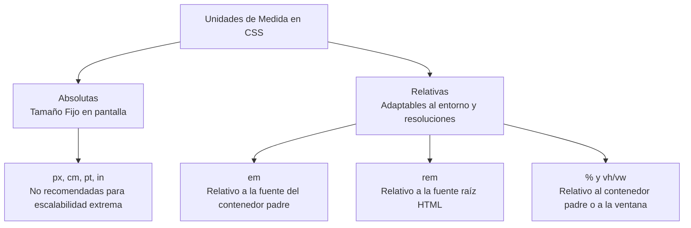

En diseño web con CSS, es necesario especificar dimensiones y colores. Se utilizan diferentes unidades dependiendo del objetivo visual y la flexibilidad requerida.



## Unidades absolutas 
Las unidades absolutas tienen un tamaño fijo y no cambian, independientemente del tamaño de la pantalla o de las configuraciones del usuario. Son útiles principalmente para estilos de impresión.
- **in:** Pulgadas (inches).
- **cm:** Centímetros.
- **mm:** Milímetros.
- **pt:** Puntos (1 punto = 1/72 de pulgada).
- **pc:** Picas (1 pica = 12 puntos).

> [!info] Explicación
> Las unidades absolutas rara vez se usan en el diseño web moderno para pantallas, ya que no se adaptan (no son *responsive*). Si defines un bloque de 5 cm, ocupará 5 cm físicos tanto en un monitor de 32" como en la pantalla de un celular pequeño, lo cual rompería el diseño.

## Unidades relativas
Las unidades relativas calculan su tamaño en función de otra medida, como el tamaño del elemento padre o de la resolución de pantalla. Son indispensables para el diseño responsivo.
- **em:** Es relativa al tamaño de fuente del elemento contenedor. (Si el padre tiene `16px`, `2em` será `32px`).
- **ex:** Es relativa a la altura de la letra minúscula 'x' de la tipografía actual.
- **px (píxel):** Es relativa a la resolución de la pantalla del dispositivo (se considera un píxel lógico en CSS). Es la unidad relativa más parecida a una absoluta por su estabilidad en pantalla.

> [!info] Explicación
> **Recomendación:** Se sugiere usar **rem** (relative to root em) en lugar de **em** para tipografías, ya que `rem` siempre se basa en el tamaño base del documento `<html>` y evita los problemas de tamaños matemáticos acumulados (cascada geométrica) que ocurren al anidar varios `em`.

## Porcentajes 
Los porcentajes permiten definir un tamaño basado en un porcentaje de la dimensión del elemento padre o de otro valor de referencia.
Ejemplo:
```css
h2 {
    font-size: 120%; /* 20% más grande que el tamaño base */
}
```

## Colores 
Existen múltiples sintaxis en CSS para declarar e interpretar colores.

### Colores predefinidos (Nombres en inglés)
CSS reconoce directamente un listado de nombres de colores estándar.
Ejemplo: `red`, `black`, `white`, `blue`, `tomato`, etc.

### RGB
Hace referencia al modelo de colores luz aditivos: **R**ed (Rojo), **G**reen (Verde) y **B**lue (Azul). *(Nota: CMYK es para impresión, no se usa habitualmente en RGB de pantallas).*
Los valores permitidos van desde 0 (ausencia de color) hasta 255 (intensidad máxima).
```css
a { color: rgb(20, 175, 210); }
```

### RGB porcentual
Es el mismo modelo RGB, pero usando porcentajes del 0 al 100% en lugar de valores de 0 a 255.
```css
a { color: rgb(20%, 75%, 21%); }
```

### RGB hexadecimal
Representa el mismo modelo RGB pero utilizando un sistema de numeración base 16 (hexadecimal). Utiliza valores del 0 al 9 y letras de la A a la F. El formato es `#RRGGBB`.
```css
a { color: #AF11E2; }
/* Formato abreviado de 3 dígitos: #RGB equivale a #RRGGBB */
a { color: #395; } /* Que es igual a #339955 */
```

### Colores establecidos del sistema
CSS permite heredar colores de la interfaz gráfica del sistema operativo del usuario (como `Canvas`, `ButtonText`), aunque su uso es menos frecuente hoy en día en favor de esquemas de color controlados por el diseñador (como los modos Light/Dark).
