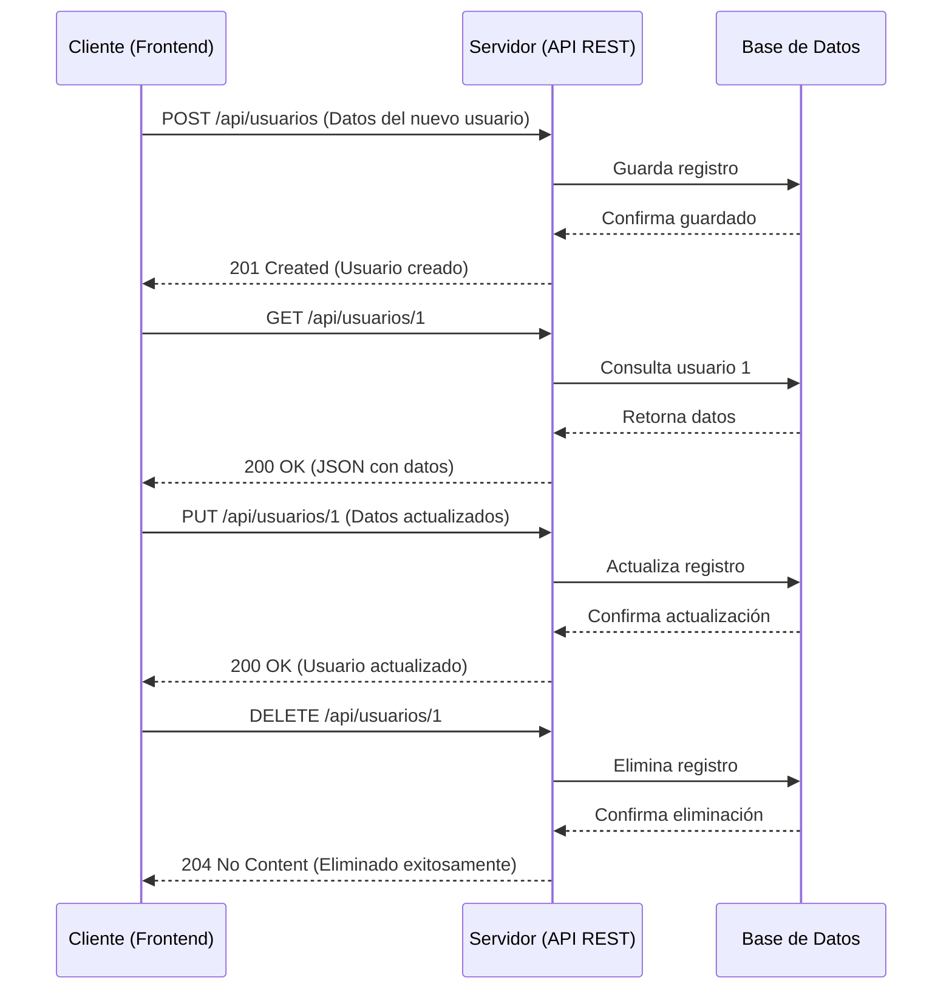

RESTful (Representational State Transfer) es un estilo arquitectónico para diseñar sistemas de software distribuidos. Se basa en el concepto de recursos, que son entidades de información, y utiliza métodos HTTP estándar (GET, POST, PUT, DELETE) para manipular estos recursos de forma estandarizada.

> [!info] Explicación
> **¿Por qué RESTful?** REST permite que diferentes sistemas (como el frontend en React y el backend en Node.js) se comuniquen a través de internet usando reglas simples y predecibles. Un "recurso" puede ser cualquier cosa: un usuario, un producto, una publicación. Cada recurso tiene una URL única (ej. `api/usuarios/1`).

## GET
Este método se utiliza para obtener o solicitar la información de un recurso o página web desde el servidor, sin modificar su estado.

## POST
Se utiliza para enviar datos a un servidor con el fin de crear un recurso nuevo. Es comúnmente utilizado al enviar formularios web y en solicitudes que requieren procesar nueva información en el servidor.

## PUT
Se emplea para actualizar o reemplazar por completo la información guardada de un recurso existente. Si el recurso no existe, en algunos casos puede crearlo.

## DELETE
Elimina los recursos identificados por la URI de la solicitud. Es un método idempotente, lo que significa que realizar la petición de borrado una o múltiples veces siempre dejará el sistema en el mismo estado (el recurso ya no existirá).

> [!info] Explicación
> **Idempotencia:** Es una propiedad clave en las APIs REST. GET, PUT y DELETE son idempotentes: si haces un GET 100 veces, no cambias nada. Si haces un PUT 100 veces, el resultado es el mismo que hacerlo 1 vez. POST no es idempotente: si envías 100 veces la orden de crear un usuario, crearás 100 usuarios idénticos.

## HEAD
Es un método en el que solo se solicitan los encabezados (headers) de la respuesta, sin descargar el cuerpo (body) del mensaje. Es útil para verificar si un recurso existe o si ha sido modificado sin gastar ancho de banda.

## PATCH
Se utiliza para aplicar modificaciones parciales a un recurso existente. Es especialmente útil cuando se quiere actualizar solo un atributo (por ejemplo, cambiar el estado a "completado") en lugar de enviar y actualizar todo el recurso completo como exige el método PUT.

## OPTIONS
Es una forma de consultar información sobre las opciones de comunicación y métodos permitidos para un recurso web específico. Se utiliza en el mecanismo CORS (Cross-Origin Resource Sharing) para verificar qué acciones puede realizar el cliente.

> [!info] Explicación
> **Resumen de métodos (CRUD):** 
> - **C**reate -> POST
> - **R**ead -> GET
> - **U**pdate -> PUT / PATCH
> - **D**elete -> DELETE

### Códigos de estado HTTP
Los códigos de error o estado comunican el resultado de la petición:
- **100-199:** Respuestas informativas (procesando).
- **200-299:** Respuestas satisfactorias (ej. 200 OK, 201 Created).
- **300-399:** Redirecciones (el recurso se movió a otra URL).
- **400-499:** Errores de los clientes (ej. 400 Bad Request, 404 Not Found).
- **500-599:** Errores de los servidores (ej. 500 Internal Server Error).

> [!info] Explicación
> Conocer estos códigos es vital. Si recibes un error 400, la culpa es tuya (enviaste mal los datos). Si recibes un 500, la culpa es del backend (el servidor colapsó o tiene un bug).

Normalmente, al desarrollar APIs RESTful se debe implementar el patrón de diseño **Modelo-Vista-Controlador (MVC)** para separar la lógica de negocio, la estructura de datos y las rutas.

## Cookies
Las cookies son pequeños fragmentos de información que el servidor envía al navegador. Ayudan a retroalimentar a las páginas web y a recordar datos, como sesiones activas, configuraciones o elementos que se digitan en la página web.
