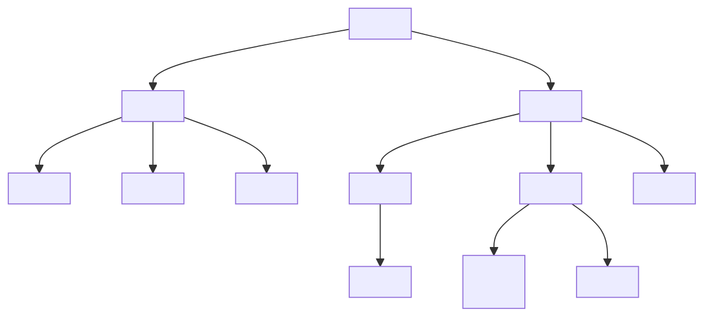

Para asegurarnos de que el contenido de nuestros documentos sea interpretado correctamente como código HTML, debemos agregar la declaración `<!DOCTYPE html>` al comienzo del archivo. Esta declaración se requiere al principio de cada documento para ayudar al navegador a decidir cómo debe procesar y generar la página web según los estándares de HTML5.

> [!info] Explicación
> **DOM (Document Object Model):** Ese "árbol de nodos" del que se habla es el DOM. Imagina HTML como el esqueleto de un árbol genealógico: el `<html>` es el abuelo, `<head>` y `<body>` son los hijos, y los párrafos o imágenes dentro del body son los nietos.

### Elementos Principales

- `<html></html>`: Este elemento delimita todo el código HTML de la página. Puede incluir el atributo `lang` para definir el idioma principal del contenido del documento. 
- `<head></head>`: En el head se tiene la información de metadata o configuración de la página web. Aquí se incluyen el título, el tipo de codificación de caracteres y los archivos externos (como CSS). Dentro del head se usan etiquetas huérfanas (sin cierre) como `<meta>`.
- `<body></body>`: Este elemento delimita el contenido del documento, es decir, toda la parte visible de la página web.
- `<link>`: Se usa comúnmente dentro del head para cargar archivos CSS externos con los estilos necesarios para generar el diseño visual de la página web.

> [!info] Explicación
> **Diferencia Head vs Body:** Lo que pongas en el `<head>` es para que lo lean las máquinas (el navegador, Google, redes sociales). Lo que pongas en el `<body>` es para que lo lean los humanos (los visitantes de tu sitio).

### Estructura Semántica
Estos elementos definen divisiones y zonas de la página con un significado específico:

- `

`: Define una división genérica. Se usa cuando no se puede aplicar ningún otro elemento con un significado semántico más claro.
- `<main></main>`: Define el contenido principal del documento (el tema central de la página).
- `<nav></nav>`: Define una división que contiene ayuda para la navegación, como el menú principal de la página o bloques de enlaces. Puede insertarse dentro de un `<header>` o en otra sección.
- `<section></section>`: Define una sección genérica. Se usa frecuentemente para separar contenido temático o generar bloques lógicos.
- `<aside></aside>`: Define una división que contiene información relacionada con el contenido principal, pero que no es estrictamente parte del mismo (ej. barras laterales con enlaces a artículos anteriores o publicidad).
- `<article></article>`: Representa un artículo independiente y autocontenido, como una entrada de blog, una noticia, un comentario en un foro, etc.
- `<header></header>`: Define la cabecera principal del cuerpo de la página, o la cabecera interna de artículos y secciones.
- `<footer></footer>`: Define el pie de página, o el cierre de una sección.

Estos elementos semánticos son muy flexibles y se pueden implementar en diferentes partes del diseño, siguiendo patrones comunes en la mayoría de los sitios web.
![[Pasted image 20240519214757.png]]

> [!info] Explicación
> **¿Por qué usar HTML Semántico?** Usar `<main>`, `<article>` o `<nav>` en lugar de puros `
` ayuda enormemente al SEO (que Google entienda tu página) y a la accesibilidad (lectores de pantalla para personas ciegas). 

### Contenido de Texto

El contenido más importante que suele incluir un documento web es el texto. Para los títulos, se utilizan las etiquetas desde `<h1>` hasta `<h6>`. 
*Nota importante:* Por temas de usabilidad y SEO, solo se debe tener un único `<h1>` por página web, ya que representa el título principal.

Otros elementos para representar texto:
- `

`: Representa un párrafo normal. Los navegadores le asignan un margen superior e inferior por defecto para separarlo.
- ``: Puede contener un texto pequeño, una frase o una palabra. No aplica ningún estilo semántico por defecto, pero se usa para aislar un pedazo de texto y asignarle estilos personalizados con CSS.
- ` `: Se usa para forzar la inserción de un salto de línea (es una etiqueta huérfana).
- `<wbr>`: Sugiere un posible salto de línea, ayudando al navegador a decidir dónde cortar una palabra larga si no hay espacio suficiente.
- `<em></em>`: Se usa para indicar énfasis semántico. El texto se muestra en *cursiva*.
- `<strong></strong>`: Se utiliza para indicar importancia extrema. El texto se muestra en **negrita**.
- `<i></i>`: Representa un texto con voz alternativa o término técnico. Se muestra en cursiva.
- `<b></b>`: Resalta texto sin darle una importancia semántica extra. Se muestra en negrita.
- `<mark></mark>`: Resalta texto como si estuviera marcado con un rotulador (útil para resultados de búsqueda).
- `<small></small>`: Representa "letra pequeña", utilizada generalmente en descargos de responsabilidad o declaraciones legales.
- `<cite></cite>`: Representa el autor o título de una obra (libro, película).
- `<address></address>`: Representa información de contacto. Se suele ubicar en el footer.
- `<pre></pre>`: Representa un bloque de texto con formato predefinido. A diferencia de otros elementos, respeta los espacios en blanco y saltos de línea literales del código fuente. Se configura con tipografía monoespaciada, siendo ideal para mostrar fragmentos de código de programación.

### Enlaces 
(Sección reservada para etiquetas como `<a>` utilizadas para hipervínculos).