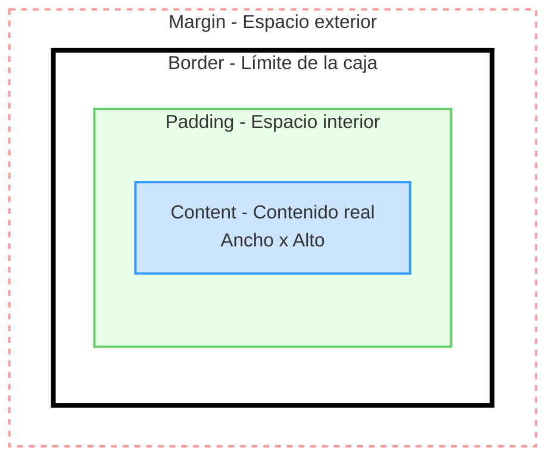

El modelo de cajas (Box Model) se refiere a cómo el navegador interpreta y renderiza los elementos HTML, cuyo comportamiento gráfico se define mediante CSS.
Toda etiqueta HTML genera automáticamente una caja rectangular alrededor de su contenido, aunque por defecto estas cajas no son visibles hasta que se les aplican estilos.

> [!info] Explicación
> **¿Qué es el Modelo de Cajas?** Es el concepto fundamental en diseño web que dicta que todo elemento en una página es, geométricamente, un rectángulo. Entender cómo se suman los tamaños de cada parte de esta caja es vital para poder maquetar (posicionar elementos) sin que la página se rompa o el contenido se desborde.

El modelo de cajas está compuesto por las siguientes capas (de adentro hacia afuera):

- **Contenido (Content):** Es el área central donde se encuentra el contenido real del elemento HTML (texto, imágenes, etc.).
- **Relleno (Padding):** Es el espacio libre y transparente, opcional, que se ubica entre el contenido y el borde. Da "respiro" hacia adentro de la caja.
- **Borde (Border):** Es la línea que encierra y delimita tanto el contenido como su relleno.
- **Margen (Margin):** Es la separación invisible externa que existe entre el borde de la caja y el resto de las cajas adyacentes. Da "respiro" hacia afuera.

Además, la apariencia de la caja puede modificarse con los siguientes atributos de fondo, que abarcan desde el contenido hasta el límite exterior del relleno (padding):
- **Imagen de fondo (Background image):** Imagen que se muestra por detrás del contenido y del espacio de relleno.
- **Color de fondo (Background color):** Color sólido que se muestra por detrás del contenido y del espacio de relleno.

> [!info] Explicación
> **Diferencia clave entre Padding y Margin:** 
> - Si aplicas un color de fondo, este teñirá el *padding*, pero **no** teñirá el *margin*. 
> - El *padding* empuja el contenido hacia adentro, haciendo la caja más grande. 
> - El *margin* empuja a los vecinos hacia afuera, separando la caja de otros elementos.
