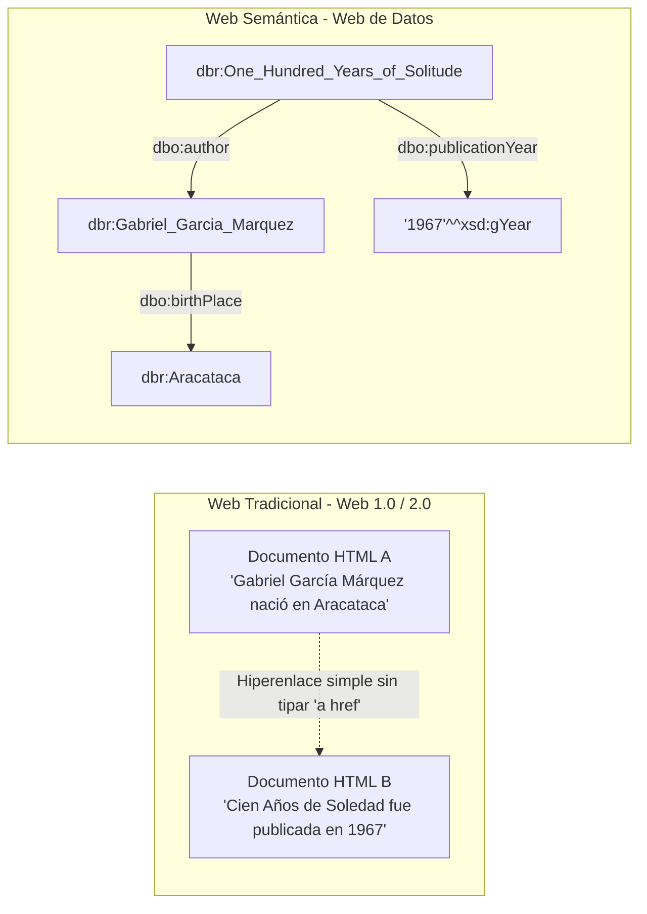
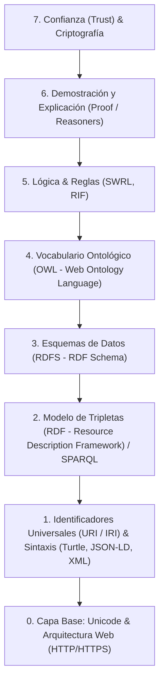
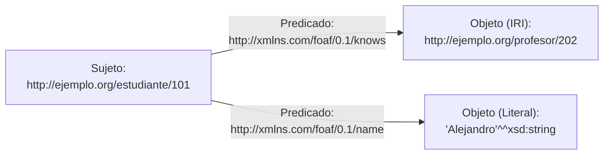
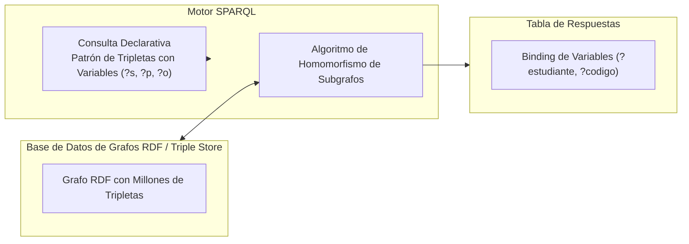

# Web Semántica: De la Web de Documentos a la Web de Datos y Grafos de Conocimiento

## Notas relacionadas
- [[Procesamiento de Lenguaje Natural y Embeddings|Procesamiento de Lenguaje Natural (NLP) y Embeddings]]
- [[que es recuperacion de informacion|Recuperación de Información]]
- [[retrival augmented generation|Retrieval Augmented Generation (RAG)]]
- [[machine learning]]
- [[Documentos/Inteligencia artificial/conducta racional|Conducta Racional y Agentes Inteligentes]]

---

## 1. La Visión de la Web Semántica

La **Web Semántica** es una extensión de la World Wide Web concebida formalmente en 2001 por **Sir Tim Berners-Lee**, James Hendler y Ora Lassila. Su propósito fundacional es transformar la Web desde un repositorio colosal de documentos diseñados exclusivamente para consumo visual humano (HTML) hacia una **red global de datos interconectados con semántica formal**, donde la información posee un significado rigurosamente definido que permite su procesamiento, inferencia e interoperabilidad automática por parte de máquinas y agentes de software autónomos.



> [!info] Semántica Simbólica vs Semántica Vectorial
> Es fundamental distinguir el enfoque de la Web Semántica de los avances en [[Procesamiento de Lenguaje Natural y Embeddings|NLP y Deep Learning]]:
> - **Web Semántica:** Se fundamenta en la **Lógica Simbólica**, la teoría de modelos, las ontologías y las Lógicas Descriptivas (*Description Logics*). Sus razonadores (*reasoners*) ofrecen inferencia exacta, determinista, explicable y libre de alucinaciones.
> - **NLP / Transformers:** Emplea representaciones estadísticas distribuidas y continuas (*embeddings* vectoriales). Es excelente para procesar texto ambiguo no estructurado pero carece de garantías formales de consistencia lógica.
> Ambos paradigmas convergen modernamente en los sistemas de **Graph-RAG** y grafos de conocimiento enriquecidos con LLMs.

---

## 2. La Pila Tecnológica de la Web Semántica (*Semantic Web Layer Cake*)

Para estructurar los diferentes niveles de abstracción formal, el W3C definió una arquitectura en capas conocida como la **Pila de la Web Semántica**:



---

### 2.1 Identificadores: De URI a IRI

Para que dos sistemas en diferentes continentes sepan que están refiriéndose exactamente al mismo concepto sin colisiones léxicas, cada entidad o relación debe poseer un identificador global único:
* **URI (Uniform Resource Identifier):** Cadena estandarizada con caracteres ASCII.
* **IRI (Internationalized Resource Identifier - RFC 3987):** Extensión moderna de URI que admite el repertorio universal de caracteres Unicode (incluyendo caracteres acentuados, cirílico, árabe, kanji, etc.).

---

### 2.2 RDF (Resource Description Framework)

**RDF** es el modelo de datos fundamental de la Web Semántica. No impone una estructura de tablas fijas ni árboles anidados, sino que modela el conocimiento universal como un **grafo dirigido y etiquetado** compuesto por proposiciones lógicas denominadas **tripletas**:

$$\langle \text{Sujeto}, \quad \text{Predicado}, \quad \text{Objeto} \rangle$$

1. **Sujeto:** El recurso que se está describiendo. Debe ser un **IRI** o un nodo anónimo/en blanco (*Blank Node*).
2. **Predicado (Propiedad):** La relación específica que vincula al sujeto con el objeto. **Siempre debe ser un IRI**.
3. **Objeto:** El valor o destino de la relación. Puede ser otro recurso (**IRI**), un **Blank Node** o un **Literal tipado** (un valor primitivo: texto, número entero, fecha, booleano).



#### Serializaciones Comunes de RDF
El modelo abstracto de grafos RDF puede expresarse en múltiples formatos sintácticos:

1. **Turtle (Terse RDF Triple Language):** La sintaxis más limpia y legible para humanos.
2. **JSON-LD (JavaScript Object Notation for Linked Data):** El estándar de oro en aplicaciones web modernas y motores de búsqueda para inyectar metadatos estructurados.
3. **N-Triples:** Una tripleta por línea, ideal para procesar grafos masivos en streaming.
4. **RDF/XML:** La serialización histórica original basada en etiquetas XML.

```turtle
@prefix ex:   <http://ejemplo.org/ontologia/> .
@prefix foaf: <http://xmlns.com/foaf/0.1/> .
@prefix xsd:  <http://www.w3.org/2001/XMLSchema#> .

# Tripletas en sintaxis Turtle
ex:Alejandro a foaf:Person ;
    foaf:name "Alejandro"^^xsd:string ;
    foaf:age 22^^xsd:integer ;
    ex:cursaAsignatura ex:ComputacionGrafica ;
    ex:dominaLenguaje "C++"^^xsd:string .

ex:ComputacionGrafica a ex:Asignatura ;
    ex:creditosAcademicos 3^^xsd:integer ;
    ex:codigoCurso "SIS-401"^^xsd:string .
```

---

### 2.3 RDFS (RDF Schema): Taxonomías y Vocabularios

RDF por sí solo no provee mecanismos para declarar clases ni definir restricciones jerárquicas. **RDFS** extiende RDF para permitir modelar esquemas y taxonomías básicas mediante constructos predefinidos:

* `rdfs:Class`: Define que un recurso actúa como una categoría o clase general de entidades.
* `rdfs:subClassOf`: Modela herencia transitiva entre clases ($A \sqsubseteq B$). Si $x \text{ rdf:type } A$ y $A \text{ rdfs:subClassOf } B$, un razonador infiere automáticamente que $x \text{ rdf:type } B$.
* `rdf:Property`: Modela una relación entre entidades.
* `rdfs:subPropertyOf`: Modela jerarquía de propiedades (ej. `ex:esPadreDe` es subpropiedad de `ex:esProgenitorDe`).
* `rdfs:domain`: Especifica a qué clase de sujeto se aplica una propiedad (permite inferir el tipo de la entidad que emite la relación).
* `rdfs:range`: Especifica qué clase o tipo de dato debe ser el objeto de la propiedad.

---

### 2.4 OWL (Web Ontology Language): Expresividad Ontológica Formal

Mientras que RDFS solo permite jerarquías simples, **OWL** es un estándar del W3C sustentado rigurosamente en las **Lógicas Descriptivas (DL)** que permite modelar ontologías ricas con un poder expresivo formal de primer orden decible.

#### Constructos Avanzados de OWL:
* **Equivalencia de Clases e Identidad:**
  - `owl:equivalentClass`: Declara que dos clases definidas con IRIs distintos son idénticas en extensión y semántica.
  - `owl:sameAs`: Permite la interconexión global de identidades en *Linked Data*. Declara que dos IRIs distintos refieren al mismo objeto en el mundo real (ej. `wd:Q179679 owl:sameAs dbr:Gabriel_Garcia_Marquez`).
* **Disyunción:** `owl:disjointWith` (ej. `Hombre` y `Mujer` no pueden compartir instancias simultáneamente).
* **Propiedades Inversas y Características de Relaciones:**
  - `owl:inverseOf` (si $X \text{ ensenaA } Y \iff Y \text{ esAlumnoDe } X$).
  - `owl:TransitiveProperty` (si $A \text{ esParteDe } B \land B \text{ esParteDe } C \implies A \text{ esParteDe } C$).
  - `owl:SymmetricProperty` (si $A \text{ esColegaDe } B \implies B \text{ esColegaDe } A$).
* **Restricciones de Cardinalidad:**
  - `owl:cardinality`, `owl:minCardinality`, `owl:maxCardinality`.
* **Restricciones de Cuantificación:**
  - `owl:allValuesFrom` ($\forall$), `owl:someValuesFrom` ($\exists$).

---

### 2.5 SPARQL (SPARQL Protocol and RDF Query Language)

**SPARQL** es el lenguaje declarativo estándar para consultar y manipular grafos RDF, análogo al rol de SQL en las bases de datos relacionales, pero diseñado específicamente para realizar **concordancia de patrones en grafos** (*Graph Pattern Matching*).



#### Ejemplo de Consulta SPARQL: Consultando DBpedia
La siguiente consulta recupera a todos los premios Nobel de Literatura que nacieron en América Latina, junto con su año de nacimiento y lugar:

```sparql
PREFIX dbo: <http://dbpedia.org/ontology/>
PREFIX dbr: <http://dbpedia.org/resource/>
PREFIX rdfs: <http://www.w3.org/2000/01/rdf-schema#>

SELECT ?autor ?nombre ?lugarNacimiento ?fechaNac
WHERE {
    ?autor dbo:award dbr:Nobel_Prize_in_Literature ;
           rdfs:label ?nombre ;
           dbo:birthPlace ?lugar ;
           dbo:birthDate ?fechaNac .
           
    ?lugar dbo:country ?pais .
    ?pais dbo:part <http://dbpedia.org/resource/Latin_America> .

    FILTER (LANG(?nombre) = "es")
}
ORDER BY ?fechaNac
LIMIT 50
```

---

## 3. Principios de *Linked Data* (Datos Abiertos Enlazados)

Formulados por Tim Berners-Lee en 2006, estos 4 principios constituyen el protocolo de diseño para federar información en una malla global de datos legibles por máquina:

1. **Uso de URIs:** Emplear URIs para identificar de manera inequívoca las cosas o conceptos del mundo real.
2. **URIs HTTP(S):** Utilizar URIs desreferenciables basadas en HTTP para que los agentes y usuarios puedan consultar e investigar dichos identificadores.
3. **Provisión de Estándares:** Cuando alguien consulta una URI, el servidor debe responder mediante negociación de contenido con información estructurada útil usando los estándares de la Web Semántica (**RDF** y **SPARQL**).
4. **Interconexión Cruzada:** Incluir enlaces semánticos hacia URIs de otros dominios y conjuntos de datos externos (ej. enlazar un concepto propio con Wikidata, DBpedia o Geonames) para permitir el descubrimiento continuo de nuevo conocimiento.

### 3.1 El Esquema de 5 Estrellas de Datos Abiertos
- $\star$: Datos disponibles en la web con licencia abierta en cualquier formato (ej. PDF escaneado).
- $\star\star$: Datos legibles por máquina (ej. Excel `.xls`).
- $\star\star\star$: Datos en formatos abiertos no propietarios (ej. `.csv`).
- $\star\star\star\star$: Datos estructurados con estándares W3C mediante URIs (ej. **RDF**, Turtle).
- $\star\star\star\star\star$: **Linked Open Data (LOD):** Datos RDF enlazados activamente a conjuntos de datos de terceros para proveer contexto ontológico universal.

---

## 4. Grafos de Conocimiento (*Knowledge Graphs*) Modernos

En 2012, Google anunció la integración de su **Google Knowledge Graph** bajo el lema emblemático:
> *"Things, not strings"* (Cosas, no cadenas de texto).

Esto marcó la madurez industrial de las ideas de la Web Semántica, superando la búsqueda indexada puramente sintáctica por una comprensión ontológica de las entidades y sus relaciones causales.

### 4.1 Principales Grafos de Conocimiento Públicos
* **Wikidata:** La base de datos libre, colaborativa y multilingüe de la Fundación Wikimedia, modelada íntegramente como tripletas y consultable mediante SPARQL endpoint público (`query.wikidata.org`).
* **DBpedia:** Extracción estructurada y masiva de la información de Wikipedia en ontologías formales.
* **Schema.org:** Vocabulario unificado impulsado conjuntamente por Google, Microsoft, Yahoo y Yandex. Permite a los desarrolladores web inyectar metadatos en formato **JSON-LD** dentro del código HTML para mejorar el SEO y permitir que los motores de búsqueda rendericen *Rich Snippets* (tarjetas de recetas, productos, precios, eventos, autores).

### 4.2 Ejemplo Real: SEO Semántico con JSON-LD (Schema.org)
```html
<script type="application/ld+json">
{
  "@context": "https://schema.org",
  "@type": "Course",
  "name": "Computación Gráfica con OpenGL",
  "description": "Curso avanzado de computación gráfica, pipeline programable y shaders GLSL.",
  "provider": {
    "@type": "Organization",
    "name": "Facultad de Ingeniería",
    "sameAs": "https://www.wikidata.org/wiki/Q12345"
  },
  "hasCourseInstance": {
    "@type": "CourseInstance",
    "courseMode": "Blended",
    "startDate": "2026-10-01"
  }
}
</script>
```
