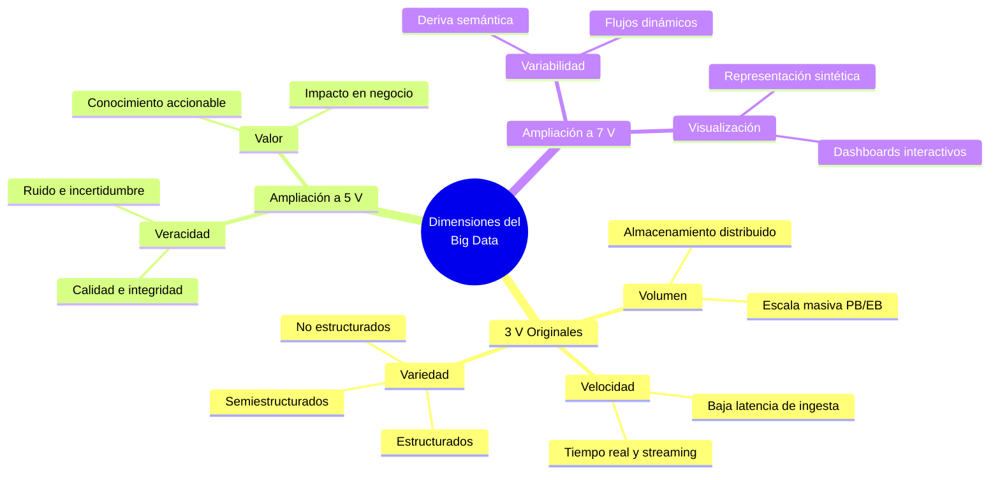
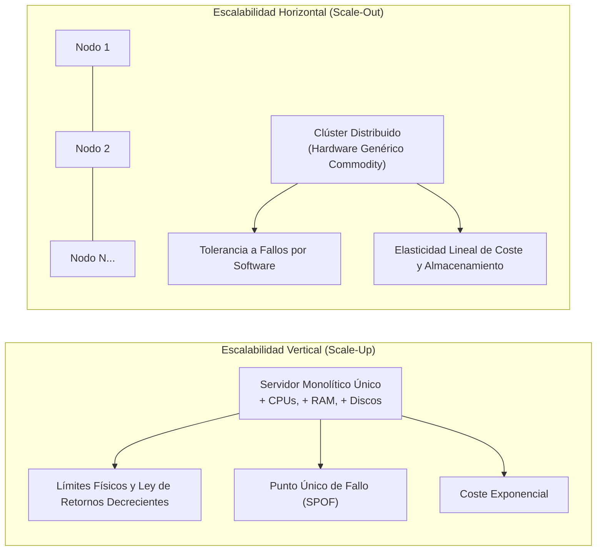
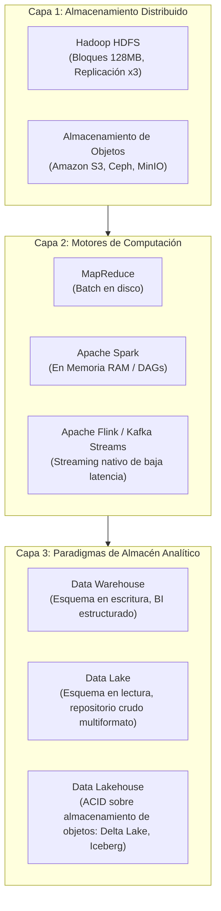

# Características y Dimensiones del Big Data

El concepto de **Big Data** hace referencia a conjuntos de datos cuyo volumen, velocidad de generación y diversidad tipológica sobrepasan la capacidad de captura, almacenamiento, gestión y procesamiento de los sistemas tradicionales basados en bases de datos relacionales (RDBMS) y arquitecturas de cómputo monolítico.

Más que un umbral cuantitativo estricto, el Big Data representa un **cambio de paradigma tecnológico y arquitectónico** en la ingeniería de datos: la transición desde el procesamiento centralizado en una única máquina hacia sistemas distribuidos, tolerantes a fallos y altamente paralelizables.

---

## 1. Las Dimensiones del Big Data: De las 3 V a las 7 V

En 2001, el analista Doug Laney (Gartner) formuló el modelo original de las **3 V** para sintetizar los desafíos emergentes de gestión de datos (*3D Data Management*). Con la madurez de la industria, la literatura científica y técnica extendió este marco conceptual hasta consolidar las **7 V modernas**:

### 1.1 Volumen
Representa la magnitud física o dimensionalidad masiva de los datos generados globalmente.
* **Escala:** Evolución vertiginosa desde gigabytes ($10^9$ bytes) y terabytes ($10^{12}$ bytes) hacia petabytes ($10^{15}$ bytes), exabytes ($10^{18}$ bytes) y zettabytes ($10^{21}$ bytes).
* **Quiebre Arquitectónico:** Supera los límites físicos de direccionamiento de memoria RAM, buses PCIe y discos duros locales en un servidor individual. Requiere sistemas de archivos distribuidos que particionen y distribuyan los datos en bloques a lo largo de clústeres de servidores.

### 1.2 Velocidad
Es la tasa o frecuencia con la que los datos son generados, transmitidos, ingeridos y analizados en el sistema.
* **Paradigmas:**
  * *Procesamiento por Lotes (Batch Processing):* Los datos se acumulan y procesan periódicamente (diaria o semanalmente) con alta latencia (ej. MapReduce).
  * *Procesamiento en Flujo (Stream Processing):* Los datos se procesan evento por evento en tiempo real con latencias de milisegundos a segundos (ej. detección de fraudes con Apache Kafka y Apache Flink).

### 1.3 Variedad
Refleja la heterogeneidad de fuentes y formatos sintácticos de la información. Se clasifica rigurosamente en tres categorías:
1. **Datos Estructurados:** Esquema relacional predefinido y rígido (*Schema-on-Write*). Tablas normalizadas en bases de datos SQL (PostgreSQL, Oracle) y archivos tabulares planos.
2. **Datos Semiestructurados:** No poseen una estructura tabular estricta, pero contienen marcadores, etiquetas o metadatos internos que definen su jerarquía organizativa. Formatos como JSON, XML, YAML, registros de logs de servidores y formatos de columnas comprimidos como Apache Parquet o Avro.
3. **Datos No Estructurados:** Carecen de un modelo conceptual o formato relacional previo. Incluyen texto libre en lenguaje natural, documentos PDF, audio, video, imágenes satelitales y streams binarios de sensores de IoT. Constituyen más del **80% de los datos generados en la actualidad**.

### 1.4 Veracidad
Evalúa la calidad, confiabilidad, completitud y autenticidad de los datos brutos.
* Dada la naturaleza descentralizada de las fuentes (redes sociales, sensores en campo), los datos conllevan ruido estocástico, registros duplicados, valores faltantes, anomalías y sesgos de recolección.
* Requiere canalizaciones rigurosas de validación, limpieza y linaje de datos para evitar el principio de *Garbage In, Garbage Out* (GIGO).

### 1.5 Valor
Constituye la dimensión teleológica fundamental: transformar petabytes de datos brutos sin procesar en **conocimiento accionable e impacto económico medible**.
* Un almacenamiento masivo sin algoritmos analíticos ni valor predictivo representa un pasivo financiero (costes de infraestructura en la nube) en lugar de un activo organizacional.

### 1.6 Variabilidad
Describe la inconstancia del flujo y la mutabilidad semántica de los datos a lo largo del tiempo:
* *Variabilidad de Tasa de Carga:* Picos impredecibles de ingesta provocados por eventos coyunturales (ej. ventas masivas en Black Friday, ciberataques, fluctuaciones bursátiles).
* *Variabilidad Semántica:* Cambios en el contexto o significado de las palabras en flujos de texto (ej. análisis de sentimiento donde un término adquiere connotaciones divergentes con el tiempo).

### 1.7 Visualización
La capacidad técnica y de diseño para transformar conjuntos de datos multidimensionales masivos en representaciones gráficas interactivas, mapas topológicos y paneles de control comprensibles para ingenieros y tomadores de decisiones.

---

## 2. El Quiebre del Paradigma Tradicional: Scale-Up vs Scale-Out

| Dimensión | Escalabilidad Vertical (*Scale-Up*) | Escalabilidad Horizontal (*Scale-Out*) |
| :--- | :--- | :--- |
| **Mecanismo** | Incrementar recursos (CPU, RAM, GPU, SSD) en un único servidor. | Incorporar múltiples nodos computacionales interconectados en red. |
| **Tipo de Hardware** | Servidores propietarios de gama alta (*Mainframes* / supercomputadoras). | Hardware genérico de bajo coste (*Commodity Hardware*). |
| **Tolerancia a Fallos** | Basada en redundancia de hardware costosa (fuentes redundantes, RAID). Vulnerable a SPOF (*Single Point of Failure*). | Diseñada a nivel de software. El sistema asume que los nodos fallarán constantemente y replica los datos automáticamente. |
| **Límite de Crecimiento** | Acotado por barreras de arquitectura de bus, calor y costes exponenciales. | Teóricamente ilimitado mediante la adición modular de nuevos nodos al clúster. |
| **Paradigma Distribuido** | No aplica (cómputo centralizado con memoria compartida). | Rige el **Teorema CAP** de Brewer (Consistencia, Disponibilidad, Tolerancia a Particiones). |

---

## 3. Ecosistema Tecnológico Fundamental

El tratamiento del Big Data se articula sobre tres capas arquitectónicas: almacenamiento distribuido, motores de cómputo y paradigmas de gestión.

### 3.1 Almacenamiento Distribuido
* **Hadoop Distributed File System (HDFS):**
  * Divide archivos masivos en bloques homogéneos (habitualmente de 128 MB o 256 MB) distribuidos a través de una arquitectura maestro-esclavo (*NameNode* para metadatos, *DataNodes* para bloques físicos).
  * Implementa un factor de replicación predeterminado de 3 copias para tolerar la pérdida imprevista de nodos.
* **Almacenamiento de Objetos en la Nube (*Object Stores*):**
  * Tecnologías como Amazon S3, Google Cloud Storage, Ceph y MinIO desacoplan el almacenamiento del cómputo.
  * Almacenan datos con durabilidad de hasta $99.999999999\%$ (11 nueves) y escalabilidad elástica sin necesidad de gestionar servidores de almacenamiento dedicados.

### 3.2 Motores de Procesamiento
* **Apache Hadoop MapReduce:**
  * Paradigma funcional pionero dividido en etapas `Map` (mapeo y filtrado local), `Shuffle/Sort` (reorganización por claves a través de la red) y `Reduce` (agregación final).
  * *Limitación:* Altísima latencia debido a constantes escrituras intermedias obligatorias en disco duro.
* **Apache Spark:**
  * Motor de cómputo unificado que reemplazó a MapReduce mediante la computación distribuida en memoria principal (RAM).
  * Introduce las abstracciones de **RDD** (*Resilient Distributed Datasets*), DataFrames y optimización mediante grafos acíclicos dirigidos (**DAGs** con el optimizador Catalyst), alcanzando velocidades hasta 100 veces superiores a MapReduce en tareas iterativas de Machine Learning.
* **Apache Flink y Apache Kafka:**
  * Infraestructuras orientadas a eventos para el procesamiento de flujos de datos en tiempo real (*event-driven streaming*), garantizando semántica de procesamiento exactamente una vez (*exactly-once semantics*) y gestión avanzada de ventanas temporales (*watermarking*).

### 3.3 Paradigmas Arquitectónicos: Data Warehouse vs Data Lake vs Data Lakehouse

| Característica | Data Warehouse (DWH) | Data Lake | Data Lakehouse |
| :--- | :--- | :--- | :--- |
| **Tipología de Datos** | Estrictamente estructurados y limpios. | Crudos: estructurados, semiestructurados y no estructurados. | Formato híbrido unificado para todos los tipos de datos. |
| **Tratamiento del Esquema** | *Schema-on-Write* (esquema rígido antes de cargar). | *Schema-on-Read* (el esquema se define al consultar). | *Schema Enforcement* y evolución de esquema transaccional. |
| **Garantías Transaccionales** | ACID completas. | Ninguna (archivos planos en storage sin soporte ACID). | **Transacciones ACID nativas** sobre almacenamiento de objetos. |
| **Coste de Almacenamiento** | Elevado (cómputo y storage acoplados o de alto coste). | Muy bajo (Object Storage económico). | Muy bajo (desacoplado sobre S3/Blob con metadatos abiertos). |
| **Casos de Uso** | BI tradicional, reportería SQL, OLAP empresarial. | Data Science exploratorio, archivado masivo de datos crudos. | Analítica unificada: BI tradicional, SQL interactivo y Machine Learning sobre el mismo repositorio. |
| **Tecnologías Ejemplo** | Snowflake, Google BigQuery, Teradata, Amazon Redshift. | Amazon S3, Azure Data Lake Storage (ADLS), HDFS. | **Delta Lake**, **Apache Iceberg**, **Apache Hudi**. |

---

## Notas relacionadas
- [[extract transform load]]
- [[crisp-dm]]
- [[machine learning]]
- [[SQL]]
- [[modelos de regresion]]
- [[test harness]]
