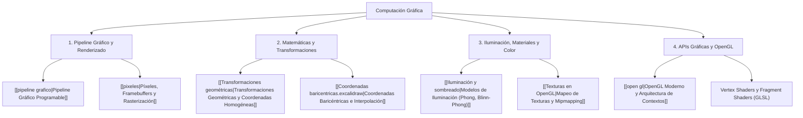

# Computación Gráfica (Pipeline Gráfico, Transformaciones y Shaders)

> [!info] 💡 ¿Qué es la Computación Gráfica y por qué es clave en Ciencias de la Computación?
> La **Computación Gráfica** es la rama de las ciencias computacionales encargada de la generación, síntesis, manipulación y almacenamiento visual de imágenes bidimensionales y tridimensionales mediante algoritmos matemáticos y aceleración por hardware (GPU).
> Es la base fundamental del desarrollo de videojuegos, simuladores físicos, visualización científica, realidad virtual y visión por computador.

---

## 🗺️ Mapa de Contenidos de la Materia (MOC)

---

## 📚 Estructura Temática

### 1. El Pipeline Gráfico
- **[[pipeline grafico]]:** Flujo de datos desde la geometría del modelo en CPU hasta los píxeles finales en pantalla: *Vertex Specification -> Vertex Shader -> Tesselation -> Geometry Shader -> Rasterization -> Fragment Shader -> Per-Sample Operations (Z-buffer, Blending)*.
- **[[pixeles]]:** Representación digital del color, profundidad de color (RGBA), búfer de profundidad (*Depth Buffer / Z-buffer*), búfer de plantilla (*Stencil Buffer*) y antialiasing (MSAA).

### 2. Fundamentos Matemáticos
- **[[Transformaciones geométricas]]:** Matrices de transformación afín en 3D (Traslación, Rotación con ángulos de Euler o Cuaterniones, Escalamiento) expresadas en coordenadas homogéneas ($4 \times 4$). Concatenación de matrices *Model-View-Projection* (MVP).
- Coordenadas Baricéntricas para interpolación de normales y coordenadas UV dentro de primitivas triangulares.

### 3. Iluminación y Sombreado
- **[[Iluminación y sombreado]]:** Modelo de reflexión empírico de Phong: componente Ambiental ($I_a$), Difusa ($I_d = k_d (N \cdot L)$ según la ley del coseno de Lambert) y Especular ($I_s = k_s (R \cdot V)^\alpha$).
- Shading plano (*Flat*), sombreado de Gouraud (interpolación en vértices) y sombreado de Phong (interpolación por fragmento).
- **[[Texturas en OpenGL]]:** Filtrado bilineal y trilineal, direccionamiento UV (*wrapping*), mapas de normales (*Normal Mapping*) y texturas cúbicas (*Skyboxes*).

### 4. Implementación con OpenGL
- **[[open gl]]:** Máquina de estados de OpenGL, manejo de objetos de búfer: Vertex Buffer Objects (VBO), Vertex Array Objects (VAO), y Element Buffer Objects (EBO).
- Compilación y enlace de programas de sombreadores en lenguaje GLSL (*OpenGL Shading Language*).

---

## 🔗 Conexión con otras disciplinas
- **[[Multiprocesamiento/Arquitectura de GPU y Programacion Heterogenea con NVIDIA CUDA|Arquitectura de GPU]]:** Ejecución masivamente paralela SIMT, núcleos de cómputo y memoria de texturas.
- **[[Matematicas/Calculo/Calculo Multivariable, Gradiente y Matriz Jacobiana|Cálculo Multivariable]]:** Vectores normales, gradientes y productos punto para física de luz.
- **[[Matematicas/Probabilidad y Metodos Numericos/Metodos Numericos para Ecuaciones No Lineales e Interpolacion|Métodos Numéricos]]:** Trazadores cúbicos (*Splines*) y curvas de Bézier.
