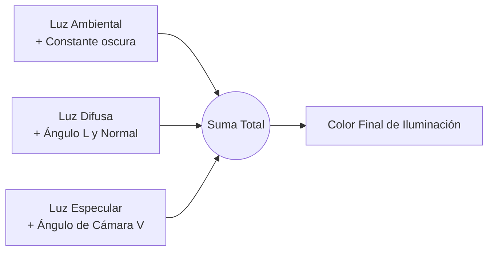

La **Iluminación y el Sombreado** en computación gráfica son los procesos matemáticos que simulan el comportamiento físico de la luz cuando interactúa con superficies. Su objetivo principal es dar sensación de volumen, realismo y profundidad (3D) a polígonos que, de otro modo, se verían planos en el [[pipeline grafico]].

## Modelos de Iluminación Local
Calculan cómo una fuente de luz directa afecta a la superficie de un objeto, ignorando que la luz pueda rebotar de otras superficies.

### El Modelo de Reflexión de Phong
Es el modelo de iluminación clásica empírica más utilizado (simplifica mucho la física real para correr rápido). Divide el comportamiento de la luz en tres componentes aditivos:
1. **Luz Ambiental:** Una iluminación base general y uniforme para asegurar que las áreas que no reciben luz directa no queden en oscuridad total (negro absoluto). Simula burdamente los múltiples rebotes de luz que llenan una habitación.
2. **Luz Difusa:** Representa cómo la luz se esparce al incidir sobre superficies mate (rugosas). El brillo depende del ángulo en el que la luz golpea la superficie, calculado mediante el producto punto entre la dirección de la luz (L) y el vector normal de la superficie (N).
3. **Luz Especular:** Representa el reflejo brillante o "destello" característico de las superficies pulidas como el metal o el plástico. Depende fuertemente del ángulo desde el cual el observador (cámara) está mirando (Vector V).

> [!info] Explicación
> **El Modelo Phong en resumen:** Es una "falsificación" rápida y barata computacionalmente: Sumas la luz constante (Ambiental) + la luz mate basada en el ángulo de golpe (Difusa) + el brillito metálico basado en hacia dónde miras (Especular).

## Modelos de Sombreado (Shading)
El modelo de iluminación (como Phong) te da el color final. El modelo de sombreado te dice **dónde** y **con qué frecuencia** calcular ese color dentro del polígono.

### 1. Flat Shading (Sombreado Plano)
Se evalúa la fórmula de iluminación una sola vez por polígono entero. El resultado es que todo el triángulo tiene exactamente el mismo color, dándole a los objetos un aspecto facetado (estilo retro o *low poly*).

### 2. Gouraud Shading
Se calcula la iluminación exacta solo en los vértices del polígono utilizando sus normales. Luego, para el interior del polígono, el color se interpola linealmente (se difumina) entre los vértices durante la rasterización a [[pixeles]]. Suaviza las superficies considerablemente sin gastar muchos recursos.

### 3. Phong Shading (No confundir con el modelo de luz Phong)
En lugar de interpolar el *color* final como hace Gouraud, interpola los *vectores normales* geométricos por cada píxel. Luego, evalúa el modelo de iluminación entero de nuevo para cada uno de los píxeles (fragmentos). Produce brillos mucho más precisos y realistas, pero es más costoso computacionalmente.

## Modelos Avanzados (Iluminación Global)
Consideran que la luz no solo viene de la fuente directa (bombillo), sino que los objetos mismos reflejan luz sobre otros objetos.

### Ray Tracing (Trazado de Rayos)
Dispara rayos imaginarios desde la cámara hacia los píxeles de la pantalla, que luego rebotan por la escena 3D. Cada rebote recopila colores, sombras, refracciones y reflexiones. 
Ofrece un hiperrealismo idéntico a la física real, pero históricamente era tan pesado computacionalmente que solo se usaba en cine pre-renderizado (como Pixar). Solo recientemente se ha popularizado en tiempo real gracias a hardware acelerado en consolas modernas y GPUs RTX.

## Notas relacionadas
- [[Transformaciones geométricas]]
- [[OpenGl]]
- [[pipeline grafico]]
