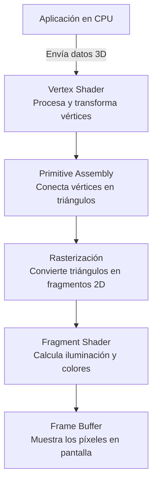

OpenGL usa una arquitectura de **pipeline** para crear gráficos en el computador. 

Los **shaders** son pequeñas aplicaciones o programas que se ejecutan directamente en la GPU. 
Dos tipos de shaders son obligatorios: 
* **Fragment Shader**: Se encarga de calcular los colores con los que se rellena el objeto (píxel por píxel).
* **Vertex Shader**: Se encarga de procesar las coordenadas y transformaciones de los vértices de la forma geométrica.
* *Geometry Shader*: Es opcional y a menudo no se usa tanto porque muchas operaciones se pueden manejar en el vertex shader.

> [!info] Explicación
> - **Pipeline**: Es una cadena de procesos secuenciales. En gráficos, los datos de los modelos 3D entran por un lado y pasan por varias etapas (vértices, rasterización, fragmentos) hasta salir como píxeles en la pantalla.
> - **Shaders**: Al ejecutarse en la tarjeta gráfica (GPU), permiten procesar millones de píxeles o vértices al mismo tiempo de manera ultra rápida.

**GLSL** (OpenGL Shading Language) es el lenguaje usado para escribir shaders, diseñado para la programación en paralelo.

La última versión estable suele ser OpenGL 4.6 y el ecosistema contiene estas distribuciones derivadas: 
* **OpenGL ES (Embedded Systems)**: Diseñado para dispositivos móviles y sistemas integrados (smartphones, consolas portátiles).
* **WebGL**: Adaptación para renderizar gráficos 3D en navegadores web mediante JavaScript.

OpenGL es una API multiplataforma.

> [!info] Explicación
> Multiplataforma significa que el mismo código básico de dibujo funcionará tanto en Windows, como en macOS o Linux, independientemente del hardware subyacente.

Cada sistema operativo tiene sus propias librerías como gestor de ventanas, y OpenGL se encarga únicamente del "relleno" o dibujo dentro de dicha ventana. Sin embargo, **GLFW** es una librería multiplataforma que facilita la creación y gestión de estas ventanas e inputs (teclado/ratón) para OpenGL sin lidiar con el código específico de cada SO.

## Notas relacionadas
- [[pipeline grafico]]
- [[pixeles]]
- [[open gl]]
