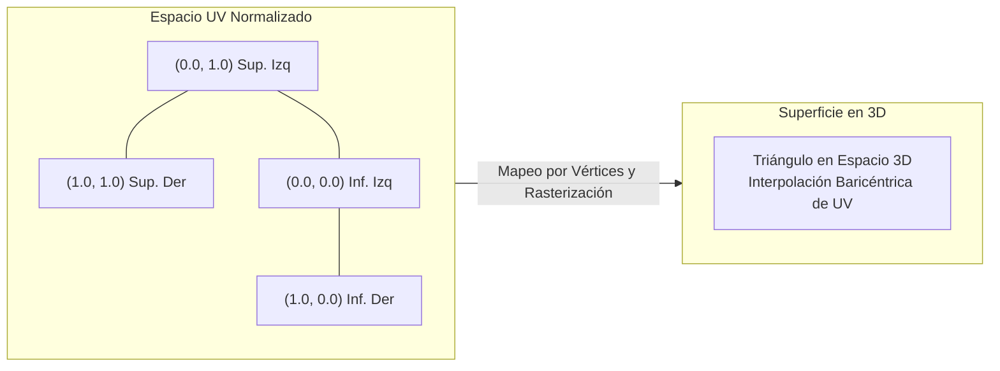
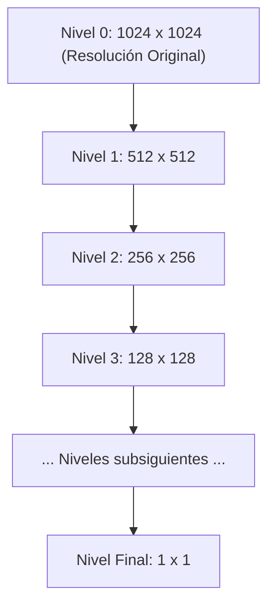
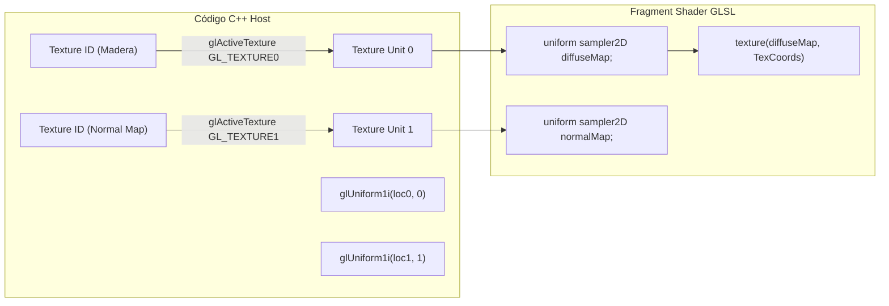

# Texturas en OpenGL: Mapeo UV, Modos de Envoltorio, Filtrado y Mipmapping

## Notas relacionadas
- [[open gl|OpenGL: Arquitectura de Pipeline y Shaders]]
- [[Documentos/computacion grafica/OpenGl|OpenGL y shaders]]
- [[Documentos/computacion grafica/pipeline grafico|Pipeline gráfico]]
- [[Documentos/computacion grafica/pixeles|Píxeles]]

---

## 1. Fundamentos: ¿Qué es una Textura en Computación Gráfica?

En computación gráfica y en la arquitectura de la GPU, una **textura** no es simplemente una imagen estática de dos dimensiones; formalmente es un **arreglo multidimensional de datos contiguos en memoria de video (VRAM)** estructurado para ser muestreado eficientemente mediante hardware especializado (*Texture Mapping Units* o TMUs). Aunque típicamente contiene canales de color (RGB o RGBA), también puede codificar vectores normales (*Normal Maps*), factores de rugosidad, metalicidad, oclusión ambiental (*PBR Maps*) o información de profundidad (*Shadow Maps*).

### 1.1 Texels vs Píxeles

Es fundamental distinguir con rigor estos dos conceptos:
* **Texel (Texture Element):** Es la unidad atómica e indivisible de información dentro de la imagen de textura almacenada en memoria. Posee coordenadas discretas enteras dentro del mapa de bits original (ej. $1024 \times 1024$ texels).
* **Píxel / Fragmento:** Es el elemento de imagen en la pantalla o en el framebuffer de destino.
* **Disparidad de Escala:** Rara vez existe una correspondencia uno a uno entre un texel y un píxel. Debido a la perspectiva 3D, rotaciones de la cámara y distancias variables, un único píxel puede cubrir cientos de texels (cuando el objeto está lejos), o un único texel puede expandirse para cubrir decenas de píxeles en pantalla (cuando la cámara se acerca a la superficie).

---

## 2. Coordenadas de Textura: El Espacio UV / $(s, t)$

Para proyectar una imagen bidimensional sobre una malla tridimensional compuesta por triángulos, cada vértice debe contener una **coordenada de textura**, convencionalmente denominada $(u, v)$ o en la nomenclatura de OpenGL $(s, t)$.

$$s, t \in [0.0, 1.0]$$

* $(0.0, 0.0)$ corresponde a la esquina inferior izquierda de la textura.
* $(1.0, 1.0)$ corresponde a la esquina superior derecha de la textura.



> [!important] Convención del Eje Y: OpenGL vs Formatos de Imagen
> En OpenGL, el origen $(0,0)$ de las coordenadas de textura se ubica en la **esquina inferior izquierda**. Sin embargo, la gran mayoría de formatos de imagen estándar (PNG, JPG) y librerías de decodificación como `stb_image` organizan sus matrices desde la **esquina superior izquierda**. Por ello, al cargar cualquier imagen en C/C++ es mandatorio invertir el eje Y antes de subirla a la GPU:
> ```cpp
> stbi_set_flip_vertically_on_load(true);
> ```

---

## 3. Modos de Envoltorio de Texturas (*Texture Wrapping*)

¿Qué ocurre cuando un shader solicita una muestra en coordenadas que caen fuera del rango estándar $[0.0, 1.0]$ (por ejemplo, $(1.5, 2.3)$)?
OpenGL proporciona políticas configurables independientes para cada eje ($s$ horizontal, $t$ vertical, y $r$ en texturas 3D) mediante `glTexParameteri`:

| Modo de Envoltorio | Constante de OpenGL | Comportamiento Matemático y Visual |
| :--- | :--- | :--- |
| **Repetición Periódica** | `GL_REPEAT` | La imagen se repite periódicamente tipo mosaico (*tiling*). Equivale a tomar la parte fraccionaria: $s' = s - \lfloor s \rfloor$. |
| **Repetición en Espejo** | `GL_MIRRORED_REPEAT` | La imagen se repite invirtiendo la orientación en cada ciclo entero par/impar, evitando costuras visuales bruscas. |
| **Fijación al Borde** | `GL_CLAMP_TO_EDGE` | Clampa las coordenadas al rango $[0, 1]$: $s' = \min(\max(s, 0.0), 1.0)$. Las coordenadas exteriores toman el color del texel del borde extremo más cercano. |
| **Fijación al Borde con Color Fijo** | `GL_CLAMP_TO_BORDER` | Cualquier coordenada fuera de $[0, 1]$ recibe un color uniforme arbitrario definido por el usuario (muy utilizado en *shadow maps* para que fuera del cono de luz no haya sombras). |

### 3.1 Configuración en C++
```cpp
glTexParameteri(GL_TEXTURE_2D, GL_TEXTURE_WRAP_S, GL_REPEAT);
glTexParameteri(GL_TEXTURE_2D, GL_TEXTURE_WRAP_T, GL_REPEAT);

// Si se utiliza GL_CLAMP_TO_BORDER:
float borderColor[] = { 1.0f, 1.0f, 0.0f, 1.0f }; // Amarillo
glTexParameterfv(GL_TEXTURE_2D, GL_TEXTURE_BORDER_COLOR, borderColor);
```

---

## 4. Filtrado de Texturas (*Texture Filtering*)

Dado que las coordenadas de textura calculadas por interpolación en el fragment shader son números continuos en punto flotante, rara vez coinciden exactamente con el centro exacto de un texel discreto. El **filtrado de texturas** define cómo la GPU reconstruye el color del fragmento a partir de los texels discretos circundantes.

### 4.1 Magnificación vs Minificación
* **Magnificación (*Zoom-In*):** Ocurre cuando un texel es significativamente más grande que un fragmento de pantalla (la cámara está sumamente cerca del objeto). Múltiples fragmentos adyacentes mapean dentro del mismo texel.
* **Minificación (*Zoom-Out*):** Ocurre cuando un solo fragmento de pantalla abarca múltiples texels de la textura (el objeto está muy lejos de la cámara).

### 4.2 Algoritmos de Filtrado Fundamentales

#### 1. Vecino Más Cercano (`GL_NEAREST` / Nearest Neighbor)
Selecciona el color del texel cuyo centro esté a la mínima distancia euclidiana de la coordenada calculada.
* **Ventajas:** Máxima velocidad computacional. Ideal para estilos artísticos "Pixel Art" o texturas retro donde se busca ver deliberadamente los píxeles nítidos.
* **Desventajas:** Genera un efecto pixelado agresivo en magnificación y severos artefactos de alias (*aliasing*) en minificación.

#### 2. Interpolación Bilineal (`GL_LINEAR`)
Calcula una media ponderada linealmente entre los 4 texels vecinos inmediatos a la coordenada de muestreo:
$$C(u, v) = (1 - \alpha)(1 - \beta) C_{00} + \alpha(1 - \beta) C_{10} + (1 - \alpha)\beta C_{01} + \alpha \beta C_{11}$$
donde $\alpha, \beta \in [0, 1]$ representan los desplazamientos fraccionarios entre los centros de los texels.
* **Ventajas:** Produce transiciones suaves y continuas de color.
* **Desventajas:** Puede dar una apariencia ligeramente borrosa (*blur*) cuando la cámara se sitúa excesivamente cerca.

```cpp
// Filtrado para magnificación (solo admite GL_NEAREST o GL_LINEAR)
glTexParameteri(GL_TEXTURE_2D, GL_TEXTURE_MAG_FILTER, GL_LINEAR);

// Filtrado para minificación
glTexParameteri(GL_TEXTURE_2D, GL_TEXTURE_MIN_FILTER, GL_LINEAR);
```

---

## 5. Mipmapping y Reducción del Aliasing (*Texel Swimming*)

### 5.1 El Problema: Aliasing y Texel Swimming en Minificación

Cuando una superficie texturizada se aleja en el espacio tridimensional hacia el horizonte, un único fragmento en pantalla puede abarcar una cuadrícula de $64 \times 64$ o más texels en el espacio de textura. Si se muestrea un único punto arbitrario mediante `GL_NEAREST` o `GL_LINEAR`, la mayor parte de la información de esa región es completamente ignorada.

Esto viola el **Teorema de Muestreo de Nyquist-Shannon**, generando:
1. **Moiré Patterns:** Patrones repetitivos y falsos en texturas de alta frecuencia (como rejas, dameros o ladrillos lejanos).
2. **Texel Swimming (Centelleo Temporal):** Con el menor movimiento de la cámara, los puntos de muestreo saltan entre texels muy dispares (negros y blancos por ejemplo), haciendo que la imagen parpadee violentamente.
3. **Pérdida Crítica de Rendimiento de Memoria:** Los accesos a VRAM pierden localidad espacial, causando *cache misses* masivos en la GPU.

### 5.2 La Solución: Pirámide de Mipmaps

Un **Mipmap** (del latín *multum in parvo*, "mucho en poco espacio") es una colección piramidal de versiones precalculadas y filtradas de la misma textura original, donde cada nivel sucesivo tiene exactamente la mitad de resolución horizontal y vertical que el nivel anterior:

$$\text{Nivel } 0: N \times M \longrightarrow \text{Nivel } 1: \frac{N}{2} \times \frac{M}{2} \longrightarrow \dots \longrightarrow 1 \times 1$$



> [!info] Costo en Memoria de los Mipmaps
> La serie geométrica infinita converge a:
> $$\sum_{k=0}^{\infty} \left(\frac{1}{4}\right)^k = \frac{1}{1 - \frac{1}{4}} = \frac{4}{3} = 1.333\dots$$
> Almacenar la pirámide completa de mipmaps solo añade un **33.3% adicional** de consumo de memoria de video (VRAM), a cambio de eliminar el aliasing y multiplicar la tasa de aciertos de la caché de texturas.

### 5.3 Modos de Filtrado de Mipmaps en Minificación

Al muestrear con mipmaps, existen dos niveles de interpolación:
1. Interpolación espacial dentro de un nivel de textura (Nearest o Linear).
2. Selección e interpolación entre los dos niveles adyacentes de la pirámide (Nearest o Linear).

| Constante GL | Filtrado dentro del nivel | Interpolación entre niveles de Mipmap | Descripción y Calidad Visual |
| :--- | :--- | :--- | :--- |
| `GL_NEAREST_MIPMAP_NEAREST` | Nearest | Nearest | Toma el mipmap más cercano y aplica vecino más cercano. Rápido, pero pixelado y con saltos perceptibles entre niveles. |
| `GL_LINEAR_MIPMAP_NEAREST` | Bilineal | Nearest | Filtra bilinealmente el mipmap más cercano. Bueno, pero al avanzar la cámara se percibe una línea divisoria donde cambia de nivel. |
| `GL_NEAREST_MIPMAP_LINEAR` | Nearest | Lineal | Interpola linealmente entre dos mipmaps, pero usando muestras nearest. |
| `GL_LINEAR_MIPMAP_LINEAR` | Bilineal | Lineal | **Filtrado Trilineal (Estándar de Oro):** Realiza interpolación bilineal dentro de los dos niveles de mipmap contiguos y luego una interpolación lineal entre ambos resultados. Elimina por completo las costuras entre niveles. |

```cpp
// Configuración de filtrado trilineal para minificación
glTexParameteri(GL_TEXTURE_2D, GL_TEXTURE_MIN_FILTER, GL_LINEAR_MIPMAP_LINEAR);
glTexParameteri(GL_TEXTURE_2D, GL_TEXTURE_MAG_FILTER, GL_LINEAR); // Mipmaps nunca se usan en magnificación
```

---

## 6. Formatos de Canales, Carga y Transferencia a Memoria GPU

### 6.1 Canales y Formatos Comunes
- **Imágenes JPG:** Típicamente 3 canales (`GL_RGB`).
- **Imágenes PNG:** Típicamente 4 canales (`GL_RGBA`) incluyendo el canal de transparencia Alfa.
- **Imágenes en Escala de Grises:** 1 canal (`GL_RED`).

### 6.2 Flujo Completo de Carga en C++ con `stb_image` y `glTexImage2D`

```cpp
#define STB_IMAGE_IMPLEMENTATION
#include "stb_image.h"
#include <glad/glad.h>
#include <iostream>

unsigned int loadTexture(const char* filepath)
{
    unsigned int textureID;
    glGenTextures(1, &textureID);

    int width, height, nrChannels;
    // Invertir eje Y para respetar la convención de origen inferior-izquierdo de OpenGL
    stbi_set_flip_vertically_on_load(true);
    unsigned char* data = stbi_load(filepath, &width, &height, &nrChannels, 0);

    if (data)
    {
        GLenum internalFormat = 0;
        GLenum dataFormat = 0;
        if (nrChannels == 1) {
            internalFormat = dataFormat = GL_RED;
        } else if (nrChannels == 3) {
            internalFormat = dataFormat = GL_RGB;
        } else if (nrChannels == 4) {
            internalFormat = dataFormat = GL_RGBA;
        }

        // 1. Enlazar textura
        glBindTexture(GL_TEXTURE_2D, textureID);

        // 2. Transferir datos de memoria RAM de CPU a la VRAM de la GPU
        glTexImage2D(GL_TEXTURE_2D, 
                     0,                // Nivel base de mipmap (0)
                     internalFormat,   // Formato de almacenamiento interno en GPU
                     width, height,    // Dimensiones en texels
                     0,                // Borde (siempre 0 en perfil moderno)
                     dataFormat,       // Formato de los datos de entrada en CPU
                     GL_UNSIGNED_BYTE, // Tipo de dato de cada canal
                     data);            // Puntero a los bytes de la imagen

        // 3. Generación automática por hardware de toda la pirámide de Mipmaps
        glGenerateMipmap(GL_TEXTURE_2D);

        // 4. Parámetros de Envoltorio y Filtrado
        glTexParameteri(GL_TEXTURE_2D, GL_TEXTURE_WRAP_S, GL_REPEAT);
        glTexParameteri(GL_TEXTURE_2D, GL_TEXTURE_WRAP_T, GL_REPEAT);
        glTexParameteri(GL_TEXTURE_2D, GL_TEXTURE_MIN_FILTER, GL_LINEAR_MIPMAP_LINEAR);
        glTexParameteri(GL_TEXTURE_2D, GL_TEXTURE_MAG_FILTER, GL_LINEAR);

        // 5. Liberar la memoria RAM del host (los datos ya residen permanentemente en VRAM)
        stbi_image_free(data);
    }
    else
    {
        std::cerr << "Fallo al cargar la textura en la ruta: " << filepath << std::endl;
        stbi_image_free(data);
    }

    return textureID;
}
```

---

## 7. Muestreo de Texturas en Shaders GLSL y Unidades de Textura

La GPU dispone de múltiples **Unidades de Textura** (*Texture Units*) que permiten enlazar varias texturas concurrentemente (`GL_TEXTURE0`, `GL_TEXTURE1`, ..., `GL_TEXTURE31`) para combinar mapas difusos, mapas especulares y normales en una sola pasada.



### 7.1 Fragment Shader: Muestreo de Texturas
```glsl
#version 330 core

in vec2 TexCoords;
out vec4 FragColor;

// Descriptores de unidades de textura
uniform sampler2D texture1; // Enlazada a la unidad 0
uniform sampler2D texture2; // Enlazada a la unidad 1

void main()
{
    // Muestreo intrínseco de hardware con filtrado y mipmap automáticos
    vec4 color1 = texture(texture1, TexCoords);
    vec4 color2 = texture(texture2, TexCoords);

    // Mezcla lineal (80% color1 + 20% color2)
    FragColor = mix(color1, color2, 0.2);
}
```
