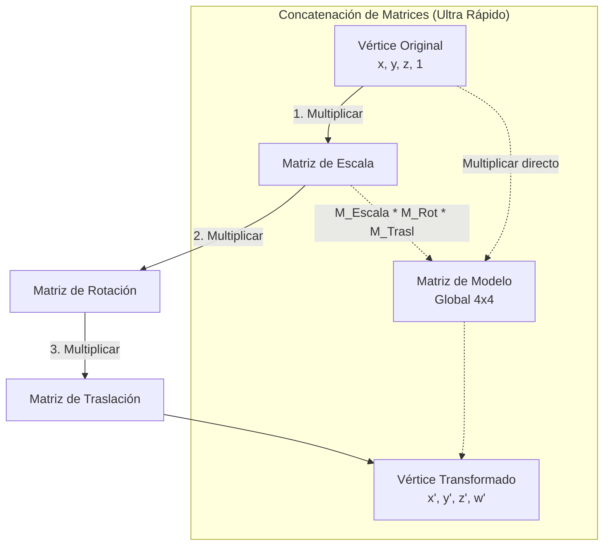

Las **Transformaciones Geométricas** son las operaciones matemáticas utilizadas en computación gráfica 2D y 3D para alterar la posición, orientación o tamaño de un objeto gráfico (que en última instancia está compuesto de vértices en un espacio vectorial).

Para ser procesadas de manera eficiente en el [[pipeline grafico]], las transformaciones se representan mediante **matrices**.

> [!info] Explicación
> Al usar matrices, el procesador gráfico (GPU) puede multiplicar un vector (un punto en el espacio 3D) por una matriz de transformación de manera ultra rápida para calcular en un instante la nueva posición del objeto en la pantalla.

## Tipos Básicos de Transformación

### 1. Traslación
La traslación desplaza un objeto en línea recta desde una coordenada inicial a una nueva coordenada, sin cambiar su forma, tamaño ni orientación.
Se logra sumando un vector de traslación $(T_x, T_y, T_z)$ a las coordenadas originales del objeto.

### 2. Rotación
La rotación hace girar los puntos de un objeto alrededor de un eje especificado (en 2D alrededor de un punto, en 3D alrededor de los ejes X, Y o Z) en función de un ángulo de inclinación $\theta$.
La rotación preserva el tamaño del objeto pero altera la ubicación relativa de sus vértices.

### 3. Escalado
El escalado se utiliza para alterar el tamaño de un objeto. Multiplica las coordenadas originales por factores de escala $(S_x, S_y, S_z)$.
- Si los factores son mayores a 1, el objeto se agranda.
- Si los factores están entre 0 y 1, el objeto se encoge.
- Si $S_x \neq S_y$, ocurre una deformación asimétrica (escalado no uniforme).

## Coordenadas Homogéneas
El problema en álgebra lineal es que la **traslación** no es una transformación lineal multiplicativa que pueda incrustarse en una simple matriz de $3 \times 3$ (para objetos 3D). Por lo tanto, no se podría "agrupar" la rotación y la traslación en una misma operación.

Para solucionar esto, en computación gráfica se agregan las **coordenadas homogéneas**. Se añade una cuarta dimensión ficticia $w$ (haciendo que los vértices sean vectores de $4 \times 1$ y las matrices de $4 \times 4$).

> [!info] Explicación
> **¿Para qué sirven las Coordenadas Homogéneas?** Permiten que la **traslación**, **rotación** y **escalado** puedan representarse exclusivamente como multiplicaciones de matrices. Esto permite "concatenar" las transformaciones. Si un objeto debe encogerse, rotar y luego moverse, puedes multiplicar esas 3 matrices juntas creando una "Matriz Global", y aplicarla a millones de vértices simultáneamente con una sola multiplicación por vértice. Esto es el secreto del alto rendimiento de las tarjetas de video modernas.

## Notas relacionadas
- [[OpenGl]]
- [[pipeline grafico]]
- [[pixeles]]
