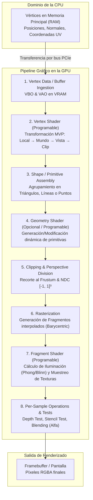

# OpenGL: Arquitectura del Pipeline Gráfico, Memoria GPU y Shaders GLSL

## Notas relacionadas
- [[Documentos/computacion grafica/OpenGl|OpenGL y shaders]]
- [[Documentos/computacion grafica/pipeline grafico|Pipeline gráfico]]
- [[Documentos/computacion grafica/pixeles|Píxeles]]
- [[Texturas en OpenGL|Texturas en OpenGL: Mapeo UV, Filtrado y Mipmapping]]

---

## 1. Fundamentos y Naturaleza de OpenGL

**OpenGL (Open Graphics Library)** no es una librería de software en el sentido convencional, sino una **especificación formal de API abierta y multiplataforma** mantenida y evolucionada por el consorcio **Khronos Group**. Dicha especificación estipula con exactitud el conjunto de funciones, parámetros y comportamientos requeridos para interactuar directamente con la Unidad de Procesamiento Gráfico (**GPU**), delegando la implementación concreta a los fabricantes de controladores de hardware gráfico (NVIDIA, AMD, Intel, Apple en su momento, etc.).

> [!info] Modelo Computacional: Máquina de Estados Finitos
> Conceptualmente, OpenGL opera como una **máquina de estados finitos** (*Finite State Machine*). La mayoría de sus llamadas a la API alteran el estado global del contexto de renderizado (por ejemplo, qué programa de shaders está activo, qué buffers están enlazados o qué pruebas de profundidad están habilitadas) o emiten instrucciones de dibujo (*draw calls*) que ejecutan operaciones geométricas y de fragmentación basándose en el estado actualmente configurado.

### 1.1 Perfil Central (*Core Profile*) vs Modo Inmediato (*Immediate Mode*)

* **Modo Inmediato / Pipeline de Función Fija (Legado - OpenGL 1.x / 2.x):** Utilizaba funciones como `glBegin(GL_TRIANGLES)`, `glVertex3f(...)` y `glEnd()`. En este paradigma, la CPU enviaba datos geométricos vértice a vértice en cada cuadro a través del bus del sistema (PCIe), provocando un cuello de botella crítico (*bus bottleneck*). Además, los modelos de iluminación y transformaciones estaban rígidamente fijados en hardware.
* **Perfil Central / Pipeline Programable (Moderno - OpenGL 3.3+ / 4.x Core Profile):** Se deprecó completamente el pipeline fijo. Exige el uso obligatorio de buffers en memoria de video VRAM ([[#3. Objetos de Memoria y Manejo de Recursos en la GPU (VBO, VAO, EBO)|VBO, VAO, EBO]]) y shaders programables escritos en **GLSL** (*OpenGL Shading Language*). Garantiza máximo rendimiento al transferir lotes masivos de geometría a la VRAM una única vez y ejecutar cómputo altamente paralelizado en los miles de núcleos de la GPU.

---

## 2. Arquitectura del Pipeline Gráfico Programable (*Programmable Graphics Pipeline*)

El pipeline gráfico de OpenGL es una secuencia de etapas de procesamiento que toma datos geométricos vectoriales tridimensionales en bruto y los transforma en una cuadrícula discreta de píxeles bidimensionales proyectados en el búfer de pantalla (*Framebuffer*).



### 2.1 Detalle Teórico de cada Etapa

1. **Vertex Data / Ingestión:** Vértices definidos con atributos múltiples (coordenadas espaciales $(x, y, z)$, vectores normales $(\hat{n}_x, \hat{n}_y, \hat{n}_z)$, coordenadas de textura $(u, v)$ y color $(r, g, b, a)$) se transfieren en bloques contiguos desde la memoria RAM a la VRAM mediante VBOs.
2. **Vertex Shader (Programable):** Procesa cada vértice de manera aislada e independiente en hilos concurrentes de la GPU. Su función primordial es aplicar la cadena de transformaciones matemáticas (matrices de Modelo, Vista y Proyección) para convertir las coordenadas locales en coordenadas de recorte homogéneas (*Clip Space Coordinates*):
   $$\mathbf{v}_{\text{clip}} = \mathbf{P} \cdot \mathbf{V} \cdot \mathbf{M} \cdot \mathbf{v}_{\text{local}}$$
3. **Primitive Assembly (Ensamblado de Primitivas):** Ensambla los vértices procesados en primitivas geométricas elementales (`GL_TRIANGLES`, `GL_TRIANGLE_STRIP`, `GL_LINES`, `GL_POINTS`) siguiendo el orden especificado o las secuencias de índices provistas por un EBO.
4. **Geometry Shader (Opcional / Programable):** Recibe una primitiva completa (por ejemplo, tres vértices de un triángulo) y tiene la capacidad de emitir nuevas primitivas o alterar la topología sobre la marcha (útil para generación de sombras volumétricas, teselación heurística o sistemas de partículas).
5. **Clipping y División de Perspectiva (Hardware Fijo):**
   - *Clipping:* Los segmentos de las primitivas que caen fuera del volumen de visualización (*viewing frustum*) se descartan o se recortan geométricamente.
   - *División de perspectiva:* Transforma las coordenadas homogéneas de 4 dimensiones $(x_c, y_c, z_c, w_c)$ a Coordenadas Normalizadas del Dispositivo (*Normalized Device Coordinates* o NDC) dividiendo entre el componente homogéneo $w_c$:
     $$\mathbf{v}_{\text{ndc}} = \left( \frac{x_c}{w_c}, \frac{y_c}{w_c}, \frac{z_c}{w_c} \right) \in [-1, 1]^3$$
   - *Viewport Transform:* Mapea el rango $[-1, 1]$ de NDC a las dimensiones reales en píxeles de la ventana configuradas por `glViewport(x, y, width, height)`.
6. **Rasterización (Hardware Fijo):** Discretiza las primitivas continuas en **fragmentos** (píxeles potenciales). Durante esta fase, el hardware interpola los atributos calculados en los vértices (normales, coordenadas UV, vectores de luz) a lo largo de la superficie del triángulo usando **coordenadas baricéntricas**:
   $$\phi(\mathbf{p}) = \lambda_1 \phi(\mathbf{v}_1) + \lambda_2 \phi(\mathbf{v}_2) + \lambda_3 \phi(\mathbf{v}_3), \quad \text{con } \lambda_1 + \lambda_2 + \lambda_3 = 1$$
7. **Fragment Shader (Programable):** Se ejecuta para cada fragmento rasterizado. Calcula el valor cromático final de color $(R, G, B, A)$, aplicando muestreo de texturas, iluminación difusa, especular y ambiental, cálculo de niebla y sombras.
8. **Operaciones por Muestra y Mezclado (Tests and Blending):**
   - *Depth Test (Z-Buffering):* Compara la profundidad $Z$ del fragmento actual con el valor preexistente en el búfer de profundidad (`GL_DEPTH_TEST`). Si el nuevo fragmento está detrás de geometría ya dibujada, se descarta.
   - *Stencil Test:* Evalúa máscaras de píxeles para efectos como espejos, portales u oclusión de contornos.
   - *Blending:* Combina el color resultante con el color previo en el búfer de color basándose en el canal alfa de transparencia:
     $$\mathbf{C}_{\text{final}} = \mathbf{C}_{\text{fuente}} \cdot \alpha_{\text{fuente}} + \mathbf{C}_{\text{destino}} \cdot (1 - \alpha_{\text{fuente}})$$

---

## 3. Objetos de Memoria y Manejo de Recursos en la GPU (VBO, VAO, EBO)

En el perfil moderno de OpenGL, el manejo de memoria en la GPU se basa en descriptores numéricos de bajo nivel (*OpenGL Object IDs*).

![[Pasted image 20241126214620.png]]

### 3.1 VBO (Vertex Buffer Object)

El **VBO** es un objeto de memoria asignado directamente en la VRAM de la GPU para almacenar grandes arreglos contiguos de bytes que representan los datos de los vértices (posiciones, colores, normales, UVs).

* **Objetivo de enlace:** `GL_ARRAY_BUFFER`.
* **Modos de uso:**
  - `GL_STATIC_DRAW`: Los datos se especifican una vez y se leen muchas veces para dibujar (ideal para modelos estáticos del escenario).
  - `GL_DYNAMIC_DRAW`: Los datos cambian frecuentemente y se leen muchas veces (partículas, ropa, mallas deformables).
  - `GL_STREAM_DRAW`: Los datos cambian en casi cada frame y se usan pocas veces.

```cpp
unsigned int VBO;
glGenBuffers(1, &VBO);
glBindBuffer(GL_ARRAY_BUFFER, VBO);
glBufferData(GL_ARRAY_BUFFER, sizeof(vertices), vertices, GL_STATIC_DRAW);
```

### 3.2 VAO (Vertex Array Object)

El **VAO** no almacena datos de vértices por sí mismo; es un **objeto de estado** que encapsula y recuerda:
1. Las llamadas a `glEnableVertexAttribArray` o `glDisableVertexAttribArray`.
2. Las configuraciones de formato de atributos realizadas con `glVertexAttribPointer`.
3. Los VBOs asociados a cada atributo.
4. El EBO actualmente enlazado en el momento de configuración.

> [!tip] Ventaja Arquitectónica del VAO
> Sin un VAO, antes de cada llamada de dibujo (*draw call*) tendrías que volver a enlazar el VBO, llamar a `glVertexAttribPointer` para cada uno de los atributos (posición, normal, textura) y habilitar los índices. Con el VAO, basta con invocar una única instrucción: `glBindVertexArray(VAO)`.

### 3.3 EBO / IBO (Element Buffer Object / Index Buffer Object)

Para dibujar un rectángulo compuesto por dos triángulos adyacentes, se requieren 6 vértices. Sin embargo, dos de ellos son idénticos. En modelos tridimensionales complejos, cada vértice es compartido por un promedio de 3 a 6 triángulos.
El **EBO** permite especificar únicamente los vértices únicos en el VBO y luego almacenar un arreglo de índices enteros que indican a la GPU el orden en que deben unirse para conformar las primitivas.

* **Objetivo de enlace:** `GL_ELEMENT_ARRAY_BUFFER`.
* **Llamada de dibujo indexada:** `glDrawElements(GL_TRIANGLES, count, GL_UNSIGNED_INT, 0);` en lugar de `glDrawArrays`.

> [!important] Beneficio de Rendimiento y Vertex Cache
> El uso de EBO no solo ahorra entre un 30% y 50% de memoria VRAM, sino que permite que el **Post-Transform Vertex Cache** de la GPU reutilice los vértices ya procesados por el Vertex Shader, reduciendo a la mitad la carga computacional geométrica.

### 3.4 Implementación C++: Configuración de VAO, VBO y EBO con Atributos Interleaved

```cpp
#include <glad/glad.h>
#include <GLFW/glfw3.h>

// Definición de vértices de un cuadrilátero con layout interleaved:
// [Posición: 3 floats] [Color: 3 floats] [Coordenadas UV: 2 floats]
float vertices[] = {
    // Posiciones (x, y, z)    // Colores (r, g, b)    // Textura (u, v)
     0.5f,  0.5f, 0.0f,        1.0f, 0.0f, 0.0f,       1.0f, 1.0f, // Vértice 0 (Sup. Der)
     0.5f, -0.5f, 0.0f,        0.0f, 1.0f, 0.0f,       1.0f, 0.0f, // Vértice 1 (Inf. Der)
    -0.5f, -0.5f, 0.0f,        0.0f, 0.0f, 1.0f,       0.0f, 0.0f, // Vértice 2 (Inf. Izq)
    -0.5f,  0.5f, 0.0f,        1.0f, 1.0f, 0.0f,       0.0f, 1.0f  // Vértice 3 (Sup. Izq)
};

// Índices para conformar dos triángulos (0, 1, 3) y (1, 2, 3)
unsigned int indices[] = {
    0, 1, 3, // Primer triángulo
    1, 2, 3  // Segundo triángulo
};

unsigned int VAO, VBO, EBO;

// 1. Generación y Enlace del VAO (registra todo el estado siguiente)
glGenVertexArrays(1, &VAO);
glBindVertexArray(VAO);

// 2. Creación del VBO y copia de datos a VRAM
glGenBuffers(1, &VBO);
glBindBuffer(GL_ARRAY_BUFFER, VBO);
glBufferData(GL_ARRAY_BUFFER, sizeof(vertices), vertices, GL_STATIC_DRAW);

// 3. Creación del EBO y copia de índices a VRAM
glGenBuffers(1, &EBO);
glBindBuffer(GL_ELEMENT_ARRAY_BUFFER, EBO);
glBufferData(GL_ELEMENT_ARRAY_BUFFER, sizeof(indices), indices, GL_STATIC_DRAW);

// 4. Especificación del Layout de Memoria (Stride = 8 * sizeof(float))
const GLsizei stride = 8 * sizeof(float);

// Atributo 0: Posición (3 componentes flotantes)
glVertexAttribPointer(0, 3, GL_FLOAT, GL_FALSE, stride, (void*)0);
glEnableVertexAttribArray(0);

// Atributo 1: Color (3 componentes flotantes, offset = 3 floats)
glVertexAttribPointer(1, 3, GL_FLOAT, GL_FALSE, stride, (void*)(3 * sizeof(float)));
glEnableVertexAttribArray(1);

// Atributo 2: Coordenadas UV (2 componentes flotantes, offset = 6 floats)
glVertexAttribPointer(2, 2, GL_FLOAT, GL_FALSE, stride, (void*)(6 * sizeof(float)));
glEnableVertexAttribArray(2);

// 5. Desenlace seguro
glBindVertexArray(0);
glBindBuffer(GL_ARRAY_BUFFER, 0);
// Nota: NO desenlazar el EBO antes del VAO, ya que el VAO almacena dicho enlace.
```

---

## 4. Shaders y GLSL (OpenGL Shading Language)

**GLSL** es un lenguaje imperativo de alto nivel fuertemente tipado con sintaxis basada en C, optimizado con operaciones vectoriales y matriciales nativas a nivel de hardware.

### 4.1 Tipos de Variables y Calificadores
- **Tipos de datos vectoriales:** `vec2`, `vec3`, `vec4` (flotantes); `ivec3` (enteros); `bvec2` (booleanos); `mat3`, `mat4` (matrices cuadradas).
- `in`: Calificador para atributos de entrada recibidos de la etapa anterior (o del VAO en el Vertex Shader).
- `out`: Calificador para datos emitidos hacia la etapa posterior.
- `uniform`: Variables globales pasadas desde la CPU a la GPU mediante la API; son constantes para todos los vértices y fragmentos durante una misma *draw call*.

---

### 4.2 El Vertex Shader: Transformaciones Geométricas y Espacios

El Vertex Shader toma cada posición local de vértice y la conduce a través de los cuatro espacios de coordenadas fundamentales de la computación gráfica:

1. **Espacio Local (Model Space):** Coordenadas relativas al origen del modelo tridimensional.
2. **Espacio de Mundo (World Space):** Coordenadas respecto al centro universal del mundo virtual, aplicando traslación, rotación y escalamiento mediante la matriz de modelo $\mathbf{M}_{\text{model}}$.
3. **Espacio de Vista / Cámara (View / Eye Space):** Coordenadas con respecto a la posición y orientación de la cámara virtual, generadas por la matriz de vista $\mathbf{V}_{\text{view}}$ (calculada habitualmente mediante el algoritmo *Look-At*).
4. **Espacio de Recorte (Clip Space):** Coordenadas obtenidas al aplicar la matriz de proyección $\mathbf{P}_{\text{proj}}$ (Perspectiva u Ortográfica), donde los límites visibles corresponden a $-w \le x, y, z \le w$.

```glsl
#version 330 core

// Atributos de entrada desde el VAO
layout (location = 0) in vec3 aPos;       // Posición en espacio local
layout (location = 1) in vec3 aNormal;    // Vector normal a la superficie
layout (location = 2) in vec2 aTexCoords; // Coordenadas UV

// Salidas hacia el Rasterizador e interpoladas al Fragment Shader
out vec3 FragPos;      // Posición del fragmento en espacio de mundo
out vec3 Normal;       // Vector normal en espacio de mundo
out vec2 TexCoords;    // Coordenadas UV pasadas directamente

// Matrices de transformación globales (Uniforms)
uniform mat4 model;
uniform mat4 view;
uniform mat4 projection;

void main()
{
    // 1. Transformación de la posición al espacio de mundo
    FragPos = vec3(model * vec4(aPos, 1.0));

    // 2. Corrección de la normal para evitar distorsiones por escalamiento no uniforme:
    // Se utiliza la matriz normal: transpuesta de la inversa de la submatriz 3x3 de model
    Normal = mat3(transpose(inverse(model))) * aNormal;

    // 3. Pasar coordenadas de textura
    TexCoords = aTexCoords;

    // 4. Salida obligatoria: Coordenadas en Clip Space
    gl_Position = projection * view * vec4(FragPos, 1.0);
}
```

---

### 4.3 El Fragment Shader: Modelos de Iluminación y Color

![[Pasted image 20241126224237.png]]

El Fragment Shader determina la apariencia visual de la superficie calculando la respuesta a las fuentes luminosas y las propiedades del material.

#### Modelo de Iluminación de Phong vs Blinn-Phong

El modelo empírico de Phong descompone la iluminación en tres componentes:

1. **Componente Ambiental ($I_{\text{ambient}}$):** Simula la dispersión de luz indirecta en la escena:
   $$I_{\text{ambient}} = k_a \cdot L_a$$
2. **Componente Difusa ($I_{\text{diffuse}}$ - Ley del Coseno de Lambert):** Refleja la luz en todas las direcciones de manera uniforme en función del ángulo de incidencia de la luz sobre la normal de la superficie:
   $$I_{\text{diffuse}} = k_d \cdot L_d \cdot \max(0, \hat{N} \cdot \hat{L})$$
3. **Componente Especular ($I_{\text{specular}}$):** Genera los brillos concentrados en superficies lisas o pulidas:
   - **Phong clásico:** Calcula el vector de reflexión $\hat{R} = 2(\hat{N} \cdot \hat{L})\hat{N} - \hat{L}$ y evalúa el coseno con el vector de la cámara $\hat{V}$:
     $$I_{\text{specular}} = k_s \cdot L_s \cdot (\max(0, \hat{R} \cdot \hat{V}))^\alpha$$
   - **Blinn-Phong (Estándar de la industria):** Reemplaza el cálculo de $\hat{R} \cdot \hat{V}$ por el vector a medio camino (*Halfway Vector*) $\hat{H} = \frac{\hat{L} + \hat{V}}{\|\hat{L} + \hat{V}\|}$, evaluando $\hat{N} \cdot \hat{H}$:
     $$I_{\text{specular\_blinn}} = k_s \cdot L_s \cdot (\max(0, \hat{N} \cdot \hat{H}))^\beta$$

> [!tip] Razón Técnica de Blinn-Phong
> Blinn-Phong es computacionalmente más eficiente (evita calcular el reflejo exacto) y es físicamente más consistente en ángulos rasantes, evitando colapsos bruscos del brillo especular cuando el ángulo entre la vista y el reflejo supera los $90^\circ$.

```glsl
#version 330 core

in vec3 FragPos;
in vec3 Normal;
in vec2 TexCoords;

out vec4 FragColor;

// Parámetros de la luz y el observador
uniform vec3 lightPos;
uniform vec3 viewPos;
uniform vec3 lightColor;
uniform vec3 objectColor;
uniform sampler2D diffuseTexture;

void main()
{
    // Normalización de vectores directores
    vec3 norm = normalize(Normal);
    vec3 lightDir = normalize(lightPos - FragPos);
    vec3 viewDir = normalize(viewPos - FragPos);

    // 1. Iluminación Ambiental
    float ambientStrength = 0.15;
    vec3 ambient = ambientStrength * lightColor;

    // 2. Iluminación Difusa
    float diff = max(dot(norm, lightDir), 0.0);
    vec3 diffuse = diff * lightColor;

    // 3. Iluminación Especular (Blinn-Phong)
    vec3 halfwayDir = normalize(lightDir + viewDir);
    float spec = pow(max(dot(norm, halfwayDir), 0.0), 32.0); // Brillo con exponente 32
    vec3 specular = 0.5 * spec * lightColor;

    // Muestreo de la textura difusa
    vec3 texColor = texture(diffuseTexture, TexCoords).rgb;

    // Composición final del color
    vec3 result = (ambient + diffuse + specular) * texColor * objectColor;
    FragColor = vec4(result, 1.0);
}
```

---

### 4.4 El Shader Program: Compilación, Enlace y Manejo de Errores

![[Pasted image 20241126225406.png]]
![[Pasted image 20241126225506.png]]

Los archivos de shaders se compilan dinámicamente en tiempo de ejecución por el controlador gráfico de la máquina anfitriona.

```cpp
#include <iostream>
#include <glad/glad.h>

unsigned int createShaderProgram(const char* vertexShaderSource, const char* fragmentShaderSource)
{
    int success;
    char infoLog[512];

    // 1. Compilación del Vertex Shader
    unsigned int vertexShader = glCreateShader(GL_VERTEX_SHADER);
    glShaderSource(vertexShader, 1, &vertexShaderSource, NULL);
    glCompileShader(vertexShader);
    glGetShaderiv(vertexShader, GL_COMPILE_STATUS, &success);
    if (!success) {
        glGetShaderInfoLog(vertexShader, 512, NULL, infoLog);
        std::cerr << "ERROR::SHADER::VERTEX::COMPILATION_FAILED\n" << infoLog << std::endl;
    }

    // 2. Compilación del Fragment Shader
    unsigned int fragmentShader = glCreateShader(GL_FRAGMENT_SHADER);
    glShaderSource(fragmentShader, 1, &fragmentShaderSource, NULL);
    glCompileShader(fragmentShader);
    glGetShaderiv(fragmentShader, GL_COMPILE_STATUS, &success);
    if (!success) {
        glGetShaderInfoLog(fragmentShader, 512, NULL, infoLog);
        std::cerr << "ERROR::SHADER::FRAGMENT::COMPILATION_FAILED\n" << infoLog << std::endl;
    }

    // 3. Creación del Shader Program y Enlace (Linking)
    unsigned int shaderProgram = glCreateProgram();
    glAttachShader(shaderProgram, vertexShader);
    glAttachShader(shaderProgram, fragmentShader);
    glLinkProgram(shaderProgram);
    glGetProgramiv(shaderProgram, GL_LINK_STATUS, &success);
    if (!success) {
        glGetProgramInfoLog(shaderProgram, 512, NULL, infoLog);
        std::cerr << "ERROR::SHADER::PROGRAM::LINKING_FAILED\n" << infoLog << std::endl;
    }

    // 4. Liberación de memoria intermedia de los shaders individuales
    glDeleteShader(vertexShader);
    glDeleteShader(fragmentShader);

    return shaderProgram;
}
```

---

## 5. Cuadro Comparativo: Vertex Processor vs Fragment Processor

| Característica / Criterio | Vertex Processor (Vertex Shader) | Fragment Processor (Fragment Shader) |
| :--- | :--- | :--- |
| **Unidad de Entrada** | Vértices individuales con sus atributos (VAO/VBO). | Fragmentos discretos generados por el rasterizador. |
| **Frecuencia de Ejecución** | Proporcional a la complejidad de la malla ($N$ vértices). | Proporcional a la resolución y área en pantalla ($M$ píxeles cubiertos). |
| **Responsabilidades Principales** | Transformación geométrica ($\mathbf{MVP}$), transformación de normales, deformación de huesos (*skinning*), generación de coordenadas de textura. | Muestreo y filtrado de texturas, cálculo de modelos de iluminación (Phong/PBR), mapeo de normales (*normal mapping*), niebla y color final. |
| **Salida Obligatoria** | `gl_Position` (Vector de 4 dimensiones en Clip Space). | `out vec4 FragColor` (Color final RGBA del píxel/muestra). |
| **Interpolación** | No aplica (opera sobre datos discretos de vértices). | Recibe variables `in` calculadas mediante interpolación baricéntrica por el rasterizador. |

---

## 6. Ciclo de Renderizado Completo (*Game / Render Loop*)

En cada cuadro de la aplicación gráfica, el ciclo de ejecución en C++ enlaza el estado y dispara las operaciones en la GPU:

```cpp
while (!glfwWindowShouldClose(window))
{
    // 1. Limpieza de los búferes de color y profundidad
    glClearColor(0.1f, 0.1f, 0.15f, 1.0f);
    glClear(GL_COLOR_BUFFER_BIT | GL_DEPTH_BUFFER_BIT);

    // 2. Activación del programa de shaders
    glUseProgram(shaderProgram);

    // 3. Envío de matrices Uniforms (MVP)
    int modelLoc = glGetUniformLocation(shaderProgram, "model");
    glUniformMatrix4fv(modelLoc, 1, GL_FALSE, glm::value_ptr(modelMatrix));
    // (Igual para view y projection)

    // 4. Enlace del VAO y dibujo indexado mediante el EBO
    glBindVertexArray(VAO);
    glDrawElements(GL_TRIANGLES, 6, GL_UNSIGNED_INT, 0);
    glBindVertexArray(0);

    // 5. Intercambio de búferes (Double Buffering) y lectura de eventos I/O
    glfwSwapBuffers(window);
    glfwPollEvents();
}
```
