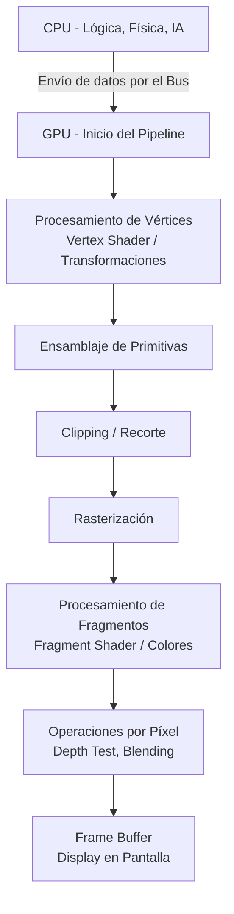

El bus de comunicación por lo general genera cuellos de botella. 
La GPU y la CPU están conectadas por un bus, y siempre quien tiene el control principal es la CPU. 

En la **CPU** nos encargamos de:
- I/O (Entrada/Salida de datos, teclado, ratón)
- Físicas (Cálculo de colisiones, gravedad)
- AI (Inteligencia Artificial de los NPCs)

En la **GPU** se llevan a cabo los procesos visuales: geometría, rasterización, fragmentación y display.

> [!info] Explicación
> - **Cuello de botella en el bus**: Ocurre porque transferir datos (como modelos 3D y texturas) desde la memoria de la placa base (RAM) a la memoria de video (VRAM) es un proceso relativamente lento en comparación con la velocidad a la que procesan la CPU y la GPU.
> - Separar tareas permite que la CPU maneje la lógica del juego mientras la GPU se enfoca exclusivamente en dibujar la pantalla en paralelo.

## Pipeline Gráfico (Flujo de Renderizado)

Una **primitiva** (generalmente un triángulo) se obtiene al conectar vértices. Ya no son solo puntos aislados, sino formas geométricas definidas por coordenadas. 

El proceso de dividir esa primitiva (triángulo) en pequeños espacios o píxeles potenciales se llama **rasterización** (rastering). En este punto, los fragmentos generados son espacios espaciales que aún no tienen un color definido.

Un algoritmo de renderizado (como el fragment shader) va a llenar esos fragmentos calculando sus colores finales. 

Ahora que se tiene la información de los píxeles, se muestra la imagen en la pantalla (Display).

## Notas relacionadas
- [[OpenGl]]
- [[pixeles]]
- [[open gl]]

## Transformaciones (Transformers)
Se pueden realizar operaciones de transformación matemática sobre las coordenadas para alterar la geometría: escalar (agrandar/achicar), trasladar (mover) o rotar.

> [!info] Explicación
> Las transformaciones se logran multiplicando los vectores de los vértices por matrices matemáticas (matriz de traslación, matriz de rotación, etc.).

## Algoritmo de Clipping (Recorte)
Elimina y descarta los vértices o partes de las primitivas que están fuera del campo de visión de la cámara, mostrando solo la parte visible del ente. Esto ahorra muchísimo procesamiento.

## Proyección
Aplica la perspectiva desde el punto de observación (cámara), haciendo que los objetos lejanos se vean más pequeños, simulando la visión humana (Proyección Perspectiva) o manteniéndolos del mismo tamaño (Proyección Ortográfica).

## Rasterización (Rastering)
Convierte las formas vectoriales continuas en fragmentos discretos (cuadrículas de píxeles) listos para ser coloreados.

## Modos de la API (Librería)
### Immediate Mode (Modo Inmediato)
Es el enfoque más antiguo, muy apegado a la ejecución directa. 
No almacena los gráficos en la memoria de la GPU permanentemente. Procesas la escena, se dibuja, y la información se descarta en cada frame.

### Retained Mode (Modo Retenido)
Es un enfoque de más alto nivel. 
La API gestiona la memoria y guarda los modelos en la GPU. Solo se le envían los cambios o actualizaciones con respecto a la escena actual. Aunque gestionarlo tiene un costo, suele ser mucho más rápido para escenas complejas porque evita enviar los mismos datos por el bus en cada frame.

> [!info] Explicación
> OpenGL moderno fomenta el uso de VBOs (Vertex Buffer Objects), lo cual es similar a la filosofía retenida: subes la geometría a la memoria de video una sola vez, eliminando el cuello de botella del bus.

Con el sistema de píxeles, se mapea la pantalla a un plano cartesiano. 
La zona visible (Normalized Device Coordinates o NDC) está delimitada en el rango de **-1 a +1** en todos sus ejes (X, Y, Z). Todo lo que esté fuera de este cubo no se dibujará.

### Nomenclatura de funciones: `glVertex3fv`
Ejemplo del formato de nombramiento en OpenGL clásico:
- **`gl`**: Prefijo de la librería (OpenGL).
- **`Vertex`**: Nombre de la función o acción.
- **`3`**: Número de dimensiones o componentes (X, Y, Z).
- **`f`**: Tipo de dato usado:
  - `f`: float 
  - `d`: double 
  - `b`: boolean
  - `i`: integer
- **`v`**: Indica que recibe un puntero (vector/array): 
  - Lee un bloque continuo de memoria. La gran ventaja es que permite cargar todos los datos geométricos de golpe desde una dirección de inicio en lugar de pasar vértice por vértice.
