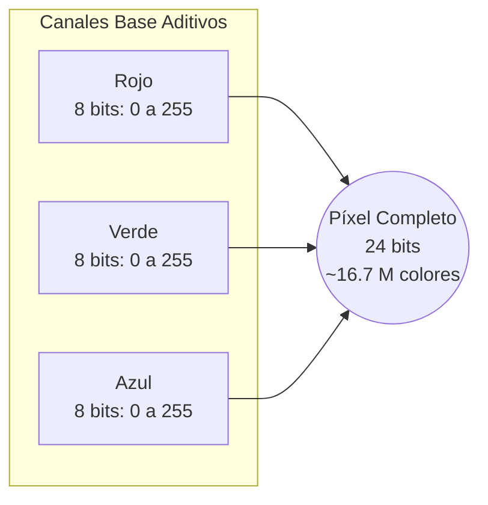

Cada pantalla contiene píxeles, los cuales representan una intensidad y color en coordenadas físicas `I(x,y)`. El valor depende directamente de estas coordenadas 2D.

Para obtener el valor de la función `I(x,y)`, se presentan dos casos:
* Se puede calcular o representar de forma puramente matemática (como en el renderizado 3D por computadora).
* Es inviable calcularla matemáticamente (como en el mundo real), por lo que debemos buscar una manera indirecta de tomar una muestra o captura, por ejemplo, usando el sensor de una cámara digital.

> [!info] Explicación
> Un píxel (Picture Element) es la unidad mínima de información gráfica que se puede mostrar en una pantalla. La pantalla es esencialmente una cuadrícula gigante de píxeles.

La **Función Plenóptica** es un modelo teórico de 7 dimensiones que describe todo el flujo de luz en un entorno. Depende de:
- La posición tridimensional del observador `(x, y, z)`
- La orientación o dirección de la mirada en dos sentidos (ángulos esféricos)
- El tiempo (para capturar movimiento)
- La longitud de onda (que percibimos como color)

El proceso de **rendering** (renderizado) es esencialmente evaluar esta luz y proyectarla para devolvernos una imagen plana en 2D.

El modelo de color base es el RGB (Red, Green, Blue). Generalmente se usan **8 bits** de memoria para representar la intensidad de cada canal de color (rojo, verde y azul). 
Por lo tanto, un píxel completo se representa usando **24 bits** (8 bits × 3 colores).

> [!info] Explicación
> - Con 8 bits, cada canal puede tener $2^8 = 256$ valores diferentes.
> - Los valores pueden representarse en enteros desde **0 hasta 255**, o como valores de punto flotante normalizados entre **0.0 y 1.0**.
> - En total, con 24 bits se pueden representar unos 16.7 millones de colores diferentes ($256 \times 256 \times 256$).

El sistema RGB es un modelo de colores **aditivos**: se basan en la emisión de luz. Sumar los tres colores al máximo de intensidad (255, 255, 255) produce el color blanco, mientras que la ausencia total de luz (0, 0, 0) produce el negro.

## Notas relacionadas
- [[OpenGl]]
- [[pipeline grafico]]
