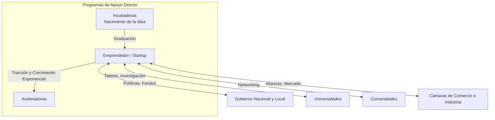

El **ecosistema de emprendimiento** es el entorno y la red de interacción entre múltiples actores e instituciones que facilitan, fomentan o financian el desarrollo de nuevos emprendimientos.

Los principales actores que interactúan en este ecosistema son:
- **El emprendedor:** El motor central del ecosistema, quien aporta la idea y la ejecución.
- **El gobierno nacional:** Define políticas públicas, leyes y fondos de financiamiento.
- **Gobiernos seccionales (municipios, prefecturas):** Brindan apoyo local, permisos, incentivos y espacios de trabajo (*coworking*).
- **Universidades e instituciones académicas:** Aportan investigación, desarrollo de talento, innovación técnica y programas de vinculación.
- **Comunidades:** Grupos de apoyo, redes de contactos (*networking*) y asociaciones de la sociedad civil.
- **Cámaras de comercio e industria:** Facilitan alianzas corporativas y ayudan a abrir mercados formales.
- **Incubadoras de empresas:** Organizaciones diseñadas para ayudar a que una empresa en etapa inicial (creación) crezca. Actúan cuando apenas existe la idea de negocio, cuando hay un equipo buscando qué emprender, o cuando una empresa recién nacida enfrenta problemas estructurales.
- **Startups:** Son empresas emergentes (frecuentemente las beneficiarias del ecosistema) que se caracterizan por tener un alto componente tecnológico, requerir altas inversiones de capital de riesgo y buscar un crecimiento exponencial rápido.
- **Aceleradoras:** Son programas estructurados para ayudar a empresas que ya tienen tracción en el mercado. A diferencia de las incubadoras, para entrar a una aceleradora el emprendimiento debe haber estado operando por un tiempo (usualmente más de 1 año). Su objetivo principal es multiplicar e incrementar radicalmente los ingresos en poco tiempo.

> [!info] Explicación
> **¿Incubadora vs. Aceleradora?** Piensa en la vida humana: Una incubadora es el "área de maternidad" donde se cuida a la idea recién nacida o prematura para que sobreviva a los primeros meses críticos. La aceleradora es la "universidad de élite", que toma a un adulto joven sano y le da herramientas intensivas y conexiones de alto nivel para volverlo exitoso rápidamente.

## Notas relacionadas
- [[emprendimiento]]
- [[producto minimo viable]]
- [[proyectos]]
- [[design thinking]]
