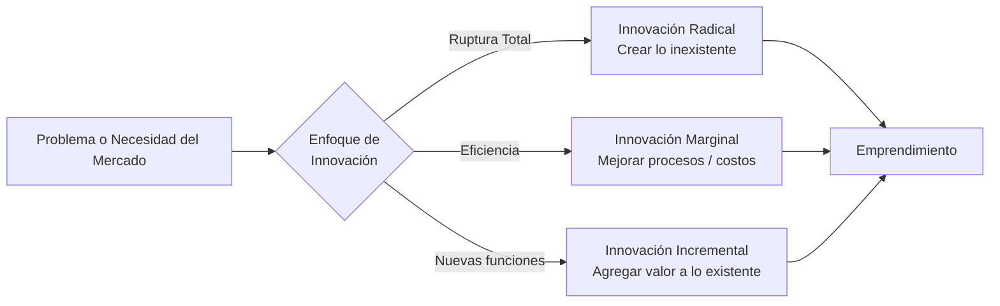

**Emprender** es el proceso de crear y estructurar una idea para un nuevo negocio que esté fundamentalmente enfocado en la innovación. Toda idea de emprendimiento tiene que estar diseñada para solucionar un problema real o cubrir una necesidad específica del mercado.

Para que un negocio sea considerado un verdadero emprendimiento (especialmente en el contexto moderno), tiene que estar orientado a la innovación. Esto implica generar un valor agregado claro, lo cual se puede lograr a través de dos vías principales:
1. Crear algo que hasta el día de hoy no existe.
2. Mejorar o modificar significativamente algo que ya existe.

> [!info] Explicación
> **Emprendimiento vs Negocio Tradicional:** Abrir una panadería igual a todas las demás es un negocio tradicional. Abrir una empresa que desarrolla levadura de crecimiento acelerado con biotecnología es un emprendimiento, porque ataca un problema con un enfoque radicalmente nuevo y escalable.

## Tipos de Innovación

- **Innovación Radical:** Consiste en crear algo completamente nuevo que no existía antes, rompiendo paradigmas (crear algo nuevo que no se puede comparar con nada existente en el mercado). *Ejemplo: La creación del primer automóvil frente a las carretas de caballos.*
- **Innovación Marginal:** Consiste en modificar algo que ya existe, mejorando procesos para ganar eficiencia, ahorrar tiempo o reducir costos de producción. *Ejemplo: Cambiar la logística de una fábrica para que ensamble productos un 5% más rápido.*
- **Innovación Incremental:** Consiste en agregar funciones, características o actividades nuevas a un producto que ya funciona para hacerlo más atractivo o útil. *Ejemplo: Lanzar una nueva versión de un teléfono con una mejor cámara.*

## Notas relacionadas
- [[ecosistema de emprendimiento]]
- [[producto minimo viable]]
- [[design thinking]]
- [[proyectos]]
