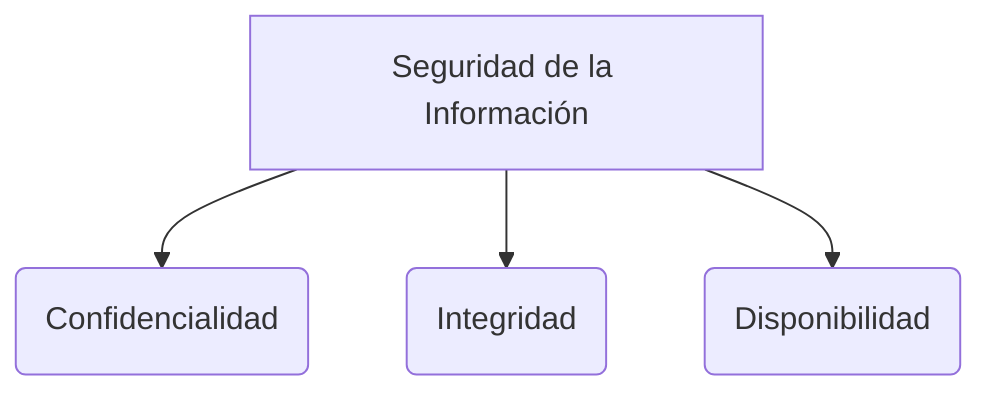

# Análisis de riesgos

El **Análisis de riesgos** es el proceso fundamental de identificar, evaluar y mitigar las vulnerabilidades y amenazas que podrían afectar negativamente a los activos de información de una organización. Es el núcleo de cualquier **[[SGSI]]** (Sistema de Gestión de seguridad de la Información).

> [!info] Explicación: Definición de Riesgo
> Matemáticamente en seguridad, `Riesgo = Probabilidad x Impacto`. El riesgo existe cuando una **Amenaza** se aprovecha de una **Vulnerabilidad** en un **Activo**.

## Metodologías Comunes
1. **MAGERIT:** Metodología de Análisis y Gestión de Riesgos de los Sistemas de Información. Muy popular en entornos gubernamentales y corporativos en España y Latinoamérica. Se centra en el valor del activo.
2. **OCTAVE:** Creada por el CERT. Es un enfoque de planificación estratégica de seguridad de la información basado en el riesgo.
3. **ISO 27005:** Es el estándar internacional que describe las directrices para la gestión de riesgos de seguridad de la información, complementando a la **[[ISO 27001]]**.

## Matriz de Riesgo
Es una herramienta visual que permite priorizar los riesgos. Mapea la probabilidad de que un riesgo ocurra frente al impacto que tendría.
- **Riesgos Altos (Rojo):** Alta probabilidad y alto impacto. Requieren atención inmediata.
- **Riesgos Medios (Amarillo):** Requieren monitoreo y controles proactivos.
- **Riesgos Bajos (Verde):** Baja probabilidad y bajo impacto. A menudo pueden simplemente ser "aceptados".

## Tratamiento del Riesgo
Una vez identificados, la gerencia debe decidir cómo tratar cada riesgo:
1. **Mitigar:** Implementar controles para reducir el impacto o la probabilidad.
2. **Evitar:** Cambiar los planes para evadir el riesgo por completo.
3. **Transferir:** Pagar a un tercero para que asuma el impacto (ej. un seguro de ciberseguridad).
4. **Aceptar:** Reconocer el riesgo pero no tomar medidas, generalmente porque el costo de mitigación supera al valor del activo.

## Notas relacionadas
- [[seguridad informatica]]
- [[SGSI]]
- [[Plan de continuidad del negocio]]

## Diagrama de Referencia

