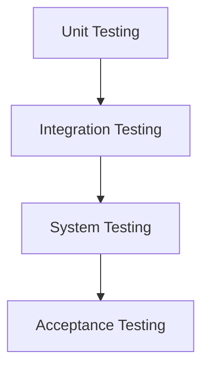

# Auditoría de seguridad

Una **Auditoría de seguridad** es una evaluación sistemática de la seguridad del sistema de información de una organización, midiendo qué tan bien se ajusta a un conjunto establecido de criterios o normativas (como **[[ISO 27001]]** o **[[controles administrativos|PCI-DSS]]**).

> [!info] Explicación: Propósito de la Auditoría
> El objetivo principal no es castigar, sino verificar el nivel de cumplimiento y encontrar brechas de seguridad antes de que sean explotadas por un atacante real. Se busca el alineamiento de la infraestructura técnica con las políticas del negocio.

## Tipos de Auditoría
1. **Auditoría de cumplimiento:** Verifica que la empresa cumple con las leyes o regulaciones aplicables.
2. **Auditoría técnica / Pentesting (Prueba de penetración):** Simula un ciberataque en la red, aplicaciones o dispositivos para encontrar vulnerabilidades explotables.
   - *Caja Blanca:* El auditor tiene información completa sobre la red.
   - *Caja Negra:* El auditor no tiene información (simula a un atacante externo).
   - *Caja Gris:* Una combinación de ambas (ej. un empleado con acceso limitado).
3. **Auditoría física:** Revisa controles de acceso a las instalaciones físicas (cámaras, guardias, cerraduras biométricas).

## Fases de una Auditoría
1. **Planificación y preparación:** Definir el alcance, los objetivos y las restricciones de la auditoría.
2. **Ejecución y recolección de información:** Utilizando herramientas técnicas y entrevistas al personal.
3. **Análisis:** Evaluar los hallazgos en contra de los estándares requeridos.
4. **Reporte:** Entregar un documento con los hallazgos (vulnerabilidades) y recomendaciones de remediación.

## Herramientas Comunes
- **Nmap:** Escáner de redes y puertos para descubrimiento de dispositivos.
- **Nessus / OpenVAS:** Escáneres de vulnerabilidades automatizados.
- **Wireshark:** Analizador de tráfico de red (sniffer).
- **Metasploit:** Framework de explotación usado en pentesting.

## Notas relacionadas
- [[seguridad informatica]]
- [[SGSI]]
- [[controles administrativos]]

## Diagrama de Referencia

