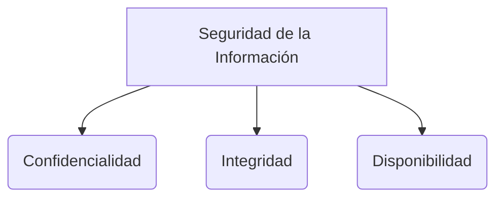

# Plan de continuidad del negocio

Un **Plan de Continuidad del Negocio (BCP - Business Continuity Plan)** es un documento estratégico que detalla cómo una organización mantendrá sus funciones esenciales durante e inmediatamente después de un desastre o incidente grave.

> [!info] Explicación: ¿Por qué es importante?
> La ciberseguridad no solo trata de prevenir ataques. Cuando las prevenciones fallan (ej. un ataque de ransomware masivo o un incendio en el centro de datos), el BCP entra en acción para garantizar la **Disponibilidad** de los servicios críticos para que la empresa no quiebre.

## Componentes Clave

### DRP (Disaster Recovery Plan)
El Plan de Recuperación ante Desastres es un subconjunto del BCP enfocado exclusivamente en la recuperación de la infraestructura tecnológica (TI) y las telecomunicaciones después de un evento disruptivo.

### Métricas de Tiempo Críticas
Al diseñar un BCP o DRP, se deben definir dos métricas de tiempo acordadas por la gerencia:

1. **RTO (Recovery Time Objective - Objetivo de Tiempo de Recuperación):**
   - El tiempo máximo tolerable que un sistema puede estar inactivo antes de causar daños inaceptables al negocio.
   - Ejemplo: "El sistema de cobros debe estar operativo en menos de 4 horas tras una caída".

2. **RPO (Recovery Point Objective - Objetivo de Punto de Recuperación):**
   - La cantidad máxima tolerable de pérdida de datos medida en tiempo. Indica la frecuencia con la que se deben hacer copias de seguridad.
   - Ejemplo: "Podemos tolerar perder como máximo 15 minutos de transacciones". Esto significa que se necesitan backups casi en tiempo real.

## Estrategias de Respaldo
- **Hot Site (Sitio Caliente):** Una instalación de respaldo totalmente equipada y sincronizada en tiempo real. Recuperación casi instantánea, pero muy costosa.
- **Warm Site (Sitio Tibio):** Instalación con hardware, pero los datos y el software deben ser restaurados. Recuperación en días.
- **Cold Site (Sitio Frío):** Solo el espacio físico y la electricidad/internet. Se debe traer el hardware y restaurar datos. Recuperación en semanas.

## Notas relacionadas
- [[seguridad informatica]]
- [[Análisis de riesgos]]
- [[Triada CIA]]

## Diagrama de Referencia

