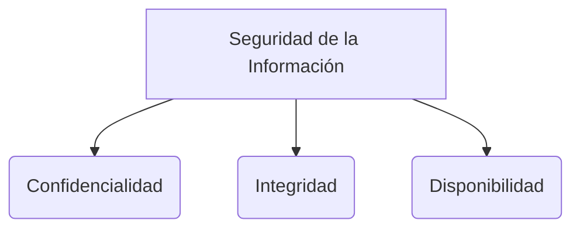

# Triada CIA

La **Triada CIA** es el modelo base de la [[seguridad informatica]]. CIA significa **Confidencialidad, Integridad y Disponibilidad** (Availability). 

Todo programa de seguridad de la información está diseñado para garantizar que se cumplan al menos estos tres principios fundamentales.

> [!info] Explicación: Los pilares de la seguridad
> Cualquier ataque cibernético busca comprometer al menos uno de estos tres pilares fundamentales. Proteger un sistema significa equilibrar estas tres necesidades.

### 1. Confidencialidad
Asegura que la información sensible solo pueda ser accedida por las personas o sistemas autorizados para verla.
- **Amenazas:** Interceptación de datos, robos de contraseñas, espionaje corporativo.
- **Controles típicos:** Cifrado de datos (en reposo y en tránsito), fuerte **[[control de acceso]]**, contraseñas seguras y biometría.

### 2. Integridad
Garantiza que la información y los sistemas se mantienen exactos, completos y sin alteraciones no autorizadas.
- **Amenazas:** Alteración de registros financieros, modificación de código malicioso.
- **Controles típicos:** **[[Funciones hash]]** para verificar la inmutabilidad de un archivo, firmas digitales, permisos de archivo estrictos y registros de auditoría.

### 3. Disponibilidad
Asegura que los sistemas, redes y datos estén accesibles y funcionando correctamente cuando los usuarios autorizados los necesiten.
- **Amenazas:** Ataques DDoS, ransomware, cortes de energía, fallos de hardware.
- **Controles típicos:** Servidores redundantes, copias de seguridad continuas, planes de respuesta a incidentes y protección contra denegación de servicio.

## Notas relacionadas
- [[seguridad informatica]]
- [[fundamentos de seguridad]]
- [[Plan de continuidad del negocio]]

## Diagrama de Referencia

