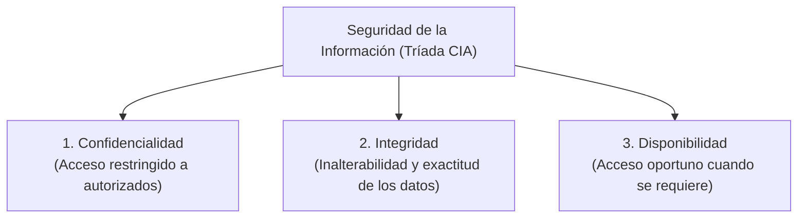
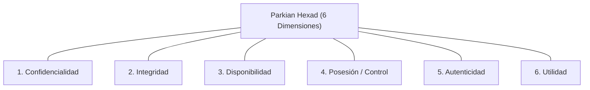
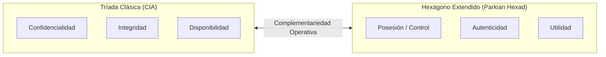

# Tríada CIA y el Modelo Extendido Parkian Hexad

> [!abstract] Definición Fundamental
> La **Tríada CIA** (*Confidentiality, Integrity, Availability*) constituye el modelo conceptual clásico y el estándar de facto sobre el cual se diseñan, implementan y evalúan todas las políticas, controles y arquitecturas de **[[seguridad informatica]]** y el **[[sgsi]]**. Cualquier incidente de seguridad representa la vulneración directa o indirecta de al menos uno de estos pilares.

Sin embargo, para subsanar ciertas omisiones semánticas y operativas de la tríada tradicional, la ingeniería de ciberseguridad moderna adopta el modelo extendido del **Hexágono de Parker (*Parkian Hexad*)**, propuesto por Donn B. Parker en 1998, que complementa la tríada con tres atributos indispensables: **Posesión/Control**, **Autenticidad** y **Utilidad**.

---

## 1. Los Tres Pilares Clásicos de la Tríada CIA

```mermaid
flowchart TD
    CIA["Seguridad de la Información (Tríada CIA)"]
    CIA --> C["1. Confidencialidad<br/>(Acceso restringido a autorizados)"]
    CIA --> I["2. Integridad<br/>(Inalterabilidad y exactitud de los datos)"]
    CIA --> A["3. Disponibilidad<br/>(Acceso oportuno cuando se requiere)"]
```

### A. Confidencialidad (*Confidentiality*)
- **Definición Formal**: Propiedad que garantiza que la información no se pone a disposición ni se revela a individuos, entidades o procesos no autorizados.
- **Mecanismos Técnicos de Protección**:
  - *Cifrado en Tránsito (*Data in Transit*)*: Protocolos criptográficos TLS 1.3, IPsec (IKEv2), SSHv2, HTTPS para blindar los canales de red frente a escuchas ilícitas (*eavesdropping*).
  - *Cifrado en Reposo (*Data at Rest*)*: Algoritmos de cifrado simétrico robusto como AES-256 (GCM/CBC), cifrado de disco completo (BitLocker, LUKS, FileVault) y Transparent Data Encryption (TDE) en bases de datos relacionales.
  - *Cifrado en Uso (*Data in Use*)*: Computación confidencial (*Confidential Computing*) mediante enclaves seguros a nivel de procesador (Intel SGX, AMD SEV) que mantienen los datos cifrados incluso en la memoria RAM durante su procesamiento.
  - *Modelos de Control de Acceso Riguroso*: Control de acceso basado en roles (RBAC), atributos (ABAC), y control obligatorio (MAC), complementados con autenticación multifactorial (MFA).
- **Amenazas e Incidentes Típicos**:
  - Exfiltración masiva de datos en bases de datos no autenticadas (Data Breach de Equifax o Capital One).
  - Intercepción pasiva de tráfico de red no cifrado (*Man-in-the-Middle* o *Sniffing* con Wireshark).
  - Fuga de información por empleados deshonestos (*Insider Threats*).

---

### B. Integridad (*Integrity*)
- **Definición Formal**: Garantía de exactitud, completitud y validez de la información y sus métodos de procesamiento, protegiéndola contra modificaciones, inserciones, supresiones o corrupciones no autorizadas o accidentales.
- **Mecanismos Técnicos de Protección**:
  - *Funciones Hash Criptográficas*: Algoritmos de un solo sentido resistentes a colisiones (SHA-256, SHA-512, SHA-3) para generar huellas digitales inmutables de archivos y transmisiones.
  - *Códigos de Autenticación de Mensajes (MAC / HMAC)*: Concatenación del mensaje con una clave secreta para verificar tanto la integridad como el origen.
  - *Firmas Digitales Asimétricas*: Criptografía de clave pública (RSA, ECDSA, Ed25519) que asegura no solo la inmutabilidad de la información, sino el no repudio del firmante.
  - *Monitoreo de Integridad de Archivos (FIM - File Integrity Monitoring)*: Herramientas como Wazuh, OSSEC o Tripwire que monitorean en tiempo real hashes de binarios del sistema operativo y archivos de configuración crítica para alertar ante alteraciones maliciosas.
  - *Transacciones Atómicas y Libros Mayores Inmutables*: Propiedades ACID en bases de datos y estructuras criptográficas de tipo Blockchain / Merkle Trees.
- **Amenazas e Incidentes Típicos**:
  - Inyección de código malicioso en la cadena de suministro de software (*Supply Chain Attack* como el caso SolarWinds Sunburst, donde se adulteró el código fuente legítimo).
  - Alteración no autorizada de saldos o transacciones bancarias mediante ataques de inyección SQL.
  - Defacement (modificación de la interfaz visual de una página web oficial).

---

### C. Disponibilidad (*Availability*)
- **Definición Formal**: Propiedad que asegura que los sistemas, redes, servicios y datos están accesibles y utilizables en el momento y forma requeridos por los usuarios o procesos autorizados.
- **Mecanismos Técnicos de Protección**:
  - *Alta Disponibilidad y Clustering (HA)*: Arquitecturas multi-nodo con redundancia activa-activa o activa-pasiva y conmutación por error automática (*failover*).
  - *Balanceadores de Carga*: Distribución inteligente de tráfico mediante herramientas como HAProxy, NGINX, AWS ALB o F5 BIG-IP.
  - *Tolerancia a Fallos en Almacenamiento*: Arreglos de discos redundantes (RAID 1, 5, 6, 10) y almacenamiento distribuido (Ceph, SAN con multipath).
  - *Sistemas de Respaldo Inmutables*: Estrategia de copias de seguridad basada en la regla **3-2-1-1-0** (3 copias de los datos, 2 medios diferentes, 1 copia fuera de sitio, 1 copia inmutable/offline, 0 errores en pruebas de restauración).
  - *Planes de Continuidad y Recuperación*: [[Plan de continuidad del negocio|BCP (Business Continuity Plan)]] y DRP (*Disaster Recovery Plan*), métricas de **RTO (*Recovery Time Objective*)** y **RPO (*Recovery Point Objective*)**.
  - *Mitigación de Ataques DDoS*: Redes de distribución de contenidos (CDN) y centros de mitigación/lavado de tráfico (*scrubbing centers* como Cloudflare, Akamai).
  - *Redundancia de Infraestructura Física*: Fuentes de alimentación ininterrumpida (UPS), generadores diésel de emergencia, enlaces de fibra óptica multi-operador y climatización en centros de datos.
- **Amenazas e Incidentes Típicos**:
  - Ataques masivos de denegación de servicio distribuida (DDoS mediante botnets IoT como Mirai).
  - Ataques de Ransomware (como WannaCry o LockBit) que cifran los sistemas productivos impidiendo el acceso a los datos.
  - Cortes de suministro eléctrico en datacenters o fallas catastróficas de hardware sin contratos de soporte 24/7.

---

## 2. El Modelo Extendido: Hexágono de Parker (*Parkian Hexad*)

Donn B. Parker demostró que la Tríada CIA es insuficiente para describir con exactitud múltiples incidentes del mundo real. El **Parkian Hexad** añade tres dimensiones atómicas complementarias:

```mermaid
flowchart TD
    PH["Parkian Hexad (6 Dimensiones)"]
    PH --- C["1. Confidencialidad"]
    PH --- I["2. Integridad"]
    PH --- A["3. Disponibilidad"]
    PH --- P["4. Posesión / Control"]
    PH --- AU["5. Autenticidad"]
    PH --- U["6. Utilidad"]
```

### 1. Posesión o Control (*Possession / Control*)
- **Concepto**: Se refiere a la tenencia física o lógica y al control sobre el activo o medio de almacenamiento que contiene los datos, con total independencia de si la información ha sido leída o descifrada.
- **El Dilema CIA vs. Parkian**:
  - *Escenario*: Un atacante roba una computadora portátil corporativa cuyo disco rígido está íntegramente cifrado con AES-256 (BitLocker).
  - *Bajo la Tríada CIA*: La confidencialidad no se ha roto (el ladrón no tiene la clave ni puede leer los datos) y la disponibilidad se mantiene si existen respaldos en la nube. Teóricamente "no hubo pérdida de confidencialidad".
  - *Bajo el Hexágono de Parker*: Se identifica con precisión la violación del pilar de **Posesión/Control**. La entidad ha perdido la posesión física del hardware y el control exclusivo sobre los datos cifrados, lo cual abre el riesgo a ataques de fuerza bruta offline a largo plazo.

### 2. Autenticidad (*Authenticity*)
- **Concepto**: Atributo que garantiza que una entidad, dato o comunicación proviene genuinamente de quien afirma provenir, validando la legitimidad de la fuente y permitiendo el **no repudio**.
- **El Dilema CIA vs. Parkian**:
  - *Escenario*: Un empleado recibe un correo electrónico supuestamente enviado por el Director Financiero (con cabeceras suplantadas mediante email spoofing) ordenando pagar una factura falsa.
  - *Bajo la Tríada CIA*: El correo llegó íntegro a través de la red (no hubo alteración en tránsito, por tanto la integridad técnica de los paquetes está intacta) y está disponible. Sin embargo, el contenido es una falsificación de origen.
  - *Bajo el Hexágono de Parker*: Se vulneró flagrantemente el pilar de **Autenticidad**. Se previene mediante protocolos criptográficos de identidad de emisor como SPF, DKIM, DMARC y firmas digitales S/MIME.

### 3. Utilidad (*Utility*)
- **Concepto**: La usabilidad, utilidad práctica o valor funcional de la información en el formato en el que se encuentra disponible.
- **El Dilema CIA vs. Parkian**:
  - *Escenario A*: Un administrador cifra correctamente una base de datos crítica con una clave de 512 bits, pero pierde de manera definitiva la clave privada de descifrado.
    - *Análisis*: Los datos están disponibles en el disco (el archivo `.db` está accesible) y su integridad es perfecta (no ha cambiado ningún bit). Sin embargo, su **Utilidad** es nula: nadie puede interpretarlos ni procesarlos.
  - *Escenario B*: Un analista financiero exporta un informe contable de 100 páginas convirtiendo accidentalmente todas las cifras a monedas desactualizadas o a un formato propietario binario que ya ningún software puede abrir. La disponibilidad e integridad son plenas, pero la utilidad ha sido destruida.

---

## 3. Matriz Comparativa: Dimensiones, Amenazas y Mecanismos Defensivos

| Dimensión | Enfoque Principal | Amenaza Representativa | Mecanismo de Control / Salvaguarda |
| :--- | :--- | :--- | :--- |
| **Confidencialidad** (CIA) | Restricción de lectura y divulgación | Sniffing de red, robo de credenciales | TLS 1.3, AES-256, RBAC, DLP, MFA |
| **Integridad** (CIA) | Inalterabilidad y exactitud | Inyección SQL, modificación de binarios | Funciones Hash (SHA-256), HMAC, FIM (Wazuh) |
| **Disponibilidad** (CIA) | Acceso y operatividad continua | Ataques DDoS, ransomware, cortes de energía | Clustering activo-activo, RAID, BCP/DRP, CDN |
| **Posesión / Control** (Parker) | Custodia física y lógica del activo | Robo de laptops o cintas de backup | Cifrado de disco, rastreo MDM, guardias físicos |
| **Autenticidad** (Parker) | Validación de identidad y no repudio | Phishing de suplantación, CEO Fraud (BEC) | Certificados X.509, DMARC, firmas digitales |
| **Utilidad** (Parker) | Usabilidad y legibilidad funcional | Pérdida de claves de descifrado, formatos corruptos | Gestión de claves (KMS/HSM), conversión a formatos abiertos |

---

## 4. Diagrama Comparativo y de Arquitectura

```mermaid
flowchart LR
    subgraph TR["Tríada Clásica (CIA)"]
        direction TB
        C["Confidencialidad"]
        I["Integridad"]
        A["Disponibilidad"]
    end

    subgraph HEX["Hexágono Extendido (Parkian Hexad)"]
        direction TB
        P["Posesión / Control"]
        AU["Autenticidad"]
        U["Utilidad"]
    end

    TR <-->|Complementariedad Operativa| HEX
```

---

## 5. Notas Relacionadas y Enlaces del Vault
- [[seguridad informatica]] - Fundamentos generales de seguridad y arquitectura de defensas.
- [[fundamentos de seguridad]] - Principios esenciales de seguridad física y lógica.
- [[Plan de continuidad del negocio]] - Estrategias de resiliencia orientadas a disponibilidad (RTO/RPO).
- [[sgsi]] - Sistema de Gestión de Seguridad de la Información (ISO/IEC 27001).
- [[egsi]] - Estrategia de Gobierno de Seguridad de la Información.
- [[linea base]] - Líneas base técnicas para salvaguardar la integridad y confidencialidad.
- [[metodologias de analisis y evaluacion de riesgo]] - Evaluación del impacto sobre las dimensiones CIA/DICAT.
- [[control de acceso]] - Mecanismos de autenticación y autorización para confidencialidad e integridad.
