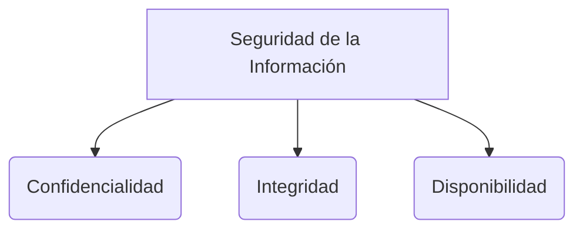

* es la restriccion selectiva del acceso de un bien o un sistema o recurso de red 
* Protege la información del bien determinando quien puede acceder a que 
* Usa identificacion ,autenticación y autorización para restringir o garantizar acceso a un bien o recurso especifico 
![[Pasted image 20241014062614.png]]
es un método por el cual se limita el acceso a los recursos de la organización para los usuarios un aspecto crucial de implementar control de acceso es para mantener integridad confidencialidad y disponibilidad de la información 

> [!info] Explicación: AAA (Identificación, Autenticación, Autorización)
> El control de acceso se basa en tres pilares fundamentales:
> - **Identificación:** Quién eres (ej. ingresar un nombre de usuario).
> - **Autenticación:** Demostrar que eres quien dices ser (ej. ingresar una contraseña o biometría).
> - **Autorización:** Determinar a qué recursos tienes permiso de acceder después de autenticarte.
> Esto ayuda a garantizar la **Triada CIA**: Confidencialidad, Integridad y Disponibilidad.

## pasos
1) El usuario provee sus credenciales mientras se inicia sesión al sistema 
2) El sistema valida el usuario con la base de datos en base de las credenciales proporcionadas
3) Cuando la identificación es exitosa el sistema da al usuario acceso al sistema
4) El sistema luego permite al usuario realizar solamente operaciones a las cuales solo esta destinado hacer 

## terminologías
- Sujeto 
se refiere a un usuario en particular o processo que quiere acceder al recurso
-  objeto
se refiere a un recurso especifico que el usuario quiere el acceso como un archivo o una pieza de hardware 
- Reference monitor
chequea si la regla de control de acceso para restriciones especificas
- Operation
representa la accion tomanda por un sujeto en un objeto 
![[Pasted image 20241014063559.png]]

> [!info] Explicación: Componentes del Control de Acceso
> - **Sujeto (Subject):** La entidad activa (usuario, programa) que solicita acceso a un recurso.
> - **Objeto (Object):** La entidad pasiva (archivo, base de datos, memoria) que contiene la información o recurso.
> - **Reference Monitor:** Un concepto de diseño de seguridad; es una máquina o software abstracto que siempre es invocado para verificar todos los intentos de acceso de los sujetos a los objetos.

## principios
### separation of duties (SoD)
- Implica un desglose del proceso de autorización en varios pasos.
- En cada paso se asignan diferentes privilegios a los sujetos individuales que solicitan un recurso.
- Esto garantiza que ningún individuo tenga los derechos de autorización para realizar todas las funciones y, al mismo tiempo, niega el acceso a todos los objetos a un solo individuo.

> [!info] Explicación: Separation of Duties (SoD)
> El principio de **Separación de Funciones** es clave para prevenir fraudes. Por ejemplo, la persona que aprueba un pago no debería ser la misma que lo emite o la que concilia las cuentas. Si se requiere cometer fraude, habría que involucrar la colusión de múltiples personas.

### need to know
segun el principio de control de acceso, se proporciona acceso unicamente a la información que se requiere para realizar una tarea especifica 

### principle of least privilege (POLP)
 - El principio del mínimo privilegio amplía el principio de necesidad de saber para brindar acceso a un sistema
 - POLP cree en brindar a los empleados un acceso que se ajuste a la necesidad de saber, es decir, ni más ni menos
- Ayuda a una organización al protegerla de comportamientos maliciosos, logrando una mejor estabilidad y seguridad del sistema

> [!info] Explicación: Need to Know vs Least Privilege
> Aunque suenan similares, tienen una ligera diferencia:
> - **Need to Know (Necesidad de Saber):** Se aplica generalmente a los datos/información. Incluso si tienes un nivel de autorización alto, solo se te da acceso a datos específicos si tu tarea actual lo requiere.
> - **Least Privilege (Mínimo Privilegio):** Se aplica a los derechos y permisos del sistema. Solo te dan los permisos técnicos (leer, escribir, ejecutar) estrictamente necesarios para tu trabajo.

## modelos de control de acceso
son estandares los cuales proveen un prederminado framework para implementar el nivel necesario de control de acceso.

### mandatory access control (mac)
- Solo el administrador o el owner tiene los derechos para asignar privilegios 
- No permite que el usuario final decida quien accede a la información 

> [!info] Explicación: MAC
> Es el modelo más estricto, comúnmente usado en entornos militares. Se basa en etiquetas de seguridad (como "Secreto", "Alto Secreto") asignadas a los objetos y autorizaciones ("Clearance") asignadas a los sujetos. El sistema operativo decide si permite el acceso de manera mandatoria y el propietario no puede cambiar esto.

### discretionary access control (dac)
- El usuario final tiene acceso completo a la información que posee 

> [!info] Explicación: DAC
> El creador de un archivo es el "propietario" y tiene control discrecional absoluto. Puede otorgar permisos a otros usuarios a voluntad. Es común en sistemas operativos como Windows o Linux para usuarios normales.

### role-based access control (rbac)
- Permiso para asignar basado en roles 

> [!info] Explicación: RBAC
> El acceso se basa en el puesto o rol de la persona en la empresa (ej. Gerente, Cajero, Auditor). Los permisos se asignan al rol, y el usuario simplemente es agregado al rol. Facilita enormemente la administración en grandes organizaciones.

### rule-based access control (rb-rbac)
* Permisos son asignados para el rol dinamico del usuario basado en un conjunto de reglas definadas del administrador 

> [!info] Explicación: Control basado en Reglas
> Aquí se aplican reglas globales que afectan a todos, independientemente de su rol. Por ejemplo, "nadie puede conectarse al sistema de 10 PM a 6 AM". A menudo se usa en firewalls y routers (ACLs).

## gestion de acceso
autorizacion
autenticacion autorizacion 
## administracion de identidad
repositorio de identidad 
administracion de identidad 

> [!info] Explicación: IAM (Identity and Access Management)
> La **Gestión de Identidades y Accesos (IAM)** es el marco de políticas y tecnologías para garantizar que las personas correctas tengan el acceso adecuado a los recursos tecnológicos. Involucra mantener un repositorio central de usuarios (como Active Directory) y automatizar los permisos a lo largo del ciclo de vida del empleado (cuando ingresa, cambia de puesto, o se retira).

## Notas relacionadas
- [[Acceso]]
- [[seguridad informatica]]
- [[fundamentos de seguridad]]
- [[controles administrativos]]
- [[egsi]]

## Diagrama de Referencia

