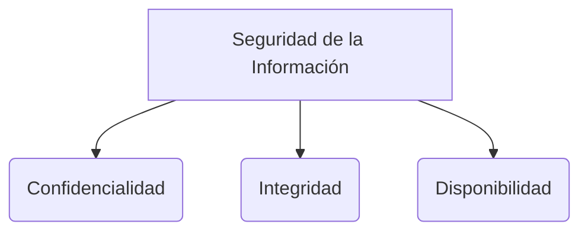

## Payment Card Industry Data Security Standard (PCIDSS)
### Estándar de seguridad de datos PCI: descripción general de alto nivel

* Implementar  medidas de control de acceso sólidas
Restringir el acceso a los datos del titular de la tarjeta según la necesidad de conocerlos 
Asignar una identificación única a cada persona con acceso a la computadora 
Restringir el acceso físico a los datos del titular de la tarjeta
* Monitorizar y probar periódicamente las redes
Realizar un seguimiento y supervisar todos los accesos a los recursos de la red y a los datos de los titulares de tarjetas
Probar periódicamente los sistemas y procesos de seguridad
* Mantener una política de seguridad de la información
Mantener una política que aborde la seguridad de la información para todo el personal

> [!info] Explicación: PCI-DSS y Controles Administrativos
> - **PCI-DSS:** Es un estándar internacional obligatorio para cualquier organización que procese, almacene o transmita datos de tarjetas de crédito. Su objetivo es reducir el fraude relacionado con tarjetas de pago mediante controles estrictos de seguridad.
> - **Controles Administrativos:** Son el pilar humano y organizativo de la seguridad. Se basan en políticas, procedimientos y normativas (en lugar de tecnología pura) para guiar el comportamiento de los empleados. Ejemplos incluyen políticas de contraseñas, acuerdos de confidencialidad y capacitaciones de concientización. En el contexto de PCI, mantener una política formal de seguridad es un control administrativo crucial.

## Notas relacionadas
- [[seguridad]]
- [[SGSI]]
- [[metodologias de analisis y evaluacion de riesgo]]
- [[linea base]]

## Diagrama de Referencia

