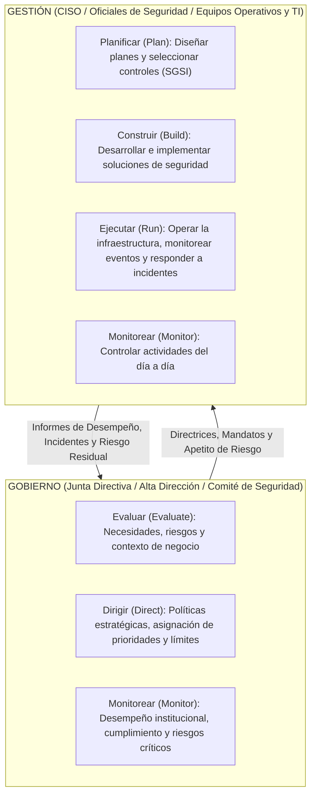
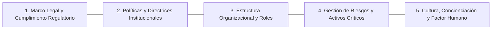

# Estrategia de Gobierno de Seguridad de la Información (EGSI)

> [!abstract] Definición Formal
> La **Estrategia de Gobierno de Seguridad de la Información (EGSI)** comprende el conjunto integral de responsabilidades directivas, marcos normativos, estructuras organizacionales, procesos de toma de decisiones y mecanismos de rendición de cuentas que permiten a la Alta Dirección dirigir, monitorear y evaluar la seguridad de la información, asegurando que los riesgos se mantengan dentro del apetito institucional y que la seguridad actúe como un facilitador directo de los objetivos misionales del negocio.

---

## 1. Gobierno (*Governance*) vs. Gestión (*Management*)

Uno de los axiomas fundamentales de la ingeniería y auditoría de TI es la separación formal entre **Gobierno** y **Gestión**:

- **Gobierno (EDM - Evaluate, Direct, Monitor)**: Determina *hacia dónde va la organización*, fija el nivel de tolerancia al riesgo (apetito de riesgo) y rinde cuentas a los accionistas o al Estado.
- **Gestión (PBRM - Plan, Build, Run, Monitor)**: Es la ejecución operativa y táctica (materializada a través de un [[sgsi]]) para alcanzar los objetivos trazados por el gobierno.

---

## 2. Marco Normativo y Estándares Internacionales

### A. Estándares Globales
1. **ISO/IEC 38500 (Gobernanza de las TI para la organización)**:
   - Establece 6 principios rectores para el gobierno corporativo de la tecnología:
     1. *Responsabilidad*: Asignación explícita de facultades y deberes.
     2. *Estrategia*: TI alineada con las metas organizacionales.
     3. *Adquisición*: Inversiones en TI justificadas por retorno y riesgo.
     4. *Rendimiento*: Eficacia y disponibilidad de los servicios tecnológicos.
     5. *Conformidad*: Adherencia estricta a leyes, estatutos y contratos.
     6. *Comportamiento humano*: Consideración de las conductas y necesidades de las personas.
2. **COBIT (Control Objectives for Information and Related Technologies - ISACA)**:
   - Distingue rigurosamente el dominio de Gobierno (**EDM**: *Evaluate, Direct and Monitor*) de los cuatro dominios de Gestión (**APO**: *Align, Plan and Organize*; **BAI**: *Build, Acquire and Implement*; **DSS**: *Deliver, Service and Support*; **MEA**: *Monitor, Evaluate and Assess*).
   - El objetivo **APO13 (Seguridad Gestionada)** define los requerimientos de gobernanza y gestión de la seguridad de la información.
3. **NIST Cybersecurity Framework (NIST CSF 2.0)**:
   - En su versión 2.0, el NIST incorporó la función central **GOVERN (Gobernar)** en el núcleo del marco, transversal a las funciones operativas tradicionales:
     $$\text{CSF 2.0} = \{\mathbf{GOVERN}, \text{IDENTIFY}, \text{PROTECT}, \text{DETECT}, \text{RESPOND}, \text{RECOVER}\}$$
   - *Govern* articula las expectativas organizacionales, los requisitos legales y las políticas de gestión del riesgo cibernético.

### B. Contexto Nacional Colombiano: Modelo de Gobierno Digital y MinTIC
En Colombia, la EGSI es de carácter mandatorio para todas las entidades del Estado bajo el **Modelo de Gestión de Seguridad y Privacidad de la Información (MSPI)** del **Ministerio de Tecnologías de la Información y las Comunicaciones (MinTIC)**:
- **Marco Legal Rector**:
  - **Decreto 1078 de 2015** (Decreto Único Reglamentario del Sector TIC) y sus actualizaciones sobre la Política de Gobierno Digital.
  - **Ley 1581 de 2012** (Régimen General de Protección de Datos Personales / Habeas Data): Ocupa un lugar neurálgico en la EGSI, obligando al nombramiento del Delegado de Protección de Datos (DPO) y al registro de bases de datos ante la Superintendencia de Industria y Comercio (SIC).
  - **Ley 1273 de 2009** (De la Protección de la Información y de los Datos): Tipificación de delitos informáticos en el Código Penal.
  - **Directiva Presidencial 07 de 2021**: Directrices estratégicas de fortalecimiento de ciberseguridad en infraestructuras del sector público.

---

## 3. Los Cinco Pilares Fundamentales del EGSI

### Pilar 1: Marco Legal, Normativo y Regulatorio
- Mapeo y cumplimiento estricto de leyes de protección de datos (Habeas Data), regulaciones financieras (Superintendencia Financiera - Circular Básica Jurídica 007/052), comercio electrónico y propiedad intelectual.
- Gestión de la responsabilidad civil y penal derivada del mal uso o vulneración de datos corporativos.

### Pilar 2: Políticas y Directrices Institucionales
La arquitectura documental de la gobernanza se estructura de manera piramidal y vinculante:
1. **Política General de Seguridad de la Información**: Documento fundacional aprobado por la Junta Directiva.
2. **Políticas Específicas**: Control de accesos lógicos ([[control de acceso]]), uso aceptable de activos, teletrabajo, gestión de contraseñas, clasificación de la información.
3. **Estándares y [[linea base|Líneas Base]]**: Requerimientos técnicos mínimos obligatorios (ej. estándares de cifrado, hardening).
4. **Procedimientos e Instructivos**: Pasos detallados para la ejecución de procesos (ej. gestión de cambios, respuesta a incidentes).

### Pilar 3: Estructura Organizacional y Roles Clave
El gobierno exige una distribución clara y sin conflictos de interés de las responsabilidades:
- **Comité de Seguridad y Privacidad de la Información**:
  - Órgano colegiado de máxima autoridad (conformado por el Director General/CEO, Secretario General/CFO, Director de TI/CIO, CISO y Director Jurídico).
  - Aprueba presupuestos, prioriza iniciativas y sanciona infracciones graves.
- **CISO (Chief Information Security Officer) / Oficial de Seguridad**:
  - Rol estratégico con independencia técnica y funcional del área de TI para evitar conflictos entre "velocidad de despliegue operativo" y "rigor de seguridad".
  - Diseña y lidera la ejecución del [[sgsi]], reportando los riesgos directamente a la Alta Dirección.
- **Oficial de Privacidad / Delegado de Protección de Datos (DPO)**:
  - Vela por el tratamiento ético y legal de los datos personales (cumplimiento de Ley 1581 de 2012 / GDPR).
  - Gestiona el ejercicio de derechos ARCO (Acceso, Rectificación, Cancelación y Oposición) por parte de los titulares de la información.
- **Segregación de Funciones (SoD - Segregation of Duties)**:
  - Principio cardinal para evitar fraudes y errores: la persona que diseña un sistema no debe ser la misma que lo audita, aprueba cambios o gestiona sus accesos de superusuario.

#### El Modelo de las Tres Líneas del IIA (The Three Lines Model)
El gobierno institucional implementa el modelo de tres líneas para garantizar supervisión y control:
1. **Primera Línea (Gestión Operativa)**: Dueños de procesos de negocio y personal de TI que operan los sistemas y aplican los controles diarios.
2. **Segunda Línea (Supervisión y Riesgo - CISO, Oficial de Cumplimiento)**: Diseña políticas, asesora, monitorea riesgos y verifica la eficacia del marco de seguridad.
3. **Tercera Línea (Aseguramiento Independiente - Auditoría Interna)**: Proporciona evaluación objetiva e independiente sobre la gobernanza y controles a la Junta Directiva.

### Pilar 4: Gestión de Riesgos y Activos Críticos
- Formulación del **Apetito de Riesgo**: cantidad de riesgo que la organización está dispuesta a tolerar en pos de sus objetivos estratégicos.
- Definición de criterios de evaluación de impacto y probabilidad acordes con [[metodologias de analisis y evaluacion de riesgo]].
- Preservación de la [[Triada CIA|Tríada de Seguridad]] a lo largo del ciclo de vida de los activos de información (creación, almacenamiento, procesamiento, tránsito y destrucción segura).

### Pilar 5: Cultura y Concienciación
- Transformar al personal de "eslabón más débil" a la "primera línea de defensa" (*human firewall*).
- Programas continuos de concienciación orientados a neutralizar ataques de [[Ingenieria social]] y promover buenas prácticas de seguridad.

---

## 4. Principios Estratégicos: Seguridad y Privacidad por Diseño

El EGSI establece como política institucional no negociable que cualquier iniciativa de software, proyecto tecnológico o contratación de terceros debe integrar controles desde su concepción:

> [!important] Seguridad y Privacidad por Diseño y por Defecto (*Security & Privacy by Design and Default*)
> - **Por Diseño (*By Design*)**: La arquitectura de seguridad, los mecanismos de cifrado, la autenticación y la minimización de datos se conciben en la fase de requerimientos y diseño, nunca como un parche añadido tras la puesta en producción.
> - **Por Defecto (*By Default*)**: El sistema debe operar en su configuración más restrictiva de fábrica: privilegios mínimos de [[Acceso]], puertos deshabilitados, recolección mínima estricta de datos personales y auditoría activada.

---

## 5. Alineación Estratégica: La Seguridad como Habilitador del Negocio

La seguridad de la información no debe percibirse como un centro de costos o una barrera burocrática, sino como un elemento de resiliencia y ventaja competitiva:
1. **Continuidad Operativa**: Protección de la cadena de valor mediante planes de recuperación ante desastres (DRP) y continuidad del negocio (BCP).
2. **Protección Reputacional**: Mitigación de fugas de datos que destruyen la confianza de clientes, inversionistas y ciudadanos.
3. **Facilitador de Transformación Digital**: Permitir la adopción segura de arquitecturas cloud, microservicios e interoperabilidad gubernamental.
4. **Cumplimiento y Evitación de Sanciones**: Reducción de contingencias jurídicas y multas regulatorias millonarias.

---

## 6. Notas Relacionadas y Enlaces del Vault
- [[sgsi]] - Sistema de Gestión de Seguridad de la Información (ISO/IEC 27001).
- [[metodologias de analisis y evaluacion de riesgo]] - Métodos formales para evaluar amenazas y riesgos.
- [[linea base]] - Estándares de configuración segura y hardening en TI.
- [[control de acceso]] - Gestión de identidades, autenticación y autorización.
- [[Acceso]] - Principios de conectividad y control lógico.
- [[Documentos/seguridad informatica/Triada CIA|Triada CIA]] - Principios de confidencialidad, integridad y disponibilidad.
- [[Osint/Ingenieria social|Ingenieria social]] - Riesgos enfocados en el factor humano y cultura corporativa.
