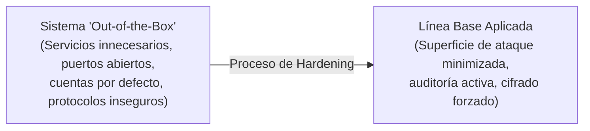
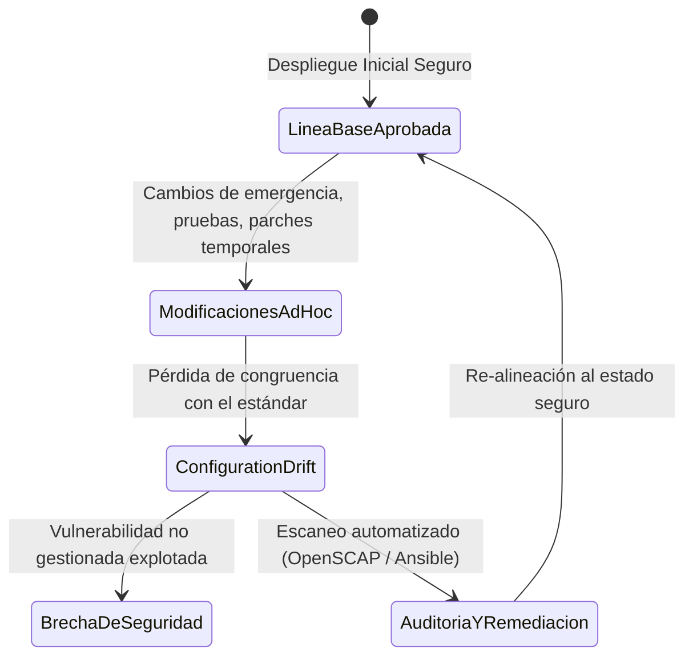
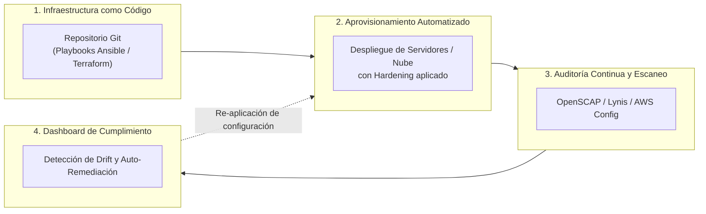

# Línea Base de Seguridad (*Security Baseline*) y Hardening

> [!abstract] Definición Formal
> Una **Línea Base de Seguridad (*Security Baseline*)** es el conjunto documentado, estandarizado, obligatorio y técnicamente verificable de directrices, parámetros de configuración y controles de seguridad que debe cumplir cualquier componente de tecnología de la información (sistemas operativos, bases de datos, dispositivos de red, aplicaciones o infraestructuras en la nube) antes y durante su operación en un entorno productivo.

La línea base representa el **estado mínimo aceptable de seguridad** definido formalmente en el alcance del [[sgsi]] y el [[egsi]]. Cualquier desviación por debajo de este umbral se considera una no conformidad o una vulnerabilidad operacional.

---

## 1. El Concepto de Hardening (Endurecimiento de Sistemas)

El proceso de aplicación práctica de una línea base se denomina **Hardening** (*endurecimiento*). Su principio rector es la **reducción sistemática de la superficie de ataque** mediante el principio de menor privilegio y necesidad operativa:



### Principios Fundamentales del Hardening
1. **Deshabilitación de Servicios y Puertos Innecesarios**: Todo puerto o servicio de red no justificado estrictamente por la función de negocio del servidor debe ser cerrado y deshabilitado (ej. desactivar CUPS, FTP, Telnet, SMBv1).
2. **Eliminación o Renombrado de Cuentas por Defecto**: Desactivación de cuentas genéricas (como `guest`, `admin`, `sa`, `root` con acceso remoto directo) y eliminación de contraseñas de fábrica.
3. **Mecanismos Fuertes de Autenticación y Cifrado**: Forzar el uso exclusivo de protocolos seguros con algoritmos robustos (ej. SSHv2 con claves Ed25519/RSA-4096 y deshabilitación de contraseñas interactivas, TLS 1.3 sin suites de cifrado débiles como 3DES o RC4).
4. **Principio de Menor Privilegio (*Least Privilege*)**: Los procesos y usuarios deben ejecutarse con los privilegios mínimos necesarios para completar su tarea (evitar ejecutar demonios web como `root` o `SYSTEM`).
5. **Auditoría y Registro (*Logging*) Exhaustivo**: Configuración obligatoria de registros de eventos de autenticación, escalamiento de privilegios y cambios en archivos críticos, con sincronización horaria mediante NTP seguro y reenvío a un SIEM centralizado.

---

## 2. Importancia Operativa: Control de Configuración y *Configuration Drift*

Uno de los principales desafíos en la ingeniería de sistemas y ciberseguridad es la **deriva de configuración (*Configuration Drift*)**:



- **¿Qué es la deriva de configuración?**: Es la degradación progresiva y no documentada del estado de seguridad de los sistemas, generada por modificaciones manuales de administradores ("soluciones rápidas"), actualizaciones inconsistentes o instalaciones de dependencias no autorizadas.
- **Riesgo asociado**: La deriva expone vectores de ataque que los administradores asumen cerrados, invalidando los análisis de riesgos del [[sgsi]] y provocando fallas graves en auditorías de cumplimiento (ISO 27001, PCI-DSS, SOC 2).

---

## 3. Marcos y Estándares Internacionales de Referencia

En lugar de definir configuraciones de seguridad arbitrarias, las organizaciones adoptan estándares reconocidos y auditados por la comunidad de ciberdefensa global:

| Estándar | Entidad Emisora | Características Principales y Niveles |
| :--- | :--- | :--- |
| **CIS Benchmarks** | *Center for Internet Security* (CIS) | El estándar de consenso de la industria por excelencia. Clasificado en:<br>- **Nivel 1 (Level 1)**: Recomendaciones base que reducen la superficie de ataque sin impacto negativo en la operación comercial.<br>- **Nivel 2 (Level 2 - Defense in Depth)**: Medidas altamente restrictivas para entornos de alta seguridad (puede impactar usabilidad).<br>- **STIG Profile**: Mapeo directo con requerimientos militares. |
| **DISA STIGs** | *Defense Information Systems Agency* (DoD - EE.UU.) | Guías de Implementación Técnica de Seguridad del Departamento de Defensa de EE.UU. Altamente rigurosas, divididas en categorías de severidad:<br>- **CAT I**: Vulnerabilidad crítica que permite acceso inmediato no autorizado.<br>- **CAT II**: Vulnerabilidad media que facilita explotación o escalada.<br>- **CAT III**: Vulnerabilidades que degradan la postura de seguridad. |
| **NIST SP 800-70** | *National Institute of Standards and Technology* (NIST) | *National Checklist Program for IT Products*. Proporciona metodologías y repositorios de listas de verificación técnicas de seguridad estandarizadas. |

---

## 4. Ejemplos Técnicos de Hardening

### A. Entornos Linux (ej. Ubuntu / RHEL)
1. **Configuración de OpenSSH (`/etc/ssh/sshd_config`)**:
   ```bash
   # Prohibir inicio de sesión directo de root
   PermitRootLogin no
   # Deshabilitar autenticación por contraseña (forzar uso de claves públicas)
   PasswordAuthentication no
   # Forzar protocolo SSH versión 2
   Protocol 2
   # Restringir algoritmos de intercambio de claves y cifrados débiles
   KexAlgorithms curve25519-sha256@libssh.org,diffie-hellman-group-exchange-sha256
   Ciphers chacha20-poly1305@openssh.com,aes256-gcm@openssh.com
   # Límite estricto de intentos fallidos
   MaxAuthTries 3
   ```
2. **Endurecimiento del Kernel (`/etc/sysctl.conf`)**:
   ```bash
   # Deshabilitar reenvío de paquetes IP (a menos que sea router)
   net.ipv4.ip_forward = 0
   # Protección contra ataques de SYN Flood
   net.ipv4.tcp_syncookies = 1
   # Ignorar solicitudes de ICMP broadcast
   net.ipv4.icmp_echo_ignore_broadcasts = 1
   # Deshabilitar aceptación de paquetes ICMP redirect (previene ataques de spoofing/MitM)
   net.ipv4.conf.all.accept_redirects = 0
   net.ipv4.conf.default.accept_redirects = 0
   ```
3. **Control de Acceso Mandatorio (MAC)**: Asegurar que SELinux esté en modo `Enforcing` o AppArmor en modo `enforce`.

### B. Entornos Microsoft Windows Server
1. **Directivas de Grupo (GPO - Group Policy Objects)**:
   - Deshabilitar el protocolo **SMBv1** en todo el dominio para mitigar ataques de propagación lateral tipo EternalBlue/WannaCry:
     ```powershell
     Set-SmbServerConfiguration -EnableSMB1Protocol $false -Force
     ```
   - Restringir la autenticación LAN Manager para forzar exclusivamente **NTLMv2** o Kerberos:
     `Computer Configuration -> Windows Settings -> Security Settings -> Local Policies -> Security Options -> Network security: LAN Manager authentication level = Send NTLMv2 response only. Refuse LM & NTLM`.
2. **Políticas de Auditoría Avanzada (`auditpol`)**:
   - Monitoreo de creación de procesos y escalamiento de privilegios:
     ```cmd
     auditpol /set /subcategory:"Process Creation" /success:enable /failure:enable
     auditpol /set /subcategory:"Logon" /success:enable /failure:enable
     ```

---

## 5. Automatización de la Verificación y Cumplimiento

En arquitecturas modernas (DevSecOps e Infraestructura como Código - IaC), la verificación manual es insostenible. La línea base debe ser **declarativa, versionada y auditada de forma continua**:



### Herramientas Esenciales de la Industria
- **OpenSCAP (Security Content Automation Protocol)**:
  - Marco estandarizado por el NIST que utiliza especificaciones en formatos **XCCDF** (listas de comprobación) y **OVAL** (definiciones de vulnerabilidades).
  - Permite evaluar automáticamente sistemas frente a perfiles CIS o STIG generando reportes de auditoría en HTML/XML:
    ```bash
    oscap xccdf eval --profile xccdf_org.ssgproject.content_profile_cis \
      --report /var/log/scap-report.html \
      /usr/share/xml/scap/ssg/content/ssg-rhel9-ds.xml
    ```
- **Lynis**:
  - Herramienta de auditoría de seguridad y escaneo de hardening liviana para sistemas Unix/Linux:
    ```bash
    lynis audit system
    ```
  - Produce un índice de endurecimiento (*Hardening Index*) y sugerencias detalladas para alcanzar la línea base.
- **Ansible / Puppet / Chef**:
  - Utilizados para aplicar y mantener la línea base como código (ej. colecciones de playbooks de *CIS Red Hat Enterprise Linux Benchmark* de GitHub/Ansible Galaxy).
- **Herramientas de Gobernanza Cloud (Cloud Security Posture Management - CSPM)**:
  - **AWS Config / Azure Policy / GCP Security Command Center**: Monitorean en tiempo real la configuración de recursos en la nube (ej. alertar o bloquear si un bucket S3 se hace público o si un Security Group permite SSH al mundo `0.0.0.0/0`).

---

## 6. Notas Relacionadas y Enlaces del Vault
- [[sgsi]] - Sistema de Gestión de Seguridad de la Información (Anexo A.8.9 Gestión de la Configuración).
- [[egsi]] - Estrategia de Gobierno de Seguridad de la Información.
- [[metodologias de analisis y evaluacion de riesgo]] - Identificación de vulnerabilidades por falta de hardening.
- [[controles administrativos]] - Políticas de configuración y gestión del cambio.
- [[Documentos/seguridad informatica/Triada CIA|Triada CIA]] - Preservación de la integridad y confidencialidad mediante configuraciones robustas.
