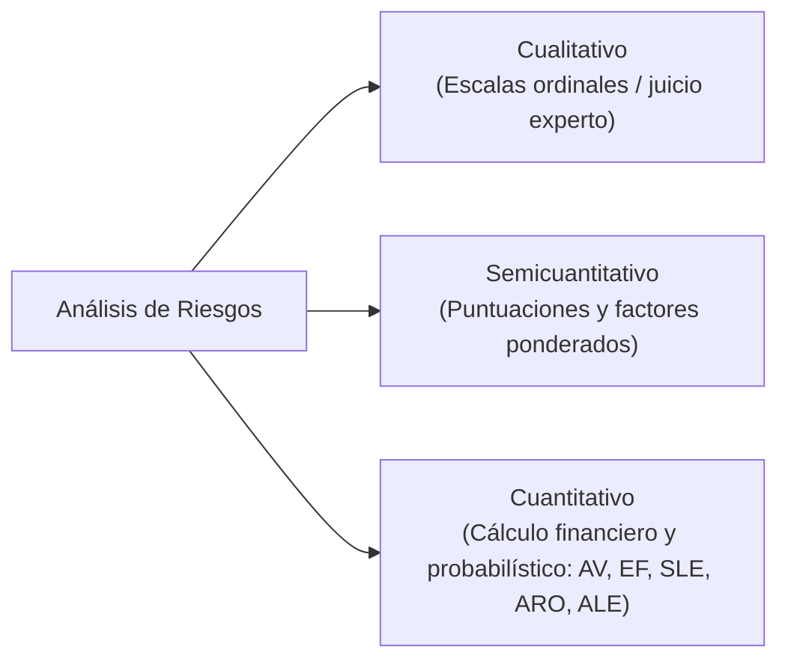
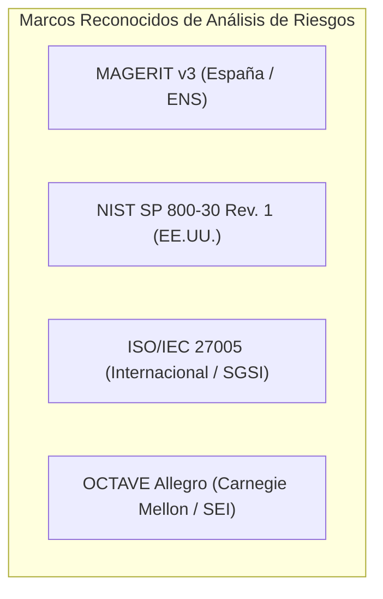
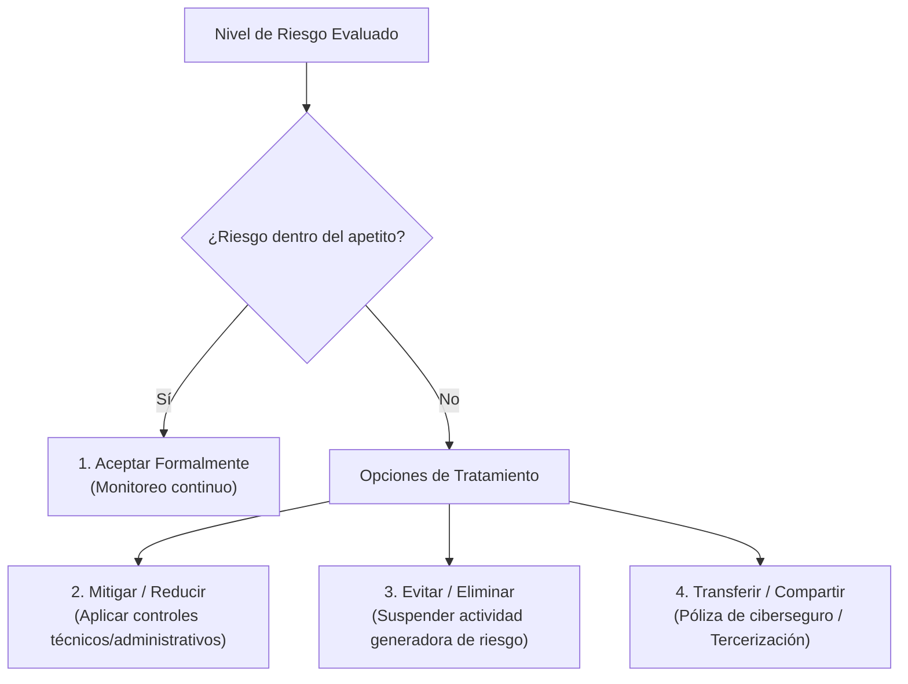

# Metodologías de Análisis y Evaluación de Riesgos en Ciberseguridad

> [!abstract] Definición Formal del Riesgo
> En el ámbito de la seguridad de la información y la auditoría informática, el **Riesgo** ($R$) se conceptualiza como la probabilidad formal de que una **Amenaza** ($A$) explote una **Vulnerabilidad** ($V$) preexistente en uno o más **Activos de Información** ($Act$), produciendo un **Impacto** negativo ($I$) sobre la organización:
> $$R = f(Amenaza, Vulnerabilidad, Impacto) \quad \text{o simplificadamente} \quad R = Probabilidad \times Impacto$$

La evaluación sistemática de riesgos es el pilar central sobre el cual descansan el [[sgsi]] (ISO/IEC 27001) y la [[egsi]].

---

## 1. Tipologías de Análisis de Riesgo

Existen tres enfoques metodológicos para la cuantificación y apreciación del riesgo:

---

### A. Análisis Cualitativo
- **Fundamento**: Emplea adjetivos y escalas nominales u ordinales descriptivas (ej. *Muy Bajo, Bajo, Medio, Alto, Muy Alto / Crítico*) para evaluar la probabilidad de ocurrencia y la magnitud del impacto potencial.
- **Instrumento Principal: Matriz de Calor de Riesgos (*Risk Heat Map*)**:
  Una matriz típica de $5 \times 5$ cruza la escala de probabilidad ($P \in [1, 5]$) con la escala de impacto ($I \in [1, 5]$):

| Probabilidad \ Impacto | 1 (Insignificante) | 2 (Menor) | 3 (Moderado) | 4 (Mayor) | 5 (Catastrófico) |
| :---: | :---: | :---: | :---: | :---: | :---: |
| **5 (Muy Frecuente)** | 5 (Medio) | 10 (Alto) | 15 (Alto) | 20 (Crítico) | 25 (Crítico) |
| **4 (Frecuente)** | 4 (Bajo) | 8 (Medio) | 12 (Alto) | 16 (Crítico) | 20 (Crítico) |
| **3 (Posible)** | 3 (Bajo) | 6 (Medio) | 9 (Medio) | 12 (Alto) | 15 (Alto) |
| **2 (Raro)** | 2 (Muy Bajo) | 4 (Bajo) | 6 (Medio) | 8 (Medio) | 10 (Alto) |
| **1 (Muy Raro)** | 1 (Muy Bajo) | 2 (Muy Bajo) | 3 (Bajo) | 4 (Bajo) | 5 (Medio) |

- **Ventajas**: Rápido de ejecutar, intuitivo para la comunicación con la Alta Dirección, no requiere datos estadísticos o financieros históricos precisos.
- **Limitaciones**: Elevada subjetividad; puede inducir a sesgos cognitivos; agrupa riesgos con impactos disímiles bajo una misma etiqueta.

---

### B. Análisis Cuantitativo
- **Fundamento**: Modela el riesgo asignando valores monetarios y frecuencias numéricas exactas basadas en datos actuariales, métricas históricas de incidentes y costos operativos.

#### Variables Matemáticas Fundamentales
1. **Valor del Activo (*Asset Value - AV*)**:
   Coste monetario total del activo ($ en USD o moneda local), considerando coste de reposición, valor de la información contenida, lucro cesante y daño reputacional.
2. **Factor de Exposición (*Exposure Factor - EF*)**:
   Porcentaje del valor del activo que se pierde como resultado directo de la materialización de una amenaza específica:
   $$0 \le EF \le 1 \quad (0\% \le EF \le 100\%)$$
3. **Pérdida Única Esperada (*Single Loss Expectancy - SLE*)**:
   Coste financiero proyectado cada vez que la amenaza se materializa con éxito sobre el activo:
   $$SLE = AV \times EF$$
4. **Tasa Anual de Ocurrencia (*Annualized Rate of Occurrence - ARO*)**:
   Frecuencia estimada con la que se espera que el evento ocurra en el transcurso de un año calendario (ej. si ocurre 3 veces al año, $ARO = 3.0$; si se proyecta estadísticamente una vez cada 4 años, $ARO = 0.25$).
5. **Pérdida Anual Esperada (*Annualized Loss Expectancy - ALE*)**:
   Coste anual proyectado para la organización si no se implementa ninguna salvaguarda adicional frente a dicha amenaza:
   $$ALE = SLE \times ARO = (AV \times EF) \times ARO$$

#### Análisis Costo-Beneficio de un Control (*Cost-Benefit Analysis - CBA*)
Para justificar la adquisición e implementación de un control de ciberseguridad, se evalúa si el ahorro proyectado en pérdidas supera el coste del control:
$$\text{Valor del Control para el Negocio} = (ALE_{\text{anterior}} - ALE_{\text{posterior}}) - ACS$$
Donde $ACS$ es el **Costo Anual del Control (*Annualized Cost of Safeguard*)**, que incluye costes de licenciamiento, mantenimiento, hardware y operación.
- Si $\text{Valor} > 0$, el control es **económicamente viable y rentable**.
- Si $\text{Valor} \le 0$, el control cuesta más de lo que ahorra y debe reconsiderarse su diseño o aceptarse el riesgo.

> [!example] Ejercicio Práctico Resuelto (Nivel Ingeniería)
> - **Activo**: Base de datos de clientes de una plataforma e-commerce.
> - **Valor del Activo ($AV$)**: $\$500{,}000$ USD.
> - **Amenaza**: Inyección SQL que extrae y corrompe los registros de clientes.
> - **Factor de Exposición ($EF$)**: Se estima que un incidente exitoso causaría una pérdida del $40\%$ del valor del activo ($EF = 0.40$).
> - **Tasa Anual de Ocurrencia ($ARO$)**: Sin controles WAF, se estima un ataque exitoso cada 2 años ($ARO = 0.5$).
> 
> **Cálculos Base**:
> 1. $SLE = AV \times EF = \$500{,}000 \times 0.40 = \$200{,}000\text{ USD}$
> 2. $ALE_{\text{anterior}} = SLE \times ARO = \$200{,}000 \times 0.5 = \$100{,}000\text{ USD/año}$
> 
> **Propuesta de Control**:
> Se propone implementar un Web Application Firewall (WAF) avanzado y un plan de codificación segura cuya suscripción y soporte anual es de $ACS = \$15{,}000\text{ USD/año}$. Con este control, la nueva tasa anual de ocurrencia se reduce a una vez cada 20 años ($ARO = 0.05$).
> 
> **Evaluación del Nuevo Riesgo**:
> 3. $ALE_{\text{posterior}} = \$200{,}000 \times 0.05 = \$10{,}000\text{ USD/año}$
> 
> **Retorno / Beneficio Neto**:
> $$\text{Beneficio Anual} = (\$100{,}000 - \$10{,}000) - \$15{,}000 = \$90{,}000 - \$15{,}000 = \mathbf{\$75{,}000\text{ USD/año}}$$
> **Conclusión**: La salvaguarda está plenamente justificada financieramente, generando un ahorro neto anual de $\$75{,}000$ USD.

---

### C. Análisis Semicuantitativo
- Asigna valores numéricos ponderados a categorías cualitativas (ej. ranking de 1 a 10 con multiplicadores de criticidad del activo) para realizar cálculos matemáticos sin requerir equivalencias monetarias directas en dólares. Reduce ambigüedades respecto al enfoque cualitativo puro.

---

## 2. Metodologías Formales de la Industria

### 1. MAGERIT v3 (Metodología de Análisis y Gestión de Riesgos de los Sistemas de Información)
Desarrollada por el Consejo Superior de Administración Electrónica de España, estándar oficial del Esquema Nacional de Seguridad (ENS).
- **Modelo de Activos Jerárquico**:
  - *Activos Esenciales*: Información procesada y servicios prestados.
  - *Activos de Soporte*: Aplicaciones, equipos informáticos (hardware), soportes de información, redes de comunicaciones, instalaciones físicas y personal.
- **Dimensiones de Seguridad Evaluadas (Criterio DICAT)**:
  1. **D**isponibilidad
  2. **I**ntegridad
  3. **C**onfidencialidad
  4. **A**utenticidad
  5. **T**razabilidad
- **Conceptos Clave de MAGERIT**:
  - *Impacto Acumulado*: Daño que sufre un activo por el valor intrínseco de los activos superiores que dependen de él.
  - *Impacto Repercutido*: Daño directo que sufre el activo analizado.
  - *Herramienta Software Oficial*: PILAR (*Puesto de Inspección y Limpieza de Amenazas y Riesgos*).

### 2. NIST SP 800-30 Rev. 1 (Guide for Conducting Risk Assessments)
Marco estándar del gobierno federal estadounidense (NIST), ampliamente adoptado en corporaciones transnacionales.
- Estructura el proceso en **cuatro fases cíclicas**:
  1. *Preparar la evaluación (Prepare)*: Definir alcance, supuestos y fuentes de información.
  2. *Conducir la evaluación (Conduct)*:
     - Identificar fuentes de amenazas y eventos de amenaza (adversarios, fallas de software, accidentes).
     - Identificar vulnerabilidades y condiciones predisponentes.
     - Determinar la probabilidad (*Likelihood*) y el impacto (*Impact*).
     - Determinar el nivel de riesgo.
  3. *Comunicar resultados (Communicate)*: Compartir hallazgos con los líderes de negocio.
  4. *Mantener la evaluación (Maintain)*: Monitorear continuamente los factores de riesgo en el tiempo.
- Enfatiza fuertemente las **amenazas adversarias** (*Adversary Threat Sources*) evaluando capacidad, intención y oportunidad de los cibercriminales.

### 3. ISO/IEC 27005:2022
- Proporciona la guía metodológica oficial para cumplir con la cláusula 6.1.2 de [[sgsi|ISO/IEC 27001]].
- Alineada con la norma madre de gestión de riesgos corporativos **ISO 31000**.
- Enfoque iterativo centrado en:
  - Contextualización de la organización.
  - Identificación de riesgos basada en eventos y escenarios de riesgo.
  - Análisis de riesgos (estimación cualitativa o cuantitativa de probabilidad y consecuencias).
  - Tratamiento del riesgo y selección de controles de ISO/IEC 27002.
  - Aceptación formal del riesgo residual.

### 4. OCTAVE Allegro (Operationally Critical Threat, Asset, and Vulnerability Evaluation)
Desarrollada por el *Software Engineering Institute* (SEI) de la Universidad Carnegie Mellon.
- **Filosofía**: Enfoque impulsado por la organización (*organization-driven*). Considera que las personas internas conocen el negocio mejor que consultores externos.
- **OCTAVE Allegro** se enfoca exclusivamente en **activos de información** (datos en reposo, en tránsito, procesados o en mente de las personas).
- Se ejecuta en **4 fases divididas en 8 pasos estructurados**:
  - *Fase 1: Establecer criterios de medición de conductores de riesgo.*
  - *Fase 2: Perfilado de activos de información.*
  - *Fase 3: Identificación de amenazas (contenedores de activos: personas, tecnología, física).*
  - *Fase 4: Identificación y mitigación de riesgos.*

---

## 3. Cuadro Comparativo de Metodologías

| Característica | MAGERIT v3 | NIST SP 800-30 Rev. 1 | ISO/IEC 27005 | OCTAVE Allegro |
| :--- | :--- | :--- | :--- | :--- |
| **Origen** | España (Administración Pública / ENS) | EE.UU. (NIST / Gobierno Federal) | Internacional (ISO / IEC) | EE.UU. (Carnegie Mellon / SEI) |
| **Enfoque Principal** | Estructura jerárquica formal de activos e impactos acumulados | Eventos de amenaza, adversarios y ciberseguridad | Vinculación estricta y flexible con el SGSI ISO 27001 | Riesgo operativo centrado en activos de información |
| **Dimensiones evaluadas** | 5 dimensiones (D-I-C-A-T) | Tríada CIA + consecuencias operacionales | Tríada CIA (Confidencialidad, Integridad, Disponibilidad) | Integridad, Disponibilidad y Confidencialidad en contenedores |
| **Tipo de Análisis** | Semicuantitativo / Cualitativo | Cualitativo y Semicuantitativo | Cualitativo, Semicuantitativo o Cuantitativo | Cualitativo / Talleres de trabajo |
| **Soporte Software** | Herramienta PILAR | Integrado en suite NIST RMF | Diversas herramientas comerciales (ej. ERAMBA) | Guías, plantillas de trabajo y cuestionarios SEI |
| **Mejor Caso de Uso** | Sector público europeo, auditorías formales rigurosas | Entornos gubernamentales, defensa y marcos NIST CSF | Organizaciones con o aspirando a certificación ISO 27001 | Organizaciones medianas que buscan autoevaluaciones sin gran sobrecarga técnica |

---

## 4. Opciones de Tratamiento del Riesgo

Una vez calificado el nivel de riesgo, la organización debe adoptar una de las **cuatro estrategias de tratamiento** según su apetito de riesgo:

1. **Mitigar / Reducir**: Aplicación de controles tecnológicos (ej. firewalls, [[linea base|hardening]], cifrado) o [[controles administrativos]] (políticas, procedimientos) para reducir la probabilidad o el impacto.
2. **Evitar / Eliminar**: Cesar la actividad que expone a la organización al riesgo (ej. retirar un servicio heredado altamente vulnerable).
3. **Transferir / Compartir**: Trasladar las consecuencias financieras o de soporte mediante contratos con terceros o pólizas de ciberriesgo.
4. **Aceptar**: Asumir formalmente el riesgo remanente tras justificación explícita de costo-beneficio y aprobación de la Alta Dirección.

---

## 5. Notas Relacionadas y Enlaces del Vault
- [[sgsi]] - Sistema de Gestión de Seguridad de la Información (ISO/IEC 27001).
- [[egsi]] - Estrategia de Gobierno de Seguridad de la Información.
- [[linea base]] - Líneas base de seguridad técnica y configuraciones de hardening.
- [[controles administrativos]] - Políticas operativas y directrices de control.
- [[Documentos/seguridad informatica/Triada CIA|Triada CIA]] - Dimensiones fundamentales de protección.
- [[fundamentos de seguridad]] - Principios esenciales de ciberseguridad.
