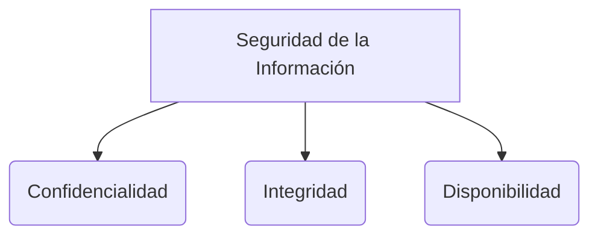

SGSI ISO 27001 norma que sirve para gestion 
PDCA

> [!info] Explicación: SGSI y PDCA
> - **SGSI (Sistema de Gestión de seguridad de la Información):** Un conjunto de políticas y procedimientos para gestionar de manera sistemática los datos sensibles de una organización. ISO 27001 es el estándar internacional más conocido que establece los requisitos para un SGSI.
> - **PDCA (Plan-Do-Check-Act o Planificar-Hacer-Verificar-Actuar):** Es un ciclo de mejora continua utilizado en ISO 27001. Ayuda a asegurar que las políticas de seguridad se planifiquen adecuadamente, se implementen, se revise su eficacia y se ajusten o mejoren de manera iterativa.

tiene 11 dominios de control
contrpl de accesos
 gestion de avtiovs 
 desarillo y mantemineto 
 seguridad 
 cumpliemineto (de la legislaacion )

> [!info] Explicación: Dominios de Control ISO 27001
> ISO 27001 define controles de seguridad agrupados en dominios para abordar diferentes áreas de riesgo. Por ejemplo:
> - **Control de Accesos:** Asegura que solo los usuarios autorizados tengan acceso a la información.
> - **Gestión de Activos:** Identificación y protección de los activos de información (hardware, software, datos).
> - **Cumplimiento:** Garantiza que los sistemas de información cumplan con la legislación aplicable (como protección de datos o propiedad intelectual).

 loes( educaciion)
 conveniio de budapest nace hace 20 años se describe penalidades 
 - derechos de autor 
 - pornografia infantil 

> [!info] Explicación: Convenio de Budapest
> El **Convenio sobre la Ciberdelincuencia de Budapest** es el primer tratado internacional que busca armonizar las leyes nacionales sobre delitos informáticos (como fraude informático, pornografía infantil y violaciones de derechos de autor), mejorar las técnicas de investigación y aumentar la cooperación entre las naciones.

## Notas relacionadas
- [[seguridad informatica]]
- [[fundamentos de seguridad]]
- [[control de acceso]]
- [[SGSI]]
 - grooming
 
ley de proteccion de datos 
lpdp->gdpr  (derecho al olvido,retificacion, como se va a procesar la información)
coip penalizar 
let  de comercio electronico -> firmas certicficados 

> [!info] Explicación: Legislación y Privacidad
> - **GDPR (Reglamento General de Protección de Datos):** Normativa europea de protección de la privacidad que influye globalmente. Introduce derechos fundamentales como el *Derecho al olvido* (borrado de datos) y *Derecho a la rectificación* (corregir datos erróneos).
> - **Ley de Comercio Electrónico:** Regula las transacciones comerciales por medios electrónicos. Introduce la validez legal de las *Firmas Electrónicas* y el uso de *Certificados Digitales* para garantizar autenticidad e integridad.

1. activos criticos 
2. alcance 
3. activos 
4. vulnerabilidades debilidades brechas de seguridad 
5. amenzas 

> [!info] Explicación: Conceptos de Riesgo
> - **Activos:** Cualquier cosa que tenga valor para la organización (datos, servidores, reputación).
> - **Vulnerabilidad:** Una debilidad en un activo o en un control que puede ser explotada por una amenaza.
> - **Amenaza:** Una causa potencial de un incidente no deseado que puede dañar un sistema o a la organización (ej. un hacker, un desastre natural).

*riesgo* 
evaluacion analisis (cuantitativo calitativo)
tratamiento
1) Mitigar 
2) Eliminar
3) Transferir
4) Aceptar 
controles identificar 

> [!info] Explicación: Gestión de Riesgos
> El **Riesgo** se calcula evaluando la probabilidad de que una amenaza explote una vulnerabilidad y el impacto que causaría.
> - **Análisis Cualitativo:** Utiliza escalas descriptivas (Alto, Medio, Bajo).
> - **Análisis Cuantitativo:** Asigna valores numéricos o monetarios precisos.
> 
> **Tratamiento del Riesgo:**
> 1. **Mitigar:** Reducir el riesgo implementando controles (ej. un firewall).
> 2. **Evitar/Eliminar:** Cambiar los planes para evadir el riesgo por completo.
> 3. **Transferir:** Compartir el riesgo con un tercero (ej. comprar un seguro).
> 4. **Aceptar:** Reconocer el riesgo pero decidir no actuar (generalmente porque el costo de mitigarlo es mayor que el impacto).

## Diagrama de Referencia

