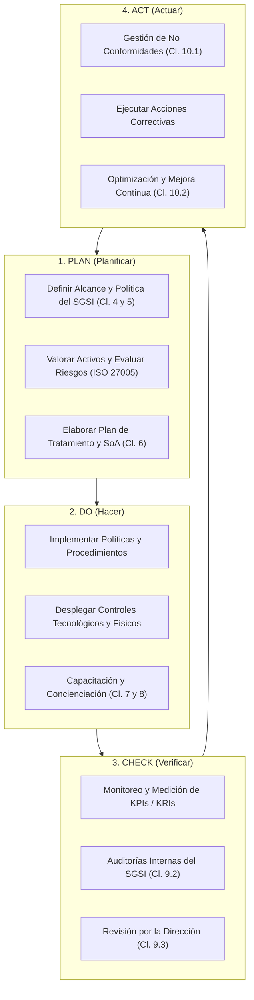
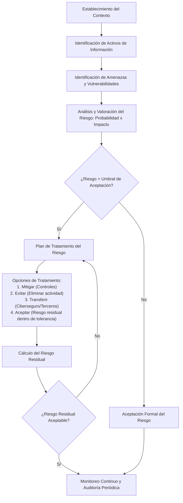
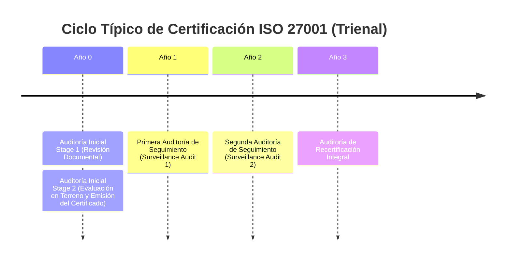

# Sistema de Gestión de Seguridad de la Información (SGSI)

> [!abstract] Definición Formal
> Un **Sistema de Gestión de Seguridad de la Información (SGSI)** es un marco sistemático, documentado, holístico e iterativo compuesto por políticas, procesos, procedimientos, estructuras organizacionales y controles tecnológicos, cuyo objetivo es preservar la **[[Triada CIA|Confidencialidad, Integridad y Disponibilidad]]** de los activos de información de una entidad, gestionando adecuadamente sus riesgos operacionales y de ciberseguridad.

El estándar internacional de referencia indiscutible para el diseño, implementación, mantenimiento y certificación de un SGSI es la norma **ISO/IEC 27001** (complementada por las directrices de buenas prácticas de **ISO/IEC 27002** y el marco de gestión del riesgo de **ISO/IEC 27005**).

---

## 1. Evolución del Estándar: ISO/IEC 27001:2013 vs. ISO/IEC 27001:2022

La versión 2022 introdujo transformaciones esenciales para responder a las nuevas realidades tecnológicas (computación en la nube, trabajo remoto, inteligencia de amenazas y privacidad de datos):

| Criterio | ISO/IEC 27001:2013 | ISO/IEC 27001:2022 |
| :--- | :--- | :--- |
| **Estructura de Cláusulas (4 al 10)** | Estructura de Alto Nivel (HLS) | Estructura Armonizada (*Harmonized Structure*) con ajustes menores de redacción |
| **Estructura del Anexo A** | 114 controles divididos en **14 dominios** | **93 controles** agrupados en **4 temas** |
| **Nuevos Controles Incorporados** | N/A | **11 controles nuevos** (ej. Threat Intelligence, Cloud Services, Data Masking) |
| **Controles Fusionados** | N/A | 57 controles se combinaron en 24 controles consolidados |
| **Esquema de Atributos** | Sin taxonomía formal de atributos | 5 atributos por control (*Control type*, *Information security properties*, *Cybersecurity concepts*, *Operational capabilities*, *Security domains*) |

### Los 11 Nuevos Controles de ISO/IEC 27002:2022
1. **A.5.7 Inteligencia de amenazas (*Threat intelligence*)**: Recolección y análisis de información sobre ciberamenazas para tomar acciones preventivas.
2. **A.5.23 Seguridad de la información para el uso de servicios en la nube**: Procesos de adquisición, uso, gestión y salida de proveedores cloud.
3. **A.5.30 Preparación de las TIC para la continuidad del negocio (*ICT readiness for business continuity*)**: Asegurar la disponibilidad de la infraestructura tecnológica según los objetivos de continuidad del negocio.
4. **A.7.4 Monitoreo de seguridad física**: Vigilancia perimetral continua y sistemas de detección de intrusión física.
5. **A.8.9 Gestión de la configuración (*Configuration management*)**: Definición, implementación y monitoreo de configuraciones seguras y [[linea base|líneas base]].
6. **A.8.10 Eliminación de información**: Borrado seguro de datos en desuso para cumplir con regulaciones y evitar fugas.
7. **A.8.11 Enmascaramiento de datos (*Data masking*)**: Aplicación de técnicas de seudonimización, anonimización u ofuscación de datos sensibles.
8. **A.8.12 Prevención de fuga de datos (*Data leakage prevention - DLP*)**: Mecanismos técnicos para detectar y evitar la extracción no autorizada de información sensible.
9. **A.8.16 Monitoreo de actividades**: Registro y supervisión de anomalías en redes, sistemas y aplicaciones.
10. **A.8.23 Filtrado web**: Restricción de acceso a sitios web maliciosos o no autorizados para prevenir descargas de malware.
11. **A.8.28 Codificación segura (*Secure coding*)**: Principios de desarrollo de software seguro a lo largo del ciclo de vida (SDLC).

---

## 2. El Ciclo de Mejora Continua PDCA (Deming) en el SGSI

El SGSI se fundamenta metodológicamente en el ciclo iterativo **PDCA** (*Plan, Do, Check, Act*), garantizando que la seguridad no sea un proyecto finito, sino un proceso adaptativo y resiliente ante la evolución del panorama de amenazas:

### Desglose de Actividades por Fase
- **PLAN (Planificar)**:
  - Delimitación formal del alcance (fronteras físicas, lógicas, organizacionales y tecnológicas).
  - Aprobación de la Política General de Seguridad por parte de la Alta Dirección.
  - Ejecución de la evaluación de riesgos: identificación de activos, amenazas, vulnerabilidades e impactos.
  - Selección de salvaguardas y redacción de la Declaración de Aplicabilidad (*Statement of Applicability - SoA*).
- **DO (Hacer)**:
  - Ejecución del Plan de Tratamiento de Riesgos (*Risk Treatment Plan - RTP*).
  - Implementación de controles técnicos, administrativos y operativos seleccionados.
  - Asignación formal de recursos, definición de roles y responsabilidades.
  - Ejecución del plan de concienciación y cultura de ciberseguridad para todo el personal.
- **CHECK (Verificar)**:
  - Evaluación cuantitativa del desempeño del SGSI mediante indicadores clave de rendimiento (KPI) e indicadores clave de riesgo (KRI).
  - Planificación y ejecución del programa anual de auditorías internas independientes.
  - Realización de la revisión periódica por parte de la Alta Dirección para constatar la idoneidad y eficacia del sistema.
- **ACT (Actuar)**:
  - Documentación y análisis de causa raíz para cada no conformidad identificada.
  - Implementación de acciones correctivas para prevenir la recurrencia de incidentes.
  - Ajuste dinámico de políticas y controles en respuesta a cambios en el entorno de negocio o tecnológico.

---

## 3. Estructura de Cláusulas Mandatorias (ISO/IEC 27001)

Las cláusulas 4 a 10 contienen los requisitos normativos auditables de cumplimiento obligatorio para optar a la certificación internacional:

### Cláusula 4: Contexto de la Organización
- **4.1 Comprensión de la organización y su contexto**: Análisis de factores internos y externos (económicos, tecnológicos, normativos, culturales) mediante matrices DOFA/PESTEL.
- **4.2 Comprensión de las necesidades y expectativas de las partes interesadas**: Identificación de clientes, reguladores, proveedores y empleados, documentando sus requisitos legales, contractuales y operativos.
- **4.3 Determinación del alcance del SGSI**: Documento formal que define las fronteras físicas, de red, sistemas y procesos donde rige el SGSI.
- **4.4 Sistema de gestión de la seguridad de la información**: Obligación de establecer, implementar, mantener y mejorar continuamente el sistema.

### Cláusula 5: Liderazgo
- **5.1 Liderazgo y compromiso**: La Alta Dirección debe demostrar liderazgo activo, asegurando los recursos financieros, humanos y tecnológicos necesarios.
- **5.2 Política de seguridad**: Documento rector alineado con los objetivos estratégicos de la entidad, accesible, comunicado y revisado periódicamente.
- **5.3 Roles, responsabilidades y autoridades**: Asignación clara de responsabilidades (ej. CISO, custodios de información, comités de seguridad).

### Cláusula 6: Planificación
- **6.1 Acciones para tratar riesgos y oportunidades**: Definición del proceso de apreciación y tratamiento de riesgos de seguridad de la información (acorde con [[metodologias de analisis y evaluacion de riesgo]]).
- **6.2 Objetivos de seguridad de la información y planificación para alcanzarlos**: Metas medibles, comunicadas, consistentes con la política y actualizadas (enfoque SMART).
- **6.3 Planificación de cambios**: Gestión controlada y estructurada de cualquier modificación al SGSI.

### Cláusula 7: Apoyo (Soporte)
- **7.1 Recursos**: Suministro de infraestructura y herramientas.
- **7.2 Competencia**: Aseguramiento de conocimientos técnicos y habilidades del personal involucrado en seguridad.
- **7.3 Concienciación**: Programas formativos sobre políticas de seguridad y consecuencias del incumplimiento.
- **7.4 Comunicación**: Mecanismos de comunicación interna y externa (qué, cuándo, a quién y cómo comunicar).
- **7.5 Información documentada**: Creación, actualización y control de políticas, procedimientos, registros y evidencias.

### Cláusula 8: Operación
- **8.1 Planificación y control operacional**: Procesos para asegurar que las actividades se ejecuten según los criterios establecidos.
- **8.2 Apreciación de los riesgos de seguridad**: Aplicación práctica periódica y controlada de la metodología de evaluación de riesgos.
- **8.3 Tratamiento de los riesgos de seguridad**: Implementación efectiva del plan de tratamiento de riesgos aprobado.

### Cláusula 9: Evaluación del Desempeño
- **9.1 Seguimiento, medición, análisis y evaluación**: Métricas de eficacia de controles y monitoreo de eventos.
- **9.2 Auditoría interna**: Realización de auditorías a intervalos planificados para verificar conformidad normativa.
- **9.3 Revisión por la dirección**: Reunión formal donde la gerencia evalúa el estado de las acciones previas, cambios en el contexto, resultados de riesgos y oportunidades de mejora.

### Cláusula 10: Mejora
- **10.1 No conformidad y acciones correctivas**: Reacción ante incidentes y hallazgos de auditoría, eliminando la causa raíz.
- **10.2 Mejora continua**: Acciones proactivas para perfeccionar la madurez, idoneidad y eficacia del SGSI.

---

## 4. Proceso de Gestión del Riesgo según ISO/IEC 27005

La norma **ISO/IEC 27005** proporciona las directrices operativas para la gestión del riesgo en el marco de ISO 27001:

### 1. Inventario y Valoración de Activos de Información
Los activos son cualquier elemento con valor para la organización:
- **Activos Primarios**: Información sensible, procesos de negocio críticos.
- **Activos de Soporte / Secundarios**: Hardware, software, redes, personas, instalaciones físicas.
- Cada activo es valorado en función del impacto ante la pérdida de su Confidencialidad ($C$), Integridad ($I$) y Disponibilidad ($D$) en una escala predefinida (ej. 1 a 5).

### 2. Identificación de Amenazas y Vulnerabilidades
- **Amenaza**: Causa potencial de un incidente no deseado que puede causar daño (ej. ransomware, inundación, error humano, exfiltración por empleados deshonestos).
- **Vulnerabilidad**: Debilidad o fallo en un activo o control que puede ser explotado por una amenaza (ej. puertos abiertos innecesarios, falta de autenticación multifactor, ausencia de una [[linea base|línea base de configuración]]).

### 3. Evaluación y Cálculo del Riesgo
$$Riesgo = f(\text{Probabilidad de Ocurrencia}, \text{Impacto})$$
El nivel de riesgo inherente se calcula combinando la probabilidad de que una amenaza explote una vulnerabilidad con la severidad del daño ocasionado sobre el negocio.

### 4. Estrategias de Tratamiento del Riesgo
1. **Mitigar / Reducir**: Desplegar controles técnicos o administrativos (ej. cifrado de datos, [[controles administrativos]], firewalls) para disminuir la probabilidad o el impacto.
2. **Evitar / Eliminar**: Descontinuar la actividad o el sistema que genera la exposición (ej. desactivar un servicio legacy vulnerable que ya no es vital).
3. **Transferir / Compartir**: Trasladar parte del impacto financiero u operativo a un tercero (ej. pólizas de ciberseguros, contratos de servicios gestionados con SLAs rigurosos).
4. **Aceptar**: Asumir formalmente el riesgo si este se encuentra por debajo del umbral de apetito de riesgo de la organización, con la firma explícita del propietario del activo.

### 5. Riesgo Inherente vs. Riesgo Residual
- **Riesgo Inherente**: Nivel de riesgo existente en ausencia de cualquier salvaguarda o control.
- **Riesgo Residual**: Riesgo remanente que perdura tras la aplicación efectiva de los controles de seguridad seleccionados:
$$Riesgo\ Residual = Riesgo\ Inherente - Efectividad\ de\ los\ Controles$$
> [!important] Regla de Oro
> El riesgo nunca se reduce a cero ($Riesgo\ Residual > 0$). La Alta Dirección debe aprobar y asumir formalmente el riesgo residual resultante.

---

## 5. Declaración de Aplicabilidad (SoA - Statement of Applicability)

La **Declaración de Aplicabilidad (SoA)** es el documento central de enlace entre el análisis de riesgos y la implementación de controles en ISO/IEC 27001:

1. **Contenido Obligatorio del SoA**:
   - Listado exhaustivo de los **93 controles del Anexo A** (ISO/IEC 27002:2022).
   - Indicación explícita de si cada control se incluye o se excluye.
   - **Justificación técnica y de negocio**: justificar tanto la inclusión (vinculada al tratamiento de un riesgo específico o a un requisito legal) como la exclusión (ej. "el control de desarrollo seguro se excluye porque la entidad no desarrolla software internamente ni contrata desarrollo a medida").
   - Estado actual de implementación de cada control (Implementado, En proceso, Planificado).

### Catálogo de Controles de ISO/IEC 27002:2022 (Los 4 Temas)
Los 93 controles se estructuran en 4 categorías:
1. **Controles Organizacionales (Cláusula 5 - 37 controles)**: Políticas de seguridad, gestión de activos, control de acceso lógico, gestión de relaciones con proveedores, gestión de incidentes y cumplimiento legal.
2. **Controles de Personas (Cláusula 6 - 8 controles)**: Selección previa al empleo, términos y condiciones contractuales, concienciación y formación, procesos disciplinarios y trabajo remoto.
3. **Controles Físicos (Cláusula 7 - 14 controles)**: Perímetros de seguridad física, control de acceso físico a instalaciones, seguridad en oficinas y salas de servidores, mantenimiento de equipos y cableado seguro.
4. **Controles Tecnológicos (Cláusula 8 - 34 controles)**: Autenticación, gestión de identidades y accesos privilegiados, prevención de fuga de datos (DLP), protección contra malware, gestión de vulnerabilidades técnicas, [[linea base|configuración segura]] y criptografía.

---

## 6. Auditorías Periódicas y Esquema de Certificación

El mantenimiento de la certificación ISO/IEC 27001 exige un ciclo continuo de auditorías:

- **Auditorías Internas (1ra Parte)**: Realizadas por personal competente e independiente de la entidad para detectar brechas antes de auditorías externas.
- **Auditorías de Segunda Parte**: Evaluaciones ejecutadas a proveedores y terceros contratistas.
- **Auditorías de Certificación (3ra Parte)**:
  - **Fase 1 (Stage 1)**: Verificación del diseño del SGSI, alcance, política, análisis de riesgos y completitud del SoA.
  - **Fase 2 (Stage 2)**: Constatación en sitio de la efectividad operativa de los controles implementados y las evidencias de cumplimiento de las cláusulas mandatorias.

---

## 7. Notas Relacionadas y Enlaces del Vault
- [[Auditoría de seguridad]] - Tipos de auditorías (técnica/pentesting, física, cumplimiento).
- [[egsi]] - Estrategia de Gobierno de Seguridad de la Información.
- [[metodologias de analisis y evaluacion de riesgo]] - Métodos formales (MAGERIT, NIST SP 800-30, ISO 27005).
- [[linea base]] - Líneas base de configuración segura y hardening técnico.
- [[controles administrativos]] - Políticas, procedimientos y controles operacionales.
- [[Documentos/seguridad informatica/Triada CIA|Triada CIA]] - Los pilares de confidencialidad, integridad y disponibilidad.
- [[control de acceso]] - Mecanismos de autenticación y autorización.
