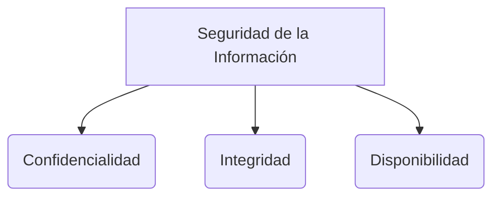

# Certificados digitales y PKI

La **PKI (Public Key Infrastructure o Infraestructura de Clave Pública)** es un marco completo de hardware, software, personas, políticas y procedimientos necesarios para crear, gestionar, distribuir y revocar **Certificados Digitales** y gestionar la encriptación de clave pública (**[[Criptografía asimétrica]]**).

> [!info] Explicación: ¿Para qué sirve?
> En internet, ¿cómo sabes que el sitio de tu banco es realmente tu banco y no un sitio falso creado por un atacante? PKI resuelve este problema de confianza asociando matemáticamente identidades reales con claves criptográficas a través de la firma de un tercero confiable.

## Componentes de la PKI

1. **CA (Certificate Authority - Autoridad Certificadora):** Es la entidad raíz de máxima confianza (ej. DigiCert, Let's Encrypt). Es responsable de verificar identidades y emitir digitalmente los certificados que asocian a una persona/empresa con una clave pública.
2. **RA (Registration Authority - Autoridad de Registro):** Entidad subordinada que se encarga de la comprobación de identidad real (ver papeles, documentos de la empresa) antes de decirle a la CA que genere el certificado.
3. **CRL (Certificate Revocation List) / OCSP:** Sistemas usados para comprobar si un certificado fue revocado (cancelado antes de su vencimiento) porque la clave privada fue robada o la empresa desapareció.

## El Certificado Digital y X.509
Un Certificado Digital es el documento electrónico equivalente a un pasaporte cibernético. 
**X.509** es el estándar internacional para el formato de estos certificados. Contiene:
- La identidad del sujeto (ej. www.mibanco.com)
- La **Clave Pública** del sujeto.
- El periodo de validez (fechas de inicio y fin).
- El nombre de la **Autoridad Certificadora (CA)** que emitió el certificado.
- La **Firma Digital** de la CA, que certifica que todo el contenido es real.

## Cadena de Confianza
Nuestros navegadores web vienen pre-instalados con los "Certificados Raíz" de las CAs más grandes del mundo. Cuando te conectas a una web cifrada (HTTPS):
1. El servidor te envía su certificado X.509.
2. Tu navegador comprueba la firma de la CA en ese certificado.
3. Si la CA está en la lista de confianza de tu navegador, el candado verde aparece. 

## Notas relacionadas
- [[protocolos criptograficos]]
- [[Criptografía asimétrica]]
- [[Funciones hash]]

## Diagrama de Referencia

