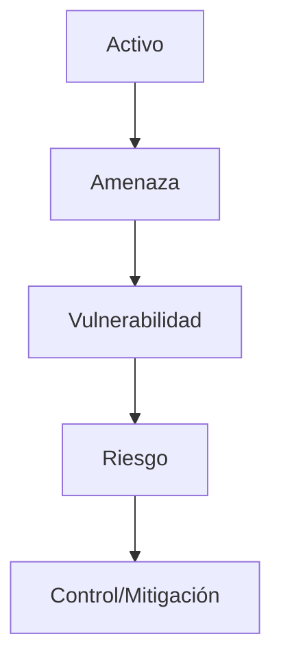

# Criptografía asimétrica

La **Criptografía asimétrica** (o de clave pública) utiliza un **par de claves matemáticamente vinculadas**:
1. Una **Clave Pública**, que se comparte abiertamente con todo el mundo.
2. Una **Clave Privada**, que se mantiene en absoluto secreto y no se comparte jamás.

> [!info] Explicación: El Truco Matemático
> Lo que se cifra con la clave pública solo puede ser descifrado por su clave privada correspondiente. Y lo que se "firma" con la clave privada puede ser verificado por cualquier persona usando la clave pública. Esto soluciona el problema de distribución de claves de la **[[Criptografía simétrica]]**.

## Algoritmos Comunes
1. **RSA (Rivest-Shamir-Adleman):** El algoritmo asimétrico clásico y más ampliamente utilizado. Su seguridad se basa en la extrema dificultad matemática de factorizar grandes números primos. Requiere claves largas (ej. 2048 o 4096 bits) para ser seguro.
2. **Diffie-Hellman (DH):** No es técnicamente un algoritmo de cifrado, sino un método de **intercambio seguro de claves**. Permite que dos partes acuerden una clave simétrica secreta a través de un canal público inseguro sin transmitir la clave en sí.
3. **ECC (Criptografía de Curva Elíptica):** Una familia matemática mucho más moderna y eficiente que RSA. Ofrece el mismo nivel de seguridad con claves muchísimo más pequeñas (ej. 256 bits de ECC = 3072 bits de RSA). Es vital para dispositivos móviles y el **Internet de las cosas (IoT)** debido a su bajo consumo de recursos.

## Casos de Uso
Dado que la criptografía asimétrica es computacionalmente lenta y costosa, no se usa para cifrar archivos grandes. Se usa para:
1. **Intercambio de claves simétricas:** Cifrar la pequeña llave AES que luego cifrará toda la sesión (ej. HTTPS/TLS).
2. **Firmas Digitales:** Probar autenticidad y no-repudio.
3. **Certificados de Identidad:** Usados en la **[[Certificados digitales y PKI|Infraestructura de Clave Pública (PKI)]]**.

## Notas relacionadas
- [[protocolos criptograficos]]
- [[Criptografía simétrica]]
- [[Certificados digitales y PKI]]

## Diagrama de Referencia

