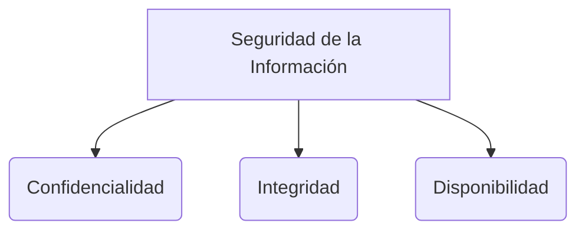

# Criptografía simétrica

La **Criptografía simétrica** (o de clave secreta) es un tipo de **[[protocolos criptograficos|criptografía]]** en la que el emisor y el receptor utilizan **la misma clave** tanto para cifrar (ocultar) como para descifrar (revelar) un mensaje.

> [!info] Explicación: Rapidez vs Distribución
> La gran ventaja de la criptografía simétrica es que es **extremadamente rápida** y eficiente, por lo que se usa para cifrar grandes volúmenes de datos, discos duros completos o tráfico de internet fluido. El gran problema es la **distribución de llaves**: ¿Cómo compartes de manera segura la clave secreta con la otra persona por primera vez?

## Algoritmos Comunes
1. **AES (Advanced Encryption Standard):** Es el estándar actual y más utilizado a nivel mundial. Extremadamente seguro y eficiente. Utiliza claves de 128, 192 o 256 bits. Prácticamente irrompible con la tecnología de computación tradicional.
2. **DES (Data Encryption Standard):** El estándar antiguo. Utilizaba claves de 56 bits. Actualmente se considera completamente inseguro y obsoleto ya que puede ser roto mediante ataques de fuerza bruta en minutos.
3. **3DES (Triple DES):** Una mejora temporal a DES donde el algoritmo se aplica tres veces sucesivas. Es más seguro que DES, pero es mucho más lento e ineficiente que AES.

## Modos de Operación (Block Ciphers)
Dado que los algoritmos simétricos cifran en "bloques" de tamaño fijo (ej. bloques de 128 bits), se necesitan modos de operación para procesar archivos grandes:
- **ECB (Electronic Codebook):** Modo básico. Cada bloque idéntico produce un cifrado idéntico. Es **inseguro** porque revela patrones en los datos originales (ej. la imagen encriptada de un pingüino donde aún se ve la silueta del pingüino).
- **CBC (Cipher Block Chaining):** Utiliza un **Vector de Inicialización (IV)**. El cifrado del bloque actual depende del cifrado del bloque anterior. Es mucho más seguro y oculta completamente los patrones.

## Notas relacionadas
- [[protocolos criptograficos]]
- [[Criptografía asimétrica]]
- [[Funciones hash]]

## Diagrama de Referencia

