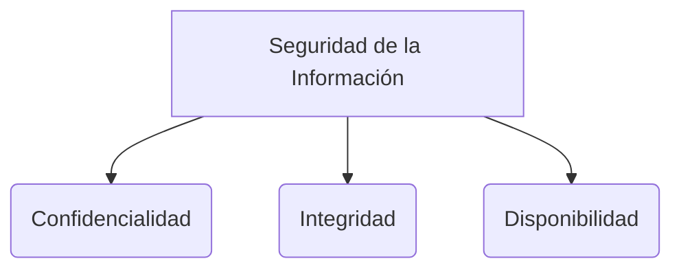

# Firewalls e IDS/IPS

Los Firewalls (cortafuegos) y los sistemas de detección y prevención de intrusiones son la primera línea defensiva en la seguridad perimetral de una red corporativa.

## Firewalls
Un firewall es un dispositivo de red o software que monitoriza y controla el tráfico de red entrante y saliente basado en reglas de seguridad predeterminadas. Establece una barrera entre una red interna segura y confiable y una red externa no confiable (como Internet).

> [!info] Explicación: Tipos de Firewalls
> - **Filtrado de Paquetes (Stateless):** Analiza los paquetes individuales basándose en la dirección IP de origen/destino y puertos. Es muy rápido pero fácilmente engañable.
> - **Stateful Inspection:** Mantiene el estado de las conexiones activas. Solo permite paquetes si corresponden a una conexión legítima ya establecida previamente.
> - **NGFW (Next-Generation Firewall):** Incorpora funciones avanzadas como inspección profunda de paquetes (DPI), prevención de intrusiones, visibilidad a nivel de aplicación (ej. permitir ver YouTube pero bloquear la subida de videos a YouTube) e inteligencia de amenazas en la nube.

## IDS y IPS
Aunque los firewalls deciden quién entra y quién sale basándose en reglas estáticas o estados de red, no saben identificar si un paquete "permitido" contiene contenido malicioso. Ahí entran el IDS y el IPS.

1. **IDS (Intrusion Detection System):**
   - Sistema de Detección de Intrusiones. Analiza el tráfico en busca de firmas de ataques conocidos o comportamientos anómalos.
   - **Actitud pasiva:** Detecta la amenaza, registra el evento y genera una alerta a los administradores, pero **no detiene** el tráfico. Actúa como una cámara de seguridad.

2. **IPS (Intrusion Prevention System):**
   - Sistema de Prevención de Intrusiones. Se ubica "en línea" (en el flujo directo del tráfico).
   - **Actitud activa:** Al detectar una amenaza mediante firmas o anomalías (ej. un ataque DDoS o un intento de inyección SQL), bloquea activamente la conexión maliciosa y descarta el tráfico en tiempo real. Actúa como un guardia de seguridad en la puerta.

## Notas relacionadas
- [[seguridad informatica]]
- [[Tipos de malware]]
- [[fundamentos de seguridad]]

## Diagrama de Referencia

