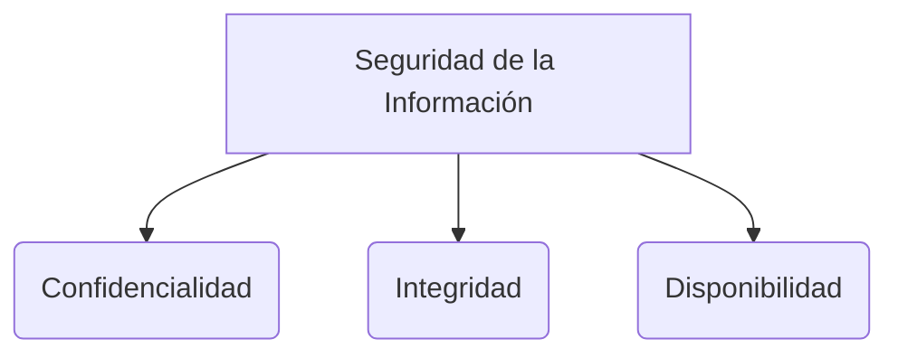

# Funciones hash

Las **Funciones Hash** son algoritmos criptográficos que toman una entrada de datos de cualquier tamaño (desde una sola letra hasta una película de 4GB) y generan como salida una cadena de caracteres alfanumérica de **longitud fija** conocida como resumen o *digest*.

> [!info] Explicación: Propiedades Críticas
> 1. **Unidireccionalidad:** Es fácil crear el hash, pero matemáticamente imposible reconstruir el archivo original a partir del hash.
> 2. **Efecto avalancha:** Cambiar una sola coma en un documento de 100 páginas cambiará el resultado del hash por completo.
> 3. **Resistencia a colisiones:** Debería ser casi imposible encontrar dos archivos diferentes que generen el mismo hash exacto.

## Usos en seguridad Informática
1. **Verificación de Integridad:** Se usa para comprobar que un archivo descargado no se corrompió ni fue alterado maliciosamente por un hombre-en-el-medio.
2. **Almacenamiento de Contraseñas:** Como se detalla en **[[ataques a contraseñas]]**, los sistemas nunca guardan contraseñas en texto plano, guardan hashes "salteados".
3. **Firmas Digitales:** Las firmas digitales no cifran el documento completo; le hacen un hash al documento y cifran solo ese hash con su clave privada, acelerando enormemente el proceso.

## Algoritmos Comunes
1. **MD5 (Message Digest 5):** Produce un hash de 128 bits. Actualmente se considera **obsoleto y vulnerable** a ataques de colisión rápidos. Solo se recomienda usar para verificación de errores de transmisión (checksums simples), nunca para seguridad.
2. **SHA-1 (Secure Hash Algorithm 1):** Produce un hash de 160 bits. También se considera **obsoleto y vulnerable**, reemplazado globalmente por SHA-2.
3. **SHA-2 y SHA-3:** La familia SHA-2 (incluyendo SHA-256 y SHA-512) es el **estándar criptográfico actual**, exigido para certificados web, transacciones y blockchain. SHA-3 es la generación más reciente y segura.

## Notas relacionadas
- [[ataques a contraseñas]]
- [[protocolos criptograficos]]
- [[Certificados digitales y PKI]]

## Diagrama de Referencia

