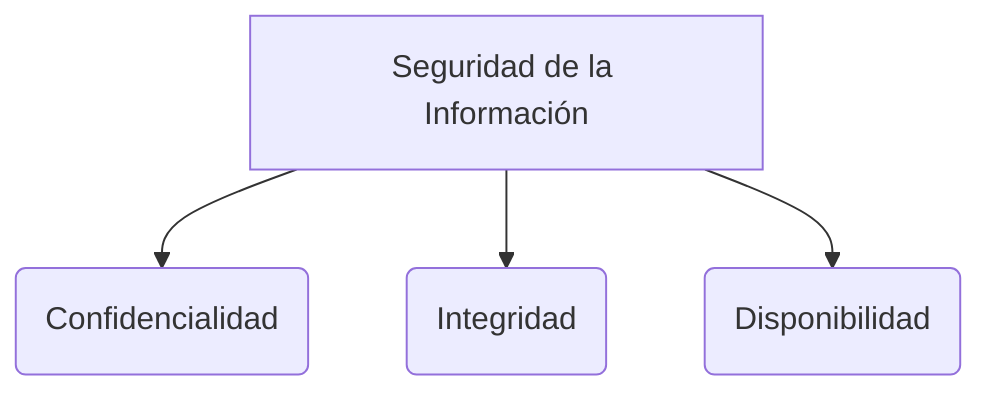

# Tipos de Malware

El término **Malware** proviene de la combinación de *Malicious* y *Software*. Abarca cualquier código, script o aplicación diseñada para causar daños operativos, robar datos o permitir accesos no autorizados en un sistema informático.

Esta nota complementa a fondo lo abordado en los **[[fundamentos de seguridad]]**.

> [!info] Explicación: Propagación y Carga útil
> El malware siempre consta de dos partes principales: el **vector de infección/propagación** (cómo llega al sistema) y la **carga útil (payload)** (el daño o acción que ejecuta una vez dentro).

## Principales Tipos de Malware

### 1. Virus
Un virus informático necesita **inmunidad del usuario o de una aplicación anfitriona** para propagarse. Por ejemplo, se adjunta al código de un archivo ejecutable, documento de Word (macros) o script. No puede actuar a menos que el usuario ejecute el archivo infectado.

### 2. Gusano (Worm)
A diferencia del virus, el gusano es un programa independiente que **se replica a sí mismo automáticamente** y se propaga a través de la red (LAN o Internet) explorando vulnerabilidades en el sistema operativo, sin intervención humana. Su objetivo primario a menudo es consumir ancho de banda y saturar las redes.

### 3. Caballo de Troya (Troyano)
Se camufla como una aplicación legítima o deseable (por ejemplo, un software de descarga gratuita, una actualización de sistema o un juego) para engañar al usuario e instalarse. Una vez instalado, ejecuta cargas útiles maliciosas en segundo plano. A diferencia de los virus o gusanos, **no se replican a sí mismos**.
- *Nota: Ver también **[[backdoor,bomba logica y keylogger]]** para detalles sobre los troyanos de acceso remoto (RAT).*

### 4. Ransomware
Actualmente el tipo más destructivo y rentable para los criminales. Secuestra el sistema de la víctima bloqueando la pantalla o cifrando profundamente sus archivos (usando **[[Criptografía simétrica]]** y **[[Criptografía asimétrica]]**). Exige un pago (rescate), generalmente en criptomonedas, a cambio de la llave de descifrado.

### 5. Spyware y Adware
- **Spyware:** Funciona de manera completamente sigilosa, monitoreando la actividad del usuario (historial web, capturas de pantalla) y robando información valiosa sin consentimiento para enviarla al creador.
- **Adware:** Aunque muchas veces es más molesto que destructivo, genera publicidad no deseada constante y puede rastrear las costumbres de compra para inyectar publicidades engañosas.

### 6. Rootkit
Un malware altamente sofisticado diseñado para ganar control de nivel de administrador (nivel kernel o root). Modifica el sistema operativo en sus capas más profundas para esconder procesos, archivos maliciosos y conexiones de red de los antivirus tradicionales, otorgando a los atacantes acceso permanente e invisible.

## Notas relacionadas
- [[fundamentos de seguridad]]
- [[backdoor,bomba logica y keylogger]]
- [[Firewalls y IDS-IPS]]

## Diagrama de Referencia

