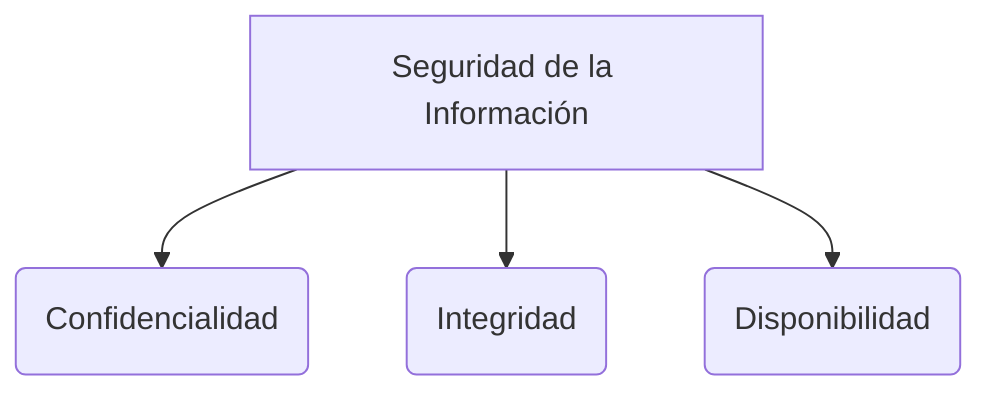

# Ataques a Contraseñas

**Funciones Hash**
Una función hash toma un dato de cualquier tamaño y lo convierte en un valor de longitud fija. 
Solo se puede calcular en una sola dirección; matemáticamente, no es posible revertir el proceso para volver al valor original.

> [!info] Explicación: Funciones Hash y Salting
> Las contraseñas nunca deben guardarse en texto plano. Se guardan como un *Hash*.
> Para evitar que dos usuarios con la misma contraseña tengan el mismo hash, se usa un **Salt** (un valor aleatorio que se le suma a la contraseña antes de aplicar el hash).

**Almacenamiento en Sistemas Operativos:**
- **En Linux:** Se usa la combinación de un salt aleatorio y el valor hash de la contraseña. Históricamente la información de usuarios estaba en `/etc/passwd`, pero por seguridad, el valor del hash real se encuentra protegido en el archivo `/etc/shadow`.
- **En Windows:** En el directorio `System32`, el archivo **SAM** (Security Account Manager) contiene los valores hash de las contraseñas. Este archivo está bloqueado y protegido por el kernel del sistema operativo mientras está encendido, pero un atacante puede extraerlo iniciando la computadora con un sistema operativo "Live" (ejecutado desde un USB).
  - Herramientas como *Trinity Rescue Kit* (un Live CD de Linux) se utilizan para acceder y manipular el archivo SAM offline.

## Métodos de Ataque
- **Ataque de fuerza bruta:** Hace uso de todas las combinaciones posibles de caracteres hasta encontrar la correcta.
- **Ataque de diccionario:** Hace uso de una lista pregenerada de palabras comunes y probables contraseñas.

## Tablas Arcoíris (Rainbow Tables)
Son bases de datos masivas que contienen valores hash ya precalculados para millones de posibles contraseñas. Al comparar el hash robado con esta tabla, se puede descubrir la contraseña instantáneamente sin tener que calcular hashes uno por uno.
- *Crackstation* es un ejemplo de un servicio en línea que utiliza tablas arcoíris enormes para romper contraseñas.

> [!info] Explicación: Prevención contra Rainbow Tables
> El uso de **Salting** (mencionado arriba) hace que las Tablas Arcoíris sean inútiles, ya que el atacante necesitaría una tabla arcoíris inmensa calculada específicamente para cada valor de *salt* posible.

## Ataque de Cumpleaños (Birthday Attack)
Se basa en la paradoja del cumpleaños en probabilidad. 
### Colisión de Hash:
En criptografía, una colisión ocurre cuando dos contraseñas diferentes generan exactamente el mismo valor hash. El ataque busca explotar la probabilidad matemática de encontrar colisiones rápidamente, realizando un barrido para encontrar diferentes entradas de texto que produzcan la misma huella digital.

## Notas relacionadas
- [[seguridad informatica]]
- [[fundamentos de seguridad]]
- [[Ingenieria social]]
- [[protocolos criptograficos]]

## Diagrama de Referencia

